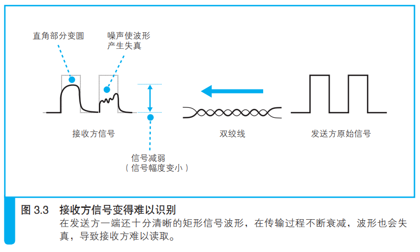
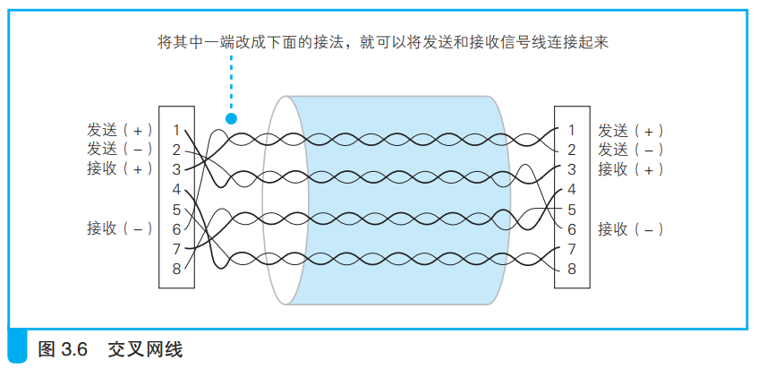
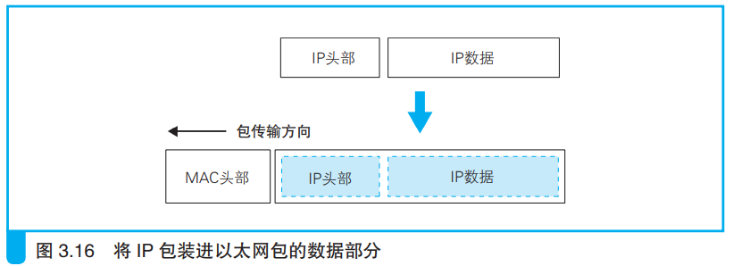

---
# 这是页面的图标
icon: page

# 这是文章的标题
title: 第三章、从网线到网络设备

# 设置作者
author: lllllan

# 设置写作时间
# time: 2020-01-20

# 一个页面只能有一个分类
category: 计算机基础

# 一个页面可以有多个标签
tag:
- 计算机网络
- 网络是怎样连接的

# 此页面会在文章列表置顶
# sticky: true

# 此页面会出现在首页的文章板块中
star: true

# 你可以自定义页脚
# footer: 
---

::: warning 转载声明

- 《网络是怎样连接的》

:::

## 一、信号在网线和集线器中传输

### 1.1 每个包都是独立传输的

### 1.2 网线中的信号衰减

以太网信号的本质是正负变化的电压。

信号在网线的传输过程中，能量会逐渐损失。网线越长，信号衰减就越严重。

同时噪声也会进一步加剧信号的失真。

### 1.3 双绞线抑制噪声

> 产生噪声的原因是网线周围的电磁波，当电磁波接触到金属等导体时，在其中就会产生电流。信号和噪声的电流混杂在一起之后，导致信号的波形发生失真。

影响网线的电磁波分为两种：

#### 来自网线之外的其他设备：

当电磁波接触到信号线时，会沿电磁波传播的右旋方向产生电流。

如果我们将信号线缠绕在一起，信号线就变成了螺旋形，其中两根信号线产生的噪声电流方向就会相反，从而使得噪声电流相互抵消。

#### 相邻信号线泄露出来：

这种内部产生的噪声称为 **串扰**

### 1.4 集线器将信号发往所有线路

> 集线器将信号发送给所有连接在它上面的线路。

###### 

## 二、交换机的包转发操作

### 2.1 交换机根据地址表进行转发

1. 信号到达网线接口，由 `PHY(MAU)` 模块进行接收
2.  `PHY(MAU)` 模块将网线中的信号转换为通用格式，并传递给 `MAC` 模块
3.  `MAC` 模块将信号转换为数字信息，并进行 `FCS` 校验错误，没有问题的放到缓冲区中
4. 查询 `MAC` 地址表，找到对应端口并通过交换电路将包发送到该端口

信号线排列成网格状，每一个交叉点都有一个交换开关，交换开关是电子控制的，通过切换开关的状态就可以改变信号的流向。

当网络包通过交换电路到达发送端口时，端口中的 `MAC` 模块和 `PHY(MAU)` 模块会执行发送操作，将信号发送到网线中。

1. 首先确认没有其他设备再发送信号，即确认信号收发模块中的接收线路没有信号进来
    1. 如果监测到其他设备正在发送信号，则需要等待信号发送完毕
    2. 如果没有其他信号，或者其他信号已经发送完毕，这是就可以将包的数字信息转换为电信号发送出去
2. 发送过程中还需要对接收信号进行监控
    1. 如果发送过程中检测到其他设备发送信号，就意味着出现了信号碰撞，这是需要发送阻塞信号以停止网络中所有的发送操作，等待一段时间后再尝试重新发送

### 2.2 MAC地址表的维护

1. 收到包时，将发送方的 MAC 地址以及其输入端口的号码写入 MAC 地址表中
2. 删除地址表中某条记录，防止设备移动时产生问题

eg：开会时把笔记本电脑从办公室拿到会议室，这是设备就发生了移动。只要笔记本电脑连接到会议室的交换机，这台交换就会根据笔记本电脑发出的包来更新它的地址表。而对于目的地的交换机来说，不需要什么特别的措施就能正常工作。

### 2.3 特殊操作

发现某个包的目标端口和源端口相同，即某台计算机给自己发送了一个包：

- 计算机A发送的包到达集线器后会被集线器转发到所有端口上，因此交换机和计算机B都会收到
- 交换机接收到之后查看地址表，将该包原路返回集线器
- 集线器接收到之后再次转发给所有端口，因此计算机AB都会收到

这种情况下计算机B就会收到两个相同的包，会导致无法正常通信。

**因此当交换机发现一个包要发回到源端口时，就会直接丢弃这个包。**

如果交换机的地址表中找不到指定的 MAC 地址，有可能是因为具有该地址的设备还没有向交换机发送过包、或者这个设备一段时间内没有工作导致地址被从地址表中删除。

这种情况下交换机只能将包转发到除了源端口以外的所有端口，这样做不会出现什么问题，因为只有相应的接收者才接受包，其他设备会忽略这个包。

::: info 发送多余的包会不会造成网络拥塞？

发送了包之后设备会作出响应，只要返回了响应包，交换机就可以将它写入地址表，下次就不需要转发给所有端口了。局域网中每秒可以传输上千个包，多出一两个并无大碍

:::

::: tip 如果接收方 MAC地址是一个广播地址，那么交换机会将包转发给除源端口以外的所有端口

:::

### 2.4 全双工模式可以同时进行发送和接收

::: note

全双工模式是交换机特有的工作模式，它可以同时进行发送和接收操作，集线器不具备这样的特性

:::

### 2.5 自动协商：确定最优的传输速率

自动协商：能够再全双工和半双工模式之间进行切换，还能探测对方的传输速率并进行自动切换。

::: note 连接脉冲

在以太网中，当没有数据在传输时，网络中会填充一种被称为连接脉冲的脉冲信号。

在没有数据信号时就填充连接脉冲，使得网络中一直都有一定的信号流过，从而能够检测对方是否在正常工作。

:::

### 2.6 交换机可以同时执行多个转发操作

交换机只将包转发到具有特定 MAC 地址的设备连接的端口，其他端口都是空闲的，这些空闲的端口可以传输其他的包，因此交换机可以同时转发多个包。

集线器会将输入的信号广播到所有的端口，如果同时输入多个信号就会发生碰撞，无法同时传输多路信号。

## 三、路由器的包转发操作

### 3.1 路由器的基本知识

==路由器是基于IP设计的，交换机是基于以太网设计的==

路由器的内部结构中，转发模块负责判断包的转发目的地，端口模块负责包的收发操作。

::: info 路由器的工作原理

1. 通过端口将发过来的包接收进来
2. 转发模块会根据接收到的包的IP头部中记录的接收方IP地址，在路由表中进行查询，以此判断转发目标
3. 转发模块将包转移到转发目标对应的端口，端口再按照硬件的规则将包发送出去

:::

::: tip 路由器的各个端口都具有MAC地址和IP地址

:::

### 3.2 路由表中的信息

==交换机是通过MAC头部中的接收方的MAC地址来判断转发目标的，而路由器是根据IP头部中的IP地址来判断的==

> 打个比方，路由器在转发包的时候只看接收方地址属于哪个区，XX区发往这一边，XX区发往那一边

==路由器会忽略主机号，只匹配网络号==

::: info 路由聚合

路由聚合会将几个子网合并成一个子网，并在路由表中只产生一条记录。

> 路由器B的路由表中原本应该有对应三个子网的3条记录。但是在这个例子中，不论是发往任何一个子网，都一定会经过路由器A。因此我们可以在路由表中将这三个子网合并成一个，从而较少路由表B中的记录数量。

:::

### 3.3 路由器的包接收操作

1. 信号到达网线接口部分
2. PHY（MAU）模块和MAC模块将信号转换为数字信号，通过包末尾的FCS进行错误校验
3. 校验没问题则检查MAC头部中的接收方MAC地址，是发送给自己的就放到接收缓冲区、否则就丢弃

==路由器的端口都具有MAC地址，只接收与自身地址匹配的包，遇到不匹配的则直接丢弃==

### 3.4 查询路由表确定输出端口

==通过路由器转发的网络包，其接收方MAC地址为路由器端口的MAC地址==

MAC头部的作用就是将包送达路由器，其中的接收方MAC地址就是路由器端口的MAC地址。因此当包到达路由器之后，MAC头部的任务就完成了，于是MAc头部就会被丢弃。

接下来路由器会根据MAC头部后方的IP头部中的内容进行包的转发操作。去路由表中查询判断转发目标。**如果路由表中无法找到匹配的记录，路由器就会丢弃这个包，并通过ICMP消息告知发送方。**

> 路由器工作的网络环境是互联网，规模太大，如果将包转发给所有的端口会产生大量的包，造成网络拥塞

### 3.5 找不到匹配路由时选怎默认路由

路由表中子网掩码为 0.0.0.0 的记录表示【默认路由】

当匹配不到其他路由时，网络包就会被转发到互联网接入路由器。因此这条记录被称为默认路由，这一行配置的网关地址被称为默认网关。

### 3.6 包的有效期

路由器会更新网络包的IP头部中的TTL字段，TTL字段表示包的有效期，没经过一个路由器的转发，这个值就会减一，当这个值变成零时就表示超过了有效期，这个包就会被丢弃。

> 这个机制是为了防止包在一个地方陷入死循环。

### 3.7 通过分片功能拆分大网络包

路由器的端口可以支持其他局域网或者专线通信技术，但是不同的线路和局域网类型各自能传输 的最大包长度不同，因此输出端口的最大包长度可能会小于输入端口。一旦转发的包长度超过了输出端口能传输的最大长度，就无法直接发送这个包了。

**可以使用IP协议中定义的分片功能对包进行拆分，缩短每个包的长度。**

::: info 区别TIP的拆分

TCP拆分数据的操作是在将数据装到包里之前进行的，拆分好的一个数据块正好装进一个包里。

从IP分片的角度来看，这样一个包其实是一个未拆分的整体，分片是对一个完整的包再进行拆分的过程。

:::

**拆分之前需要查看IP头部中的标志字段，确认是否可以分片。**　如果查询标志字段发现不能分片，那么就只能丢弃这个包，并通过ICMP消息通知发送方。

### 3.8 路由器的发送操作和计算机相同

1. 根据路由表的网关列判断对方的地址。
    - 如果网关是一个IP地址，则这个IP地址就是我们要转发到的目标地址
    - 如果网关为空，则IP头部中的接收方IP就是我们要转发到的目标地址
2. 通过ARP根据IP地址查询MAC地址，并将查询结果作为接收方的MAC地址
    - 路由器中有ARP缓存，首先会在ARP缓存中查询
    - 如果找不到则发送ARP查询请求
3. 将网络包转换成电信号并通过端口发送出去
    - 半双工模式，先确认线路中没有其他信号才能发送，如果检测到碰撞则需要等待一段时间后重发
    - 全双工模式，不需要确认线路中的信号，可以直接发送

### 3.9 路由器和交换机的关系

==IP协议本身没有传输包的功能，因此包的实际传输要委托以太网来进行==

路由器将包的传输工作委托给交换机来进行。

> 这里的内容适用于纯粹从路由器和纯粹的交换机。实际情况中路由器有内置的交换机功能

IP并不是委托以太网将包传输到最红目的地，而是传到下一个路由器。当包到达下一个路由器后，下一个路由器又会重新委托以太网将包传输到再下一个路由器。如此反复包就会最终到达IP的目的地。

::: info

IP本身不负责包的传输，而是委托各种通信技术将包传输到下一个路由器。

这样的设计可以根据需要灵活运用各种通信技术，这也是IP的最大特点。

:::

