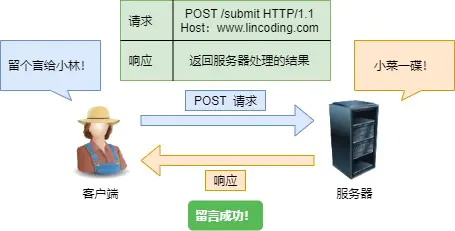

---
# 这是页面的图标
icon: page

# 这是文章的标题
title: HTTP 常见面试题

# 设置作者
author: lllllan

# 设置写作时间
# time: 2020-01-20

# 一个页面只能有一个分类
category: 计算机基础

# 一个页面可以有多个标签
tag:
- 计算机网络
- 面试题

# 此页面会在文章列表置顶
# sticky: true

# 此页面会出现在首页的文章板块中
star: true

# 你可以自定义页脚
# footer: 
---

::: warning 转载声明

- [3.1 HTTP 常见面试题 | 小林coding (xiaolincoding.com)](https://xiaolincoding.com/network/2_http/http_interview.html)

:::

## GET 与 POST

### GET

==GET 的语义是从服务器获取指定的资源==

- GET 请求的参数位置一般是写在 URL 中
- URL 规定只能支持 ASCII，所以 GET 请求的参数只允许 ASCII 字符 
- 而且浏览器会对 URL 的长度有限制（HTTP协议本身对 URL长度并没有做任何规定）。

::: center

:::

### POST

==POST 的语义是根据请求负荷（报文body）对指定的资源做出处理==

- POST 请求携带数据的位置一般是写在报文 body 中，
- body 中的数据可以是任意格式的数据，只要客户端与服务端协商好即可
- 而且浏览器不会对 body 大小做限制

::: center

:::

### GET 和 POST 方法都是安全和幂等的吗？

- 在 HTTP 协议里，所谓的「安全」是指请求方法不会「破坏」服务器上的资源。
- 所谓的「幂等」，意思是多次执行相同的操作，结果都是「相同」的。

如果从 RFC 规范定义的语义来看：

- ==GET 方法就是安全且幂等的== ，因为它是「只读」操作，无论操作多少次，服务器上的数据都是安全的，且每次的结果都是相同的。所以，**可以对 GET 请求的数据做缓存，这个缓存可以做到浏览器本身上（彻底避免浏览器发请求），也可以做到代理上（如nginx），而且在浏览器中 GET 请求可以保存位书签**。
- ==POST 方法不安全也不幂等== ，因为是「新增或提交数据」的操作，会修改服务器上的资源，所以是不安全的，且多次提交数据就会创建多个资源，所以不是幂等的。所以，**浏览器一般不会缓存 POST 请求，也不能把 POST 请求保存为书签**。

::: note url 和 body

RFC 规范并没有规定 GET 请求不能带 body 的。理论上，任何请求都可以带 body 的。只是因为 RFC 规范定义的 GET 请求是获取资源，所以根据这个语义不需要用到 body。

另外，URL 中的查询参数也不是 GET 所独有的，POST 请求的 URL 中也可以有参数的。

:::
