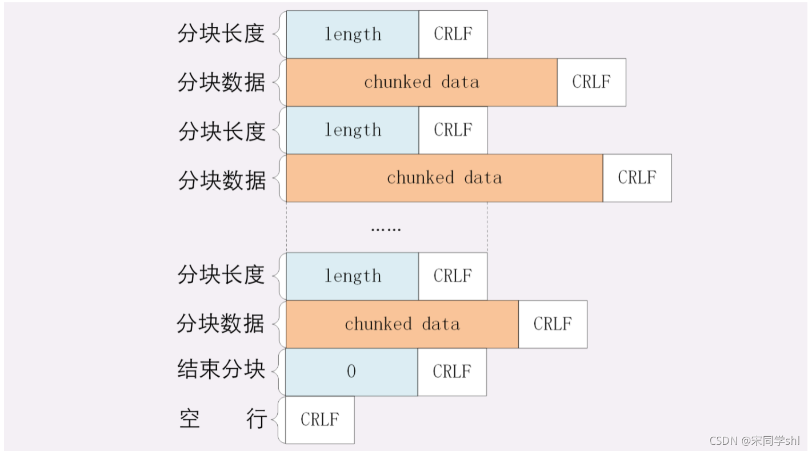

---
# 这是页面的图标
icon: page

# 这是文章的标题
title: HTTP 传输大文件

# 设置作者
author: lllllan

# 设置写作时间
# time: 2020-01-20

# 一个页面只能有一个分类
category: 

# 一个页面可以有多个标签
tag:

# 此页面会在文章列表置顶
# sticky: true

# 此页面会出现在首页的文章板块中
star: true

# 你可以自定义页脚
# footer: 

---


::: warning 转载声明

- [HTTP 传输大文件有哪些方案？ - 掘金 (juejin.cn)](https://juejin.cn/post/7005347768491311134)
- [HTTP传输大文件的方法_宋同学shl的博客-CSDN博客_传大文件](https://blog.csdn.net/song_hai_lei/article/details/120976608)
- [深入解析数据压缩算法_Geek.Fan的博客-CSDN博客_数据压缩算法](https://blog.csdn.net/fanyun_01/article/details/80211799)
- [HTTP CHUNK分块传输 - 简书 (jianshu.com)](https://www.jianshu.com/p/9c1889be3d14)

:::


如标题所见，http在面临传输大文件的时候，也就是如何在有限带宽下高效快捷地传输这些大文件。


## 数据压缩


> 是指在不丢失信息的前提下，缩减数据量以减少存储空间，提高传输、存储和处理效率的一种技术方法。或者是按照一定的算法对数据进行重新组织，减少数据的冗余和存储的空间。
>
> 更多介绍：[深入解析数据压缩算法_Geek.Fan的博客-CSDN博客_数据压缩算法](https://blog.csdn.net/fanyun_01/article/details/80211799)

通常浏览器在发送请求时都会带着 `Accept-Encoding` 头字段，里面是浏览器支持的压缩格式列表，例如  gzip、deflate、br 等，这样服务器就可以从中选择一种压缩算法，放进 `Content-Encoding` 响应头里，再把原数据压缩后发给浏览器。


:::: code-group


::: code-group-item 客户端请求

```http
accept: */*
accept-encoding: gzip, deflate, br
accept-language: zh-CN,zh;q=0.9
```

:::


::: code-group-item 服务器响应

```http
cache-control: max-age=2592000
content-encoding: gzip
content-type: application/x-javascript
```

:::


::::


## 分块传输

> 分块传输编码（Chunked transfer encoding）是超文本传输协议（HTTP）中的一种数据传输机制，允许HTTP由应用服务器发送给客户端应用（ 通常是网页浏览器）的数据可以分成多个部分。分块传输编码只在HTTP协议1.1版本（HTTP/1.1）中提供。
>
> 
>
> 通常，持久链接需要服务器在开始发送消息体前发送Content-Length消息头字段，但是对于动态生成的内容来说，在内容创建完之前是不可知的。
>
> 使用分块传输能很好的应对这种问题，分块传输编码允许服务器在最后发送消息头字段。


响应头 `Transfer-Encoding` 字段的值为 `chunked`，表示数据以一系列分块的形式进行发送。需要注意的是 `Transfer-Encoding` 和 `Content-Length` 这两个字段是互斥的，也就是说响应报文中这两个字段不能同时出现


分块传输的编码规则：

- 每个分块包含分块长度和数据块两个部分；
- 分块长度使用 16 进制数字表示，以 `\r\n` 结尾；
- 数据块紧跟在分块长度后面，也使用 `\r\n` 结尾，但数据不包含 `\r\n`；
- 终止块是一个常规的分块，表示块的结束。不同之处在于其长度为 0，即 `0\r\n\r\n`


```http
Transfer-Encoding: chunked
Transfer-Encoding: gzip, chunked
```




## 范围请求

> Range 头是在 HTTP/1.1 协议中新增的一个请求头。包含 Range 头的请求通常称为范围请求，因为 Range 头允许服务器只发送部分响应到客户端。范围请求可以满足以下一些场景：
>
> - 断网重连之后，可以从下载中断处恢复下载
> - 将大文件拆分后多线程下载
> - 大文件中只想获取其中的一部分


如果在响应中存在 `Accept-Ranges` 首部（并且它的值不为 “none”），那么表示该服务器支持范围请求。

- `unit`：范围请求所采用的单位，通常是字节（bytes）。
- `<range-start>`：一个整数，表示在特定单位下，范围的起始值。
- `<range-end>`：一个整数，表示在特定单位下，范围的结束值。**这个值是可选的，如果不存在，表示此范围一直延伸到文档结束。**


:::: code-group


::: code-group-item 单一范围

```
curl http://i.imgur.com/z4d4kWk.jpg -i -H "Range: bytes=0-1023"
```

:::


::: code-group-item 多重范围

```
curl http://www.example.com -i -H "Range: bytes=0-50, 100-150"
```

:::


::::


:::: code-group


::: code-group-item 客户端请求

```http
GET /big-file.txt HTTP/1.1
Host: localhost:3000
Connection: keep-alive
Referer: http://localhost:3000/index.html
Accept-Encoding: identity
Accept-Language: zh-CN,zh;q=0.9,en;q=0.8,id;q=0.7
Range: bytes=0-100
```

:::


::: code-group-item 服务器响应

```http
HTTP/1.1 206 Partial Content
Vary: Origin
Accept-Ranges: bytes
Last-Modified: Sun, 06 Jun 2021 01:40:19 GMT
Cache-Control: max-age=0
Content-Type: text/plain; charset=utf-8
Date: Sun, 06 Jun 2021 03:01:01 GMT
Connection: keep-alive
Content-Range: bytes 0-100/5243
Content-Length: 101
```

:::


::::


