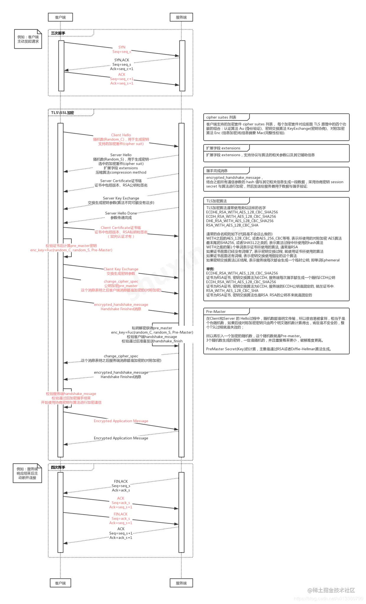

---
# 这是页面的图标
icon: page

# 这是文章的标题
title: HTTP和HTTPS

# 设置作者
author: lllllan

# 设置写作时间
# time: 2020-01-20

# 一个页面只能有一个分类
category: 计算机基础

# 一个页面可以有多个标签
tag:
- 计算机网络
- 面试题

# 此页面会在文章列表置顶
# sticky: true

# 此页面会出现在首页的文章板块中
star: true

# 你可以自定义页脚
# footer: 
---

::: warning 转载声明

- [HTTP 与 HTTPS 的区别 | 菜鸟教程 (runoob.com)](https://www.runoob.com/w3cnote/http-vs-https.html)
- [《图解HTTP》HTTPS](../diagram-http/7/)
- [HTTPS加密（握手）过程](https://www.jianshu.com/p/e30a8c4fa329)
- [刨根问底系列之https到底是如何防篡改的？面试必备 - 掘金 (juejin.cn)](https://juejin.cn/post/6845166890675863559#comment)

:::

## 基本概念

### HTTP

**HTTP**（HyperText Transfer Protocol：超文本传输协议）是一种用于分布式、协作式和超媒体信息系统的应用层协议。 简单来说就是一种发布和接收 HTML 页面的方法，被用于在 Web 浏览器和网站服务器之间传递信息。

HTTP 默认工作在 TCP 协议 80 端口，用户访问网站 **http://** 打头的都是标准 HTTP 服务。

HTTP 协议以明文方式发送内容，不提供任何方式的数据加密，如果攻击者截取了Web浏览器和网站服务器之间的传输报文，就可以直接读懂其中的信息，因此，HTTP协议不适合传输一些敏感信息，比如：信用卡号、密码等支付信息。

### HTTPS

[刨根问底系列之https到底是如何防篡改的？面试必备 - 掘金 (juejin.cn)](https://juejin.cn/post/6845166890675863559#comment)

**HTTPS**（Hypertext Transfer Protocol Secure：超文本传输安全协议）是一种透过计算机网络进行安全通信的传输协议。HTTPS 经由 HTTP 进行通信，但利用 SSL/TLS 来加密数据包。HTTPS 开发的主要目的，是提供对网站服务器的身份认证，保护交换数据的隐私与完整性。

HTTPS 默认工作在 TCP 协议443端口，它的工作流程一般如以下方式：

- 1、TCP 三次同步握手
- 2、客户端验证服务器数字证书
- 3、DH 算法协商对称加密算法的密钥、hash 算法的密钥
- 4、SSL 安全加密隧道协商完成
- 5、网页以加密的方式传输，用协商的对称加密算法和密钥加密，保证数据机密性；用协商的hash算法进行数据完整性保护，保证数据不被篡改。

## HTTP 与 HTTPS 区别

- HTTP 明文传输，数据都是未加密的，安全性较差，HTTPS（SSL+HTTP） 数据传输过程是加密的，安全性较好。
- 使用 HTTPS 协议需要到 CA（Certificate Authority，数字证书认证机构） 申请证书，一般免费证书较少，因而需要一定费用。证书颁发机构如：Symantec、Comodo、GoDaddy 和 GlobalSign 等。
- HTTP 页面响应速度比 HTTPS 快，主要是因为 HTTP 使用 TCP 三次握手建立连接，客户端和服务器需要交换 3 个包，而 HTTPS除了 TCP 的三个包，还要加上 ssl 握手需要的 9 个包，所以一共是 12 个包。
- http 和 https 使用的是完全不同的连接方式，用的端口也不一样，前者是 80，后者是 443。
- HTTPS 其实就是建构在 SSL/TLS 之上的 HTTP 协议，所以，要比较 HTTPS 比 HTTP 要更耗费服务器资源。

## HTTPS工作流程

[HTTPS协议详解(四)：TLS/SSL握手过程_hherima的博客-CSDN博客_ssl握手](https://blog.csdn.net/hherima/article/details/52469674)

[刨根问底系列之https详细握手过程 - 掘金 (juejin.cn)](https://juejin.cn/post/6847902219745181709)

1. ==客户端发起握手请求 client_hello==

    以明文传输请求信息，包含

    - TLS版本信息
    - 随机数（用于后续的密钥协商）random_C
    - 加密套件候选列表
    - 压缩算法候选列表
    - 扩展字段等信息 

2. ==服务端发送 server_hello 返回协商的信息结果==

    - 选择使用的TLS协议版本
    - 随机数 random_S
    - 选择的加密套件 cipher suite
    - 选择的压缩算法 compression method

3. ==服务端发送证书==

    服务器端配置对应的证书链，用于身份验证和密钥交换

4. ==服务端发送Server Hello Done==

    通知客户端 server_hello 信息发送结束

5. 客户端验证证书的合法性，包括可信性，是否吊销，过期时间和域名

6. ==客户端发送.client_key_exchange + change_cipher_spec + encrypted_handshake_message==

    - **client_key_exchange**，合法性验证通过之后，客户端计算产生随机数字 Pre-master，并用证书公钥加密，发送给服务器。两个明文随机数 random_C 和 random_S 与自己计算产生的 Pre-master，计算得到协商密钥 ` enc_key=Fuc(random_C, random_S, Pre-Master)`
    - **change_cipher_spec**，客户端通知服务器后续的通信都采用协商的通信密钥和加密算法进行加密通信
    - **encrypted_handshake_message**，结合之前所有通信参数的 hash 值与其它相关信息生成一段数据，采用协商密钥 session secret 与算法进行加密，然后发送给服务器用于数据与握手验证

7. ==服务端发送change_cipher_spec + encrypted_handshake_message==

    - 服务器用私钥解密加密的 Pre-master 数据，基于之前交换的两个明文随机数 random_C 和 random_S，计算得到协商密钥：`enc_key=Fuc(random_C, random_S, Pre-Master)`
    - 计算之前所有接收信息的 hash 值，然后解密客户端发送的 encrypted_handshake_message，验证数据和密钥正确性;
    - change_cipher_spec, 验证通过之后，服务器同样发送 change_cipher_spec 以告知客户端后续的通信都采用协商的密钥与算法进行加密通信
    -  encrypted_handshake_message, 服务器也结合所有当前的通信参数信息生成一段数据并采用协商密钥 session secret 与算法加密并发送到客户端

8. 握手结束

    - 客户端计算所有接收信息的 hash 值，并采用协商密钥解密 encrypted_handshake_message，验证服务器发送的数据和密钥，验证通过则握手完成;

::: note 山寨版总结

1. 客户端请求握手 client_hello
2. 服务端发送 server_hello
3. 服务端发送证书
4. 服务端发送 server_hello_down
5. 客户端验证证书，使用随机数计算接下来传输使用的共享密钥（看上面，是几次随机数计算出来的），使用证书中的公钥对共享密钥进行加密，发送给服务端
6. 服务端使用已知的随机数计算出共享密钥，与客户端发送过来的密钥进行比较，验证正确性。
7. 双方确认之后使用共享密钥对数据进行加密后通信

:::

### 数字签名

[HTTP vs HTTPS（应用层） | JavaGuide](https://javaguide.cn/cs-basics/network/http&https.html#公钥传输的信赖性)

数字签名，是 CA 在给服务器颁发证书时，使用散列+加密的组合技术，在证书上盖个章，以此来提供验伪的功能。具体行为如下：

> CA 知道服务器的公钥，对该公钥采用散列技术生成一个摘要。CA 使用 CA 私钥对该摘要进行加密，并附在证书下方，发送给服务器。
>
> 现在服务器将该证书发送给客户端，客户端需要验证该证书的身份。客户端找到第三方机构 CA，获知 CA 的公钥，并用 CA 公钥对证书的签名进行解密，获得了 CA 生成的摘要。
>
> 客户端对证书数据（也就是服务器的公钥）做相同的散列处理，得到摘要，并将该摘要与之前从签名中解码出的摘要做对比，如果相同，则身份验证成功；否则验证失败。

## SSL/TLS

[SSL/TLS原理详解 - 云+社区 - 腾讯云 (tencent.com)](https://cloud.tencent.com/developer/article/1115445)

[一篇文章让你彻底弄懂SSL/TLS协议 - 知乎 (zhihu.com)](https://zhuanlan.zhihu.com/p/133375078)

