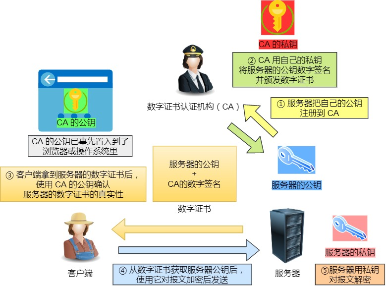

---
# 这是页面的图标
icon: page

# 这是文章的标题
title: HTTP和HTTPS

# 设置作者
author: lllllan

# 设置写作时间
# time: 2020-01-20

# 一个页面只能有一个分类
category: 计算机基础

# 一个页面可以有多个标签
tag:
- 计算机网络
- 面试题

# 此页面会在文章列表置顶
# sticky: true

# 此页面会出现在首页的文章板块中
star: true

# 你可以自定义页脚
# footer: 
---

::: warning 转载声明

- [HTTP 与 HTTPS 的区别 | 菜鸟教程 (runoob.com)](https://www.runoob.com/w3cnote/http-vs-https.html)
- [《图解HTTP》HTTPS](../diagram-http/7/)
- [HTTPS加密（握手）过程](https://www.jianshu.com/p/e30a8c4fa329)
- [3.1 HTTP 常见面试题 | 小林coding (xiaolincoding.com)](https://xiaolincoding.com/network/2_http/http_interview.html#http-与-https)

:::

## 基本概念

### HTTP

HTTP（HyperText Transfer Protocol：超文本传输协议）。HTTP 是一个在计算机世界里专门在「两点」之间「传输」文字、图片、音频、视频等「超文本」数据的「约定和规范」。

HTTP 默认工作在 TCP 协议 80 端口，用户访问网站 **http://** 打头的都是标准 HTTP 服务。

HTTP 协议以明文方式发送内容，不提供任何方式的数据加密，如果攻击者截取了Web浏览器和网站服务器之间的传输报文，就可以直接读懂其中的信息，因此，HTTP协议不适合传输一些敏感信息，比如：信用卡号、密码等支付信息。

### HTTPS

HTTPS（Hypertext Transfer Protocol Secure：超文本传输安全协议）是一种透过计算机网络进行安全通信的传输协议。HTTPS 经由 HTTP 进行通信，但利用 SSL/TLS 来加密数据包。HTTPS 开发的主要目的，是提供对网站服务器的身份认证，保护交换数据的隐私与完整性。

## HTTP 与 HTTPS 区别

- HTTP 是超文本传输协议，信息是明文传输，存在安全风险的问题。HTTPS 则解决 HTTP 不安全的缺陷，在 TCP 和 HTTP 网络层之间加入了 SSL/TLS 安全协议，使得报文能够加密传输。
- HTTP 连接建立相对简单， TCP 三次握手之后便可进行 HTTP 的报文传输。而 HTTPS 在 TCP 三次握手之后，还需进行 SSL/TLS 的握手过程，才可进入加密报文传输。
- HTTP 的端口号是 80，HTTPS 的端口号是 443。
- HTTP 页面响应速度比 HTTPS 快，主要是因为 HTTP 使用 TCP 三次握手建立连接，客户端和服务器需要交换 3 个包，而 HTTPS除了 TCP 的三个包，还要加上 ssl 握手需要的 9 个包，所以一共是 12 个包。
- HTTPS 协议需要向 CA（证书权威机构）申请数字证书，来保证服务器的身份是可信的。

## HTTPS 解决了什么问题

::: danger HTTP 不安全

- **窃听风险**，比如通信链路上可以获取通信内容，用户号容易没。
- **篡改风险**，比如强制植入垃圾广告，视觉污染，用户眼容易瞎。
- **冒充风险**，比如冒充淘宝网站，用户钱容易没。

:::

HTTPS 在 HTTP 与 TCP 层之间加入了 `SSL/TLS` 协议，可以很好的解决了上述的风险：

- **信息加密**：交互信息无法被窃取，但你的号会因为「自身忘记」账号而没。
- **校验机制**：无法篡改通信内容，篡改了就不能正常显示，但百度「竞价排名」依然可以搜索垃圾广告。
- **身份证书**：证明淘宝是真的淘宝网，但你的钱还是会因为「剁手」而没。

### 混合加密

- 对称加密。加密和解密使用相同的密钥。优点是相对高效，但是密钥被窃取就不安全了。
- 非对称加密。加密方使用公开的公钥进行加密，解密方用只有自己保持的私钥进行解密。优点是更加安全，但是效率相对较低

因此采用「混合加密」的方式：

- 在通信建立前采用 **非对称加密** 的方式交换「会话秘钥」，后续就不再使用非对称加密。
- 在通信过程中全部使用 **对称加密** 的「会话秘钥」的方式加密明文数据。

### 摘要算法

==摘要算法用来实现完整性== ，能够为数据生成独一无二的「指纹」，用于校验数据的完整性，解决了篡改的风险。

客户端在发送明文之前会通过摘要算法算出明文的「指纹」，发送的时候把「指纹 + 明文」一同加密成密文后，发送给服务器，服务器解密后，用相同的摘要算法算出发送过来的明文，通过比较客户端携带的「指纹」和当前算出的「指纹」做比较，若「指纹」相同，说明数据是完整的。

> 如果你想要成功篡改某次通信的数据包还不被发现，你需要同时达成一下几个条件
>
> - 你能够窃听到通信双方使用的「会话秘钥」，这步在混合加密的时候就单防你了
> - 还要窃听到通信双方使用的「摘要算法」
>
> 
>
> 如果你想要偷偷篡改数据，你需要拦截下发送方的数据包，修改数据之后用相同的「摘要算法」算出假明文的「指纹」，再整个使用相同的「会话秘钥」，然后发送给接收方。

### 数字证书

双方安全确定「会话秘钥」和「摘要算法」之后，才能保证传输数据不被篡改。但是在这之前，传输公钥的过程中仍有被篡改的风险。

这时候就需要借助第三方权威机构 `CA` （数字证书认证机构），将 **服务器公钥放在数字证书** （由数字证书认证机构颁发）中，只要证书是可信的，公钥就是可信的。

::: info 敲重点

服务器提前向 CA 申请证书：

1. 服务器将自己的公钥发给 CA，申请一个证书来保护自己的公钥
2. CA 使用散列算法对「服务器公钥」计算出「摘要」，用自己的私钥对「摘要」进行加密
3. CA 向服务器返回一个数字证书：「服务器公钥」 +  ==「数字签名」（加密过的摘要）==

**CA 非常可靠，大部分浏览器中都提起那内置了 CA 的公钥。**

客户端和服务器双方建立安全连接：

1. 服务器向客户端发送提前申请好的「数字证书」
2. 客户端收到「数字证书」，使用浏览器内置的「CA 公钥」对证书中的「数字签名」进行解密获得「摘要 A」
3. 客户端使用和 CA 相同的散列算法对证书中的「服务器公钥」计算出「摘要 B」，如果前后两个摘要完全相等，证明该公钥是安全可靠的

:::

## HTTPS 握手流程

1. ==客户端发送 client_hello==

    首先，由客户端向服务器发起加密通信请求，也就是 `ClientHello` 请求。以明文传输请求信息，包含

    - 客户端支持的 SSL/TLS 协议版本
    - 客户端生产的随机数（`Client Random`），后面用于生成「会话秘钥」条件之一。
    - 加密套件候选列表
    - 压缩算法候选列表
    - 扩展字段等信息 

2. ==服务器发送 SeverHello==

    服务器收到客户端请求后，向客户端发出响应，也就是 `SeverHello`。服务器回应的内容有如下内容：

    - 确认 SSL/ TLS 协议版本，如果浏览器不支持，则关闭加密通信
    - 服务器生产的随机数（`Server Random`），也是后面用于生产「会话秘钥」条件之一。
    - 选择的加密套件 cipher suite
    - 选择的压缩算法 compression method

3. ==服务端发送证书==

    服务器端配置对应的证书链，用于身份验证和密钥交换

4. ==服务端发送Server Hello Done==

    通知客户端 server_hello 信息发送结束

5. ==客户端回应==

    客户端收到服务器的回应之后，首先通过浏览器或者操作系统中的 CA 公钥，确认服务器的数字证书的真实性。

    如果证书没有问题，客户端会从数字证书中取出服务器的公钥，然后使用它加密报文，向服务器发送如下信息：

    - 一个随机数（`pre-master key`）。该随机数会被服务器公钥加密。

    - 加密通信算法改变通知，表示随后的信息都将用「会话秘钥」加密通信。
    - 客户端握手结束通知，表示客户端的握手阶段已经结束。这一项同时把之前所有内容的发生的数据做个摘要，用来供服务端校验。

    **服务器和客户端有了这三个随机数（Client Random、Server Random、pre-master key），接着就用双方协商的加密算法，各自生成本次通信的「会话秘钥」**。

6. ==服务端回应==

    服务器收到客户端的第三个随机数（`pre-master key`）之后，通过协商的加密算法，计算出本次通信的「会话秘钥」。

    然后，向客户端发送最后的信息：

    - 加密通信算法改变通知，表示随后的信息都将用「会话秘钥」加密通信。
    - 服务器握手结束通知，表示服务器的握手阶段已经结束。这一项同时把之前所有内容的发生的数据做个摘要，用来供客户端校验。

## SSL/TLS

[SSL/TLS原理详解 - 云+社区 - 腾讯云 (tencent.com)](https://cloud.tencent.com/developer/article/1115445)

[一篇文章让你彻底弄懂SSL/TLS协议 - 知乎 (zhihu.com)](https://zhuanlan.zhihu.com/p/133375078)

