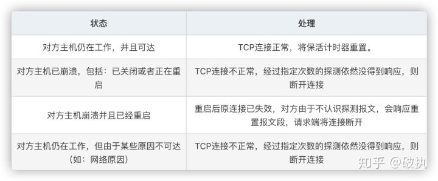

---
# 这是页面的图标
icon: page

# 这是文章的标题
title: keep-alive

# 设置作者
author: lllllan

# 设置写作时间
# time: 2020-01-20

# 一个页面只能有一个分类
category: 

# 一个页面可以有多个标签
tag:

# 此页面会在文章列表置顶
# sticky: true

# 此页面会出现在首页的文章板块中
star: true

# 你可以自定义页脚
# footer: 
---

::: warning 转载声明

- [HTTP keep-alive和TCP keepalive的区别，你了解吗？ - 知乎 (zhihu.com)](https://zhuanlan.zhihu.com/p/224595048)
- [keepalive 原理讲解 - salami-china - 博客园 (cnblogs.com)](https://www.cnblogs.com/wangjq19920210/p/8440824.html)

:::

## TCP keepalive

keepalive 是 TCP 连接的双方，在长时间未通信的时候确认对方还活着的保活机制。

开启保活机制的一段，每隔一段时间会向灵一段发送一个保活探测报文。

- 如果能够收到响应报文，证明对方还活着。重置计时器，过段时间继续发送。
- 如果不能接收到响应报文，可能是因为网络等诸多原因。隔断时间重新发送。
- 如果一直接收不到响应报文，说明连接不可达。

## HTTP keep-alive

keep-alive 是 HTTP 建立长连接的一个机制。

在 HTTP/1.0 的时候，每次请求资源，都会建立一次 TCP 连接，服务器响应之后将会断开连接。下次再有资源的请求，将重新建立连接。

为了减少建立连接的消耗，HTTP/1.1 引入了 keep-alive，在不主动断开的情况下，将会一直保持 TCP 连接。
