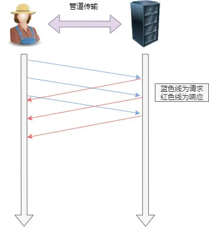
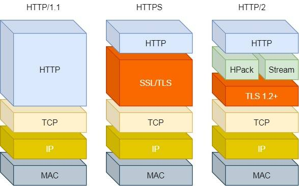

---
# 这是页面的图标
icon: page

# 这是文章的标题
title: HTTP 各版本

# 设置作者
author: lllllan

# 设置写作时间
# time: 2020-01-20

# 一个页面只能有一个分类
category: 计算机基础

# 一个页面可以有多个标签
tag:
- 计算机网络
- 面试题

# 此页面会在文章列表置顶
# sticky: true

# 此页面会出现在首页的文章板块中
star: true

# 你可以自定义页脚
# footer: 
---


::: warning 转载声明

- [HTTP/1.0、HTTP/1.1、HTTP/2、HTTPS - 知乎 (zhihu.com)](https://zhuanlan.zhihu.com/p/43787334)
- [一文读懂 HTTP/2 特性 - 知乎 (zhihu.com)](https://zhuanlan.zhihu.com/p/26559480)
- [3.1 HTTP 常见面试题 | 小林coding (xiaolincoding.com)](https://xiaolincoding.com/network/2_http/http_interview.html#http-1-1、http-2、http-3-演变)

:::


## HTTP/1.1


1. 长连接
2. 管道网络传输
3. 范围请求
4. Host 头
5. 更多缓存策略
6. 更多的状态码


### 长连接

HTTP1.0 默认使用短连接，每次发送一个 HTTP 请求都会单独进行一次 TCP 连接，使用完马上断开。

为了解决资源浪费的问题，HTTP1.1 默认使用长连接。


### 管道网络传输

HTTP/1.1 采用了长连接的方式，这使得管道（pipeline）网络传输成为了可能。

即可在同一个 TCP 连接里面，客户端可以发起多个请求，只要第一个请求发出去了，不必等其回来，就可以发第二个请求出去，可以减少整体的响应时间。





::: danger 「队头阻塞」

HTTP1.1 可以连续发送请求，解决了请求的「队头阻塞」。

==但是服务器必须按照接收请求的顺序发送对这些管道化请求的响应。== 因此并没有饥饿绝响应的「队头阻塞」。

:::


### 范围请求

HTTP/1.1 引入了范围请求（range request）机制，以避免带宽的浪费。

当客户端想请求一个文件的一部分，或者需要继续下载一个已经下载了部分但被终止的文件，HTTP/1.1 可以在请求中加入 `Range` 头部，以请求（并只能请求字节型数据）数据的一部分。服务器端可以忽略 `Range` 头部，也可以返回若干 `Range` 响应。


在范围响应中，`Content-Range` 头部标志指示出了该数据块的偏移量和数据块的长度。


### Host 头

域名系统（DNS）允许多个主机名绑定到同一个IP地址上，通过 host 头的域名，可以访问到同一台服务器上的不同应用。


```http
GET /home.html HTTP/1.1
Host: example1.org
```


## HTTP/2

HTTP/2 协议是基于 HTTPS 的，所以 HTTP/2 的安全性也是有保障的。

1. 头部压缩
2. 二进制格式
3. 数据流
4. 多路复用
5. 服务器推送




### 头部压缩

如果你同时发出多个请求，他们的头是一样的或是相似的，那么，协议会帮你消除重复的部分。

这就是所谓的 `HPACK` 算法：在客户端和服务器同时维护一张头信息表，所有字段都会存入这个表，生成一个索引号，以后就不发送同样字段了，只发送索引号，这样就提高速度了。


### 二进制格式 

HTTP/2 不再像 HTTP/1.1 里的纯文本形式的报文，而是全面采用了 **二进制格式**，头信息和数据体都是二进制，并且统称为帧（frame）：「头信息帧（Headers Frame）」和「数据帧（Data Frame）」。

接收方收到报文后，无需再将明文的报文转成二进制，而是直接解析二进制报文，提升了数据传输的效率。


### 数据流

HTTP/2 的数据包不是按顺序发送的，同一个连接里面连续的数据包，可能属于不同的回应。因此，必须要对数据包做标记，指出它属于哪个回应。

在 HTTP/2 中每个请求或相应的所有数据包，称为一个「数据流（`Stream`）」。每个数据流都标记着一个独一无二的编号（Stream ID）。

==在 HTTP/2 连接上，不同 Stream 的帧是可以乱序发送的（因此可以并发不同的 Stream ），因为每个帧的头部会携带 Stream ID 信息，所以接收端可以通过 Stream ID 有序组装成 HTTP 消息，而同一 Stream 内部的帧必须是严格有序的。==

客户端和服务器双方都可以建立 Stream， Stream ID 也是有区别的，客户端建立的 Stream 必须是奇数号，而服务器建立的 Stream 必须是偶数号。

客户端还可以指定数据流的优先级。优先级高的请求，服务器就先响应该请求。


### 多路复用

HTTP/2 是可以在一个连接中并发多个请求或回应，而不用按照顺序一一对应。

移除了 HTTP/1.1 中的串行请求，不需要排队等待，也就不会再出现「队头阻塞」问题，降低了延迟，大幅度提高了连接的利用率。


### 服务器推送

HTTP/2 还在一定程度上改善了传统的「请求 - 应答」工作模式，服务不再是被动地响应，也可以主动向客户端发送消息。


## HTTP/3

我直接阿巴阿巴 [3.7 HTTP/3 强势来袭 | 小林coding (xiaolincoding.com)](https://xiaolincoding.com/network/2_http/http3.html)

