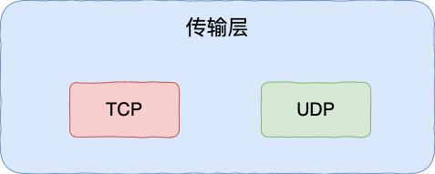
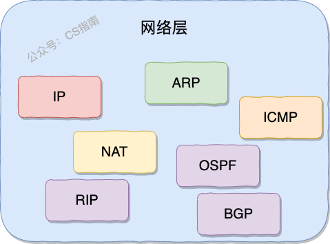

---
# 这是页面的图标
icon: page

# 这是文章的标题
title: OSI 和 TCP/IP 网络分层模型详解

# 设置作者
author: lllllan

# 设置写作时间
# time: 2020-01-20

# 一个页面只能有一个分类
category: 计算机基础

# 一个页面可以有多个标签
tag:
- 计算机网络
- 面试题

# 此页面会在文章列表置顶
# sticky: true

# 此页面会出现在首页的文章板块中
star: true

# 你可以自定义页脚
# footer: 
---

::: warning

本文转载自以下文章，略有改动。

- [OSI 和 TCP/IP 网络分层模型详解（基础） | JavaGuide](https://javaguide.cn/cs-basics/network/osi&tcp-ip-model.html)

:::

## OSI 七层模型

**OSI 七层模型** 是国际标准化组织提出一个网络分层模型，其大体结构以及每一层提供的功能如下图所示：

每一层都专注做一件事情，并且每一层都需要使用下一层提供的功能比如传输层需要使用网络层提供的路由和寻址功能，这样传输层才知道把数据传输到哪里去。

**OSI 的七层体系结构概念清楚，理论也很完整，但是它比较复杂而且不实用，而且有些功能在多个层中重复出现。**

## TCP/IP 四层模型

**TCP/IP 四层模型** 是目前被广泛采用的一种模型，我们可以将 TCP / IP 模型看作是 OSI 七层模型的精简版本，由以下 4 层组成：

1. 应用层
2. 传输层
3. 网络层
4. 网络接口层

>  我们并不能将 TCP/IP 四层模型 和 OSI 七层模型完全精确地匹配起来，不过可以简单将两者对应起来，如下图所示：

### 应用层（Application layer）

应用层位于传输层之上， ==主要提供两个终端设备上的应用程序之间信息交换的服务，它定义了信息交换的格式，消息会交给下一层传输层来传输== 。 我们把应用层交互的数据单元称为报文。

应用层协议定义了网络通信规则，对于不同的网络应用需要不同的应用层协议。在互联网中应用层协议很多，如支持 Web 应用的 HTTP 协议，支持电子邮件的 SMTP 协议等等。

### 传输层（Transport layer）

传输层的主要任务就是 ==负责向两台终端设备进程之间的通信提供通用的数据传输服务== 。 应用进程利用该服务传送应用层报文。【通用的】是指并不针对某一个特定的网络应用，而是多种应用可以使用同一个运输层服务。

运输层主要使用以下两种协议：

1. **传输控制协议 TCP**（Transmisson Control Protocol）--提供**面向连接**的，**可靠的**数据传输服务。
2. **用户数据协议 UDP**（User Datagram Protocol）--提供**无连接**的，尽最大努力的数据传输服务（**不保证数据传输的可靠性**）。

### 网络层（Network layer）

==网络层负责为分组交换网上的不同主机提供通信服务== 。 在发送数据时，网络层把运输层产生的报文段或用户数据报封装成分组和包进行传送。在 TCP/IP 体系结构中，由于网络层使用 IP 协议，因此分组也叫 IP 数据报，简称数据报。

==网络层的还有一个任务就是选择合适的路由，使源主机运输层所传下来的分株，能通过网络层中的路由器找到目的主机。==

互联网是由大量的异构（heterogeneous）网络通过路由器（router）相互连接起来的。互联网使用的网络层协议是无连接的网际协议（Intert Prococol）和许多路由选择协议，因此互联网的网络层也叫做**网际层**或**IP 层**。

### 网络接口层（Network interface layer）

我们可以把网络接口层看作是数据链路层和物理层的合体。

1. 数据链路层(data link layer)通常简称为链路层（ 两台主机之间的数据传输，总是在一段一段的链路上传送的）。 ==数据链路层的作用是将网络层交下来的 IP 数据报组装成帧，在两个相邻节点间的链路上传送帧。== 每一帧包括数据和必要的控制信息（如同步信息，地址信息，差错控制等）。
2. ==物理层的作用是实现相邻计算机节点之间比特流的透明传送，尽可能屏蔽掉具体传输介质和物理设备的差异==

## 为什么网络要分层？

复杂的系统需要分层，因为每一层都需要专注于一类事情。网络分层的原因也是一样，每一层只专注于做一类事情。

1. **各层之间相互独立**：各层之间相互独立，各层之间不需要关心其他层是如何实现的，只需要知道自己如何调用下层提供好的功能就可以了（可以简单理解为接口调用）**。这个和我们对开发时系统进行分层是一个道理。**
2. **提高了整体灵活性** ：每一层都可以使用最适合的技术来实现，你只需要保证你提供的功能以及暴露的接口的规则没有改变就行了。**这个和我们平时开发系统的时候要求的高内聚、低耦合的原则也是可以对应上的。**
3. **大问题化小** ： 分层可以将复杂的网络间题分解为许多比较小的、界线比较清晰简单的小问题来处理和解决。这样使得复杂的计算机网络系统变得易于设计，实现和标准化。 **这个和我们平时开发的时候，一般会将系统功能分解，然后将复杂的问题分解为容易理解的更小的问题是相对应的，这些较小的问题具有更好的边界（目标和接口）定义。**

