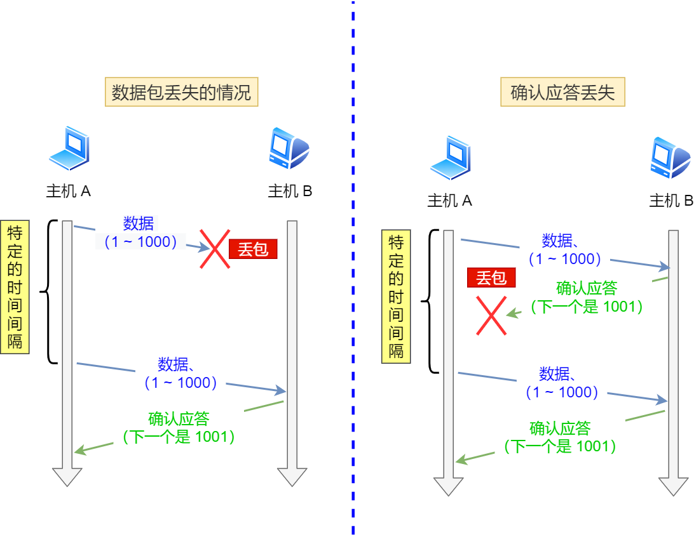
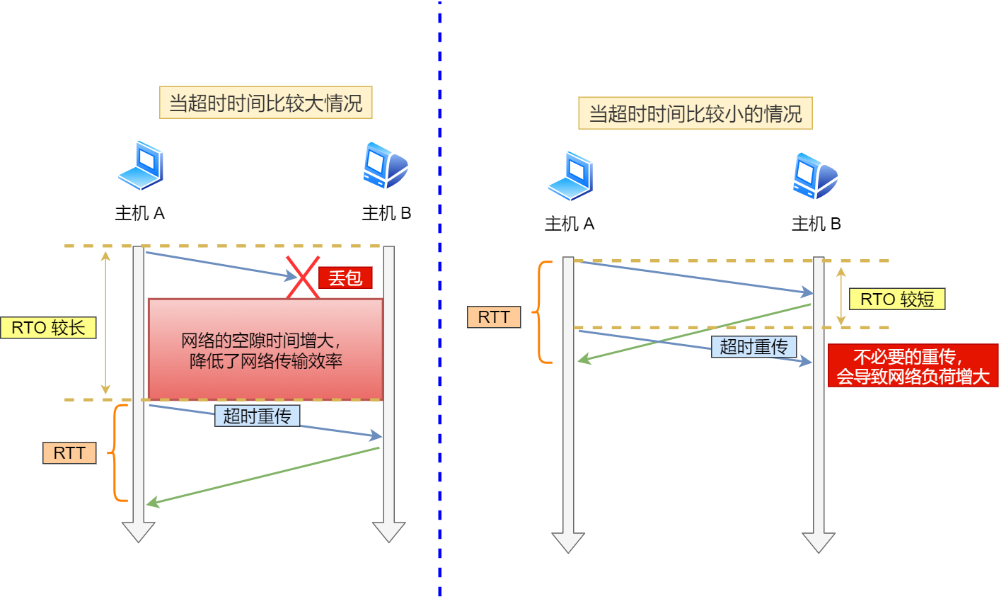
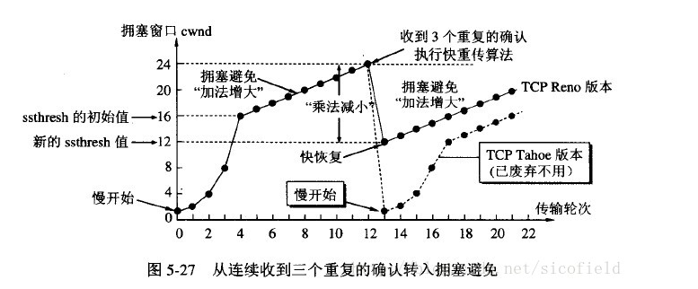

---
# 这是页面的图标
icon: page

# 这是文章的标题
title: TCP可靠传输

# 设置作者
author: lllllan

# 设置写作时间
# time: 2020-01-20

# 一个页面只能有一个分类
category: 

# 一个页面可以有多个标签
tag:

# 此页面会在文章列表置顶
# sticky: true

# 此页面会出现在首页的文章板块中
star: true

# 你可以自定义页脚
# footer: 

---

::: warning 转载声明

- [网络基础：TCP协议-如何保证传输可靠性_ricardoleo的博客-CSDN博客_tcp如何保证可靠传输](https://blog.csdn.net/liuchenxia8/article/details/80428157)
- [TCP的可靠性传输是如何保证的 - 知乎 (zhihu.com)](https://zhuanlan.zhihu.com/p/112317245)
- [计算机网络——TCP的拥塞控制（超详细） - 特务依昂 - 博客园 (cnblogs.com)](https://www.cnblogs.com/tuyang1129/p/12439862.html)
- [TCP拥塞避免 - hongdada - 博客园 (cnblogs.com)](https://www.cnblogs.com/hongdada/p/11206679.html)
- [4.2 TCP 重传、滑动窗口、流量控制、拥塞控制 | 小林coding (xiaolincoding.com)](https://xiaolincoding.com/network/3_tcp/tcp_feature.html)

:::

1. 连接管理
2. 校验和
3. 序列号/确认应答
4. 超时重传
5. 滑动窗口/流量控制
6. 拥塞控制

## 连接管理

三次握手和四次挥手，保证可靠的连接

## 校验和

通过检验和的方式，接收端可以检测出来数据是否有差错和异常，假如有差错就会直接丢弃TCP段，重新发送。

## 序列号/确认应答

序列号：TCP传输时将每个字节的数据都进行了编号。
确认应答：TCP传输的过程中，每次接收方收到数据后，都会对传输方进行确认应答。也就是发送ACK报文。这个ACK报文当中带有对应的确认序列号，告诉发送方，接收到了哪些数据，下一次的数据从哪里发。

## 重传机制

### 超时重传

在进行TCP传输时，由于确认应答与序列号机制，也就是说发送方发送一部分数据后，都会等待接收方发送的 ACK 报文，并解析 ACK 报文，判断数据是否传输成功。如果发送方发送完数据后，迟迟没有等到接收方的 ACK 报文，原因可能有两点：

1. 数据在传输过程中由于网络原因等直接全体丢包，接收方根本没有接收到。
2. 接收方接收到了响应的数据，但是发送的ACK报文响应却由于网络原因丢包了。

只要发送方在规定时间内没有接收到对方的 ACK 报文，就会认为对方没有接收到数据，需要重新发送。

1. 如果之后能收到对方的 ACK 报文，则进行下一步的发送
2. 如果重复几次之后仍然不能收到回复，就认为 TCP 连接失效了，会关闭连接。

::: info 超时时间

- RTT，Round-Trip Time 往返时延。数据从网络一端发送到另一端、并且得到响应所需要的时间。
- RTO，Retransmission Timeout 超时重传时间。

- 当超时时间 **RTO 较大**时，重发就慢，丢了老半天才重发，没有效率，性能差；
- 当超时时间 **RTO 较小**时，会导致可能并没有丢就重发，于是重发的就快，会增加网络拥塞，导致更多的超时，更多的超时导致更多的重发。

==超时重传时间 RTO 的值应该略大于报文往返 RTT 的值==

:::

### 快速重传

当发送方连续收到三个 ACK 包（`ack = 2`）的时候，就知道有数据包（`seq = 2`）丢失了，就会在定时器国企之间，直接重传该包。

> 超时重传，是为了保证接收方能接收到数据，设定超时时间是防止发生网络拥塞。
>
> 而当连续收到三个相同的 ACK 包时，就可以认为，网络拥塞已经好转了，并且接收方已经有段时间没有收到数据包了，可以立刻重传。

## 滑动窗口/流量控制

> 滑动窗口就是维护了一个缓冲区。

发送方可以连续发送一个缓冲区能够接纳的数据，而不用每发送一个包就等待一个响应，从而提升了效率。

但接收方不是一直都能接收那么多的数据，因此 TCP 双方都有一个缓冲区，接收方在返回 ACK 包的时候，附带窗口字段向发送方确认窗口大小，从而约束发送方的发送速率。

==窗口大小是由接收端告诉发送端自己还有多少缓冲区可以接收数据==

### 收缩窗口

滑动窗口是一个逻辑上的概念，窗口大小也是由接收方告知发送方的，发送方会根据窗口大小来决定发送多少数据。

接收方的缓冲区就是一个真实存在的、物理意义上的滑动窗口，接收方接收到的数据会暂时存放在缓冲区中，等到程序需要或者处理得过来的时候会过来取数据。

操作系统在繁忙的时候，可能会缩减缓冲区的大小，如果这时候发送方不知道缓冲区的变化，继续发送大量的数据，在超出接收方的承受范围的时候可能会直接丢弃数据包。

所以一般需要 ==先通过 ACK 包告知发送方滑动窗口的收缩，过段时间再缩减缓区的大小，避免出现丢包==

### 窗口关闭

如果窗口大小为零，就会阻止发送方发送数据。

如果这个时候接收方在返回 ACK 包（携带滑动窗口变大的信息）的时候，发生了数据包丢失。发送方仍然认为窗口是关闭的，不会发送数据，继而造成了【死锁】

TCP 会定时发送一个 ==窗口探测报文== ，如果能收到回复就能及时知道滑动窗口的大小，如果长时间得不到回复，就会断开这次 TCP 连接。

### 糊涂窗口综合症

只要窗口大小不为零，发送方就会义无反顾地继续发送数据。但是 TCP + IP 的头部就占了 40 个字节，当窗口比较小的时候，就使得数据的发送不太划算。

- 让接收方不通告小窗口给发送方
- 让发送方避免发送小数据

## 拥塞控制

如果网络非常拥堵，此时再发送数据就会加重网络负担，那么发送的数据段很可能超过了最大生存时间也没有到达接收方，就会产生丢包问题。

拥塞控制就是为了防止过多的数据注入到网络中，这样就可以使网络中的路由器或链路不致过载。TCP 发送方要维持一个 **拥塞窗口(cwnd)** 的状态变量。拥塞控制窗口的大小取决于网络的拥塞程度，并且动态变化。发送方让自己的发送窗口取为拥塞窗口和接收方的接受窗口中较小的一个。

- **MSS**：最大报文段长度，`TCP` 双方发送的报文段中，包含的数据部分的最大字节数；
- **cwnd**：拥塞窗口，`TCP` 发送但还没有得到确认的报文的序号都在这个区间；
- **RTT**：往返时间，发送方发送一个报文，到接收这个报文的确认报文所经历的时间；
- **ssthresh**：慢启动阈值，慢启动阶段，若 `cwnd` 的大小达到这个值，将转换到拥塞避免模式；

### 慢启动

慢开始算法的思路是当主机开始发送数据时，如果立即把大量数据字节注入到网络，那么可能会引起网络阻塞，因为现在还不知道网络的符合情况。

慢开始算法的思路就是， ==不要一开始就发送大量的数据，先探测一下网络的拥塞程度，也就是说由小到大逐渐增加拥塞窗口的大小==

### 拥塞避免

当拥塞窗口增长到一定值，到达了设定的阈值「慢启动门限 `ssthresh`」的时候，就认为大概率快要发生网络拥塞了，这时候就要减缓一下窗口增长的速度。

==拥塞避免算法让拥塞窗口缓慢增长，即每经过一个往返时间RTT就把发送方的拥塞窗口 cwnd 加 1，而不是加倍。== 这样拥塞窗口按线性规律缓慢增长。

无论是在 **慢开始阶段** 还是在 **拥塞避免阶段**，只要发送方判断网络出现拥塞（其根据就是没有收到确认，虽然没有收到确认可能是其他原因的分组丢失，但是因为无法判定，所以都当做拥塞来处理），就把慢开始门限设置为出现拥塞时的发送窗口大小的一半。然后把拥塞窗口设置为1，执行慢开始算法。

### 拥塞发生

当网络出现拥塞，也就是会发生数据包重传，重传机制主要有两种：

- 超时重传
- 快速重传

接着，就重新开始慢启动，慢启动是会突然减少数据流的。

### 快速恢复

快速重传和快速恢复算法一般同时使用，快速恢复算法是认为，你还能收到 3 个重复 ACK 说明网络也不那么糟糕，所以没有必要像 `RTO` 超时那么强烈。

当发生网络拥塞的时候，没必要重新开始「慢启动」，而是缩小拥塞窗口的和慢启动门限的大小

- 拥塞窗口 `cwnd = ssthresh + 3` （ 3 的意思是确认有 3 个数据包被收到了）；
- 重传丢失的数据包；
- 如果再收到重复的 ACK，那么 cwnd 增加 1；
- 如果收到新数据的 ACK 后，把 cwnd 设置为第一步中的 ssthresh 的值，原因是该 ACK 确认了新的数据，说明从 duplicated ACK 时的数据都已收到，该恢复过程已经结束，可以回到恢复之前的状态了，也即再次进入拥塞避免状态；

