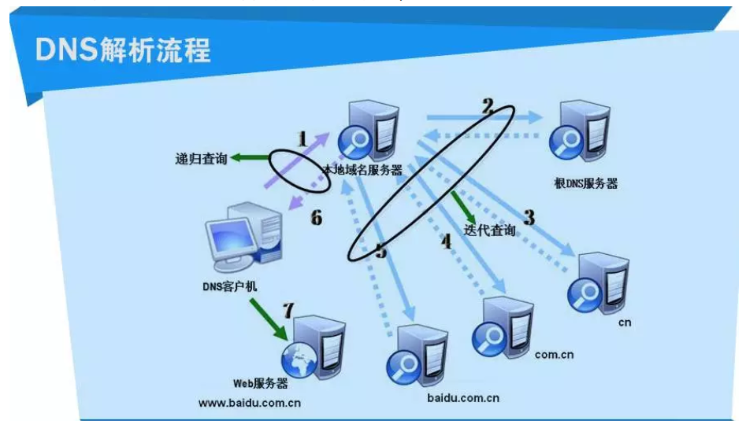

---
# 这是页面的图标
icon: page

# 这是文章的标题
title: 从输入 url 网址到显示页面的过程

# 设置作者
author: lllllan

# 设置写作时间
time: 2022-2-22

# 一个页面只能有一个分类
category: 计算机基础

# 一个页面可以有多个标签
tag:
- 计算机网络
- 面试题

# 此页面会在文章列表置顶
# sticky: true

# 此页面会出现在首页的文章板块中
star: true

# 你可以自定义页脚
# footer: 
---

::: warning 转载声明

- [前端经典面试题: 从输入URL到页面加载发生了什么？ - SegmentFault 思否](https://segmentfault.com/a/1190000006879700)
- [从URL输入到页面展现到底发生什么？ - SegmentFault 思否](https://segmentfault.com/a/1190000017184701)
- [从输入URL到页面展示的详细过程（从输入url到页面展示到底发生了什么）](https://blog.csdn.net/qinian8/article/details/99081105)

:::

## 从输入 url 到页面显示发生了什么

总体来说分为以下几个过程:

1. DNS解析
2. TCP连接
3. 发送HTTP请求
4. 服务器处理请求并返回HTTP报文
5. 浏览器解析渲染页面
6. 断开连接

## 一、应用层进行DNS 解析

**DNS解析的过程就是寻找哪台机器上有你需要资源的过程。**

### 1.1 DNS 解析过程

**DNS解析是一个递归查询的过程。**

浏览器通过向DNS服务器发送域名，DNS服务器查询到与域名相对应的IP地址，然后返回给浏览器，浏览器再将IP地址和请求参数搭载在协议上，一并发送给对应的服务器。

### 1.2 DNS 缓存

DNS 服务器有一个缓存功能，可以记住之前查询过的域名

- 如果要查询的域名和相关信息已经在缓存中，那么就可以直接返回响应。
- 当查询的域名不存在时，【不存在】这一响应结果也会被缓存
- 缓存信息设置有一个有效期，当信息超过有效期后，数据会从缓存中删除
- DNS服务器返回响应时，会告知这一响应结果是来自缓存还是来自负责管理该域名的DNS服务器

### 1.3 DNS 负载均衡

真实的互联网世界背后存在成千上百台服务器，大型的网站甚至更多。但是在用户的眼中，它需要的只是处理他的请求，哪台机器处理请求并不重要。DNS可以返回一个合适的机器的IP给用户，例如可以根据每台机器的负载量，该机器离用户地理位置的距离等等，这种过程就是DNS负载均衡，又叫做DNS重定向。大家耳熟能详的CDN(Content Delivery Network)就是利用DNS的重定向技术，DNS服务器会返回一个跟用户最接近的点的IP地址给用户，CDN节点的服务器负责响应用户的请求，提供所需的内容。

## 二、传输层建立TCP连接

简单地看，可以把TCP连接理解成三次握手：

1. 客户端向服务器端发送一个建立连接的请求 `SYN = 1, seq = x`
2. 服务器端同意客户端的请求，并且同样发送一个建立连接的请求 `ACK = 1, ack = x + 1, SYN = 1, seq = y`
3. 客户端同意服务器端的请求 `ACK = 1, ack = y + 1`

> 为什么握手要三次？握手期间可能发生的异常？-> [计算机网络-常见面试题 | lllllan](http://blog.lllllan.cn/cs-basic/network/interview-questions/#二、tcp-三次握手)

## 三、发送 HTTP 请求

### 3.1 应用层生成HTTP请求报文

应用层针对目标Web服务器生成HTTP请求报文，向服务器申请需要的资源。

### 3.2 传输层对报文进行封装

TCP模块在报文前面加上TCP头部，指定目标服务器的IP地址委托给IP模块发送

 ### 3.3 网络层使用IP协议来选择路线

IP模块接收到TCP模块委托过来的包，在其前面加上IP头部和MAC头部，其中IP头部中包含发送方和接收方的IP地址。

然后交给硬件发送出去，在数据传输的过程中，IP协议负责选择传送的路线，称为路由功能

### 3.4 数据链路层实现网络相邻节点可靠的数据通信

为了保证数据的可靠纯属，把数据包封装成帧，并按顺序传输各帧。

由于物理线路的不可靠，发出的数据帧有可能在线路上出错或丢失，于是每个数据分块计算出CRC（循环冗余校验），并把CRC添加到帧中，这样接收方就可以通过重新计算CRC并比对来判断数据的正确性。

### 3.5 物理层传输数据

数据链路层的帧转换成二进制形式的比特流，从网卡发送出局，再把比特流转换成电子、光学信号在网络中传输。

## 四、服务器处理并返回 HTTP 报文

服务器接收到数据之后，

光电信号 → 比特流 → 帧 → 网络包 → 解除MAC头部 → 解除IP头部 → 接触TCP头部 → 获得请求报文的数据。

服务器内部对请求做出处理，生成响应报文，以相同的方式发送给客户端。

## 五、浏览器解析渲染页面

（前端内容，不管了）

## 六、传输层断开TCP连接

- 客户端-发送一个 FIN，用来关闭客户端到服务器的数据传送
- 服务器-收到这个 FIN，它发回一 个 ACK，确认序号为收到的序号加 1 。和 SYN 一样，一个 FIN 将占用一个序号
- 服务器-关闭与客户端的连接，发送一个 FIN 给客户端
- 客户端-发回 ACK 报文确认，并将确认序号设置为收到序号加 1

> [计算机网络-常见面试题 | lllllan](http://blog.lllllan.cn/cs-basic/network/interview-questions/#三、tcp四次挥手)

