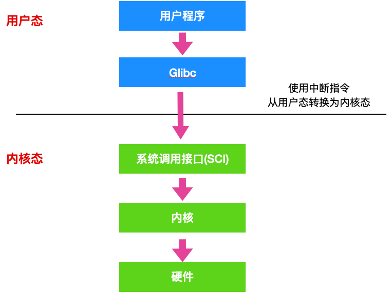
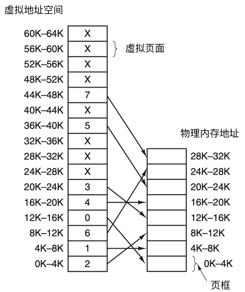
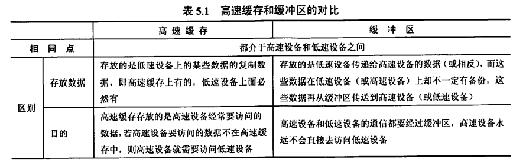
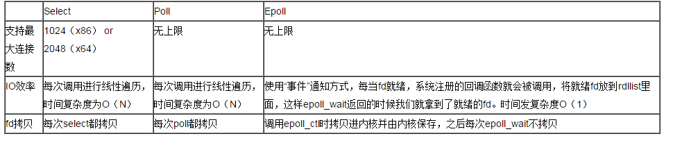

---

# 这是页面的图标
icon: page

# 这是文章的标题
title: 操作系统

# 设置作者
author: lllllan

# 设置写作时间
# time: 2020-01-20

# 一个页面只能有一个分类
category: 

# 一个页面可以有多个标签
tag:

# 此页面会在文章列表置顶
# sticky: true

# 此页面会出现在首页的文章板块中
star: true

# 你可以自定义页脚
# footer: 
---

::: warning 转载声明

- [JavaGuide（Java学习&&面试指南） | JavaGuide](https://javaguide.cn/home.html#必看专栏)
- [什么是操作系统？ - 知乎 (zhihu.com)](https://zhuanlan.zhihu.com/p/105945721)
- [协程的原理以及与线程的区别 - rhyme - 博客园 (cnblogs.com)](https://www.cnblogs.com/theRhyme/p/14061698.html)
- [协程的概念，为什么要用协程，以及协程的使用_someone丶](https://blog.csdn.net/weixin_44575037/article/details/105513014)
- [进程的切换过程_凝视阳光](https://blog.csdn.net/qq_40861091/article/details/102601719)
- [2021-Java后端工程师必会知识点-(操作系统) - 掘金 (juejin.cn)](https://juejin.cn/post/6942686874301857800#heading-1)
- [细说select、poll和epoll之间的区别与优缺点_七月朔风的技术博客_51CTO博客](https://blog.51cto.com/luminous/1832114)

:::

## 一、操作系统基础

### 1.1 操作系统

[什么是操作系统？ - 知乎 (zhihu.com)](https://zhuanlan.zhihu.com/p/105945721)

**操作系统(Operation System, OS) 是指控制和管理整个计算机系统的硬件和软件资源的系统软件。** 

### 1.2 系统调用

[系统调用](wangdao/1/3/#_2-3-中断和异常的处理过程)

所谓系统调用，是指用户在程序中调用操作系统所提供的一些子功能，系统调用可视为特殊的公共子程序。系统中的各种共享资源都由操作系统统一掌管，因此在用户程序中，凡是与资源有关的操作（如存储分配、进行I/O传输及管理文件等），都必须通过系统调用方式向操作系统提出服务请求，并由操作系统代为完成

- 设备管理。完成设备的请求或释放，以及设备启动等功能。
- 文件管理。完成文件的读、写、创建及删除等功能。
- 进程控制。完成进程的创建、撤销、阻塞及唤醒等功能。
- 进程通信。完成进程之间的消息传递或信号传递等功能。
- 内存管理。完成内存的分配、回收以及获取作业占用内存区大小及始址等功能。

### 1.3 硬链接和软链接

- 硬链接就是在目录下创建一个条目，记录着文件名与 `inode` 编号，这个 `inode` 就是源文件的 `inode`。删除任意一个条目，文件还是存在，只要引用数量不为 `0`。但是硬链接有限制，它不能跨越文件系统，也不能对目录进行链接。
- 符号链接文件保存着源文件所在的绝对路径，在读取时会定位到源文件上，可以理解为 `Windows` 的快捷方式。当源文件被删除了，链接文件就打不开了。因为记录的是路径，所以可以为目录建立符号链接。

### 1.4 中断的处理过程

1. 保护现场：将当前执行程序的相关数据保存在寄存器中，然后入栈。
2. 开中断：以便执行中断时能响应较高级别的中断请求。
3. 中断处理
4. 关中断：保证恢复现场时不被新中断打扰
5. 恢复现场：从堆栈中按序取出程序数据，恢复中断前的执行状态。

### 1.5 中断和轮询的区别

* 轮询：CPU对**特定设备**轮流询问。中断：通过**特定事件**提醒CPU。
* 轮询：效率低等待时间长，CPU利用率不高。中断：容易遗漏问题，CPU利用率不高。

### 1.6 用户态和内核态的切换过程 ★

（找不到特别好的答案）

所有的用户进程都是运行在用户态的，但是我们上面也说了，用户程序的访问能力有限，一些比较重要的比如从硬盘读取数据，从键盘获取数据的操作则是内核态才能做的事情，而这些数据却又对用户程序来说非常重要。所以就涉及到两种模式下的转换，即**用户态 -> 内核态 -> 用户态**，而唯一能够做这些操作的只有 `系统调用`，而能够执行系统调用的就只有 `操作系统`。

一般用户态 -> 内核态的转换我们都称之为 trap 进内核，也被称之为 `陷阱指令(trap instruction)`。

他们的工作流程如下：

- 首先用户程序会调用 `glibc` 库，glibc 是一个标准库，同时也是一套核心库，库中定义了很多关键 API。
- glibc 库知道针对不同体系结构调用`系统调用`的正确方法，它会根据体系结构应用程序的二进制接口设置用户进程传递的参数，来准备系统调用。
- 然后，glibc 库调用`软件中断指令(SWI)` ，这个指令通过更新 `CPSR` 寄存器将模式改为超级用户模式，然后跳转到地址 `0x08` 处。
- 到目前为止，整个过程仍处于用户态下，在执行 SWI 指令后，允许进程执行内核代码，MMU 现在允许内核虚拟内存访问
- 从地址 0x08 开始，进程执行加载并跳转到中断处理程序，这个程序就是 ARM 中的 `vector_swi()`。
- 在 vector_swi() 处，从 SWI 指令中提取系统调用号 SCNO，然后使用 SCNO 作为系统调用表 `sys_call_table` 的索引，调转到系统调用函数。
- 执行系统调用完成后，将还原用户模式寄存器，然后再以用户模式执行。

## 二、进程和线程

### 2.1 进程和线程的区别

**概念：**

- **进程**：是并发执行的程序在执行过程中**分配和管理资源的基本单位**，是一个动态概念，竞争计算机系统资源的基本单位。
- **线程**：是进程的一个执行单元，是进程内的调度实体。比进程更小的独立运行的基本单位。线程也被称为轻量级进程。

**关系：**

1. 一个线程只属于一个进程，一个进程至少有一个线程
2. 资源分配给进程，同一进程的所有线程共享该进程的资源
3. 处理机分配给线程，真正在处理机上运行的是线程
4. 线程在执行过程中，需要协作同步。不同进程的线程间要利用消息通信的办法实现同步。

**区别：**

|          |              进程              |             线程             |
| :------: | :----------------------------: | :--------------------------: |
|   调度   |    分配和管理资源的基本单位    |     调度和分配的基本单位     |
|   资源   |           相互间独立           |       共享本进程的资源       |
|  健壮性  | 一个进程的崩溃不会影响其他进程 | 一个线程的崩溃会影响整个进程 |
|  并发性  |          可以并发执行          |         可以并发执行         |
| 系统开销 |               大               |              小              |

### 2.2 线程和协程的区别

[协程的原理以及与线程的区别 - rhyme - 博客园 (cnblogs.com)](https://www.cnblogs.com/theRhyme/p/14061698.html)

[协程的概念，为什么要用协程，以及协程的使用_someone丶](https://blog.csdn.net/weixin_44575037/article/details/105513014)

协程（Coroutines）是一种比线程更加轻量级的存在。协程完全由程序所控制（在用户态执行），带来的好处是性能大幅度的提升。

* 需要用户释放使用权切换到其他协程，因此同一时间其实只有一个协程拥有运行权，相当于单线程的能力。
* 一个线程可以有多个协程，一个进程也可以有多个协程。
* 协程不被操作系统内核管理，而完全是由程序控制。线程是被分割的CPU资源，协程是组织好的代码流程，线程是协程的资源。但协程不会直接使用线程，协程直接利用的是执行器关联任意线程或线程池。
* 协程能保留上一次调用时的状态。
* 协程无需系统内核的上下文切换，开销更小
* 协程无需原子操作锁定及同步的开销，不用担心资源共享的问题

### 2.3 进程的状态

- **创建状态(new)** ：进程正在被创建，尚未到就绪状态。
- **就绪状态(ready)** ：进程已处于准备运行状态，即进程获得了除了处理器之外的一切所需资源，一旦得到处理器资源(处理器分配的时间片)即可运行。
- **运行状态(running)** ：进程正在处理器上上运行(单核 CPU 下任意时刻只有一个进程处于运行状态)。
- **阻塞状态(waiting)** ：又称为等待状态，进程正在等待某一事件而暂停运行如等待某资源为可用或等待 IO 操作完成。即使处理器空闲，该进程也不能运行。
- **结束状态(terminated)** ：进程正在从系统中消失。可能是进程正常结束或其他原因中断退出运行。

- **运行态→阻塞态**：往往是由于等待外设，等待主存等资源分配或等待人工干预而引起的。
- **阻塞态→就绪态**：则是等待的条件已满足，只需分配到处理器后就能运行。
- **运行态→就绪态**：不是由于自身原因，而是由外界原因使运行状态的进程让出处理器，这时候就变成就绪态。例如时间片用完，或有更高优先级的进程来抢占处理器等。
- **就绪态→运行态**：系统按某种策略选中就绪队列中的一个进程占用处理器，此时就变成了运行态。

### 2.4 进程/线程间的通信方式 ★

[进程通信方式](def/process-communication/)

[线程通信方式](../../java/concurrent/1/5/)

### 2.5 进程/线程的同步方式 ★

[进程同步](wangdao/2/3/)

**线程同步是两个或多个共享关键资源的线程的并发执行。** 应该同步线程以避免关键资源的使用冲突。线程同步有以下几种方式：

1. **互斥量 Mutex：** 采用互斥对象机制，只有拥有互斥对象的线程才有访问公共资源的权限。因为互斥对象只有一个，所以可以保证公共资源不会被多个线程同时访问。比如java中的 `synchronized` 关键词和各种 `Lock` 都是这种机制。
2. **信号量 Semphares：** 它允许同一时刻多个线程访问同一资源，但是需要控制同一时刻访问次资源的最大线程数量。
3. **事件 Event：** `Wait/Notify`，通过通知操作的方式来保持多线程同步，还可以方便地实现多线程优先级的比较操作。

::: info 线程同步

线程同步在进程同步的基础上，多一个【临界区】

当多个线程访问一个独占性共享资源时，可以使用临界区对象。拥有临界区的线程可以访问被保护起来的资源或代码段，其他线程若想访问，则被挂起，直到拥有临界区的线程放弃临界区为止，以此达到用原子方式操作共享资源的目的。

:::

### 2.6 进程的调度算法

[进程的调度算法](wangdao/2/2/#四、典型的调度算法)

不论是在什么系统中，进程数量一般都会多于处理及数量，这将导致他们呢相互争夺处理机。这时就需要通过进程调度，来分配不同进程使用处理机的顺序，让这些进程**高效、及时、公平**地使用CPU，以提高CPU利用率。

1. **先来先服务调度算法 FCFS：** 所有进程按照 <u>先来后到</u> 的方式依次进入就绪队列，然后按照顺序为队列中的进程逐个分配资源，使他立即执行并且一直执行到完成或发生某事件而被阻塞放弃占用CPU时再重新调度。
2. **短作业优先调度算法 SJF：** 从就绪队列中选出一个 <u>估计运行时间最短</u> 的进程为止分配资源，使他立即执行并且一直执行到完成或发生某事件而被阻塞放弃占用CPU时再重新调度。
3. **时间片轮转调度算法 RR：** 所有进程按照 <u>先来后到</u> 的方式一次进入就绪队列，然后按照顺序为队列中的进程逐个 <u>分配固定时长的资源</u>，执行完成或时间结束都将放弃占用CPU，未执行完将重新调度。
4. **多级反馈队列调度算法：** 根据先来先服务原则给就绪队列排序，为就绪队列赋予<u>不同的优先级数，不同的时间片</u>，按照优先级抢占CPU
5. **优先级调度：** 为每个流程分配优先级，首先执行具有最高优先级的进程，以此类推。具有相同优先级的进程以 FCFS 方式执行。可以根据 <u>内存、时间或任何其他资源要求来确定优先级</u>。

### 2.7 死锁

[死锁](wangdao/2/4/)

死锁是指多个进程在执行过程中，由于竞争资源或者由于彼此通信而造成的一种阻塞的现象，若无外力作用，他们都将无法推进下去。

#### 死锁产生的原因

- 系统资源不足
- 程序执行的顺序有问题
- 资源分配不当

#### 死锁产生的条件

- **互斥：** 指进程对所分配到的资源进行排他性使用，即在一段时间内某资源只由一个进程占用。如果此时还有其他进程请求资源，则请求者只能等待，直到占有资源的进程释放。
- **请求和保持：** 指进程已经保持至少一个资源，但又提出了新的资源请求，而该资源已被其他进程占有，此时请求进程阻塞，但又对已获得的其他资源保持不放。
- **不剥夺：** 指进程已获得的资源，在未使用完之前，不能被剥夺，只能在使用完时由自己释放。
- **环路等待：** 指在发生死锁时，必然存在一个进程-资源的环形链，即进程集合 `{P0, P1, P2, ... , Pn}` 中的 `P0` 正在等一个 `P1` 占用的资源； `P1` 正在等待 `P2` 占用的资源， ...... ，`Pn` 正在等待一个 `P0` 占用的资源。

**只有四个条件同时成立时，死锁才会出现。**

### 2.8 进程和线程切换 ★

[进程的切换过程_凝视阳光](https://blog.csdn.net/qq_40861091/article/details/102601719)

1. （进程）切换新的页表，然后使用新的虚拟地址空间
2. （进程、线程）切换内核栈和上下文

> 因为每个进程都有自己的虚拟地址空间，而线程是共享所在进程的虚拟地址空间的， 因此同一个进程中的线程切换时不涉及虚拟地址空间转换

### 2.9 线程分类

从线程的运行空间来说，分为用户级线程（user-level thread, ULT）和内核级线程（kernel-level, KLT）

**内核级线程**：这类线程依赖于内核，又称为内核支持的线程或轻量级进程。无论是在用户程序中的线程还是系统进程中的线程，它们的创建、撤销和切换都由内核实现

**用户级线程**：它仅存在于用户级中，这种线程是**不依赖于操作系统核心**的。应用进程利用**线程库来完成其创建和管理**，速度比较快，**操作系统内核无法感知用户级线程的存在**。

###  2.10 什么是临界区，如何解决冲突？

每个进程中访问临界资源的那段程序称为临界区，**一次仅允许一个进程使用的资源称为临界资源。**

解决冲突的办法：

- 如果有若干进程要求进入空闲的临界区，**一次仅允许一个进程进入**，如已有进程进入自己的临界区，则其它所有试图进入临界区的进程必须等待；
- 进入临界区的进程要在**有限时间内退出**。
- 如果进程不能进入自己的临界区，则应**让出CPU**，避免进程出现【忙等】现象。

### 2.11 进程调度

[进程调度](wangdao/2/2/#四、典型的调度算法)

## 三、内存管理

[内存管理](wangdao/3/1/)

### 3.1 内存管理介绍

- 内存空间的分配与回收
- 地址转换：把逻辑地址转换成相应的物理地址
- 内存空间的扩充：利用虚拟技术或自动覆盖技术，从逻辑上扩充内存
- 存储保护：保证各道作业在各自的存储空间内运行，互不干扰

### 3.2 内存管理机制

简单分为 **连续分配管理方式** 和 **非连续分配管理方式** 两种。

- 连续分配管理方式是指为一个用户程序分配一个连续的内存空间，常见的如 <u>块式管理</u>
- 非连续分配管理方式允许一个程序使用的内存分布在离散或者说不相邻的内存中，常见的如 <u>页式管理</u>、<u>段式管理</u>、<u>段页式管理</u>

1. **块式管理：** 将内存分为几个固定大小的块，每个块中只包含一个进程。如果程序运行需要内存的话，操作系统就会分配给它一块，如果程序运行只需要很小的空间的话，块中其余的部分将会被浪费。
2. **页式管理：** 把主存分为大小相等的一页一页的形式，页较小，相对比块式管理的划分力度更大，提高了内存利用率，减少了碎片（块中没有被利用的空间）。页式管理通过页表对应逻辑地址和物理地址
3. **段式管理：** 段式管理把主存分为一段段的，每个段定义了一组逻辑信息，例如有主程序的 Main、子程序段 X、数据段 D 及栈段 S 等。段式管理通过段表对应逻辑地址和物理地址，相对于页式管理赋予了段的实际意义。
4. **段页式管理：** 把主存分成若干段，每个段分成若干页，结合了段式管理和页式管理的优点。

### 3.3 快表和多级页表

#### 快表

为了解决虚拟地址到物理地址的转换速度，操作系统在页表方案基础上引入了快表来加速虚拟地址到物理地址的转换。我们可以把快表理解为一种特殊的告诉缓冲存储器（Cache），其中的内容是页表的一部分或者全部内容。作为页表的Cache，它的作用与页表相似，但是提高了访问速率。由于采用页表做地址转换，读写内存数据CPU要访问两次主存。有了快表，有时只要访问一次告诉缓冲存储区，一次主存，这样可以加速查找并提高指令执行速度。

1. 根据虚拟地址中的页号查快表
2. 如果该页在快表中，直接从快表中读取相应的物理地址
3. 如果该页不在快表中，就访问内存中的页表，再从页表中得到物理地址，同时将该映射添加到快表中
4. 当快表填满后，新添加时会按照一定的淘汰策略淘汰掉快表中的一页

#### 多级页表

引入多级页表的主要目的时为了避免把全部页表一直放在内存中占用过多的空间，特别是哪些根本不需要的页表就不需要保留在内存中。多级页表属于时间换空间的典型场景。

#### 总结

为了提高内存的空间性能，提出了多级页表的概念；但是提到空间性能是以浪费时间性能为基础的，因此为了补充损失的时间性能，提出了快表的概念。

### 3.4 分页

把内存空间划分为**大小相等且固定的块**，作为主存的基本单位。因为程序数据存储在不同的页面中，而页面又离散的分布在内存中，**因此需要一个页表来记录映射关系，以实现从页号到物理块号的映射。**

访问分页系统中内存数据需要**两次的内存访问** (一次是从内存中访问页表，从中找到指定的物理块号，加上页内偏移得到实际物理地址；第二次就是根据第一次得到的物理地址访问内存取出数据)。

### 3.5 分段

**分页是为了提高内存利用率，而分段是为了满足程序员在编写代码的时候的一些逻辑需求(比如数据共享，数据保护，动态链接等)。**

分段内存管理当中，**地址是二维的，一维是段号，二维是段内地址；其中每个段的长度是不一样的，而且每个段内部都是从0开始编址的**。由于分段管理中，每个段内部是连续内存分配，但是段和段之间是离散分配的，因此也存在一个逻辑地址到物理地址的映射关系，相应的就是段表机制。

### 3.6 分页和分段的异同

**共同点：**

- 都是为了提高内存利用率，减少内存碎片
- 都是离散分配内存的方式，但页和段中的内存都是连续的

**区别：**

- 页的大小是固定的，由操作系统决定；段的大小是不固定的，取决于当前运行的程序
- 分页仅仅是为了满足操作系统内存管理的需求；段是逻辑信息的单位，在程序中可以体现为代码段、数据段，能够更好满足用户的需求
- 分页主要用于实现虚拟内存，从而获得更大的地址空间；分段主要是为了使程序和数据可以被划分为逻辑上独立的地址空间并且有助于共享和保护。

### 3.7 逻辑地址和物理地址

比如在 C 语言中，指针里面存储的数值就可以理解成为内存里的一个地址，这个地址也就是我们说的逻辑地址，逻辑地址由操作系统决定。物理地址指的是真实物理内存中地址，更具体一点来说就是内存地址寄存器中的地址。物理地址是内存单元真正的地址

### 3.8 CPU 寻址

现代处理器使用的是 **虚拟寻址** 的方式。**使用虚拟寻址，CPU需要将虚拟地址翻译成物理地址，这样才能访问到真实的物理内存。** 实际上完成虚拟地址转换为物理地址的硬件是 CPU 中的 **内存管理单元**

::: info 为什么要有虚拟地址空间？

在没有虚拟地址的时候，程序都是直接访问和操作物理内存的，存在以下问题：

1. 用户程序可以访问任意内存，寻址内存的每个字节，这样就很容易（有意或者无意）破坏操作系统，造成操作系统崩溃
2. 想要同时运行多个程序特别困难，困难会发生多个程序同时修改同个内存地址上的内容，从而导致程序的崩溃

**如果直接把物理地址暴露出来的话会带来严重问题，可能会对操作系统和程序造成伤害和困难**

通过虚拟地址访问内存有以下优势：

1. 程序可以使用一系列相邻的虚拟地址来访问物理内存中不相邻的大内存缓冲区
2. 程序可以使用一系列虚拟地址访问大于可用物理内存的内存缓冲区。当物理内存的供应量变小时，内存管理器会将物理内存页保存到磁盘文件。数据或代码也会根据需要在物理内存与磁盘之间移动
3. 不同进程使用的虚拟地址彼此隔离。一个进程中的代码无法更改正在由另一进程或操作系统使用的物理内存

:::

### 3.9 覆盖于交换

[覆盖与交换](wangdao/3/1/#二、覆盖与交换)

### 3.10 物理地址、逻辑地址、有效地址、线性地址、虚拟地址的区别 ▲

==物理地址== 就是内存中真正的地址，它就相当于是你家的门牌号，你家就肯定有这个门牌号，具有唯一性。**不管哪种地址，最终都会映射为物理地址**。

在`实模式`下，段基址 + 段内偏移经过地址加法器的处理，经过地址总线传输，最终也会转换为`物理地址`。

但是在 `保护模式` 下，段基址 + 段内偏移被称为 ==线性地址== ，不过此时的段基址不能称为真正的地址，而是会被称作为一个 `选择子` 的东西，选择子就是个索引，相当于数组的下标，通过这个索引能够在 GDT 中找到相应的段描述符，段描述符记录了**段的起始、段的大小**等信息，这样便得到了基地址。如果此时没有开启内存分页功能，那么这个线性地址可以直接当做物理地址来使用，直接访问内存。如果开启了分页功能，那么这个线性地址又多了一个名字，这个名字就是 ==虚拟地址==

不论在实模式还是保护模式下，段内偏移地址都叫做 ==有效地址== 也是 ==逻辑地址==

线性地址可以看作是`虚拟地址`，虚拟地址不是真正的物理地址，但是虚拟地址会最终被映射为物理地址。下面是虚拟地址 -> 物理地址的映射。

## 四、虚拟内存

### 4.1 什么是虚拟内存

> 虚拟内存是计算机系统内存管理的一种技术。它使得应用程序认为它拥有连续可用的内存（一个连续完整的地址空间），而实际上，它通常是被分隔成多个物理内存碎片，还有部分暂时存储在外部磁盘存储器上，在需要时进行数据交换。
> 现代所有用于一般应用的操作系统都对普通的应用程序使用虚拟内存技术，老一些的操作系统，如DOS和1980年代的Windows，或者那些1960年代的大型机，一般都没有虚拟内存的功能
> ——维基百科

[如何理解虚拟内存 - 知乎 (zhihu.com)](https://zhuanlan.zhihu.com/p/96098896)

虚拟内存就是说，让物理内存扩充成更大的逻辑内存，从而让程序获得更多的可用内存。虚拟内存使用部分加载的技术，让一个进程或者资源的某些页面加载进内存，从而能够加载更多的进程，甚至能加载比内存大的进程，这样看起来好像内存变大了，这部分内存其实包含了磁盘或者硬盘，并且就叫做虚拟内存。

### 4.2 局部性原理

程序执行的时候往往呈现局部性规律，即在某i个较短的时间内，程序执行局限于某一小部分，程序访问的存储空间也局限于某个区域。

1. **时间局部性：** 如果程序中某条指令一旦执行，不久以后该指令可能再次执行；如果某数据被访问过，不久以后该数据可能被再次访问。产生时间局部性的典型原因，是由于程序中存在着大量的循环操作。
2. **空间局部性：** 一旦程序访问了某个存储单元，在不久之后，其附近的存储单元也被访问，即程序在一段时间内所访问的地址，可能集中在一定的范围内。这是因为指令通常是顺序存放、顺序执行的，数据也一般是以向量、数组、表等形式簇聚存储的

时间局部性是通过将近来使用的指令和数据保存到高速缓存存储器中，并使用高速缓存的层次结构实现。空间局部性通常是使用较大的高速缓存，并将预取机制继承到高速缓存的控制逻辑中实现。虚拟内存技术实际上是建立了“内存-外村”的两级存储器的结构，利用局部性原理实现高速缓存。

### 4.3 虚拟内存的技术实现

**虚拟内存的实现需要建立在离散分配的内存管理方式的基础上。**

1. **请求分页存储管理：** 建立在分页管理之上，为了支持虚拟存储功能而增加了请求调页功能和页面置换功能。请求分页是目前最常用的一种实现虚拟存储器的方法。请求分页存储管理系统中，在作业开始运行之前，仅装入当前要执行的部分段即可运行。加入在作业运行的过程中发现要访问的页面不在内存，则由处理器通知操作系统按照对应的页面置换算法将相应的页面调入到主存，同时操作系统可以将暂时不用的页面置换到外存中。
2. **请求分段存储管理：** 建立在分段存储管理之上，增加了请求调段功能、分段置换功能。请求分段存储管理方式就如同请求分页存储管理方式一样，在作业开始运行之前，仅装入当前要执行的部分段即可运行；在执行过程中，可使用请求调入中断动态装入要访问但又不在内存的程序段；当内存空间已满，而又需要装入新的段时，根据置换功能适当调出某个段，以便腾出空间而装入新的段
3. **请求段页式存储管理**

::: info 请求分页和分页存储管理的区别

请求分页建立在分页管理之上。他们的根本区别是是否将程序所需要的全部地址空间都装入主存，这也是请求分页存储管理可以提供虚拟内存的原因。请求分页不要求将作业全部地址同时装入主存，基于这一点，请求分页可以提供虚存，而分页管理不能。

:::

不管是上面哪种实现方式，我们一般都需要：

1. 一定容量的内存和外存：在载入程序的时候，直选哟将程序的一部分装入内存，而将其他部分留在外存，然后程序就可以执行了。
2. **缺页中断：** 如果需要执行的指令或访问的数据尚未在内存（称为缺页或缺段），则由处理器通知操作系统将相应的页面或段调入到内存，然后继续执行程序
3. **虚拟地址空间：** 逻辑地址到物理地址的变换

### 4.4 页面置换算法

**缺页中断：** 要访问的页不在主存中，需要操作系统将其调入主存再进行访问。在这个时候，被内存映射的文件实际上称为了一个分页交换文件。

当发生缺页中断时，如果当前内存中没有空闲的页面，操作系统就必须在内存中选择一个页面移出内存，以便为即将调入的页面让出空间。用来选择淘汰哪一页的规则就叫页面置换算法。

- **OPT 最佳页面置换算法：** 该算法所选择的被淘汰的页面将是以后永不使用的，或者是在最长时间内不再被访问的页面，这样可以保证获得最低的缺页率。但由于目前无法预知进程在内存下的若干页面中哪个是未来最长时间内不在被访问的，因而无法实现该算法。一般作为衡量其他置换算法的方法。
- **FIFO 先进先出页页面置换算法：** 总是淘汰最先进入内存的页面，即选择在内存中驻留时间最久的页面进行淘汰
- **LRU 最近最久未使用页面置换算法：** LRU算法赋予每个页面一个访问字段，用来记录一个页面自上次被访问依赖所经历的时间T，当需淘汰一个页面时，选择现有页面中其 T 值最大的，即最近最久未使用的页面予以淘汰
- **LFU 最少使用页面置换算法：** 选择在之前时期内使用最少的页面淘汰

### 4.5 为什么虚拟地址空间切换会比较耗时 ★

进程都有自己的虚拟地址空间，把虚拟地址转换为物理地址需要查找页表，页表查找是一个很慢的过程，因此通常使用Cache来缓存常用的地址映射，这样可以加速页表查找，这个Cache就是TLB（translation Lookaside Buffer，TLB本质上就是一个Cache，是用来加速页表查找的）。

由于每个进程都有自己的虚拟地址空间，那么显然每个进程都有自己的页表，那么**当进程切换后页表也要进行切换，页表切换后TLB就失效了**，Cache失效导致命中率降低，那么虚拟地址转换为物理地址就会变慢，表现出来的就是程序运行会变慢，而线程切换则不会导致TLB失效，因为线程无需切换地址空间，因此我们通常说线程切换要比较进程切换块，原因就在这里。

### 4.6 页面置换算法

[页面置换算法](wangdao/3/2/#四、页面置换算法)

## 五、IO管理

### 5.1 IO多路复用

[IO多路复用](def/multiplexing/)

### 5.2 缓冲区

[高速缓存和缓冲区](wangdao/5/2/#二、高速缓存与缓冲区)

::: danger 缓冲区溢出的危害

缓冲区溢出是指当计算机向缓冲区填充数据时超出了缓冲区本身的容量，溢出的数据覆盖在合法数据上。

危害有以下两点：

- 程序崩溃，导致拒绝额服务
- 跳转并且执行一段恶意代码

造成缓冲区溢出的主要原因是程序中没有仔细检查用户输入。

:::

### 5.3 Unix常见的IO模型 ★

IO模型的详细说明见：[2021-Java后端工程师必会知识点-(操作系统) - 掘金 (juejin.cn)](https://juejin.cn/post/6942686874301857800#heading-13)

对于一次IO访问（以read举例），数据会先被拷贝到操作系统内核的缓冲区中，然后才会从操作系统内核的缓冲区拷贝到应用程序的地址空间。所以说，当一个read操作发生时，它会经历两个阶段：

> - 等待数据准备就绪 (Waiting for the data to be ready)
> - 将数据从内核拷贝到进程中 (Copying the data from the kernel to the process)

正式因为这两个阶段，linux系统产生了下面五种网络模式的方案：

> - 阻塞式IO模型(blocking IO model)
> - 非阻塞式IO模型(noblocking IO model)
> - IO复用式IO模型(IO multiplexing model)
> - 信号驱动式IO模型(signal-driven IO model)
> - 异步IO式IO模型(asynchronous IO model)

### 5.4 select、poll 和 epoll 之间的区别 ★

[一文搞懂select、poll和epoll区别 - 知乎 (zhihu.com)](https://zhuanlan.zhihu.com/p/272891398)，有代码，看不懂

[细说select、poll和epoll之间的区别与优缺点_七月朔风的技术博客_51CTO博客](https://blog.51cto.com/luminous/1832114)

（1）select：时间复杂度 O(n)

select 仅仅知道有 I/O 事件发生，但并不知道是哪几个流，所以只能无差别轮询所有流，找出能读出数据或者写入数据的流，并对其进行操作。所以 select 具有 O(n) 的无差别轮询复杂度，同时处理的流越多，无差别轮询时间就越长。

（2）poll：时间复杂度 O(n)

poll 本质上和 select 没有区别，它将用户传入的数组拷贝到内核空间，然后查询每个 fd 对应的设备状态， 但是它没有最大连接数的限制，原因是它是基于链表来存储的。

（3）epoll：时间复杂度 O(1)

epoll 可以理解为 event poll，不同于忙轮询和无差别轮询，epoll 会把哪个流发生了怎样的 I/O 事件通知我们。所以说 epoll 实际上是事件驱动（每个事件关联上 fd）的。

> select，poll，epoll 都是 IO 多路复用的机制。I/O 多路复用就是通过一种机制监视多个描述符，一旦某个描述符就绪（一般是读就绪或者写就绪），就通知程序进行相应的读写操作。但 select，poll，epoll 本质上都是同步 I/O，因为他们都需要在读写事件就绪后自己负责进行读写，也就是说这个读写过程是阻塞的，而异步 I/O 则无需自己负责进行读写，异步 I/O 的实现会负责把数据从内核拷贝到用户空间。

1. select，poll实现需要自己不断轮询所有fd集合，直到设备就绪，期间可能要睡眠和唤醒多次交替。而epoll其实也需要调用epoll_wait不断轮询就绪链表，期间也可能多次睡眠和唤醒交替，但是它是设备就绪时，调用回调函数，把就绪fd放入就绪链表中，并唤醒在epoll_wait中进入睡眠的进程。虽然都要睡眠和交替，但是select和poll在“醒着”的时候要遍历整个fd集合，而epoll在“醒着”的时候只要判断一下就绪链表是否为空就行了，这节省了大量的CPU时间。这就是回调机制带来的性能提升。
2. select，poll每次调用都要把fd集合从用户态往内核态拷贝一次，并且要把current往设备等待队列中挂一次，而epoll只要一次拷贝，而且把current往等待队列上挂也只挂一次（在epoll_wait的开始，注意这里的等待队列并不是设备等待队列，只是一个epoll内部定义的等待队列）。这也能节省不少的开销。

## 六、文件管理

### 6.1 inode

硬盘的最小存储单位是扇区(Sector)，块(block)由多个扇区组成。文件数据存储在块中。块的最常见的大小是 4kb，约为 8 个连续的扇区组成（每个扇区存储 512 字节）。一个文件可能会占用多个 block，但是一个块只能存放一个文件。

虽然，我们将文件存储在了块(block)中，但是我们还需要一个空间来存储文件的 元信息 metadata ：如某个文件被分成几块、每一块在的地址、文件拥有者，创建时间，权限，大小等。这种 存储文件元信息的区域就叫 inode，译为索引节点：i（index）+node。 每个文件都有一个 inode，存储文件的元信息。

可以使用 stat 命令可以查看文件的 inode 信息。每个 inode 都有一个号码，Linux/Unix 操作系统不使用文件名来区分文件，而是使用 inode 号码区分不同的文件。

简单来说：inode 就是用来维护某个文件被分成几块、每一块在的地址、文件拥有者，创建时间，权限，大小等信息。

简单总结一下：

- inode ：记录文件的属性信息，可以使用 stat 命令查看 inode 信息。
- block ：实际文件的内容，如果一个文件大于一个块时候，那么将占用多个 block，但是一个块只能存放一个文件。（因为数据是由 inode 指向的，如果有两个文件的数据存放在同一个块中，就会乱套了）

