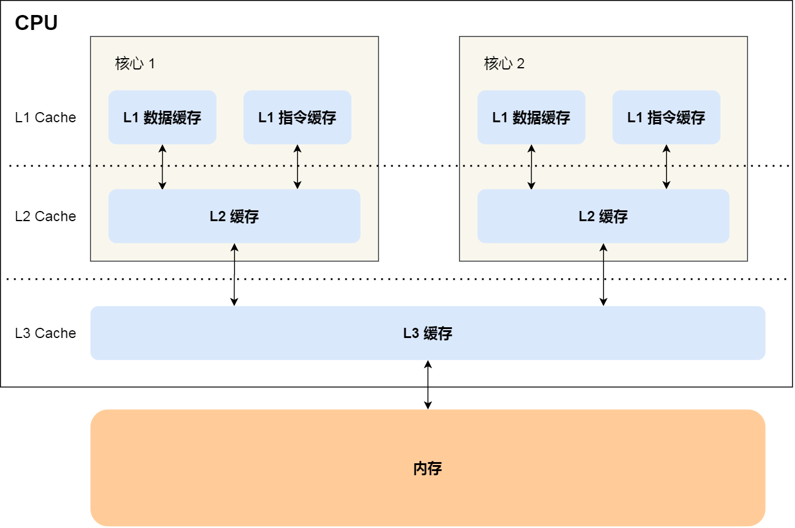
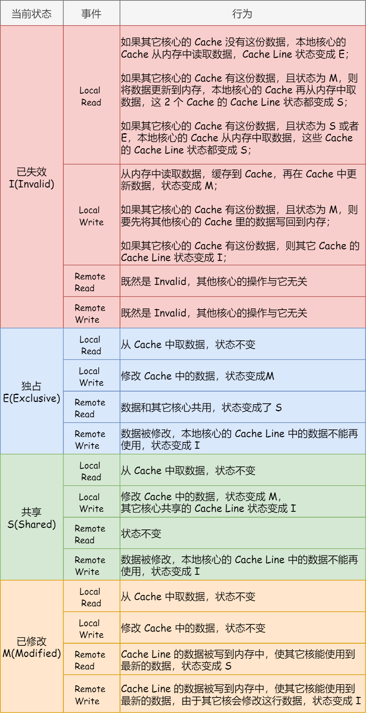

---
# 这是页面的图标
icon: page

# 这是文章的标题
title: CPU 缓存

# 设置作者
author: lllllan

# 设置写作时间
# time: 2020-01-20

# 一个页面只能有一个分类
category: 

# 一个页面可以有多个标签
tag:

# 此页面会在文章列表置顶
# sticky: true

# 此页面会出现在首页的文章板块中
star: true

# 你可以自定义页脚
# footer: 

---

::: warning 转载声明

- [10 张图打开 CPU 缓存一致性的大门 - 小林coding - 博客园 (cnblogs.com)](https://www.cnblogs.com/xiaolincoding/p/13886559.html)

:::

## CPU Cache

> CPU 和内存的访问性能相差较大，而 CPU Cache 离 CPU 核心相当近，访问速度特别快。为了能够提升读写数据的效率， 基于局部性原理，采用 CPU Cache 来充当 CPU 和内存之间的缓存角色。

CPU Cache 通常分为三级缓存：L1 Cache、L2 Cache、L3 Cache，级别越低的离 CPU 核心越近，访问速度也快，但是存储容量相对就会越小。

### 缓存行

CPU Cache 是由很多个 Cache Line 组成的，CPU Line 是 CPU 从内存读取数据的基本单位，而 CPU Line 是由各种标志（Tag）+ 数据块（Data Block）组成。

事实上，数据不光是只有读操作，还有写操作，那么如果数据写入 Cache 之后，内存与 Cache 相对应的数据将会不同，这种情况下 Cache 和内存数据都不一致了，于是我们肯定是要把 Cache 中的数据同步到内存里的。

## 缓存和内存的一致性

数据不光是只有读操作，还有写操作，那么如果数据写入 Cache 之后，内存与 Cache 相对应的数据将会不同，这种情况下 Cache 和内存数据都不一致了，于是我们肯定是要把 Cache 中的数据同步到内存里的。

### 写直达

保持内存与 Cache 一致性最简单的方式是，**把数据同时写入内存和 Cache 中**，这种方法称为**写直达（Write Through）**。

在这个方法里，写入前会先判断数据是否已经在 CPU Cache 里面了：

- 如果数据已经在 Cache 里面，先将数据更新到 Cache 里面，再写入到内存里面；
- 如果数据没有在 Cache 里面，就直接把数据更新到内存里面。

==写直达法很直观，也很简单，但是问题明显，无论数据在不在 Cache 里面，每次写操作都会写回到内存，这样写操作将会花费大量的时间，无疑性能会受到很大的影响。==

### 写回

在写回机制中，**当发生写操作时，新的数据仅仅被写入 Cache Block 里，只有当修改过的 Cache Block「被替换」时才需要写到内存中**，减少了数据写回内存的频率，这样便可以提高系统的性能。

当发生写操作时：

- 如果数据已经在 CPU Cache 里的话，则把数据更新到 CPU Cache 里，同时标记这个 Cache Block 为脏（Dirty）
- 如果数据所对应的 Cache Block 里存放的是「别的内存地址的数据」的话
    - 就要检查这个 Cache Block 里的数据有没有被标记为脏的，如果是脏的话，我们就要把这个 Cache Block 里的数据写回到内存，然后再把当前要写入的数据，写入到这个 Cache Block 里，同时也把它标记为脏的
    - 如果 Cache Block 里面的数据没有被标记为脏，则就直接将数据写入到这个 Cache Block 里，然后再把这个 Cache Block 标记为脏的就好了。

只有在缓存不命中，同时数据对应的 Cache 中的 Cache Block 为脏标记的情况下，才会将数据写到内存中，而在缓存命中的情况下，则在写入后 Cache 后，只需把该数据对应的 Cache Block 标记为脏即可，而不用写到内存里。

这样的好处是，如果我们大量的操作都能够命中缓存，那么大部分时间里 CPU 都不需要读写内存，自然性能相比写直达会高很多。

## 缓存之间的一致性

现在 CPU 都是多核的，由于 L1/L2 Cache 是多个核心各自独有的，那么会带来多核心的**缓存一致性（Cache Coherence）** 的问题，如果不能保证缓存一致性的问题，就可能造成结果错误。

- 第一点，某个 CPU 核心里的 Cache 数据更新时，必须要传播到其他核心的 Cache，这个称为 ==写传播（Wreite Propagation）==
- 第二点，某个 CPU 核心里对数据的操作顺序，必须在其他核心看起来顺序是一样的，这个称为 ==事务的串形化（Transaction Serialization）==

### 总线嗅探

==某个 CPU 核心对缓存的修改，会通过总线把这个事件通知给其他所有的核心，然后每个 CPU 核心都会监听总线的广播事件。==

线嗅探只是保证了某个 CPU 核心的 Cache 更新数据这个事件能被其他 CPU 核心知道，但是并不能保证事务串形化。

### MESI协议

MESI 协议其实是 4 个状态单词的开头字母缩写，分别是：

- *Modified*，「已修改」状态就是我们前面提到的脏标记，代表该 Cache Block 上的数据已经被更新过，但是还没有写到内存里。
- *Exclusive*，「独占」状态的下数据只存储在一个 CPU 核心的 Cache 里，而其他 CPU 核心的 Cache 没有该数据。并且的数据是干净的。
- *Shared*，「共享」状态代表着相同的数据在多个 CPU 核心的 Cache 里都有，并且数据是干净的。
- *Invalidated*，「已失效」状态，表示的是这个 Cache Block 里的数据被别的 CPU 核心修改了，这里的数据并不是最新的、已经失效了，不可以读取该状态的数据。

举个栗子：

1. 当 A 号 CPU 核心从内存读取变量 i 的值，数据被缓存在 A 号 CPU 核心自己的 Cache 里面， ==此时其他 CPU 核心的 Cache 没有缓存该数据，于是标记 Cache Line 状态为「独占」，此时其 Cache 中的数据与内存是一致的==
2. 然后 B 号 CPU 核心也从内存读取了变量 i 的值，此时会发送消息给其他 CPU 核心，由于 A 号 CPU 核心已经缓存了该数据，所以会把数据返回给 B 号 CPU 核心。在这个时候， A 和 B 核心缓存了相同的数据， ==Cache Line 的状态就会变成「共享」，并且其 Cache 中的数据与内存也是一致的==
3. 当 A 号 CPU 核心要修改 Cache 中 i 变量的值，发现数据对应的 Cache Line 的状态是共享状态，则要向所有的其他 CPU 核心广播一个请求， ==要求先把其他核心的 Cache 中对应的 Cache Line 标记为「无效」状态，然后 A 号 CPU 核心才更新 Cache 里面的数据，同时标记 Cache Line 为「已修改」状态，此时 Cache 中的数据就与内存不一致了==
4. 如果 A 号 CPU 核心「继续」修改 Cache 中 i 变量的值，由于此时的 ==Cache Line 是「已修改」状态，因此不需要给其他 CPU 核心发送消息，直接更新数据即可==
5. 如果 A 号 CPU 核心的 Cache 里的 i 变量对应的 Cache Line 要被「替换」，发现 Cache Line 状态是「已修改」状态，就会在替换前先把数据同步到内存。
6. 如果 B 号 CPU 核心想要修改 Cache 中 i 变量的值，由于此时的 ==Cache Line 是「无效」状态，需要从内存中读取数据（因为 A 号 CPU 核心已经把 i 变量替换掉了）==

当 Cache Line 状态是「已修改」或者「独占」状态时，修改更新其数据不需要发送广播给其他 CPU 核心，这在一定程度上减少了总线带宽压力。

