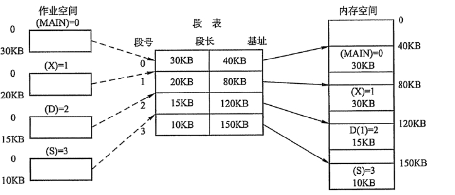

---
# 这是页面的图标
icon: page

# 这是文章的标题
title: 内存管理

# 设置作者
author: lllllan

# 设置写作时间
# time: 2020-01-20

# 一个页面只能有一个分类
category: 

# 一个页面可以有多个标签
tag:

# 此页面会在文章列表置顶
# sticky: true

# 此页面会出现在首页的文章板块中
star: true

# 你可以自定义页脚
# footer: 
---

::: warning 转载声明

- [JavaGuide（Java学习&&面试指南） | JavaGuide](https://javaguide.cn/home.html#必看专栏)
- [2021-Java后端工程师必会知识点-(操作系统) - 掘金 (juejin.cn)](https://juejin.cn/post/6942686874301857800#heading-1)
- [为什么使用多级页表？_ibless的博客-CSDN博客_多级页表的好处](https://blog.csdn.net/ibless/article/details/81275009)

:::

[内存管理概念 | lllllan](http://blog.lllllan.cn/cs-basic/os/wangdao/3/1/)

## 内存管理介绍

- 内存空间的分配与回收
- 地址转换：把逻辑地址转换成相应的物理地址
- 内存空间的扩充：利用虚拟技术或自动覆盖技术，从逻辑上扩充内存
- 存储保护：保证各道作业在各自的存储空间内运行，互不干扰

## 内存分配机制

简单分为 **连续分配管理方式** 和 **非连续分配管理方式** 两种。

- 连续分配管理方式是指为一个用户程序分配一个连续的内存空间，常见的如 <u>块式管理</u>
- 非连续分配管理方式允许一个程序使用的内存分布在离散或者说不相邻的内存中，常见的如 <u>页式管理</u>、<u>段式管理</u>、<u>段页式管理</u>

1. **块式管理：** 将内存分为几个固定大小的块，每个块中只包含一个进程。如果程序运行需要内存的话，操作系统就会分配给它一块，如果程序运行只需要很小的空间的话，块中其余的部分将会被浪费。
2. **页式管理：** 把主存分为大小相等的一页一页的形式，页较小，相对比块式管理的划分力度更大，提高了内存利用率，减少了碎片（块中没有被利用的空间）。页式管理通过页表对应逻辑地址和物理地址
3. **段式管理：** 段式管理把主存分为一段段的，每个段定义了一组逻辑信息，例如有主程序的 Main、子程序段 X、数据段 D 及栈段 S 等。段式管理通过段表对应逻辑地址和物理地址，相对于页式管理赋予了段的实际意义。
4. **段页式管理：** 把主存分成若干段，每个段分成若干页，结合了段式管理和页式管理的优点。

## 快表和多级页表

### 快表

为了解决虚拟地址到物理地址的转换速度，操作系统在页表方案基础上引入了快表来加速虚拟地址到物理地址的转换。我们可以把快表理解为一种特殊的 ==高速缓冲存储器（Cache）== ，其中的内容是页表的一部分或者全部内容。作为页表的 Cache，它的作用与页表相似，但是提高了访问速率。由于采用页表做地址转换，读写内存数据 CPU 要访问两次主存。有了快表，有时只要访问一次告诉缓冲存储区，一次主存，这样可以加速查找并提高指令执行速度。

[虚拟内存管理 | lllllan](http://blog.lllllan.cn/cs-basic/os/wangdao/3/2/#_2-3-地址变换机构)

1. 根据虚拟地址中的页号查快表
2. 如果该页在快表中，直接从快表中读取相应的物理地址
3. 如果该页不在快表中，就访问内存中的页表，再从页表中得到物理地址，同时将该映射添加到快表中
4. 当快表填满后，新添加时会按照一定的淘汰策略淘汰掉快表中的一页

### 多级页表

[为什么使用多级页表？_ibless的博客-CSDN博客_多级页表的好处](https://blog.csdn.net/ibless/article/details/81275009)

- 多级页表可以离散地存储页表。页帧可以离散，是因为有页表记录它们存在的位置。一级页表必须连续，当页帧较多的时候则需要占用较大的连续空间。使用多级页表可以离散地存储页表，通过某一级的页表记录下一级页表的存储位置。通过时间换取空间。
- 在虚拟存储技术中，可以节省页表的占用空间。因为局部性原理，暂时用不到的信息不会写到内存中，页表中就可以少一些记录。

### 总结

为了提高内存的空间性能，提出了多级页表的概念；但是提到空间性能是以浪费时间性能为基础的，因此为了补充损失的时间性能，提出了快表的概念。

## 分页

把内存空间划分为**大小相等且固定的块**，作为主存的基本单位。因为程序数据存储在不同的页面中，而页面又离散的分布在内存中，**因此需要一个页表来记录映射关系，以实现从页号到物理块号的映射。**

访问分页系统中内存数据需要**两次的内存访问** (一次是从内存中访问页表，从中找到指定的物理块号，加上页内偏移得到实际物理地址；第二次就是根据第一次得到的物理地址访问内存取出数据)。

## 分段

**分页是为了提高内存利用率，而分段是为了满足程序员在编写代码的时候的一些逻辑需求(比如数据共享，数据保护，动态链接等)。**

分段内存管理当中，**地址是二维的，一维是段号，二维是段内地址；其中每个段的长度是不一样的，而且每个段内部都是从0开始编址的**。由于分段管理中，每个段内部是连续内存分配，但是段和段之间是离散分配的，因此也存在一个逻辑地址到物理地址的映射关系，相应的就是段表机制。

## 分页和分段的异同

**共同点：**

- 都是为了提高内存利用率，减少内存碎片
- 都是离散分配内存的方式，但页和段中的内存都是连续的

**区别：**

- 页的大小是固定的，由操作系统决定；段的大小是不固定的，取决于当前运行的程序
- 分页仅仅是为了满足操作系统内存管理的需求；段是逻辑信息的单位，在程序中可以体现为代码段、数据段，能够更好满足用户的需求
- 分页主要用于实现虚拟内存，从而获得更大的地址空间；分段主要是为了使程序和数据可以被划分为逻辑上独立的地址空间并且有助于共享和保护。

## 逻辑地址和物理地址

比如在 C 语言中，指针里面存储的数值就可以理解成为内存里的一个地址，这个地址也就是我们说的逻辑地址，逻辑地址由操作系统决定。物理地址指的是真实物理内存中地址，更具体一点来说就是内存地址寄存器中的地址。物理地址是内存单元真正的地址

## CPU 寻址

现代处理器使用的是 **虚拟寻址** 的方式。**使用虚拟寻址，CPU需要将虚拟地址翻译成物理地址，这样才能访问到真实的物理内存。** 实际上完成虚拟地址转换为物理地址的硬件是 CPU 中的 **内存管理单元**

::: info 为什么要有虚拟地址空间？

在没有虚拟地址的时候，程序都是直接访问和操作物理内存的，存在以下问题：

1. 用户程序可以访问任意内存，寻址内存的每个字节，这样就很容易（有意或者无意）破坏操作系统，造成操作系统崩溃
2. 想要同时运行多个程序特别困难，困难会发生多个程序同时修改同个内存地址上的内容，从而导致程序的崩溃

**如果直接把物理地址暴露出来的话会带来严重问题，可能会对操作系统和程序造成伤害和困难**

通过虚拟地址访问内存有以下优势：

1. 程序可以使用一系列相邻的虚拟地址来访问物理内存中不相邻的大内存缓冲区
2. 程序可以使用一系列虚拟地址访问大于可用物理内存的内存缓冲区。当物理内存的供应量变小时，内存管理器会将物理内存页保存到磁盘文件。数据或代码也会根据需要在物理内存与磁盘之间移动
3. 不同进程使用的虚拟地址彼此隔离。一个进程中的代码无法更改正在由另一进程或操作系统使用的物理内存

:::

## 覆盖于交换

[内存管理概念 | lllllan](http://blog.lllllan.cn/cs-basic/os/wangdao/3/1/#二、覆盖与交换)

交换技术主要在不同进程(或作业)之间进行，而覆盖则用于同一个程序或进程中

## 物理地址、逻辑地址、有效地址、线性地址、虚拟地址的区别 ▲

==物理地址== 就是内存中真正的地址，具有唯一性。**不管哪种地址，最终都会映射为物理地址**。

在`实模式`下，段基址 + 段内偏移经过地址加法器的处理，经过地址总线传输，最终也会转换为`物理地址`。

但是在 `保护模式` 下，段基址 + 段内偏移被称为 ==线性地址== ，不过此时的段基址不能称为真正的地址，而是会被称作为一个 `选择子` 的东西，选择子就是个索引，相当于数组的下标，通过这个索引能够在 GDT 中找到相应的段描述符，段描述符记录了**段的起始、段的大小**等信息，这样便得到了基地址。如果此时没有开启内存分页功能，那么这个线性地址可以直接当做物理地址来使用，直接访问内存。如果开启了分页功能，那么这个线性地址又多了一个名字，这个名字就是 ==虚拟地址==

不论在实模式还是保护模式下，段内偏移地址都叫做 ==有效地址== 也是 ==逻辑地址==

线性地址可以看作是`虚拟地址`，虚拟地址不是真正的物理地址，但是虚拟地址会最终被映射为物理地址。下面是虚拟地址 -> 物理地址的映射。

