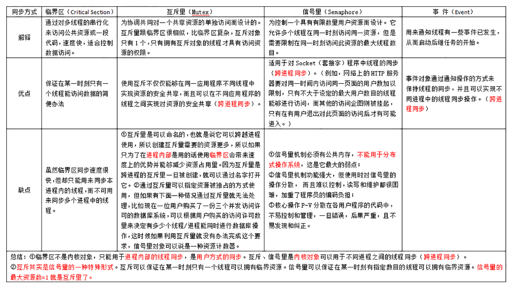

---

# 这是页面的图标
icon: page

# 这是文章的标题
title: 进程和线程

# 设置作者
author: lllllan

# 设置写作时间
# time: 2020-01-20

# 一个页面只能有一个分类
category: 

# 一个页面可以有多个标签
tag:

# 此页面会在文章列表置顶
# sticky: true

# 此页面会出现在首页的文章板块中
star: true

# 你可以自定义页脚
# footer: 
---

::: warning 转载声明

- [JavaGuide（Java学习&&面试指南） | JavaGuide](https://javaguide.cn/home.html#必看专栏)
- [协程的原理以及与线程的区别 - rhyme - 博客园 (cnblogs.com)](https://www.cnblogs.com/theRhyme/p/14061698.html)
- [协程的概念，为什么要用协程，以及协程的使用_someone丶](https://blog.csdn.net/weixin_44575037/article/details/105513014)
- [进程的切换过程_凝视阳光](https://blog.csdn.net/qq_40861091/article/details/102601719)

:::

## 进程和线程的区别

**概念：**

- **进程**：是并发执行的程序在执行过程中**分配和管理资源的基本单位**，是一个动态概念，竞争计算机系统资源的基本单位。
- **线程**：是进程的一个执行单元，是进程内的调度实体。比进程更小的独立运行的基本单位。线程也被称为轻量级进程。

**关系：**

1. 一个线程只属于一个进程，一个进程至少有一个线程
2. 资源分配给进程，同一进程的所有线程共享该进程的资源
3. 处理机分配给线程，真正在处理机上运行的是线程
4. 线程在执行过程中，需要协作同步。不同进程的线程间要利用消息通信的办法实现同步。

**区别：**

|          |              进程              |             线程             |
| :------: | :----------------------------: | :--------------------------: |
|   调度   |    分配和管理资源的基本单位    |     调度和分配的基本单位     |
|   资源   |           相互间独立           |       共享本进程的资源       |
|  健壮性  | 一个进程的崩溃不会影响其他进程 | 一个线程的崩溃会影响整个进程 |
|  并发性  |          可以并发执行          |         可以并发执行         |
| 系统开销 |               大               |              小              |

## 线程和协程的区别

[协程的原理以及与线程的区别 - rhyme - 博客园 (cnblogs.com)](https://www.cnblogs.com/theRhyme/p/14061698.html)

[协程的概念，为什么要用协程，以及协程的使用_someone丶](https://blog.csdn.net/weixin_44575037/article/details/105513014)

协程（Coroutines）是一种比线程更加轻量级的存在。协程完全由程序所控制（在用户态执行），带来的好处是性能大幅度的提升。

* 需要用户释放使用权切换到其他协程，因此 ==同一时间其实只有一个协程拥有运行权==，相当于单线程的能力。
* 一个线程可以有多个协程，一个进程也可以有多个协程。
* 协程不被操作系统内核管理，而完全是 ==由程序控制==。线程是被分割的CPU资源，协程是组织好的代码流程，线程是协程的资源。但协程不会直接使用线程，协程直接利用的是执行器关联任意线程或线程池。
* 协程能 ==保留上一次调用时的状态==
* 协程 ==无需系统内核的上下文切换==，开销更小
* 协程无需原子操作锁定及同步的开销，不用担心资源共享的问题

## 进程的状态

- **创建状态(new)** ：进程正在被创建，尚未到就绪状态。
- **就绪状态(ready)** ：进程已处于准备运行状态，即进程获得了除了处理器之外的一切所需资源，一旦得到处理器资源(处理器分配的时间片)即可运行。
- **运行状态(running)** ：进程正在处理器上上运行(单核 CPU 下任意时刻只有一个进程处于运行状态)。
- **阻塞状态(waiting)** ：又称为等待状态，进程正在等待某一事件而暂停运行如等待某资源为可用或等待 IO 操作完成。即使处理器空闲，该进程也不能运行。
- **结束状态(terminated)** ：进程正在从系统中消失。可能是进程正常结束或其他原因中断退出运行。

- **运行态→阻塞态**：往往是由于等待外设，等待主存等资源分配或等待人工干预而引起的。
- **阻塞态→就绪态**：则是等待的条件已满足，只需分配到处理器后就能运行。
- **运行态→就绪态**：不是由于自身原因，而是由外界原因使运行状态的进程让出处理器，这时候就变成就绪态。例如时间片用完，或有更高优先级的进程来抢占处理器等。
- **就绪态→运行态**：系统按某种策略选中就绪队列中的一个进程占用处理器，此时就变成了运行态。

## 进程/线程的通信方式 ★

[进程间通信 | lllllan](http://blog.lllllan.cn/cs-basic/os/def/process-communication/)

管道 | 有名管道 | 信号 | 消息队列 | 共享内存和信号量 | 套接字

---

[第五章、Java线程间的通信 | lllllan](http://blog.lllllan.cn/java/concurrent/1/5/)

共享内存 | 消息传递 | 管道

## 进程/线程的同步方式 ★

[同步与互斥 | lllllan](http://blog.lllllan.cn/cs-basic/os/wangdao/2/3/)

信号量 | 互斥量 | 管程 | 进程间通信

---

线程同步

信号量 | 互斥量 | 临界区 | 事件

## 进程的调度算法

[处理机调度 | lllllan](http://blog.lllllan.cn/cs-basic/os/wangdao/2/2/#四、典型的调度算法)

不论是在什么系统中，进程数量一般都会多于处理及数量，这将导致他们呢相互争夺处理机。这时就需要通过进程调度，来分配不同进程使用处理机的顺序，让这些进程**高效、及时、公平**地使用CPU，以提高CPU利用率。

1. **先来先服务调度算法 FCFS：** 所有进程按照 <u>先来后到</u> 的方式依次进入就绪队列，然后按照顺序为队列中的进程逐个分配资源，使他立即执行并且一直执行到完成或发生某事件而被阻塞放弃占用CPU时再重新调度。
2. **短作业优先调度算法 SJF：** 从就绪队列中选出一个 <u>估计运行时间最短</u> 的进程为止分配资源，使他立即执行并且一直执行到完成或发生某事件而被阻塞放弃占用CPU时再重新调度。
3. **时间片轮转调度算法 RR：** 所有进程按照 <u>先来后到</u> 的方式一次进入就绪队列，然后按照顺序为队列中的进程逐个 <u>分配固定时长的资源</u>，执行完成或时间结束都将放弃占用CPU，未执行完将重新调度。
4. **多级反馈队列调度算法：** 根据先来先服务原则给就绪队列排序，为就绪队列赋予<u>不同的优先级数，不同的时间片</u>，按照优先级抢占CPU
5. **优先级调度：** 为每个流程分配优先级，首先执行具有最高优先级的进程，以此类推。具有相同优先级的进程以 FCFS 方式执行。可以根据 <u>内存、时间或任何其他资源要求来确定优先级</u>。

## 死锁

[死锁 | lllllan](http://blog.lllllan.cn/cs-basic/os/wangdao/2/4/)

死锁是指多个进程在执行过程中，由于竞争资源或者由于彼此通信而造成的一种阻塞的现象，若无外力作用，他们都将无法推进下去。

### 死锁产生的原因

- 系统资源不足
- 程序执行的顺序有问题
- 资源分配不当

### 死锁产生的条件

- **互斥：** 指进程对所分配到的资源进行排他性使用，即在一段时间内某资源只由一个进程占用。如果此时还有其他进程请求资源，则请求者只能等待，直到占有资源的进程释放。
- **请求和保持：** 指进程已经保持至少一个资源，但又提出了新的资源请求，而该资源已被其他进程占有，此时请求进程阻塞，但又对已获得的其他资源保持不放。
- **不剥夺：** 指进程已获得的资源，在未使用完之前，不能被剥夺，只能在使用完时由自己释放。
- **环路等待：** 指在发生死锁时，必然存在一个进程-资源的环形链，即进程集合 `{P0, P1, P2, ... , Pn}` 中的 `P0` 正在等一个 `P1` 占用的资源； `P1` 正在等待 `P2` 占用的资源， ...... ，`Pn` 正在等待一个 `P0` 占用的资源。

**只有四个条件同时成立时，死锁才会出现。**

## 进程和线程切换 ★

[处理机调度 | lllllan](http://blog.lllllan.cn/cs-basic/os/wangdao/2/2/#五、进程切换)

[进程的切换过程_凝视阳光](https://blog.csdn.net/qq_40861091/article/details/102601719)

进程切换的流程：

1. 挂起一个进程，保存 CPU 上下文，包括程序计数器和其他寄存器。
2. 更新 PCB 信息（信息保存在进程控制块）
3. 把进程的 PCB 移入相应的队列，如就绪、在某事件阻塞等队列。
4. 选择另一个进程执行，并更新其 PCB。
5. 跳转到新进程 PCB 中的程序计数器所指向的位置执行。
6. 恢复处理机上下文

---

1. （进程）切换新的页表，然后使用新的虚拟地址空间
2. （进程、线程）切换内核栈和上下文

> 因为每个进程都有自己的虚拟地址空间，而线程是共享所在进程的虚拟地址空间的， 因此同一个进程中的线程切换时不涉及虚拟地址空间转换

## 线程分类

从线程的运行空间来说，分为用户级线程（user-level thread, ULT）和内核级线程（kernel-level, KLT）

**内核级线程**：这类线程依赖于内核，又称为内核支持的线程或轻量级进程。无论是在用户程序中的线程还是系统进程中的线程，它们的创建、撤销和切换都由内核实现

**用户级线程**：它仅存在于用户级中，这种线程是**不依赖于操作系统核心**的。应用进程利用**线程库来完成其创建和管理**，速度比较快，**操作系统内核无法感知用户级线程的存在**。

##  什么是临界区，如何解决冲突？▲

每个进程中访问临界资源的那段程序称为临界区，**一次仅允许一个进程使用的资源称为临界资源。**

解决冲突的办法：

- 如果有若干进程要求进入空闲的临界区，**一次仅允许一个进程进入**，如已有进程进入自己的临界区，则其它所有试图进入临界区的进程必须等待；
- 进入临界区的进程要在**有限时间内退出**。
- 如果进程不能进入自己的临界区，则应**让出CPU**，避免进程出现【忙等】现象。

