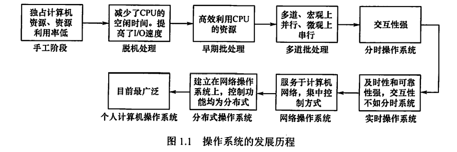

---
# 这是页面的图标
icon: page

# 这是文章的标题
title: 操作系统发展历程

# 设置作者
author: lllllan

# 设置写作时间
# time: 2020-01-20

# 一个页面只能有一个分类
category: 计算机基础

# 一个页面可以有多个标签
tag:
- 操作系统
- 王道-操作系统

# 此页面会在文章列表置顶
# sticky: true

# 此页面会出现在首页的文章板块中
star: true

# 你可以自定义页脚
# footer: 
---

::: warning 转载声明

- 《王道考研-操作系统》

:::

## 一、手工操作阶段

（此阶段无操作系统）

用户在计算机上算题的所有工作都要人工干预，如程序的装入、运行、结果的输出等。手工操作阶段有两个突出的缺点：

1. 用户独占全机，虽然不会出现因资源已被其他用户占用而等待的现象，但资源利用率低。
2. CPU等待手工操作，CPU的利用不充分。

## 二、批处理阶段

### 2.1 单道批处理系统

系统对作业的处理是 **成批进行的，但内存中始终保持一道作业**。

1. 自动性。在顺利的情况下，磁带上的一批作业能自动地逐个运行，而无须人工干预。
2. 顺序性。磁带上的各道作业顺序地进入内存，各道作业的完成顺序与它们进入内存的顺序在正常情况下应完全相同，亦即先调入内存的作业先完成。

3. 单道性。内存中仅有一道程序运行，即监督程序每次从磁带上只调入一道程序进入内存运行，当该程序完成或发生异常情况时，才换入其后继程序进入内存运行。

此时面临的问题是：每次主机内存中仅存放一道作业， 每当它在运行期间（注意这里是【运行时】而不是【完成后】）发出输入/输出请求后，高速的CPU便处于等待低速的I/O完成的状态。为了进一步提高资源的利用率和系统的吞吐量，引入了多道程序技术。

### 2.2 多道批处理系统

多道程序设计的特点是 **多道、宏观上并行、微观上串行**。

多道程序设计技术允许多个程序同时进入内存并允许它们在CPU中交替地运行，这些程序共享系统中的各种硬/软件资源。当一道程序因I/O请求而暂停运行时，CPU便立即转去运行另一道程序。

1. 多道。计算机内存中同时存放多道相互独立的程序。
2. 宏观上并行。同时进入系统的多道程序都处于运行过程中，即它们先后开始各自的运行，但都未运行完毕。
3. 微观上串行。内存中的多道程序轮流占有CPU，交替执行。

在批处理系统中采用多道程序设计技术就形成了多道批处理操作系统。该系统把用户提交的作业成批地送入计算机内存，然后由作业调度程序自动地选择作业运行。

优点：

- 资源利用率高，多道程序共享计算机资源，从而使各种资源得到充分利用;
- 系统吞吐量大，CPU 和其他资源保持【忙碌】状态。

缺点：

- 用户响应的时间较长；
- 不提供人机交互能力，用户既不能了解自己的程序的运行情况，又不能控制计算机。

##  三、分时操作系统

所谓分时技术，是指把处理器的运行时间分成很短的时间片，**按时间片轮流把处理器分配给各联机作业使用。**

> 若某个作业在分配给它的时间片内不能完成其计算，则该作业暂时停止运行，把处理器让给其他作业使用，等待下一轮再继续运行。由于计算机速度很快，作业运行轮转得也很快，因此给每个用户的感觉就像是自己独占一台计算机。
>
> 分时系统也是支持多道程序设计的系统，但它不同于多道批处理系统。多道批处理是实现作业自动控制而无须人工干预的系统，而分时系统是实现人机交互的系统，这使得分时系统具有与批处理系统不同的特征。

1. 同时性。同时性也称多路性，指允许多个终端用户同时使用一台计算机，即一台计算机与若干台终端相连接，终端上的这些用户可以同时或基本同时使用计算机。
2. 交互性。用户能够方便地与系统进行人机对话，即用户通过终端采用人机对话的方式直接控制程序运行，与同程序进行交互。
3. 独立性。系统中多个用户可以彼此独立地进行操作，互不干扰，单个用户感觉不到别人也在使用这台计算机，好像只有自己单独使用这台计算机一样。
4. 及时性。用户请求能在很短时间内获得响应。分时系统采用时间片轮转方式使一台计算机同时为多个终端服务，使用户能够对系统的及时响应感到满意。

虽然分时操作系统较好地解决了人机交互问题，但在一些应用场合，需要系统能对外部的信息在规定的时间（比时间片的时间还短）内做出处理（比如飞机订票系统或导弹制导系统），因此，实时操作系统应运而生。

## 四、实时操作系统

为了能 **在某个时间限制内完成某些紧急任务而不需要时间片排队**，诞生了实时操作系统。这里的时间限制可以分为两种情况：

- 硬实时系统：若某个动作必须绝对地在规定的时刻（或规定的时间范围）发生。如飞行器的飞行自动控制系统，这类系统必须提供绝对保证，让某个特定的动作在规定的时间内完成。
- 软实时系统：若能够接受偶尔违反时间规定且不会引起任何永久性的损害。如飞机订票系统、银行管理系统。

在实时操作系统的控制下，计算机系统接收到外部信号后及时进行处理，并在严格的时限内处理完接收的事件。实时操作系统的主要特点是及时性和可靠性。

## 五、网络操作系统和分布式计算机系统

网络操作系统把计算机网络中的各台计算机有机地结合起来，提供一种统一 、经济而有效的使用各台计算机的方法，实现各台计算机之间数据的互相传送。**网络操作系统最主要的特点是网络中各种资源的共享及各台计算机之间的通信。**

分布式计算机系统是由多台计算机组成并满足下列条件的系统：系统中任意两台计算机通过通信方式交换信息；系统中的每台计算机都具有同等的地位，即没有主机也没有从机；每台计算机上的资源为所有用户共享；系统中的任意台计算机都可以构成一个子系统，并且还能重构；任何工作都可以分布在几台计算机上，由它们并行工作、协同完成。用于管理分布式计算机系统的操作系统称为分布式计算机系统。该系统的主要特点是：分布性和并行性。分布式操作系统与网络操作系统的本质不同是，分布式操作系统中的若干计算机相互协同完成同一任务。

## 六、个人计算机操作系统

个人计算机操作系统是目前使用最广泛的操作系统,它广泛应用于文字处理、电子表格、游戏中，常见的有Windows、Linux和Macintosh等。

