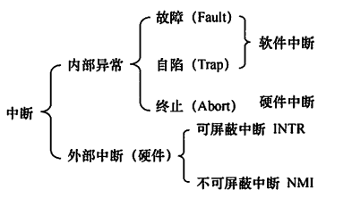
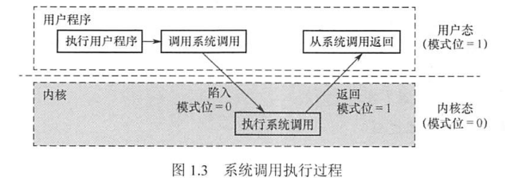

---
# 这是页面的图标
icon: page

# 这是文章的标题
title: 操作系统运行环境

# 设置作者
author: lllllan

# 设置写作时间
# time: 2020-01-20

# 一个页面只能有一个分类
category: 计算机基础

# 一个页面可以有多个标签
tag:
- 操作系统
- 王道-操作系统

# 此页面会在文章列表置顶
# sticky: true

# 此页面会出现在首页的文章板块中
star: true

# 你可以自定义页脚
# footer: 

---

::: warning 转载声明

- 《王道考研-操作系统》

:::

## 一、处理器运行模式

计算机系统中，通常CPU执行两种不同性质的程序：

- 一种是操作系统内核程序，能够执行一些特权指令；
- 另一种是用户自编程序（即系统外层的应用程序，或简称“应用程序”），出于安全考虑不能执行这些指令。

::: info 特权指令

特权指令是指不允许用户直接使用的指令，如I/O指令、置中断指令，存取用于内存保护的寄存器、送程序状态字到程序状态字寄存器等的指令。

非特权指令，是指允许用户直接使用的指令，它不能直接访问系统中的软硬件资源，仅限于访问用户的地址空间，这也是为了防止用户程序对系统造成破坏。

:::

在具体实现上，将CPU的运行模式划分为 ==用户态==（目态）和 ==核心态==（又称管态、内核态）。

> 可以理解为CPU内部有一个小开关，当小开关为0时，CPU处于核心态，此时CPU可以执行特权指令，切换到用户态的指令也是特权指令。当小开关为1时，CPU处于用户态，此时CPU只能执行非特权指令。用户自编程序运行在用户态，操作系统内核程序运行在核心态。

一些与硬件关联较紧密的模块，如时钟管理、中断处理、设备驱动等处于最低层。其次是运行频率较高的程序，如进程管理、存储器管理和设备管理等。这两部分内容构成了操作系统的内核。这部分内容的指令操作工作在核心态。

### 1.1 时钟管理

在计算机的各种部件中，时钟是最关键的设备。

- 计时，操作系统需要通过时钟管理，向用户提供标准的系统时间。
- 通过时钟中断的管理，实现进程的切换。

### 1.2 中断机制

::: info 中断

中断是指计算机运行过程中，出现某些意外情况需主机干预时，机器能自动停止正在运行的程序并转入处理新情况的程序，处理完毕后又返回原被暂停的程序继续运行。

:::

引入中断技术的初衷是 **提高多道程序运行环境中CPU的利用率**，而且主要是针对外部设备的。后来逐步得到发展，形成了多种类型，成为操作系统各项操作的基础。例如，键盘或鼠标信息的输入、进程的管理和调度、系统功能的调用、设备驱动、文件访问等，无不依赖于中断机制。可以说，现代操作系统是靠中断驱动的软件。

中断机制中，只有一小部分功能属于内核，它们负责保护和恢复中断现场的信息，转移控制权到相关的处理程序。这样可以减少中断的处理时间，提高系统的并行处理能力。

### 1.3 原语

::: info 原语

一般是指由若干条指令组成的程序段，用来实现某个特定功能，在执行过程中不可被中断

:::

按层次结构设计的操作系统，底层必然是一些可被调用的公用小程序，它们各自完成一个规定的操作。它们的特点如下:

1. 处于操作系统的最低层，是最接近硬件的部分。
2. 这些程序的运行具有原子性，其操作只能一气呵成（出于系统安全性和便于管理考虑）。
3. 这些程序的运行时间都较短，而且调用频繁。

### 1.4 系统控制的数据结构及处理

系统中用来登记状态信息的数据结构很多，如作业控制块、进程控制块（PCB）、 设备控制块、各类链表、消息队列、缓冲区、空闲区登记表、内存分配表等。为了实现有效的管理，系统需要一些基本的操作，常见的操作有以下3种:

1. 进程管理。进程状态管理、进程调度和分派、创建与撤销进程控制块等。
2. 存储器管理。存储器的空间分配和回收、内存信息保护程序、代码对换程序等。
3. 设备管理。缓冲区管理、设备分配和回收等。

## 二、中断和异常的概念

在操作系统中引入核心态和用户态这两种工作状态后，就需要考虑这两种状态之间如何切换。

> 系统不允许用户程序实现核心态的功能，而它们又必须使用这些功能。因此，需要在核心态建立一些【门】，以便实现从用户态进入核心态。在实际操作系统中，CPU运行上层程序时唯一能进入这些 “门”的途径就是通过中断或异常。
>
> 发生中断或异常时，运行用户态的CPU会立即进入核心态，这是通过硬件实现的(例如，用一个特殊寄存器的一位来表示CPU所处的工作状态，0表示核心态，1 表示用户态。若要进入核心态，则只需将该位置0即可)。

### 2.1 中断和异常的定义

::: info 中断

中断是指CPU对系统发生某事件时的这样一种响应

CPU 暂停正在执行的程序，在保留现场后自动地转去执行该事件的中断处理程序；执行完后，再返回到原程序的断点处继续执行。

:::

- 外中断——就是我们指的 **中断**，是指由于外部设备事件所引起的中断，如通常的磁盘中断、打印机中断等；
- 内中断——就是 **异常**，是指由于 CPU 内部事件所引起的中断，如程序出错（非法指令、地址越界）。内中断(trap)也被译为【**捕获**】或【**陷入**】。

### 2.2 中断和异常的分类

外中断可分为可屏蔽中断和不可屏蔽中断。

- 可屏蔽中断。是指通过INTR线发出的中断请求，通过改变屏蔽字可以实现多重中断，从而使得中断处理更加灵活。
- 不可屏蔽中断。是指通过NMI线发出的中断请求，通常是紧急的硬件故障，如电源掉电等。此外，异常也是不能被屏蔽的。

----

异常可分为故障、自陷和终止。

- 故障(Fault) 。通常是由 **指令执行引起的异常**，如非法操作码、缺页故障、除数为0、运算溢出等。
- 自陷(Trap) 。是一种 **事先安排** 的异常事件，用于在用户态下调用操作系统内核程序，如条件陷阱指令。
- 终止(Abort)。是指出现了使得CPU无法继续执行的 **硬件故障**，如控制器出错、存储器校验错等。

故障异常和自陷异常属于软件中断（程序性异常），终止异常和外部中断属于硬件中断。

### 2.3 中断和异常的处理过程

中断和异常处理过程的大致描述如下：当CPU在执行用户程序的第i条指令时检测到-一个异常事件，或在执行第i条指令后发现一个中断请求信号，则CPU打断当前的用户程序，然后转到相应的中断或异常处理程序去执行。

若中断或异常处理程序能够解决相应的问题，则在中断或异常处理程序的最后，CPU通过执行中断或异常返回指令，回到被打断的用户程序的第i条指令或第i+ 1条指令继续执行；

若中断或异常处理程序发现是不可恢复的致命错误，则终止用户程序。通常情况下，对中断和异常的具体处理过程由操作系统（和驱动程序）完成。

## 三、系统调用

所谓系统调用，是指用户在程序中调用操作系统所提供的一些子功能，系统调用可视为特殊的公共子程序。系统中的各种共享资源都由操作系统统一掌管，因此在用户程序中，凡是与资源有关的操作（如存储分配、进行I/O传输及管理文件等），都必须通过系统调用方式向操作系统提出服务请求，并由操作系统代为完成

- 设备管理。完成设备的请求或释放，以及设备启动等功能。
- 文件管理。完成文件的读、写、创建及删除等功能。
- 进程控制。完成进程的创建、撤销、阻塞及唤醒等功能。
- 进程通信。完成进程之间的消息传递或信号传递等功能。
- 内存管理。完成内存的分配、回收以及获取作业占用内存区大小及始址等功能。

显然，系统调用相关功能涉及系统资源管理、进程管理之类的操作，对整个系统的影响非常大，因此必定需要使用某些特权指令才能完成，所以系统调用的处理需要由操作系统内核程序负责完成，要运行在核心态。

**用户程序可以执行陷入指令（又称访管指令或trap指令）来发起系统调用，请求操作系统提供服务**。

> 可以这么理解，用户程序执行【陷入指令】，相当于把CPU的使用权主动交给操作系统内核程序（CPU状态会从用户态进入核心态），之后操作系统内核程序再对系统调用请求做出相应处理。处理完成后，操作系统内核程序又会把CPU的使用权还给用户程序（即CPU状态会从核心态回到用户态）。

这么设计的目的是：用户程序不能直接执行对系统影响非常大的操作，必须通过系统调用的方式请求操作系统代为执行，以便保证系统的稳定性和安全性，防止用户程序随意更改或访问重要的系统资源，影响其他进程的运行。

> 这样，操作系统的运行环境就可以理解为：用户通过操作系统运行上层程序（如系统提供的命令解释程序或用户自编程序），而这个上层程序的运行依赖于操作系统的底层管理程序提供服务支持，当需要管理程序服务时，系统则通过硬件中断机制进入核心态，运行管理程序；也可能是程序运行出现异常情况，被动地需要管理程序的服务，这时就通过异常处理来进入核心态。管理程序运行结束时，用户程序需要继续运行，此时通过相应的保存的程序现场退出中断处理程序或异常处理程序，返回断点处继续执行，如图1.3 所示。

在操作系统这一层面 上，我们关心的是系统核心态和用户态的软件实现与切换，对于硬件层面的具体理解，可以结合“计算机组成原理”课程中有关中断的内容进行学习。下面列举-些由用户态转向核心态的例子:

1. 用户程序要求操作系统的服务，即系统调用。
2. 发生一次中断。
3. 用户程序中产生了一个错误状态。
4. 用户程序中企图执行一条特权指令。
5. 从核心态转向用户态由一条指令实现，这条指令也是特权命令，一般是中断返回指令。

注意：由用户态进入核心态，不仅状态需要切换，而且所用的堆栈也可能需要由用户堆栈切换为系统堆栈，但这个系统堆栈也是属于该进程的。

若程序的运行由用户态转到核心态，则会用到访管指令，访管指令是在用户态使用的，所以它不可能是特权指令。

