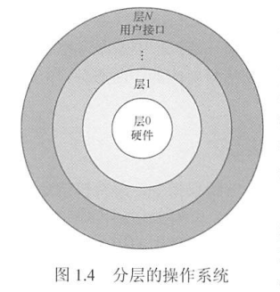
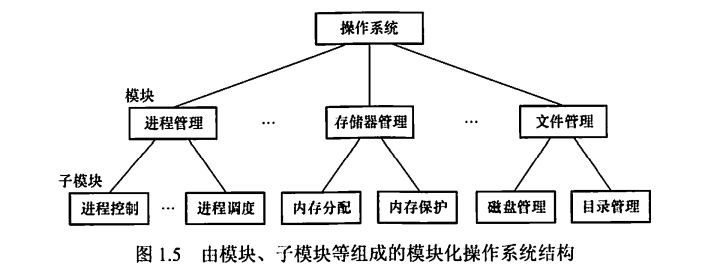
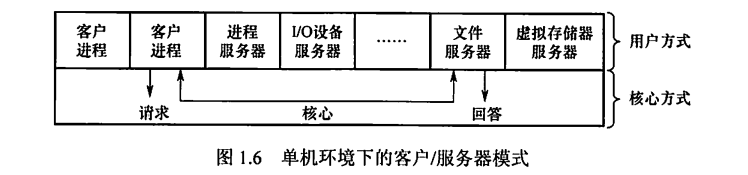

---
# 这是页面的图标
icon: page

# 这是文章的标题
title: 操作系统结构

# 设置作者
author: lllllan

# 设置写作时间
# time: 2020-01-20

# 一个页面只能有一个分类
category: 计算机基础

# 一个页面可以有多个标签
tag:
- 操作系统
- 王道-操作系统

# 此页面会在文章列表置顶
# sticky: true

# 此页面会出现在首页的文章板块中
star: true

# 你可以自定义页脚
# footer: 
---

::: warning 转载声明

- 《王道考研-操作系统》

:::

随着操作系统功能的不断增多和代码规模的不断扩大，提供合理的结构，对于降低操作系统复杂度、提升操作系统安全与可靠性来说变得尤为重要。

## 一、分层法

分层法是将操作系统分为若干层，最底层（层0）为硬件，最高层（层N）为用户接口，每层只能调用紧邻它的低层的功能和服务（单向依赖）。这种分层结构如图1.4所示。

### 1.1 分层法的优点

1. **便于系统的调试和验证，简化了系统的设计和实现**。第1层可先调试而无须考虑系统的其他部分，因为它只使用了基本硬件。第1层调试完且验证正确之后，就可以调试第2层，如此向上。如果在调试某层时发现错误，那么错误应在这一层上，这是因为它的低层都调试好了。
2. **易扩充和易维护**。在系统中增加、修改或替换一层中的模块或整层时，只要不改变相应层间的接口，就不会影响其他层。

### 1.2 分层法的问题

1. **合理定义各层比较困难**。因为依赖关系固定后，往往就显得不够灵活。
2. **效率较差**。操作系统每执行一个功能，通常要自上而下地穿越多层，各层之间都有相应的层间通信机制，这无疑增加了额外的开销，导致系统效率降低。

## 二、模块化

模块化，是将操作系统按功能划分为若干具有一定独立性的模块。

每个模块具有某方面的管理功能，并规定好各模块间的接口，使各模块之间能够通过接口进行通信。还可以进一步将各模块细分为若干具有一定功能的子模块，同样也规定好各子模块之间的接口。这种设计方法被称为模块-接口法，图1.5 所示为由模块、子模块等组成的模块化操作系统结构。

在划分模块时，如果将模块划分得太小，虽然能降低模块本身的复杂性，但会使得模块之间的联系过多，造成系统比较混乱；如果模块划分得过大，又会增加模块内部的复杂性，显然应在两者间进行权衡。此外，在划分模块时，要充分考虑模块的独立性问题，因为模块独立性越高，各模块间的交互就越少，系统的结构也就越清晰。衡量模块的独立性主要有两个标准:

- **内聚性**，模块内部各部分间联系的紧密程度。内聚性越高，模块独立性越好。
- **耦合度**， 模块间相互联系和相互影响的程度。耦合度越低，模块独立性越好。

### 2.1 模块化的优点

1. 提高了操作系统设计的正确性、可理解性和可维护性
2. 增强了操作系统的可适应性
3. 加速了操作系统的开发过程。

### 2.2 模块化的缺点

1. 模块间的接口规定很难满足对接口的实际需求
2. 各模块设计者齐头并进，每个决定无法建立在上一个已验证的正确决定的基础上，因此无法找到一个可靠的决定顺序。

## 三、宏内核

从操作系统的内核架构来划分，可分为宏内核和微内核。

宏内核，也称单内核或大内核，**是指将系统的主要功能模块都作为一个紧密联系的整体运行在核心态**，从而为用户程序提供高性能的系统服务。因为各管理模块之间共享信息，能有效利用相互之间的有效特性，所以具有无可比拟的性能优势。

随着体系结构和应用需求的不断发展，需要操作系统提供的服务越来越复杂，操作系统的设计规模急剧增长，操作系统也面临着“软件危机”困境。就像一个人，越胖活动起来就越困难。所以就出现了微内核技术，就是将一些非核心的功能移到用户空间，这种设计带来的好处是方便扩展系统，所有新服务都可以在用户空间增加，内核基本不用去做改动。

从操作系统的发展来看，宏内核获得了绝对的胜利，目前主流的操作系统，如Windows、Android、iOS、 macOS、 Linux 等，都是基于宏内核的构架。但也应注意到，微内核和宏内核一直是同步发展的，目前主流的操作系统早已不是当年纯粹的宏内核构架了，而是广泛吸取微内核构架的优点而后揉合而成的混合内核。当今宏内核构架遇到了越来越多的困难和挑战，而微内核的优势似乎越来越明显，尤其是谷歌的Fuchsia和华为的鸿蒙OS，都瞄准了微内核构架。

## 四、微内核

### 4.1 微内核的基本概念

微内核构架，**是指将内核中最基本的功能保留在内核，而将那些不需要在核心态执行的功能移到用户态执行**，从而降低内核的设计复杂性。那些移出内核的操作系统代码根据分层的原则被划分成若干服务程序，它们的执行相互独立，交互则都借助于微内核进行通信。

微内核结构将操作系统划分为两大部分：微内核和多个服务器。

微内核是指精心设计的、能实现操作系统最基本核心功能的小型内核，通常包含：

1. 与硬件处理紧密相关的部分
2. 一些较基本的功能
3. 客户和服务器之间的通信。

这些部分只是为构建通用操作系统提供一个重要基础，这样就可以确保将内核做得很小。操作系统中的绝大部分功能都放在微内核外的一组服务器（进程）中实现，如用于提供对进程（线程）进行管理的进程（线程）服务器、提供虚拟存储器管理功能的虚拟存储器服务器等，它们都是作为进程来实现的，运行在用户态，客户与服务器之间是借助微内核提供的消息传递机制来实现交互的。图1.6展示了单机环境下的客户/服务器模式。

在微内核结构中，为了实现高可靠性，只有微内核运行在内核态，其余模块都运行在用户态，一个模块中的错误只会使这个模块崩溃，而不会使整个系统崩溃。例如，文件服务代码运行时出了问题，宏内核因为文件服务是运行在内核态的，系统直接就崩溃了。而微内核的文件服务是运行在用户态的，只要把文件服务功能强行停止，然后重启，就可以继续使用，系统不会崩溃。

### 4.2 微内核的基本功能

微内核结构通常利用【机制与策略分离】的原理来构造OS结构，将机制部分以及与硬件紧密相关的部分放入微内核。微内核通常具有如下功能：

1. **进程（线程）管理**。进程（线程）之间的通信功能是微内核OS最基本的功能，此外还有进程的切换、进程的调度，以及多处理机之间的同步等功能，都应放入微内核中。

    > 举个例子，为实现进程调度功能，需要在进程管理中设置一个或多个进程优先级队列，这部分属于调度功能的机制部分，应将它放入微内核中。
    >
    > 而对用户进程如何分类，以及优先级的确认方式，则属于策略问题，可将它们放入微内核外的进程管理服务器中。

2. **低级存储器管理**。在微内核中，只配置最基本的低级存储器管理机制.

    > 如用于实现将逻辑地址变换为物理地址等的页表机制和地址变换机制，这一部分是依赖于硬件的，因此放入微内核。
    >
    > 而实现虚拟存储器管理的策略，则包含应采取何种页面置换算法，采用何种内存分配与回收的策略，应将这部分放在微内核外的存储器管理服务器中。

3. **中断和陷入处理**。微内核OS将与硬件紧密相关的一小部分放入微内核，此时微内核的主要功能是捕获所发生的中断和陷入事件，并进行中断响应处理，在识别中断或陷入的事件后，再发送给相关的服务器来处理，故中断和陷入处理也应放入微内核。微内核操作系统将进程管理、存储器管理以及IO管理这些功能一分为二，属于机制的很小一部分放入微内核，而绝大部分放入微内核外的各种服务器实现，大多数服务器都要比微内核大。因此，在采用客户/服务器模式时，能把微内核做得很小。

### 4.3 微内核的特点

微内核结构的优点主要有:

1. **扩展性和灵活性**。许多功能从内核中分离出米，当要修改某些功能或增加新功能时，只需在相应的服务器中修改或新增功能，或再增加一个专用的服务器，而无须改动内核代码。
2. **可靠性和安全性**。
3. **可移植性**。与CPU和I/O硬件有关的代码均放在内核中，而其他各种服务器均与硬件平台无关，因而将操作系统移植到另一个平台上所需做的修改是比较小的。
4. **分布式计算**。客户和服务器之间、服务器和服务器之间的通信采用消息传递机制，这就使得微内核系统能很好地支持分布式系统和网络系统。

微内核结构的主要问题是性能问题，因为需要频繁地在核心态和用户态之间进行切换，操作系统的执行开销偏大。为了改善运行效率，可以将那些频繁使用的系统服务移回内核，从而保证系统性能，但这又会使微内核的容量明显地增大。

虽然宏内核在桌面操作系统中取得了绝对的胜利，但是微内核在实时、工业、航空及军事应用中特别流行，这些领域都是关键任务，需要有高度的可靠性。

## 五、外核

不同于虚拟机克隆真实机器，另一种策略是对机器进行分区，给每个用户整个资源的一个子集。这样，某个虚拟机可能得到磁盘的0至1023盘块，而另一台虚拟机会得到磁盘的1024至2047盘块，等等。在底层中，一种称为外核(exokernel) 的程序在内核态中运行。

它的任务是为虚拟机分配资源，并检查使用这些资源的企图，以确保没有机器会使用他人的资源。每个用户层的虚拟机可以运行自己的操作系统，但限制只能使用已经申请并且获得分配的那部分资源。

外核机制的优点是 **减少了映射层**。在其他的设计中，每个虛拟机都认为它有自己的磁盘，其盘块号从0到最大编号，这样虚拟机监控程序就必须维护-张表格以重映像磁盘地址（或其他资源），有了外核，这个重映射处理就不需要了。外核只需要记录已经分配给各个虚拟机的有关资源即可。这种方法还有一个优点，它将多道程序（在外核内）与用户操作系统代码（在用户空间内）加以分离，而且相应的负载并不重，因为外核所做的只是保持多个虚拟机彼此不发生冲突。

