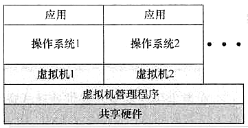
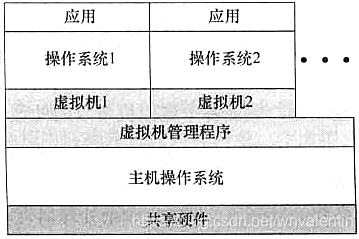

---
# 这是页面的图标
icon: page

# 这是文章的标题
title: 虚拟机

# 设置作者
author: lllllan

# 设置写作时间
# time: 2020-01-20

# 一个页面只能有一个分类
category: 计算机基础

# 一个页面可以有多个标签
tag:
- 操作系统
- 王道-操作系统

# 此页面会在文章列表置顶
# sticky: true

# 此页面会出现在首页的文章板块中
star: true

# 你可以自定义页脚
# footer: 
---

::: warning 转载声明

- 《王道考研-操作系统》

:::

虚拟机是一台【逻辑计算机】，**利用特殊的虚拟化技术，通过隐藏特定计算平台的实际物理特性，为用户提供抽象的、统一的、模拟的计算环境**。有两类虚拟化方法。

## 第一类虚拟机管理程序

从技术上讲，第一类虚拟机管理程序就像一个操作系统，因为它是唯一一个运行在最高特权级的程序。

它在裸机上运行并且具备多道程序功能。虚拟机管理程序向上层提供若干台虚拟机，这些虚拟机是裸机硬件的精确复制品。由于每台虚拟机都与裸机相同，所以在不同的虚拟机上可以运行任何不同的操作系统。

**虚拟机作为用户态的一个进程运行，不允许执行敏感指令。然而，虚拟机上的操作系统认为自己运行在内核态（实际上不是）**，称为【虚拟内核态】。虚拟机中的用户进程认为自己运行在用户态（实际上确实是）。

当虚拟机操作系统执行了一条CPU处于内核态才允许执行的指令时，会陷入虚拟机管理程序。在支持虚拟化的CPU上，虚拟机管理程序检查这条指令是由虚拟机中的操作系统执行的还是由用户程序执行的。如果是前者，虚拟机管理程序将安排这条指令功能的正确执行。否则，虚拟机管理程序将模拟真实硬件面对用户态执行敏感指令时的行为。

在过去不支持虚拟化的CPU上， 真实硬件不会直接执行虚拟机中的敏感指令，这些敏感指令被转为对虚拟机管理程序的调用，由虚拟机管理程序模拟这些指令的功能。

## 第二类虚拟机管理程序

它是一个依赖于Windows. Linux等操作系统分配和调度资源的程序，很像一个普通的进程。

**第二类虚拟机管理程序仍然伪装成具有**CPU和各种设备的完整计算机。VMware Workstation是首个X86平台上的第二类虚拟机管理程序。运行在两类虚拟机管理程序上的操作系统都称为客户操作系统。对于第二类虚拟机管理程序，运行在底层硬件上的操作系统称为宿主操作系统。首次启动时，第二类虚拟机管理程序像一台刚启动的计算机那样运转，期望找到的驱动器可以是虚拟设备。然后将操作系统安装到虚拟磁盘上（其实只是宿主操作系统中的一一个文件）。客户操作系统安装完成后，就能启动并运行。

虚拟化在Web主机领域很流行。没有虚拟化，服务商只能提供共享托管（不能控制服务器的软件）和独占托管（成本较高）。当服务商提供租用虚拟机时，一台物理服务器就可以运行多个虚拟机，每个虚拟机看起来都是- .台完整的服务器，客户可以在虚拟机上安装自己想用的操作系统和软件，但是只需支付较低的费用。这就是市面上常见的“云”主机。
