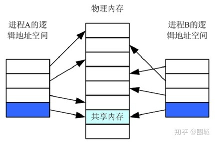

---
# 这是页面的图标
icon: page

# 这是文章的标题
title: 进程与线程

# 设置作者
author: lllllan

# 设置写作时间
# time: 2020-01-20

# 一个页面只能有一个分类
category: 计算机基础

# 一个页面可以有多个标签
tag:
- 操作系统
- 王道-操作系统

# 此页面会在文章列表置顶
# sticky: true

# 此页面会出现在首页的文章板块中
star: true

# 你可以自定义页脚
# footer: 
---

::: warning 转载声明

- 《王道考研-操作系统》
- [进程间的五种通信方式介绍 - moon-zhu](https://www.cnblogs.com/zgq0/p/8780893.html)
- [linux 进程间通信-FIFO（有名管道）_ShenHang_](https://blog.csdn.net/ShenHang_/article/details/106674378)
- [Linux进程间通信——消息队列](https://zhuanlan.zhihu.com/p/268389190)
- [用户级线程与核心级线程_成天天的博客](https://blog.csdn.net/weixin_39138071/article/details/80231760)

:::

## 一、进程的概念和特征

### 1.1 进程的概念

> 在多道程序环境下，允许多个程序并发执行，此时它们将失去封闭性，并具有间断性及不可再现性的特征。

为此引入了 ==进程(Process)== 的概念，以便更好地描述和控制程序的并发执行，实现操作系统的 **并发性和共享性**。

为了使参与并发执行的每个程序（含数据）都能独立地运行，必须为之配置一个专门的数据结构，称为 ==进程控制块(Process Control Block，PCB)== 。

系统利用PCB来描述进程的基本情况和运行状态，进而控制和管理进程。相应地，**由程序段、相关数据段和PCB三部分构成了进程实体（又称进程映像）**。

> 所谓创建进程，实质上是创建进程实体中的PCB；而撤销进程，实质上是撤销进程的PCB。值得注意的是，进程映像是静态的，进程则是动态的。注意：PCB是进程存在的唯一标志!从不同的角度，进程可以有不同的定义，比较典型的定义有:
>
> 1. 进程是程序的一次执行过程。
> 2. 进程是一个程序及其数据在处理机上顺序执行时所发生的活动。
> 3. 进程是具有独立功能的程序在一个数据集合上运行的过程，它是系统进行资源分配和调度的一个独立单位。

::: info 进程

进程是进程实体的运行过程，是系统进行资源分配和调度的一个独立单位。

:::

系统资源，指处理机、存储器和其他设备服务于某个进程的【时间】，例如把处理机资源理解为处理机的时间片才是准确的。因为进程是这些资源分配和调度的独立单位，即【时间片】分配的独立单位，这就决定了进程一定是一个动态的、过程性的概念。

### 1.2 进程的特征

进程是由多道程序的并发执行而引出的，它和程序是两个截然不同的概念。进程的基本特征是对比单个程序的顺序执行提出的，也是对进程管理提出的基本要求。

1. **动态性**。进程是程序的一次执行，它有着创建、活动、暂停、终止等过程，具有一定的生命周期，是动态地产生、变化和消亡的。动态性是进程最基本的特征。
2. **并发性**。指多个进程实体同存于内存中，能在一段时间内同时运行。引入进程的目的就是使进程能和其他进程并发执行。并发性是进程的重要特征，也是操作系统的重要特征。
3. **独立性**。指进程实体是一个能独立运行、独立获得资源和独立接受调度的基本单位。凡未建立PCB的程序，都不能作为一个独立的单位参与运行。
4. **异步性**。由于进程的相互制约，使得进程按各自独立的、不可预知的速度向前推进。异步性会导致执行结果的不可再现性，为此在操作系统中必须配置相应的进程同步机制。

## 二、进程的状态与转换

进程在其生命周期内，由于系统中各进程之间的相互制约及系统的运行环境的变化，使得进程的状态也在不断地发生变化。通常进程有以下5种状态，前3种是进程的基本状态。

1. **运行态**。进程正在处理机上运行。在单处理机中，每个时刻只有一个进程处于运行态。
2. **就绪态**。进程获得了除处理机外的一切所需资源，一旦得到处理机，便可立即运行。系统中处于就绪状态的进程可能有多个，通常将它们排成一个队列，称为就绪队列。
3. **阻塞态**，又称等待态。进程正在等待某一事件而暂停运行，如等待某资源为可用（不包括处理机）或等待输入/输出完成。即使处理机空闲，该进程也不能运行。系统通常将处于阻塞态的进程也排成一个队列，甚至根据阻塞原因的不同，设置多个阻塞队列。
4. **创建态**。进程正在被创建，尚未转到就绪态。创建进程需要多个步骤：首先申请一个空白PCB，并向PCB中填写用于控制和管理进程的信息；然后为该进程分配运行时所必须的资源；最后把该进程转入就绪态并插入就绪队列。但是，如果进程所需的资源尚不能得到满足，如内存不足，则创建工作尚未完成，进程此时所处的状态称为创建态。
5. **结束态**。进程正从系统中消失，可能是进程正常结束或其他原因退出运行。进程需要结束运行时，系统首先将该进程置为结束态，然后进一步处理资源释放和回收等工作。

::: tip 注意区别就绪态和等待态

就绪态是指进程仅缺少处理器，只要获得处理机资源就立即运行；而等待态是指进程需要其他资源（除了处理机）或等待某一事件。 之所以把处理机和其他资源划分开，是因为在分时系统的时间片轮转机制中，每个进程分到的时间片是若干毫秒。也就是说，进程得到处理机的时间很短且非常频繁，进程在运行过程中实际上是频繁地转换到就绪态的；而其他资源（如外设）的使用和分配或某一事件的发生（如I/O操作的完成）对应的时间相对来说很长，进程转换到等待态的次数也相对较少。这样来看，就绪态和等待态是进程生命周期中两个完全不同的状态，显然需要加以区分。

:::

图2.1说明了5种进程状态的转换，而3种基本状态之间的转换如下：

- 就绪态→运行态：处于就绪态的进程被调度后，**获得处理机资源**（分派处理机时间片），于是进程由就绪态转换为运行态。
- 运行态→就绪态：**处于运行态的进程在时间片用完后**，不得不让出处理机，从而进程由运行态转换为就绪态。此外，在可剥夺的操作系统中，当有更高优先级的进程就绪时，调度程序将正在执行的进程转换为就绪态，让更高优先级的进程执行。
- 运行态→阻塞态：进程请求某一资源（如外设）的使用和分配或等待某一事件的发生（如I/O操作的完成）时，它就从运行态转换为阻塞态。<u>进程以系统调用的形式请求操作系统提供服务</u>，这是一种特殊的、由运行用户态程序调用操作系统内核过程的形式。
- 阻塞态→就绪态：进程等待的事件到来时，如IO操作结束或中断结束时，中断处理程序必须把相应进程的状态由阻塞态转换为就绪态。

需要注意的是，一个进程从运行态变成阻塞态是主动的行为，而从阻塞态变成就绪态是被动的行为，需要其他相关进程的协助。

::: danger 疑问 —— 时间片轮转算法当中，时间片用完的进程在让出处理机的时候，需要让出资源吗？

:::

## 三、进程的组织

进程是一个独立的运行单位，也是操作系统进行资源分配和调度的基本单位。它由以下三部分组成，其中最核心的是进程控制块(PCB)。

### 3.1 进程控制块

进程创建时，操作系统为它新建一个PCB，该结构之后常驻内存，任意时刻都可以存取，并在进程结束时删除。==PCB是进程实体的一部分， 是进程存在的唯一标志== 。

> 进程执行时，系统通过其PCB了解进程的现行状态信息，以便操作系统对其进行控制和管理；进程结束时，系统收回其PCB，该进程随之消亡。

::: note 操作

- 当操作系统欲调度某进程运行时，要从该进程的PCB中查出其现行状态及优先级；
- 在调度到某进程后，要根据其PCB中所保存的处理机状态信息，设置该进程恢复运行的现场，并根据其PCB中的程序和数据的内存始址，找到其程序和数据；
- 进程在运行过程中，当需要和与之合作的进程实现同步、通信或访问文件时，也需要访问PCB；
- 当进程由于某种原因而暂停运行时，又需将其断点的处理机环境保存在PCB中。

:::

PCB主要包括进程描述信息、进程控制和管理信息、资源分配清单和处理机相关信息等。各部分的主要说明如下：

|  进程描述信息  | 进程控制和管理信息 | 资源分配清单 | 处理机相关信息 |
| :------------: | :----------------: | :----------: | :------------: |
| 进程标识符 PID |    进程当前状态    |  代码段指针  |  通用寄存器值  |
| 用户标识符 UID |     进程优先级     |  数据段指针  |  地址寄存器值  |
|                |  代码运行入口地址  |  堆栈段指针  |  控制寄存器值  |
|                |   程序的外存地址   |  文件描述符  |  标志寄存器值  |
|                |    进入内存时间    |     键盘     |     状态字     |
|                |   处理机占用时间   |     鼠标     |                |
|                |     信号量使用     |              |                |

**资源分配清单**，用于说明有关内存地址空间或虚拟地址空间的状况，所打开文件的列表和所使用的输入/输出设备信息。

**处理机相关信息**，也称处理机的上下文，主要指处理机中各寄存器的值。当进程处于执行态时，处理机的许多信息都在寄存器中。当进程被切换时，处理机状态信息都必须保存在相应的PCB中，以便在该进程重新执行时，能从断点继续执行。

::: tip PCB的组织方式

- 链接方式。将同一状态的PCB链接成一个队列，不同状态对应不同的队列，也可把处于阻塞态的进程的PCB，根据其阻塞原因的不同，排成多个阻塞队列。
- 索引方式。将同一状态的进程组织在一个索引表中，索引表的表项指向相应的PCB，不同状态对应不同的索引表，如就绪索引表和阻塞索引表等。

:::

### 3.2 程序段

程序段就是能被进程调度程序调度到CPU执行的程序代码段。注意，程序可被多个进程共享，即多个进程可以运行同一个程序。

### 3.3 数据段

一个进程的数据段，可以是进程对应的程序加工处理的原始数据，也可以是程序执行时产生的中间或最终结果。

## 四、进程控制

进程控制的主要功能是对系统中的所有进程实施有效的管理，它具有创建新进程、撤销已有进程、实现进程状态转换等功能。在操作系统中，一般把进程控制用的程序段称为原语， 原语的特点是执行期间不允许中断，它是一个不可分割的基本单位。

### 4.1 进程的创建

允许一个进程创建另一个进程，此时创建者称为父进程，被创建的进程称为子进程。子进程可以继承父进程所拥有的资源。当子进程被撤销时，应将其从父进程那里获得的资源归还给父进程。此外，在撤销父进程时，通常也会同时撤销其所有的子进程。

在操作系统中，终端用户登录系统、作业调度、系统提供服务、用户程序的应用请求等都会引起进程的创建。

::: note 创建原语

操作系统创建一个新进程的过程如下：

1. 为新进程分配一个唯一的进程标识号，并申请一个空白PCB（PCB是有限的）。若PCB申请失败，则创建失败。
2. 为进程分配其运行所需的资源，如内存、文件、I/O 设备和CPU时间等（在PCB中体现）。这些资源或从操作系统获得，或仅从其父进程获得。如果资源不足（如内存），则并不是创建失败，而是处于创建态，等待内存资源。
3. 初始化PCB，主要包括初始化标志信息、初始化处理机状态信息和初始化处理机控制信息，以及设置进程的优先级等。
4. 若进程就绪队列能够接纳新进程，则将新进程插入就绪队列，等待被调度运行。

:::

### 4.2 进程的终止

引起进程终止的事件主要有:

1. 正常结束，表示进程的任务已完成并准备退出运行。
2. 异常结束，表示进程在运行时，发生了某种异常事件，使程序无法继续运行，如存储区越界、保护错、非法指令、特权指令错、运行超时、算术运算错、IO故障等。
3. 外界干预，指进程应外界的请求而终止运行，如操作员或操作系统干预、父进程请求和父进程终止。

::: note 终止原语

操作系统终止进程的过程如下：

1. 根据被终止进程的标识符，检索出该进程的PCB，从中读出该进程的状态。
2. 若被终止进程处于执行状态，立即终止该进程的执行，将处理机资源分配给其他进程。
3. 若该进程还有子孙进程，则应将其所有子孙进程终止。
4. 将该进程所拥有的全部资源，或归还给其父进程，或归还给操作系统。
5. 将该PCB从所在队列（链表）中删除。

:::

### 4.3 进程的阻塞和唤醒

正在执行的进程，由于期待的某些事件未发生，如请求系统资源失败、等待某种操作的完成、新数据尚未到达或无新任务可做等，进程便通过调用阻塞原语(Block)，使自己由运行态变为阻塞态。

可见，**阻塞是进程自身的一种主动行为**，也因此只有处于运行态的进程（获得CPU），才可能将其转为阻塞态。

::: note 阻塞原语

1. 找到将要被阻塞进程的标识号对应的PCB.
2. 若该进程为运行态，则保护其现场，将其状态转为阻塞态，停止运行。
3. 把该PCB插入相应事件的等待队列，将处理机资源调度给其他就绪进程。

:::

当被阻塞进程所期待的事件出现时，如它所启动的I/O操作已完成或其所期待的数据已到达，由有关进程（比如，释放该I/O设备的进程，或提供数据的进程）调用唤醒原语(Wakeup), 将等待该事件的进程唤醒。

::: note 唤醒原语

1. 在该事件的等待队列中找到相应进程的PCB。
2. 将其从等待队列中移出，并置其状态为就绪态。
3. 把该PCB插入就绪队列，等待调度程序调度。

:::

应当注意，Block 原语和 Wakeup 原语是一对作用刚好相反的原语，必须成对使用。如果在某进程中调用了Block 原语，则必须在与之合作的或其他相关的进程中安排一条相应的 Wakeup 原语，以便唤醒阻寨进程。否则，阳寒进程将会因不能被唤醒而永久地处千阻塞状态。

## 五、进程的通信

进程通信（IPC，InterProcess Communication）是指进程之间的信息交换。PV操作是低级通信方式，高级通信方式是指以较高的效率传输大量数据的通方式。

### 5.1 管道

管道，通常指无名管道，是 UNIX 系统IPC最古老的形式。

::: tip 特点

1. 半双工。数据在某一时刻只能在一个方向上流动。
2. 只能用于具有亲缘关系的进程之间的通信。父子进程或兄弟进程之间。
3. 特殊的文件。可以使用 read、write，但不属于任何文件系统， ==只存在于内存==

:::

为了协调双方的通信，管道机制必须提供以下三方面的协调能力：互斥、同步和确定对方的存在。

若要数据流从父进程流向子进程，则关闭父进程的读端（`fd[0]`）与子进程的写端（`fd[1]`）；反之，则可以使数据流从子进程流向父进程。

### 5.2 FIFO

FIFO，也称为命名管道，它是一种文件类型。

::: tip 特点

1. FIFO可以在无关的进程之间交换数据
2. FIFO有路径名与之相关联，是一种特殊设备文件形式

:::

FIFO是Linux基础文件类型中的一种。但，FIFO文件在磁盘上没有数据块，仅仅用来标识内核中一条通道。各进程可以打开这个文件进行read/write，实际上是在 ==读写内核通道==，这样就实现了进程间通信。

有名管道突破了这种限制，可以实现互不相关的进程实现彼此的通信，管道可以通过路径名指定，在系统是可见的，建立管道之后就可以想普通文件一样进行读写，FIFO严格遵守先进先出的原则，读总是从开始读取数据，写数据写入末尾，不支持lseek()文件定位操作。

### 5.3 消息队列

消息队列，是消息的链接表，存放在内核中。一个消息队列由一个标识符（即队列ID）来标识。

::: tip 特点

1. 消息队列是面向记录的，其中的消息具有特定的格式以及特定的优先级。
2. 消息队列独立于发送与接收进程。进程终止时，消息队列及其内容并不会被删除。
3. 消息队列可以实现消息的随机查询，消息不一定要以先进先出的次序读取，也可以按消息的类型读取。

:::

### 5.4 共享内存和信号量

在通信的进程之间存在一块可直接访问的共享空间，通过对这片共享空间进行写/读操作实现进程之间的信息交换。在对共享空间进行写/读操作时，需要使用同步互斥工具（信号量），对共享空间的写/读进行控制。

::: tip 特点

1. ==共享内存是最快的一种 IPC，因为进程是直接对内存进行存取==。
2. 因为多个进程可以同时操作，所以需要进行同步。
3. 信号量 + 共享内存通常结合在一起使用，信号量用来同步对共享内存的访问。

:::

操作系统只负责为通信进程提供可共享使用的存储空间和同步互斥工具，而数据交换则由用户自己安排读/写指令完成。注意，进程空间一般都是独立的，进程运行期间一般不能访问其他进程的空间，想让两个进程共享空间， ==**必须通过特殊的系统调用实现**== ，而进程内的线程是自然共享进程空间的。

## 六、线程

### 6.1 线程的基本概念

引入进程的目的是更好地使多道程序并发执行，提高资源利用率和系统吞吐量；

**而引入线程的目的则是减小程序在并发执行时所付出的时空开销，提高操作系统的并发性能。**

线程最直接的理解就是【轻量级进程】，它是一个基本的CPU执行单元，也是程序执行流的最小单元，由线程ID、程序计数器、寄存器集合和堆栈组成。

> 线程是进程中的一个实体，是被系统独立调度和分派的基本单位，线程自己不拥有系统资源，只拥有一点儿在运行中必不可少的资源，但它可与同属一个进程的其他线程共享进程所拥有的全部资源。一个线程可以创建和撤销另一个线程， 同一进程中的多个线程之间可以并发执行。由于线程之间的相互制约，致使线程在运行中呈现出间断性。

线程也有就绪、阻塞和运行三种基本状态。引入线程后，进程的内涵发生了改变，**进程只作为除CPU外的系统资源的分配单元，而线程则作为处理机的分配单元**。由于一个进程内部有多个线程，若线程的切换发生在同一个进程内部，则只需要很少的时空开销。下面从几个方面对线程和进程进行比较。

### 6.2 线程与进程的比较

1. **调度**。在传统的操作系统中，拥有资源和独立调度的基本单位都是进程，每次调度都要进行上下文切换，开销较大。在引入线程的操作系统中，线程是独立调度的基本单位，而线程切换的代价远低于进程。在同一进程中，线程的切换不会引起进程切换。但从一个进程中的线程切换到另一个进程中的线程时，会引起进程切换。
2. **并发性**。在引入线程的操作系统中，不仅进程之间可以并发执行，而且一个进程中的多个线程之间亦可并发执行，甚至不同进程中的线程也能并发执行，从而使操作系统具有更好的并发性，提高了系统资源的利用率和系统的吞吐量。
3. **拥有资源**。进程是系统中拥有资源的基本单位，而线程不拥有系统资源（仅有一点必不可少、能保证独立运行的资源），但线程可以访问其隶属进程的系统资源，这主要表现在属于同进程的所有线程都具有相同的地址空间。
4. **独立性**。每个进程都拥有独立的地址空间和资源，除了共享全局变量，不允许其他进程访问。某进程中的线程对其他进程不可见。同一进程中 的不同线程是为了提高并发性及进行相互之间的合作而创建的，它们共享进程的地址空间和资源。
5. **系统开销**。在创建或撤销进程时，系统都要为之分配或回收进程控制块PCB及其他资源，如内存空间、I/O 设备等。操作系统为此所付出的开销，明显大于创建或撤销线程时的开销。类似地，在进程切换时涉及进程上下文的切换，而线程切换时只需保存和设置少量寄存器内容，开销很小。此外，由于同一进程内的多个线程共享进程的地址空间，因此这些线程之间的同步与通信非常容易实现，甚至无须操作系统的千预。
6. **支持多处理机系统**。对于传统单线程进程，不管有多少处理机，进程只能运行在一个处理机上。对于多线程进程，可以将进程中的多个线程分配到多个处理机上执行。

### 6.3 线程的属性

多线程操作系统中的进程已不再是一个基本的执行实体，但它仍具有与执行相关的状态。所谓进程处于【执行】状态，实际上是指该进程中的某线程正在执行。线程的主要属性如下:

1. 线程是一个轻型实体，它不拥有系统资源，但每个线程都应有一个唯一的标识符和一个线程控制块（TCB），线程控制块记录了线程执行的寄存器和栈等现场状态。
2. 不同的线程可以执行相同的程序，即同一个服务程序被不同的用户调用时，操作系统把它们创建成不同的线程。
3. 同一进程中的各个线程共享该进程所拥有的资源。
4. 线程是处理机的独立调度单位，多个线程是可以并发执行的。在单CPU的计算机系统中，各线程可交替地占用CPU；在多CPU的计算机系统中，各线程可同时占用不同的CPU，若各个CPU同时为一个进程内的各线程服务，则可缩短进程的处理时间。
5. 一个线程被创建后，便开始了它的生命周期，直至终止。线程在生命周期内会经历阻塞态、就绪态和运行态等各种状态变化。

为什么线程的提出有利于提高系统并发性？可以这样来理解：由于有了线程，线程切换时，有可能会发生进程切换，也有可能不发生进程切换，平均而言每次切换所需的开销就变小了，因此能够让更多的线程参与并发，而不会影响到响应时间等问题。

### 6.4 线程的状态与转换

与进程一样， 各线程之间也存在共享资源和相互合作的制约关系，致使线程在运行时也具有间断性。相应地，线程在运行时也具有下面三种基本状态。

- 执行状态：线程已获得处理机而正在运行。
- 就绪状态：线程己具备各种执行条件，只需再获得CPU便可立即执行。
- 阻塞状态：线程在执行中因某事件受阻而处于暂停状态。

线程这三种基本状态之间的转换和进程基本状态之间的转换是一样的。

### 6.5 线程的组织与控制

**线程控制块，TCB**

与进程类似，系统也为每个线程配置一个线程控制块TCB，用于记录控制和管理线程的信息。线程控制块通常包括:

1. 线程标识符;
2. 一组寄存器，包括程序计数器、状态寄存器和通用寄存器;
3. 线程运行状态，用于描述线程正处于何种状态;
4. 优先级;
5. 线程专有存储区，线程切换时用于保存现场等;
6. 堆栈指针，用于过程调用时保存局部变量及返回地址等。

同一进程中的所有线程都完全共享进程的地址空间和全局变量。各个线程都可以访问进程地址空间的每个单元，所以一个线程可以读、写或甚至清除另一个线程的堆栈。

----

**线程的创建**

线程也是具有生命期的，它由创建而产生，由调度而执行，由终止而消亡。相应地，在操作系统中就有用于创建线程和终止线程的函数（或系统调用）。

用户程序启动时，通常仅有一个称为【初始化线程】的线程正在执行，其主要功能是用于创建新线程。在创建新线程时，需要利用一个线程创建函数，并提供相应的参数，如指向线程主程序的入口指针、堆栈的大小、线程优先级等。线程创建函数执行完后，将返回一个线程标识符。

---

**线程的终止**

当一个线程完成自己的任务后，或线程在运行中出现异常而要被强制终止时，由终止线程调用相应的函数执行终止操作。但是有些线程（主要是系统线程）一旦被建立，便一直运行而不会被终止。通常，线程被终止后并不立即释放它所占有的资源，只有当进程中的其他线程执行了分离函数后，被终止线程才与资源分离，此时的资源才能被其他线程利用。被终止但尚未释放资源的线程仍可被其他线程调用，以使被终止线程重新恢复运行。

### 6.6 线程的实现方式

线程的实现可以分为两类：**用户级线程**(User-Level Thread, ULT) 和 **内核级线程**(Kemel-LevelThread, KLT)。 内核级线程又称内核支持的线程。

----

**用户级线程**(ULT)

**在用户级线程中，有关线程管理（创建、撤销和切换等）的所有工作都由应用程序在用户空间中完成，内核意识不到线程的存在。** 应用程序可以通过使用线程库设计成多线程程序。通常，应用程序从单线程开始，在该线程中开始运行，在其运行的任何时刻，可以通过调用线程库中的派生例程创建一个在相同进程中运行的新线程。

图2.5(a)说明了用户级线程的实现方式。对于设置了用户级线程的系统，其调度仍是以进程为单位进行的，各个进程轮流执行一个时间片。假设进程A包含1个用户级线程，进程B包含100个用户级线程，这样，进程A中线程的运行时间将是进程B中各线程运行时间的100倍，因此对线程来说实质上是不公平的。

::: tip 优缺点

这种实现方式的优点如下:

1. 整个用户级线程的切换发生在用户空间，这样的线程切换至少比陷入内核要快一个数量级（不需要陷入内核、不需要上下文切换、不需要对内存高速缓存进行刷新，这就使得线程调度非常快捷）。
2. 调度算法可以是进程专用的，不同的进程可根据自身的需要，对自己的线程选择不同的调度算法。
3. 用户级线程的实现与操作系统平台无关，对线程管理的代码是属于用户程序的一部分。
4. 线程的调度不需要内核直接参与，控制简单。

这种实现方式的缺点如下：

1. 系统调用的阻塞问题，当线程执行一个系统调用时，不仅该线程被阻塞，而且进程内的所有线程都被阻塞。
2. 不能发挥多处理机的优势，内核每次分配给一个进程的仅有一个CPU，因此进程中仅有一个线程能执行。

:::

---

**内核级线程**( KLT)

在操作系统中，无论是系统进程还是用户进程，都是在操作系统内核的支持下运行的，与内核紧密相关。内核级线程同样也是在内核的支持下运行的，线程管理的所有工作也是在内核空间内实现的。**内核空间也为每个内核级线程设置一个线程控制块**，内核根据该控制块感知某线程的存在，并对其加以控制。图2.5(b)说明了内核级线程的实现方式。

::: tip 优缺点

这种实现方式的优点如下：

1. 能发挥多处理机的优势，内核能同时调度同一进程中的多个线程并行执行。
2. 如果进程中的一个线程被阻塞，内核可以调度该进程中的其他线程占用处理机，也可运行其他进程中的线。
3. 内核支持线程具有很小的数据结构和堆栈，线程切换比较快、开销小。
4. 内核本身也可采用多线程技术，可以提高系统的执行速度和效率。

这种实现方式的缺点如下：

1. 同一进程中的线程切换，需要从用户态转到核心态进行，系统开销较大。这是因为用户进程的线程在用户态运行，而线程调度和管理是在内核实现的。

:::

----

**组合方式**

有些系统使用组合方式的多线程实现。在组合实现方式中，内核支持多个内核级线程的建立、调度和管理，同时允许用户程序建立、调度和管理用户级线程。

一些内核级线程对应多个用户级线程，这是用户级线程通过 ==时分多路复用== 内核级线程实现的。同一进程中的多个线程可以同时在多处理机上并行执行，且在阻塞一个线程时不需要将整个进程阻塞，所以组合方式能结合KLT和ULT的优点，并且克服各自的不足。

::: warning 线程库是啥

:::

## 七、多线程模型

有些系统同时支持用户线程和内核线程，由于用户级线程和内核级线程连接方式的不同，从而形成了下面三种不同的多线程模型。

1. 多对一模型。将多个用户级线程映射到一个内核级线程，如图2.6(a)所示。 这些用户线程一般属于一个进程，线程的调度和管理在用户空间完成。仅当用户线程需要访问内核时，微才将其映射到一个内核级线程上，但是每次只允许-个线程进行映射。
    - 优点：线程管理是在用户空间进行的，因而效率比较高。
    - 缺点：如果一个线程在访问内核时发生阻塞，则整个进程都会被阻塞；在任何时刻，只有一个线程能够访问内核，多个线程不能同时在多个处理机上运行。
2. 一对一模型。 将每个用户级线程映射到一个内核级线程，如图2.6(b)所示。
    - 优点：当一个线程被阻塞后，允许调度另一个线程运行，所以并发能力较强。
    - 缺点：每创建一个用户线程， 相应地就需要创建一个内核线程，开销较大。
3. 多对多模型。将n个用户线程映射到m个内核级线程上，要求n≥m，如图2.6(c)所示。
    - 特点：既克服了多对一模型并发度不高的缺点，又克服了一对一模型的一个用户进程占用太多内核级线程而开销太大的缺点。此外，还拥有上述两种模型各自的优点。

