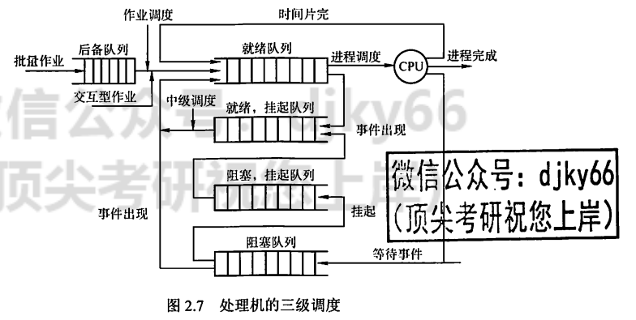
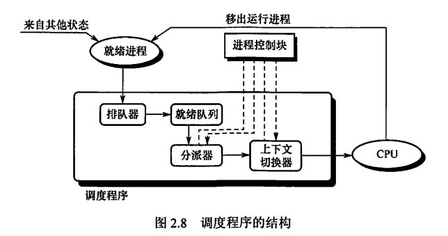
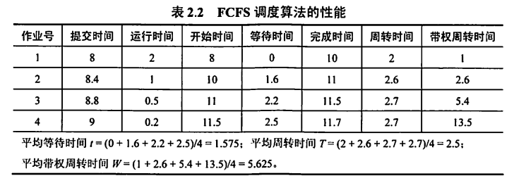
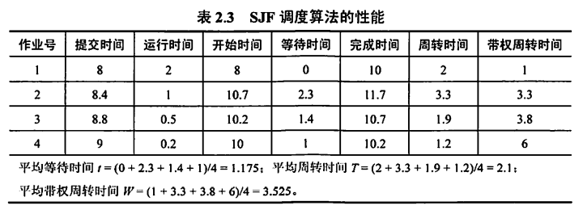
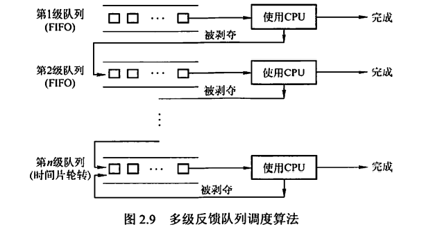

---
# 这是页面的图标
icon: page

# 这是文章的标题
title: 处理机调度

# 设置作者
author: lllllan

# 设置写作时间
# time: 2020-01-20

# 一个页面只能有一个分类
category: 计算机基础

# 一个页面可以有多个标签
tag:
- 操作系统
- 王道-操作系统

# 此页面会在文章列表置顶
# sticky: true

# 此页面会出现在首页的文章板块中
star: true

# 你可以自定义页脚
# footer: 
---

::: warning 转载声明

- 《王道考研-操作系统》

:::

## 一、调度的概念

### 1.1 调度的基本概念

在多道程序系统中，进程的数量往往多于处理机的个数，因此进程争用处理机的情况在所难免。处理机调度是对处理机进行分配，即从就绪队列中按照一定的算法（公平、高效的原则）选择一个进程并将处理机分配给它运行，以实现进程并发地执行。处理机调度是多道程序操作系统的基础，是操作系统设计的核心问题。

### 1.2 调度的层次

一个作业从提交开始直到完成，往往要经历以下三级调度，如图2.7所示。

1. 高级调度(作业调度)

    按照一定的原则从外存上处于后备队列的作业中挑选一个(或多个)，给它(们)分配内存、输入/输出设备等必要的资源，并建立相应的进程，以使它(们)获得竞争处理机的权利。简言之，作业调度就是内存与辅存之间的调度。对于每个作业只调入一次、调出一次。多道批处理系统中大多配有作业调度，而其他系统中通常不需要配置作业调度。

2. 中级调度(内存调度)

    引入中极调度的目的是提高内存利用率和系统吞吐量。为此，将那些暂时不能运行的进程调至外存等待，此时进程的状态称为挂起态。当它们已具备运行条件且内存又稍有空闲时，由中级调度来决定把外存上的那些已具备运行条件的就绪进程再重新调入内存，并修改其状态为就绪态，挂在就绪队列上等待。中级调度实际上是存储器管理中的对换功能。

3. 低级调度(进程调度)

    按照某种算法从就绪队列中选取一个进程，将处理机分配给它。进程调度是最基本的一种调度，在各种操作系统中都必须配置这级调度。进程调度的频率很高，一般几十毫秒一次。

### 1.3 三级调度的联系

==作业调度从外存的后备队列中选择一批作业进入内存， 为它们建立进程，这些进程被送入就绪队列，进程调度从就绪队列中选出一个进程，并把其状态改为运行态，把CPU分配给它。中级调度是为了提高内存的利用率，系统将那些暂时不能运行的进程挂起来。==

1. 作业调度为进程活动做准备，进程调度使进程正常活动起来。
2. 中级调度将暂时不能运行的进程挂起，中级调度处于作业调度和进程调度之间。
3. 作业调度次数少，中级调度次数略多，进程调度频率最高。
4. 进程调度是最基本的，不可或缺。

## 二、调度的目标

不同的调度算法具有不同的特性，在选择调度算法时，必须考虑算法的特性。为了比较处理机调度算法的性能，人们提出了很多评价标准，下面介绍其中主要的几种:

1. CPU利用率。CPU是计算机系统中最重要和昂贵的资源之一，所以应尽可能使CPU保持“忙”状态，使这一资源利用率最高。 CPU利用率的计算方法如下:

$$
CPU 的利用率=\frac{CPU 有效工作时间}{CPU 有效工作时间 + CPU 空闲等待时间}
$$

2. 系统吞吐量。表示单位时间内CPU完成作业的数量。长作业需要消耗较长的处理机时间，因此会降低系统的吞吐量。而对于短作业，需要消耗的处理机时间较短，因此能提高系统微的吞吐量。调度算法和方式的不同，也会对系统的吞吐量产生较大的影响。
3. 周转时间。指从作业提交到作业完成所经历的时间，是作业等待、在就绪队列中排队、在处理机上运行及输入/输出操作所花费时间的总和。周转时间的计算方法如下:

$$
周转时间 = 作业完成时间 - 作业提交时间
$$

$$
平均周转时间=(作业1的周转时间+...+作业n的周转时间)/n
$$

$$
带权周转时间=\frac{作业周转时间}{作业实际运行时间}
$$

$$
平均带权周转时间=(作业1的带权周转时间+...+作业n的带权周转时间)/n
$$

4. 等待时间。指进程处于等处理机的时间之和，等待时间越长，用户满意度越低。处理机调度算法实际上并不影响作业执行或输入/输出操作的时间，只影响作业在就绪队列中等待所花的时间。因此，衡量一个调度 算法的优劣，常常只需简单地考察等待时间。
5. 响应时间。指从用户提交请求到系统首次产生响应所用的时间。在交互式系统中，周转时间不是最好的评价准则，一般采用响应时间作为衡量调度算法的重要准则之一。从用户角度来看，调度策略应尽量降低响应时间，使响应时间处在用户能接受的范围之内。

要想得到一个满足所有用户和系统要求的算法几乎是不可能的。设计调度程序，一方面要满足特定系统用户的要求（如某些实时和交互进程的快速响应要求），另一方面要考虑系统整体效率（如减少整个系统的进程平均周转时间），同时还要考虑调度算法的开销。

## 三、调度的实现

### 3.1 调度程序(调度器)

在操作系统中，用于调度和分派CPU的组件称为调度程序，它通常由三部分组成，如图2.8所示。

1. 排队器。将系统中的所有就绪进程按照一定的策略排成一个或多个队列，以便于调度程序选择。每当有一个进程转变为就绪态时，**排队器便将它插入到相应的就绪队列中**。

2. 分派器。依据调度程序所选的进程，**将其从就绪队列中取出**，将CPU分配给新进程。
3. 上下文切换器。在对处理机进行切换时，会发生两对上下文的切换操作：第一对，将当前进程的上下文保存到其PCB中，再装入分派程序的上下文，以便分派程序运行；第二对，移出分派程序的上下文，将新选进程的CPU现场信息装入处理机的各个相应寄存器。在上下文切换时，需要执行大量load和store指令，以保存寄存器的内容，因此会花费较多时间。现在已有硬件实现的方法来减少上下文切换时间。通常采用两组寄存器，其中一组供内核使用，一组供用户使用。这样，上下文切换时，只需改变指针，让其指向当前寄存器组即可。

### 3.2 调度的时机、切换与过程

调度程序是操作系统内核程序。请求调度的事件发生后，才可能运行调度程序，调度了新的就绪进程后，才会进行进程切换。理论上这三件事情应该顺序执行，但在实际的操作系统内核程序运行中，若某时刻发生了引起进程调度的因素，则不一定能马上进行调度与切换。现代操作系统中，不能进行进程的调度与切换的情况有以下几种：

1. **在处理中断的过程中**。中断处理过程复杂，在实现上很难做到进程切换，而且中断处理是系统工作的一部分，逻辑上不属于某一进程，不应被剥夺处理机资源。
2. **进程在操作系统内核临界区中**。进入临界区后，需要独占式地访问，理论上必须加锁，以防止其他并行进程进入，在解锁前不应切换到其他进程，以加快临界区的释放。
3. **其他需要完全屏蔽中断的原子操作过程中**。如加锁、解锁、中断现场保护、恢复等原子操作。在原子过程中，连中断都要屏蔽，更不应该进行进程调度与切换。

若在上述过程中发生了引起调度的条件，则不能马上进行调度和切换，应置系统的请求调度标志，直到上述过程结束后才进行相应的调度与切换。

应该进行进程调度与切换的情况如下:

1. 发生引起调度条件且当前进程无法继续运行下去时，可以马上进行调度与切换。若操作系统只在这种情况下进行进程调度，则是 **非剥夺调度**。
2. 中断处理结束或自陷处理结束后，返回被中断进程的用户态程序执行现场前，若置上请求调度标志，即可马上进行进程调度与切换。若操作系统支持这种情况下的运行调度程序，则实现了剥夺方式的调度。

进程切换往往在调度完成后立刻发生，它要求保存原进程当前断点的现场信息，恢复被调度进程的现场信息。现场切换时，操作系统内核将原进程的现场信息推入当前进程的内核堆栈来保存它们，并更新堆栈指针。内核完成从新进程的内核栈中装入新进程的现场信息、更新当前运行进程空间指针、重设PC寄存器等相关工作之后，开始运行新的进程。

### 3.3 进程调度方式

所谓进程调度方式，是指当某个进程正在处理机上执行时，若有某个更为重要或紧迫的进程需要处理，即有优先权更高的进程进入就绪队列，此时应如何分配处理机。

通常有以下两种进程调度方式

1. 非抢占调度方式，又称非剥夺方式。是指当一个进程正在处理机上执行时，即使有某个更为重要或紧迫的进程进入就绪队列，仍然让正在执行的进程继续执行，直到该进程运行完成或发生某种事件而进入阻塞态时，才把处理机分配给其他进程。

    **非抢占调度方式的优点是实现简单、系统开销小，适用于大多数的批处理系统，但它不能用于分时系统和大多数的实时系统。**

2. 抢占调度方式，又称剥夺方式。是指当一个进程正在处理机上执行时，若有某个更为重要或紧迫的进程需要使用处理机，则允许调度程序根据某种原则去暂停正在执行的进程，将处理机分配给这个更为重要或紧迫的进程。

    **抢占调度方式对提高系统吞吐率和响应效率都有明显的好处**。但“抢占”不是一种任意微性行为，必须遵循一定的原则，主要有优先权、短进程优先和时间片原则等。

### 3.4 闲逛进程

在进程切换时，如果系统中没有就绪进程，就会调度闲逛进程(idle) 运行，如果没有其他进程就绪，**该进程就一直运行， 并在执行过程中测试中断**。闲逛进程的优先级最低，没有就绪进程时才会运行闲逛进程，只要有进程就绪，就会立即让出处理机。

闲逛进程不需要CPU之外的资源，它不会被阻塞。

### 3.5 两种线程的调度

1. 用户级线程调度。由于内核并不知道线程的存在，所以内核还是和以前一样，选择一个进程，并给予时间控制。由进程中的调度程序决定哪个线程运行。
2. 内核级线程调度。内核选择一个特定线程运行，通常不用考虑该线程属于哪个进程。对被选择的线程赋予一个时间片， 如果超过了时间片，就会强制挂起该线程。用户级线程的线程切换在同一进程中进行，仅需少量的机器指令；内核级线程的线程切换需要完整的上下文切换、修改内存映像、使高速缓存失效，这就导致了若干数量级的延迟。

## 四、典型的调度算法

操作系统中存在多种调度算法，有的调度算法适用于作业调度，有的调度算法适用于进程调度，有的调度算法两者都适用。下面介绍几种常用的调度算法。

### 4.1 先来先服务(FCFS)调度算法

FCFS调度算法是一种最简单的调度算法，它既 ==可用于作业调度，又可用于进程调度==。在作业调度中，算法每次从后备作业队列中选择最先进入该队列的一个或几个作业，将它们调入内存，分配必要的资源，创建进程并放入就绪队列。

在进程调度中，FCFS调度算法每次从就绪队列中选择最先进入该队列的进程，将处理机分配给它，使之投入运行，直到运行完成或因某种原因而阻塞时才释放处理机。

下面通过一一个实例来说明FCFS调度算法的性能。假设系统中有4个作业，它们的提交时间分别是 `8, 8.4, 8.8, 9`，运行时间依次是 `2, 1, 0.5, 0.2` ，系统采用FCFS调度算法，这组作业的平均等待时间、平均周转时间和平均带权周转时间见表2.2。

FCFS调度算法属于不可剥夺算法。从表面上看，它对所有作业都是公平的，但若一个长作业先到达系统，就会使后面的许多短作业等待很长时间，因此它不能作为分时系统和实时系统的主要调度策略。但它常被结合在其他调度策略中使用。例如，在使用优先级作为调度策略的系统中，往往对多个具有相同优先级的进程按FCFS原则处理。

==FCFS调度算法的特点是算法简单，但效率低；对长作业比较有利，但对短作业不利(相对SJF和高响应比)；有利于CPU繁忙型作业，而不利于I/O繁忙型作业。==

### 4.2 短作业优先(SJF)调度算法

短作业(进程)优先调度算法是指对 ==短作业(进程)优先调度== 的算法。短作业优先(SJF)调度算法从后备队列中选择一个或若干估计运行时间最短的作业，将它们调入内存运行；短进程优先(SPF) 调度算法从就绪队列中选择一个估计运行时间最短的进程，将处理机分配给它，使之立即执行，直到完成或发生某事件而阻塞时，才释放处理机。

例如，考虑表2.2中给出的一-组作业，若系统采用短作业优先调度算法，其平均等待时间、平均周转时间和平均带权周转时间见表2.3. 

SJF调度算法也存在不容忽视的缺点：

1. 该算法对长作业不利，由表2.2和表2.3可知，SJF**调度算法中长作业的周转时间会增加**。更严重的是，若有一长作业进入系统的后备队列，由于调度程序总是优先调度那些(即使是后进来的)短作业，**将导致长作业长期不被调度**(“饥饿”现象，注意区分“死锁”，后者是系统环形等待，前者是调度策略问题)。
2. **该算法完全未考虑作业的紧迫程度**，因而不能保证紧迫性作业会被及时处理。
3. 由于作业的长短是根据用户所提供的估计执行时间而定的，而用户又可能会有意或无意地缩短其作业的估计运行时间，致使该算法不一定能真正做到短作业优先调度。注意，SJF 调度算法的平均等待时间、平均周转时间最少。

### 4.3 优先级调度算法

优先级调度算法既 ==可用于作业调度，又可用于进程调度==。该算法中的优先级用于描述作业的紧迫程度。在作业调度中，优先级调度算法每次从后备作业队列中选择优先级最高的一个或几个作业，将它们调入内存，分配必要的资源，创建进程并放入就绪队列。在进程调度中，优先级调度算法每次从就绪队列中选择优先级最高的进程，将处理机分配给它，使之投入运行。

根据新的更高优先级进程能否抢占正在执行的进程，可将该调度算法分为如下两种：

1. 非抢占式优先级调度算法。当一个进程正在处理机上运行时，即使有某个优先级更高的进程进入就绪队列，仍让正在运行的进程继续运行，直到由于其自身的原因而让出处理机时(任务完成或等待事件)，才把处理机分配给就绪队列中优先级最高的进程。
2. 抢占式优先级调度算法。当一个进程正在处理机上运行时，若有某个优先级更高的进程进入就绪队列，则立即暂停正在运行的进程，将处理机分配给优先级更高的进程。

而根据进程创建后其优先级是否可以改变，可以将进程优先级分为以下两种：

1. 静态优先级。优先级是在创建进程时确定的，且在进程的整个运行期间保持不变。确定山，静态优先级的主要依据有进程类型、进程对资源的要求、用户要求。
2. 动态优先级。在进程运行过程中，根据进程情况的变化动态调整优先级。动态调整优先级的主要依据有进程占有CPU时间的长短、就绪进程等待CPU时间的长短。

一般来说，进程优先级的设置可以参照以下原则：

1. 系统进程 > 用户进程。系统进程作为系统的管理者，理应拥有更高的优先级。
2. 交互型进程 > 非交互型进程(或前台进程 > 后台进程)。大家平时在使用手机时，在前台运行的正在和你交互的进程应该更快速地响应你，因此自然需要被优先处理。

3) I/O 型进程 > 计算型进程。所谓I/O型进程，是指那些会频繁使用I/O设备的进程，而计算型进程是那些频繁使用CPU的进程(很少使用I/O设备)。我们知道，I/O 设备(如打印机)的处理速度要比CPU慢得多，因此若将I/0型进程的优先级设置得更高，就更有可能让I/O设备尽早开始工作，进而提升系统的整体效率。

### 4.4 高响应比优先调度算法

高响应比优先调度算法 ==主要用于作业调度==，是对FCFS调度算法和SJF调度算法的一种综合平衡，同时考虑了每个作业的等待时间和估计的运行时间。在每次进行作业调度时，先计算后备作业队列中每个作业的响应比，从中选出响应比最高的作业投入运行。

响应比的变化规律可描述为
$$
响应比Rp = \frac{等待时间+要求服务时间}{要求服务时间}
$$

根据公式可知

1. 作业的等待时间相同时，要求服务时间越短，响应比越高，有利于短作业，因而类似于SJF.
2. 要求服务时间相同时,作业的响应比由其等待时间决定，等待时间越长，其响应比越高，因而类似于FCFS。
3. 对于长作业，作业的响应比可以随等待时间的增加而提高，当其等待时间足够长时，也可获得处理机，克服了“饥饿”现象。

### 4.5 时间片轮转调度算法

时间片轮转调度算法主要适用于分时系统。在这种算法中，系统将所有就绪进程按FCFS策略排成一-个就绪队列，调度程序总是选择就绪队列中的第一个进程执行，但仅能运行一个时间片，如50ms。在使用完-一个时间片后，即使进程并未运行完成，它也必须释放出(被剥夺)处理机给下一个就绪进程，而被剥夺的进程返回到就绪队列的末尾重新排队，等候再次运行。

在时间片轮转调度算法中，时间片的大小对系统性能的影响很大。若时间片足够大，以至于所有进程都能在-一个时间片内执行完毕，则时间片轮转调度算法就退化为先来先服务调度算法。若时间片很小，则处理机将在进程间过于频繁地切换，使处理机的开销增大，而真正用于运行用户进程的时间将减少。因此，时间片的大小应选择适当，时间片的长短通常由以下因素确定：系统的响应时间、就绪队列中的进程数目和系统的处理能力。

### 4.6 多级队列调度算法

前述的各种调度算法，由于系统中仅设置一个进程的就绪队列，即调度算法是固定且单一的，无法满足系统中不同用户对进程调度策略的不同要求。在多处理机系统中，这种单一调度策略实现机制的缺点更为突出，多级队列调度算法能在一定程度上弥补这一缺点。

**该算法在系统中设置多个就绪队列，将不同类型或性质的进程固定分配到不同的就绪队列。每个队列可实施不同的调度算法**，因此，系统针对不同用户进程的需求，很容易提供多种调度策略。同一队列中的进程可以设置不同的优先级，不同的队列本身也可以设置不同的优先级。在多处理机系统中，可以很方便为每个处理机设置一个单独的就绪队列，每个处理机可实施各自不同的调度策略，这样就能根据用户需求将多个线程分配到一一个或多个处理机上运行。

### 4.7 多级反馈队列调度箕法

多级反馈队列调度算法是时间片轮转调度算法和优先级调度算法的综合与发展，如图2.9 所示。通过动态调整进程优先级和时间片大小，多级反馈队列调度算法可以兼顾多方面的系统目标。例如，为提高系统吞吐量和缩短平均周转时间而照顾短进程：为获得较好的I/O设备利用率和缩短响应时间而照顾I/O型进程；同时，也不必事先估计进程的执行时间。

多级反馈队列调度算法的实现思想如下:

1. 设置多个就绪队列，并为每个队列赋予不同的优先级。第1级队列的优先级最高，第2级队列的优先级次之，其余队列的优先级逐个降低。
2. 赋予各个队列的进程运行时间片的大小各不相同。**在优先级越高的队列中，每个进程的时间片就越小**。例如，第i+1级队列的时间片要比第i级队列的时间片长1倍。
3. 每个队列都采用FCFS算法。当新进程进入内存后，首先将它放入第1级队列的末尾，按FCFS原则等待调度。当轮到该进程执行时，如它能在该时间片内完成，便可撤离系统。**若它在一个时间片结束时尚未完成，调度程序将其转入第2级队列的末尾等待调度；**若它在第2级队列中运行一个时间片后仍未完成，再将它放入第3级队列....依此类推。当进程最后被降到第n级队列后，在第n级队列中便采用时间片轮转方式运行。
4. 按队列优先级调度。仅当第1级队列为空时，才调度第2级队列中的进程运行；仅当第1~i-1级队列均为空时，才会调度第i级队列中的进程运行。若处理机正在执行第i级队列中的某进程时，又有新进程进入任一优先级较高的队列，此时须立即把正在运行的进程放回到第i级队列的末尾，而把处理机分配给新到的高优先级进程。

多级反馈队列的优势有以下几点：

1. 终端型作业用户：短作业优先。
2. 短批处理作业用户：周转时间较短。
3. 长批处理作业用户：经过前面几个队列得到部分执行，不会长期得不到处理。

下表总结了几种常见进程调度算法的特点，读者要在理解的基础上掌握。

|              |   能否是可抢占   |  能否是不可抢占  |                   优点                   |                 缺点                 |        适用于        | 默认决策模式 |
| :----------: | :--------------: | :--------------: | :--------------------------------------: | :----------------------------------: | :------------------: | :----------: |
|  先来先服务  |        否        |        能        |              公平，实现简单              |             不利于短作业             |          无          |    非抢占    |
|  短作业优先  |        能        |        能        |        平均等待时间最少，效率最高        |    长作业会饥饿，估计时间不易确定    | 作业调度，批处理系统 |    非抢占    |
| 高响应比优先 |        能        |        能        |               兼顾长短作业               |          计算响应比的开销大          |          无          |    非抢占    |
|  时间片轮转  |        能        |        否        |               兼顾长短作业               | 平均等待时间较长，上下文切换浪费时间 |       分时系统       |     抢占     |
| 多级反馈队列 | 队列内算法不一定 | 队列内算法不一定 | 兼顾长短作业，有较好的响应时间，可行性强 |                  无                  |       相当通用       |     抢占     |

## 五、进程切换

对于通常的进程而言，其创建、撤销及要求由系统设备完成的I/O操作，都是利用系统调用而进入内核，再由内核中的相应处理程序予以完成的。进程切换同样是在内核的支持下实现的，因此可以说，任何进程都是在操作系统内核的支持下运行的，是与内核紧密相关的。

### 5.1 上下文切换

切换CPU到另一个进程需要保存当前进程状态并恢复另一个进程的状态，这个任务称为 ==上下文切换== 。上下文是指某一时刻CPU寄存器和程序计数器的内容。进行上下文切换时，内核会将旧进程状态保存在其PCB中，然后加载经调度而要执行的新进程的上下文。

上下文切换实质上是指处理机从一个进程的运行转到另一个进程上运行，在这个过程中，进程的运行环境产生了实质性的变化。上下文切换的流程如下:

1. 挂起一个进程，保存CPU上下文，包括程序计数器和其他寄存器。
2. ==更新PCB信息==（信息保存在进程控制块）
3. 把进程的PCB移入相应的队列，如就绪、在某事件阻塞等队列。
4. 选择另一个进程执行，并更新其PCB。
5. 跳转到新进程PCB中的程序计数器所指向的位置执行。
6. 恢复处理机上下文。

### 5.2 上下文切换的消耗

上下文切换通常是计算密集型的，即它需要相当可观的CPU时间，在每秒几十上百次的切换中，每次切换都需要纳秒量级的时间，所以上下文切换对系统来说意味着消耗大量的CPU时间。有些处理器提供多个寄存器组，这样，上下文切换就只需要简单改变当前寄存器组的指针。

### 5.3 上下文切换与模式切换

模式切换与上下文切换是不同的，模式切换时，CPU逻辑上可能还在执行同一进程。用户进程最开始都运行在用户态，若进程因中断或异常进入核心态运行，执行完后又回到用户态刚被中断的进程运行。用户态和内核态之间的切换称为模式切换，而不是上下文切换，因为没有改变当前的进程。上下文切换只能发生在内核态，它是多任务操作系统中的一个必需的特性。

注意：调度和切换的区别。调度是指决定资源分配给哪个进程的行为，是一种决策行为；切换是指实际分配的行为，是执行行为。一般来说，先有资源的调度，然后才有进程的切换。

