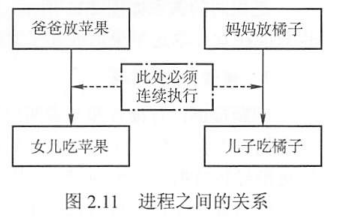
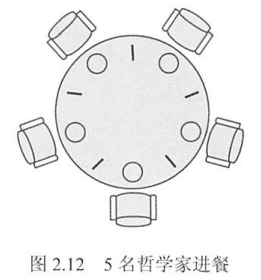

---
# 这是页面的图标
icon: page

# 这是文章的标题
title: 同步与互斥

# 设置作者
author: lllllan

# 设置写作时间
# time: 2020-01-20

# 一个页面只能有一个分类
category: 计算机基础

# 一个页面可以有多个标签
tag:
- 操作系统
- 王道-操作系统

# 此页面会在文章列表置顶
# sticky: true

# 此页面会出现在首页的文章板块中
star: true

# 你可以自定义页脚
# footer: 
---


::: warning 转载声明

- 《王道考研-操作系统》
- [开中断和关中断](https://blog.csdn.net/weixin_34097242/article/details/86458859)

:::


## 一、同步与互斥的基本概念

在多道程序环境下，进程是并发执行的，不同进程之间存在着不同的相互制约关系。为了协调进程之间的相互制约关系，引入了进程同步的概念。


> 例如，让系统计算 `1 + 2 x 3`，假设系统产生两个进程：一个是加法进程，一个是乘法进程。要让计算结果是正确的，一定要让加法进程发生在乘法进程之后，但实际，上操作系统具有异步性，若不加以制约，加法进程发生在乘法进程之前是绝对有可能的，因此要制定一定的机制去约束加法进程，让它在乘法进程完成之后才发生，而这种机制就是本节要讨论的内容。


### 1.1 临界资源

::: info 临界资源

一次仅允许一个进程使用的资源称为临界资源

:::


虽然多个进程可以共享系统中的各种资源，但其中许多资源一次只能为一个进程所用。许多物理设备都属于临界资源，如打印机等。此外，还有许多变量、数据等都可以被若干进程共享，也属于临界资源。


对临界资源的访问，必须互斥地进行，在每个进程中，访问临界资源的那段代码称为临界区。为了保证临界资源的正确使用，可把临界资源的访问过程分成4个部分:


1. **进入区**。为了进入临界区使用临界资源，在进入区要检查可否进入临界区，若能进入临界区，则应设置正在访问临界区的标志，以阻止其他进程同时进入临界区。
2. **临界区**。进程中访问临界资源的那段代码，又称临界段。
3. **退出区**。将正在访问临界区的标志清除。
4. **剩余区**。代码中的其余部分。


```cpp
do {
    entry section;  	//进入区
    critical section;	//临界区
    exit section; 		//退出区
    remainder section;	//剩余区
} while (true)
```


### 1.2 同步


::: info 同步

同步亦称直接制约关系，是指为完成某种任务而建立的两个或多个进程，这些进程因为需要在某些位置上协调它们的工作次序而等待、传递信息所产生的制约关系。

:::


> 进程间的直接制约关系源于它们之间的相互合作。例如，输入进程 A 通过单缓冲向进程 B 提供数据。当该缓冲区空时，进程 B 不能获得所需数据而阻塞，一旦进程 A 将数据送入缓冲区，进程 B 就被唤醒。反之，当缓冲区满时，进程 A 被阻塞，仅当进程 B 取走缓冲数据时，才唤醒进程 A。


### 1.3 互斥

::: info 互斥

互斥也称间接制约关系。当一个进程进入临界区使用临界资源时，另一个进程必须等待，当占用临界资源的进程退出临界区后，另一进程才允许去访问此临界资源。

:::


> 例如，在仅有一台打印机的系统中，有两个进程A和进程B，若进程A需要打印时，系统已将打印机分配给进程B,则进程A必须阻塞。一旦进程 B将打印机释放，系统便将进程A唤醒，并将其由阻塞态变为就绪态。


为禁止两个进程同时进入临界区，同步机制应遵循以下准则:

1. **空闲让进**。临界区空闲时，可以允许一个请求进入临界区的进程立即进入临界区。
2. **忙则等待**。当已有进程进入临界区时，其他试图进入临界区的进程必须等待。
3. **有限等待**。对请求访问的进程，应保证能在有限时间内进入临界区。
4. **让权等待**。当进程不能进入临界区时，应立即释放处理器，防止进程忙等待。


## 二、实现临界区互斥的基本方法


### 2.1 软件实现方法

在进入区设置并检查一些标志 来标明是否有进程在临界区中，若已有进程在临界区，则在进入区通过循环检查进行等待，进程离开临界区后则在退出区修改标志。

---


算法一：**单标志法**。

该算法设置一个公用整型变量 `turn`，用于指示被允许进入临界区的进程编号，即若 `turn = 0` ，则允许 P0 进程进入临界区。该算法可确保每次只允许一个进程进入临界区。


:::: code-group

::: code-group-item P0

```cpp
P0 进程:
while (turn != 0);	//进入区
critical section;	//临界区
turn = 1;			//退出区
remainder section;	//剩余区
```

:::

::: code-group-item P1

```cpp
P1 进程:
while (turn != 1);  //进入区
critical section; 	//临界区
turn = 0; 			//退出区
remainder section;	//剩余区
```

:::

::::


但两个进程必须交替进入临界区，若某个进程不再进入临界区，则另一个进程也将无法进入临界区（ ==违背【空闲让进】== ）。这样很容易造成资源利用不充分。若 P0 顺利进入临界区并从临界区离开，则此时临界区是空闲的，但 P1 并没有进入临界区的打算，`turn = 1` 一直成立，P0 就无法再次进入临界区（一直被while死循环困住）。

---


算法二：**双标志法先检查**。

该算法的基本思想是在每个进程访问临界区资源之前，先查看临界资源是否正被访问，若正被访问，该进程需等待；否则，进程才进入自己的临界区。为此，设置一个数据 `flag[i]`，如第i 个元素值为 FALSE，表示 Pi 进程未进入临界区，值为TRUE，表示 Pi 进程进入临界区。


:::: code-group

::: code-group-item Pi

```cpp
Pi 进程:
while(flag[j]); 	//1. 进入区
flag[i] = TRUE;  	//3. 进入区
critical section;	//临界区
flag[i] = FALSE;    //退出区
remainder section;  //剩余区
```

:::

::: code-group-item Pj

```cpp
Pj 进程:
while(flag[i]); 	//2. 进入区
flag[j] = TRUE;  	//4. 进入区
critical section;	//临界区
flag[j] = FALSE;    //退出区
remainder section;  //剩余区
```

:::

::::


- 优点：不用交替进入，可连续使用；
- 缺点：Pi 和 Pj 可能同时进入临界区。按序列①②③④执行时，会同时进入临界区（ ==违背【忙则等待】== ）。即在检查对方的 flag 后和切换自己的 flag 前有一段时间，结果都检查通过。这里的问题出在检查和修改操作不能一次进行。

---


算法三：**双标志法后检查**。

算法二先检测对方的进程状态标志，再置自己的标志，由于在检测和放置中可插入另一个进程到达时的检测操作，会造成两个进程在分别检测后同时进入临界区。为此，算法三先将自己的标志设置为TRUE，再检测对方的状态标志，若对方标志为 TRUE，则进程等待；否则进入临界区。


:::: code-group

::: code-group-item Pi

```cpp
Pi 进程：
flag[i] = TRUE; 	//进入区
while(flag[j]); 	//进入区
critical section;	//临界区
flag[i] = FALSE;	//退出区
remainder section;	//剩余区
```

:::

::: code-group-item Pj

```cpp
Pj 进程:
flag[j] = TRUE; 	//进入区
while(flag[i]); 	//进入区
critical section;	//临界区
flag[i] = FALSE;	//退出区
remainder section;	//剩余区
```

:::

::::


两个进程几乎 同时都想进入临界区时，它们分别将自己的标志值 flag 设置为TRUE，并且同时检测对方的状态（执行while语句），发现对方也要进入临界区时，双方互相谦让，结果谁也进不了临界区，从而 ==导致【饥饿】现象==

---


算法四：**Peterson's Algorithm**。

为了防止两个进程为进入临界区而无限期等待，又设置了变量 turn，每个进程在先设置自己的标志后再设置 turn 标志。这时，再同时检测另一个进程状态标志和允许进入标志，以便保证两个进程同时要求进入临界区时，只允许一个进程进入临界区。


:::: code-group

::: code-group-item Pi

```cpp
Pi进程：
flag[i] = TRUE; turn = j;		//进入区
while(flag[j] && turn = j);		//进入区
critical section;				//临界区
flag[i] = FALSE;				//退出区
remainder section;				//剩余区
```

:::

::: code-group-item Pj

```cpp
Pj进程:
flag[j] = TRUE; turn = i;		//进入区
while(flag[i] && turn == i);	//进入区
critical section;				//临界区
flag[i] = FALSE; 				//退出区
remainder section; 				//剩余区
```

:::

::::


具体如下：考虑进程 Pi，一旦设置 `flag[i] = true`，就表示它想要进入临界区，同时 `turn = j`，此时若进程 Pj 已在临界区中，符合进程 Pi 中的 while 循环条件，则 Pi 不能进入临界区。若 Pj 不想要进入临界区，即 `flag[j] =  false`， 循环条件不符合，则 Pi 可以顺利进入，反之亦然。本算法的基本思想是算法一和算法三的结合。利用 flag 解决临界资源的互斥访问，而利用 turn 解决【饥饿】现象。理解Peterson's Algorithm的最好方法就是手动模拟。


### 2.2 硬件实现方法


计算机提供了特殊的硬件指令，允许对一个字中的内容进行检测和修正，或对两个字的内容进行交换等。通过硬件支持实现临界段问题的方法称为低级方法，或称 ==元方法==


#### **1. 中断屏蔽方法**

当一个进程正在执行它的临界区代码时，防止其他进程进入其临界区的最简方法是关中断。因为CPU只在发生中断时引起进程切换，因此屏蔽中断能够保证当前运行的进程让临界区代码顺利地执行完，进而保证互斥的正确实现，然后执行开中断。其典型模式为


```cpp
关中断;
临界区;
开中断;
```


**这种方法限制了处理机交替执行程序的能力，因此执行的效率会明显降低**。对内核来说，在它执行更新变量或列表的几条指令期间，关中断是很方便的，但将关中断的权力交给用户则很不明智，若一个进程关中断后不再开中断，则系统可能会因此终止。


:::: tip 关中断

关中断和开中断其实就是像我们生活中的开关一样。 关中断是为了保护一些不能中途停止执行的程序而设计的，计算机的CPU进行的是时分复用，即每个时钟周期内，CPU只能执行一条指令。在多道程序设计的环境下（就是我们通常所说的多个程序同时运行时），CPU是不断地交替地将这些程序的指令一条一条的分别执行，这样从宏观上看我们就感觉多个程序是在同时执行，但从微观上看则是CPU在不同的时间段（极短）内执行着不同程序的单条指令。而CPU在这些指令之间的切换就是通过中断来实现的。关中断就是为了让CPU在一段时间内执行同一程序的多条指令而设计的，比如在出现了非常事件后又恢复正常时，CPU就会忙于恢复非常事件出现之前计算机的工作环境（通常叫做恢复现场），在恢复现场的时候，CPU是不允许被其他的程序打扰的，此时就要启动关中断，不再相应其他的请求。当现场恢复完毕后，CPU就启动开中断，其他等待着的程序的指令就开始被CPU执行，计算机恢复正常。


::: danger 多核下的关中断又是怎么样的呢？

:::

::::


---


#### **2. 硬件指令方法**


::: note TestAndSet 指令

这条指令是原子操作，即执行该代码时不允许被中断。其功能是读出指定标志后把该标志设置为真。指令的功能描述如下:


```cpp
boolean TestAndSet (boolean *lock) {
    boolean old;
    old = *lock;
    *lock = true;
    return old;
}
```


可以为每个临界资源设置一个共享布尔变量 lock，表示资源的两种状态：true表示正被占用，初值为 false。 进程在进入临界区之前，利用 TestAndSet 检查标志 lock，若无进程在临界区，则其值为 false，可以进入，关闭临界资源，把 lock 置为 true，使任何进程都不能进入临界区；若有进程在临界区，则循环检查，直到进程退出。利用该指令实现互斥的过程描述如下:

```cpp {1}
while TestAndSet (&lock);
进程的临界区代码段;
lock = false;
进程的其他代码;
```

:::


::: note Swap指令

该指令的功能是交换两个字(字节)的内容。其功能描述如下:

```cpp
Swap(boolean *a, boolean *b) {
    boolean temp;
    Temp = *a; 
    *a = tb;
    *b = temp;
}
```


> 注意：以上对 TestAndSet 和 Swap 指令的描述仅是功能实现，而并非软件实现的定义。事实上，它们是由硬件逻辑直接实现的，不会被中断。

用 Swap 指令可以简单有效地实现互斥，为每个临界资源设置一个共享布尔变量 lock，初值为 false；在每个进程中再设置一个局部布尔变量 key，用于与 lock 交换信息。在进入临界区前，先利用 Swap 指令交换 lock 与 key 的内容，然后检查 key 的状态；有进程在临界区时，重复交换和检查过程，直到进程退出。其处理过程描述如下:


```cpp {2}
key = true;
while (key) Swap(&lock, &key);
进程的临界区代码段;
lock = false;
进程的其他代码;
```

:::


::: tip 硬件方法的优缺点

硬件方法的优点：适用于任意数目的进程，而不管是单处理机还是多处理机；简单、容易验证其正确性。可以支持进程内有多个临界区，只需为每个临界区设立一个布尔变量。


硬件方法的缺点：进程等待进入临界区时要耗费处理机时间，不能实现让权等待。从等待进程中随机选择-一个进入临界区，有的进程可能一直选不上， 从而导致【饥饿】现象。

:::


## 三、互斥锁

解决临界区最简单的工具就是 **互斥锁(mutex lock)**。一个进程在进入临界区时应获得锁；在退出临界区时释放锁。函数 acquire() 获得锁，而函数 release() 释放锁。每个互斥锁有一个布尔变量 available，表示锁是否可用。如果锁是可用的，调用 acqiure() 会成功，且锁不再可用。当一个进程试图获取不可用的锁时，会被阻塞，直到锁被释放。

```cpp
acquire() {
    while (!available);	//忙等待
    available = false;	//获得锁
}

release() {
    available = true; 	//释放锁
}
```


acquire() 或 release() 的执行必须是原子操作，因此互斥锁通常采用硬件机制来实现。

**互斥锁的主要缺点是忙等待**，当有一个进程在临界区中，任何其他进程在进入临界区时必须连续循环调用acquire()。当多个进程共享同一CPU时，就浪费了CPU周期。因此，互斥锁通常用于多处理器系统，一个线程可以在一个处理器上等待，不影响其他线程的执行。


## 四、信号量

信号量机制是一种功能较强的机制，可用来解决互斥与同步问题，它只能被两个标准的原语 wait(S) 和 signal(S) 访问，也可记为【P操作，申请资源】和【V操作，释放资源】。


::: info 原语

原语是指完成某种功能且不被分割、不被中断执行的操作序列，通常可由硬件来实现。

:::


> 例如，前述的 Test-and-Set 和 Swap 指令就是由硬件实现的原子操作。原语功能的不被中断执行特性在单处理机上可由软件通过屏蔽中断方法实现。原语之所以不能被中断执行，是因为原语对变量的操作过程若被打断，可能会去运行另一个对同一-变量的操作过程，从而出现临界段问题。


### 4.1 整型信号量

整型信号量被定义为一个用于表示资源数目的整型量 s，wait 和 signal 操作可描述为

```cpp
wait(S) {
    while(S <= 0);
    S = S - 1;
}

signal(S) {
    S = S + 1;
}
```


在整型信号量机制中的 wait 操作，只要信号量 S ≤ 0，就会不断地测试。

因此，==该机制并未遵循【让权等待】的准则，而是使进程处于【忙等】的状态==


### 4.2 记录型信号量

记录型信号量机制是一种不存在【忙等】现象的进程同步机制。除了需要一个用于代表资源数目的整型变量 value外，再增加一个进程链表L，用于链接所有等待该资源的进程。记录型信号量得名于采用了记录型的数据结构。记录型信号量可描述为


```cpp
typedef struct {
    int value;
    struct process *L;
} semaphore;
```


相应的 wait(S) 和 signal(S) 的操作如下:


```cpp
void wait(semaphore S) { //相当于申请资源
    s.value--;
    if (S.value < 0) {
        add this process to S.L;
        block(S.L);
    }
}
```


wait 操作，`S.value--` 表示进程请求一个该类资源，当 `S.value < 0` 时，表示该类资源已分配完毕，因此进程应调用 block 原语，进行自我阻塞，放弃处理机，并插入该类资源的等待队列 S.L，可见该机制遵循了【让权等待】的准则。

```cpp
void signal(semaphore S){ //相当于释放资源
    s.value++;
    if(S.value <= 0) {
        remove a process P from S.L;
        wakeup(P) ;
    }
}
```


signal 操作，表示进程释放一个资源，使系统中可供分配的该类资源数增1，因此有 `S.value++`。若加1后仍是 `S.value <= 0` ，则表示在 S.L 中仍有等待该资源的进程被阻塞，因此还应调用 wakeup 原语，将 S.L 中的第一个等待进程唤醒。


### 4.3 利用信号量实现同步

信号量机制能用于解决进程间的各种同步问题。设 S 为实现进程 P1，P2 同步的公共信号量，初值为 0。进程 P2 中的语句 y 要使用进程 P1 中语句 x 的运行结果，所以只有当语句 x 执行完成之后语句 y 才可以执行。其实现进程同步的算法如下：

```cpp
semaphore S = 0;	//初始化信号量

P1() {
    x; 				//语句x
    V(S);			//告诉进程P2，语句x已经完成
    ...
}

P2() {
    P(S); 			//检查语句x是否运行完成
    y; 				//检查无误，运行y语句
    ...
}
```


若 P2 先执行到 P(S) 时，S 为 0，执行 P 操作会把进程 P2 阻塞，并放入阻塞队列；当进程 P1 中的 x 执行完后，执行 V 操作，把 P2 从阻塞队列中放回就绪队列，当 P2 得到处理机时，就得以继续执行。


### 4.4 利用信号量实现进程互斥

信号量机制也能很方便地解决进程互斥问题。设 S 为实现进程 P1，P2 互斥的信号量，由于每次只允许一个进程进入临界区，所以 S 的初值应为 1 (即可用资源数为1)。只需把临界区置于 P(S) 和 V(S) 之间，即可实现两个进程对临界资源的互斥访问。其算法如下:

```cpp
semaphore S = 1;	//初始化信号量

P1() {
    ...
    P(S); 			//准备开始访问临界资源，加锁
    进程P1的临界区;
    V(S); 			//访问结束，解锁
    ...
}

P2() {
    ...
    P(S); 			//准备开始访问临界资源，加锁
    进程P2的临界区;
    V(S); 			//访问结束，解锁
    ...
}
```

当没有进程在临界区时，任意一个进程要进入临界区，就要执行 P 操作，把 S 的值减为 0，然后进入临界区；当有进程存在于临界区时，S 的值为 0，再有进程要进入临界区，执行 P 操作时将会被阻塞，直至在临界区中的进程退出，这样便实现了临界区的互斥。

互斥是不同进程对同一信号量进行 P，V 操作实现的，一个进程成功对信号量执行了 P 操作后进入临界区，并在退出临界区后，由该进程本身对该信号量执行 V 操作，表示当前没有进程进入临界区，可以让其他进程进入。


## 五、管程

在信号量机制中，每个要访问临界资源的进程都必须自备同步的 PV 操作，大量分散的同步操作给系统管理带来了麻烦，且容易因同步操作不当而导致系统死锁。于是，便产生了一种新的进程同步工具——管程。 管程的特性保证了进程互斥，无须程序员自己实现互斥，从而降低了死锁发生的可能性。同时管程提供了条件变量，可以让程序员灵活地实现进程同步。


### 5.1 管程的定义

系统中的各种硬件资源和软件资源，均可用数据结构抽象地描述其资源特性，即用少量信息和对资源所执行的操作来表征该资源，而忽略它们的内部结构和实现细节。

利用共享数据结构抽象地表示系统中的共享资源，而把对该数据结构实施的操作定义为一组过程。进程对共享资源的申请、释放等操作，都通过这组过程来实现，这组过程还可以根据资源情况，或接受或阻塞进程的访问，确保每次仅有一个进程使用共享资源，这样就可以统一管理对共享资源的所有访问，实现进程互斥。这个代表共享资源的数据结构，以及由对该共享数据结构实施操作的一组过程所组成的资源管理程序，称为管程( monitor)。管程定义了一个数据结构和能为并发进程所执行(在该数据结构上)的一组操作，这组操作能同步进程和改变管程中的数据。

由上述定义可知，管程由4部分组成：

1. 管程的名称
2. 局部于管程内部的共享数据结构说明
3. 对该数据结构进行操作的一组过程(或函数)
4. 对局部于管程内部的共享数据设置初始值的语句。


管程的定义描述举例如下:

```cpp
monitor Demo { // 1.定义一个名称为“Demo"的管程
    // 2. 定义共享数据结构，对应系统中的某种共享资源
    共享数据结构S;
    
    // 4. 对共享数据结构初始化的语句
    init_code(){
        S = 5; // 初始资源数等于5
    }

    // 3. 过程1：申请一个资源
    take_away(){
        对共享 数据结构x的一系列处理;
        S--; //可用资源数-1
        ...
    }

    // 3. 过程2：归还一个资源
    give_back() {
        对共享数据结构x的一系列处理;
        S++; //可用资源数+1
        ...
    }
}
```


熟悉面向对象程序设计的读者看到管程的组成后，会立即联想到管程很像一个类 (class)。

1. 管程把对共享资源的操作封装起来，管程内的共享数据结构只能被管程内的过程所访问。一个进程只有通过调用管程内的过程才能进入管程访问共享资源。对于上例，外部进程只能通过调用 `take_away()` 过程来申请一个资源；归还资源也一样。
2. 每次仅允许一个进程进入管程，从而实现进程互斥。若多个进程同时调用 `take_away()`，`give back()`，则只有某个进程运行完它调用的过程后，下个进程才能开始运行它调用的过程。也就是说，各个进程只能串行执行管程内的过程，这一特性保证了进程【互斥】访问共享数据结构 S。


### 5.2 条件变量

当一个进程进入管程后被阻塞，直到阻塞的原因解除时，在此期间，如果该进程不释放管程，那么其他进程无法进入管程。为此，将阻塞原因定义为条件变量 condition。 通常，一个进程被阻塞的原因可以有多个，因此在管程中设置了多个条件变量。每个条件变量保存了一个等待队列，用于记录因该条件变量而阻塞的所有进程，对条件变量只能进行两种操作，即 wait 和 signal。

- x.wait：当x对应的条件不满足时，正在调用管程的进程调用 x.wait 将自己插入 x 条件的等待队列，并释放管程。此时其他进程可以使用该管程。
- x.signal：x对应的条件发生了变化，则调用 x.signal，唤醒一个因 x 条件而阻塞的进程。


下面给出条件变量的定义和使用:

```cpp {8,14}
monitor Demo {
    共享数据结构S;
    condition x; // 定义一个条件变量x

    init_code() { ... }

    take_away() {
        if(S <= 0) x.wait(); // 资源不够， 在条件变量x上阻塞等待
        资源足够，分配资源，做一系列相应处理;
    }

    give_back() {
        归还资源，做一系列相应处理;
        if(有进程在等待) x.signal; // 唤醒一个阻塞进程
    }
}
```


条件变量和信号量的比较：

相似点：条件变量的 wait/signal 操作类似于信号量的 P/V 操作，可以实现进程的阻塞/唤醒。

不同点：条件变量是【没有值】的，仅实现了【排队等待】功能；而信号量是【有值】的，信号量的值反映了剩余资源数，而在管程中，剩余资源数用共享数据结构记录。


## 六、经典同步问题


### 6.1 生产者-消费者问题

问题描述：一组生产者进程和一组消费者进程共享一个初始为空、大小为 n 的缓冲区，只有缓冲区没满时，生产者才能把消息放入缓冲区，否则必须等待；只有缓冲区不空时，消费者才能从中取出消息，否则必须等待。由于缓冲区是临界资源，它只允许一个生产者放入消息，或一个消费者从中取出消息。

问题分析：

1. 关系分析。**生产者和消费者对缓冲区互斥访问是互斥关系**，同时生产者和消费者又是一个相互协作的关系，只有生产者生产之后，消费者才能消费，**它们也是同步关系**。
2. 整理思路。这里比较简单，只有生产者和消费者两个进程，正好是这两个进程存在着互斥关系和同步关系。那么需要解决的是互斥和同步 PV 操作的位置。
3. 信号量设置。信号量 mutex 作为互斥信号量，用于控制互斥访问缓冲池，互斥信号量初值为1；信号量 full 用于记录当前缓冲池中的【满】缓冲区数，初值为 0。信号量 empty 用于记录当前缓冲池中的【空】缓冲区数，初值为 n。


```cpp
semaphore mutex = 1; 				// 临界区互斥信号量
semaphore empty = n; 				// 空闲缓冲区
semaphore full = 0; 				// 缓冲区初始化为空
producer() { 						// 生产者进程
    while(1) {
        produce an item in nextp; 	// 生产数据
        P(empty); 					// 获取空缓冲区单元
        P(mutex); 					// 进入临界区
        add nextp to buffer; 		// 将数据放入缓冲区
        V(mutex);  					// 离开临界区，释放互斥信号量
        V(full);  					// 满缓冲区数加1
    } 
}

consumer() { 						// 消费者进程
    while(1) {
        P(fu1l); 					// 获取满缓冲区单元
        P(mutex); 					// 进入临界区
        remove an item from buffer; // 从缓冲区中取出数据
        V(mutex); 					// 离开临界区，释放互斥信号量
        V(empty); 					// 空缓冲区数加1
        consume the item; 			// 消费数据
    }
}
```


该类问题要注意对缓冲区大小为 n 的处理，当缓冲区中有空时，便可对 empty 变量执行 P 操作，一旦取走一个产品便要执行V操作以释放空闲区。对 empty 和 full 变量的 P 操作必须放在对 mutex 的 P 操作之前。

若生产者进程先执行 P(mutex)，然后执行 P(empty)，消费者执行 P(mutex)，然后执行 P(full)，这样可不可以？答案是否定的。设想生产者进程已将缓冲区放满，消费者进程并没有取产品，即 `empty= 0`，当下次仍然是生产者进程运行时，它先执行 P(mutex) 封锁信号量，再执行 P(empty) 时将被阻塞，希望消费者取出产品后将其唤醒。轮到消费者进程运行时，它先执行 P(mutex)，然而由于生产者进程已经封锁 mutex 信号量，消费者进程也会被阻塞，这样一来生产者、消费者进程都将阻塞，都指望对方唤醒自己，因此陷入了无休止的等待。

同理，若消费者进程已将缓冲区取空，即 full= 0，下次若还是消费者先运行，也会出现类似的死锁。不过生产者释放信号量时，mutex，full 先释放哪一个 无所谓，消费者先释放 mutex 或 empty 都可以。

根据对同步互斥问题的简单总结，我们发现，其实生产者消费者问题只是一个同步互斥问题的综合而已。

---


下面再看一个较为复杂的生产者-消费者问题。

问题描述：桌子上有一个盘子，每次只能向其中放入一个水果。爸爸专向盘子中放苹果，妈妈专向盘子中放橘子，儿子专等吃盘子中的橘子，女儿专等吃盘子中的苹果。只有盘子为空时，爸爸或妈妈才可向盘子中放一个水果；仅当盘子中有自己需要的水果时，儿子或女儿可以从盘子中取出





问题分析：

1. 关系分析。这里的关系要稍复杂一些。由每次只能向其中放入一个水果可知，爸爸和妈妈是互斥关系。
    爸爸和女儿、妈妈和儿子是同步关系，而且这两对进程必须连起来，儿子和女儿之间没有互斥和同步
    关系，因为他们是选择条件执行，不可能并发，如图2.11所示。
2. 整理思路。这里有4个进程，实际上可抽象为两个生产者和两个消费者被连接到大小为 1 的缓冲区上。
3. 信号量设置。首先将信号量 plate 设置互斥信号量，表示是否允许向盘子放入水果，初值为 1 表示允许放入，且只允许放入一个。信号量 apple 表示盘子中是否有苹果，初值为 0 表示盘子为空，不许取，apple = 1表示可以取。信号量 orange 表示盘子中是否有橘子，初值为 0 表示盘子为空，不许取，orange = 1表示可以取。


解决该问题的代码如下:

```cpp
semaphore plate = 1, apple = 0, orange = 0;
dad() { 								// 父亲进程
    while(1) {
        prepare an apple;
        P(plate); 						// 互斥向盘中取、放水果
        put the apple on the plate;		// 向盘中放苹果
        V(apple); 						// 允许取苹果
    }
}

mom() { 								// 母亲进程
    while(1) {
        prepare an orange;
        P(plate); 						// 互斥向盘中取、放水果
        put the orange on the plate;	// 向盘中放橘子
        V(orange); 						// 允许取橘子
    }
}

son() { 								// 儿子进程
    while(1){
        P(orange); 						// 互斥向盘中取橘子
        take an orange from the plate;
        V(plate); 						// 允许向盘中取、放水果
        eat the orange;
    }
}

daughter() { 							// 女儿进程
    while(l) {
        P(apple); 						// 互斥向盘中取苹果
        take an apple from the plate;
        V(plate); 						// 允许向盘中取、放水果
        eat the apple;
    }
}
```

进程间的关系如图2.11所示。dad() 和 daughter()、mom() 和 son() 必须连续执行，正因为如此，也只能在女儿拿走苹果后或儿子拿走橘子后才能释放盘子，即 V(plate) 操作。


### 6.2 读者-写者问题

问题描述：有读者和写者两组并发进程，共享一个文件，当两个或以上的读进程同时访问共享数据时不会产生副作用，但若某个写进程和其他进程（读进程或写进程）同时访问共享数据时则可能导致数据不一致的错误。因此要求：

1. 允许多个读者可以同时对文件执行读操作
2. 只允许一个写者往文件中写信息
3. 任一写者在完成写操作之前不允许其他读者或写者工作
4. 写者执行写操作前，应让已有的读者和写者全部退出。


问题分析：

1. 关系分析。由题目分析读者和写者是互斥的，写者和写者也是互斥的，而读者和读者不存在互斥问题。
2. 整理思路。两个进程，即读者和写者。写者是比较简单的，它和任何进程互斥，用互斥信号量的P操作、V操作即可解决。读者的问题比较复杂，它必须在实现与写者互斥的同时，实现与其他读者的同步，因此简单的一-对P操作、V操作是无法解决问题的。这里用到了一个计数器，用它来判断当前是否有读者读文件。当有读者时，写者是无法写文件的，此时读者会一直占用文件，当没有读者时，写者才可以写文件。同时，这里不
    同读者对计数器的访问也应该是互斥的。
3. 信号量设置。首先设置信号量 count 为计数器，用于记录当前读者的数量，初值为 0；设置 mutex 为互斥信号量，用于保护更新 count 变量时的互斥；设置互斥信号量 rw，用于保证读者和写者的互斥访问。


代码如下:

```cpp
int count = 0; 				// 用于记录当前的读者数量
semaphore mutex = 1;		// 用于保护更新count变量时的互斥
semaphore rw = 1; 			// 用于保证读者和写者互斥地访问文件
writer() { 					// 写者进程
    while(1) {
        P(rw); 				// 互斥访问共享文件
        writing; 			// 写入
        V(rw);				// 释放共享文件
    }
}

reader() { 					// 读者进程
    while(1) {
        P(mutex); 			// 互斥访问count变量
        if(count == 0) 		// 当第一个读进程读共享文件时
            P(rw); 			// 阻止写进程写
        count++; 			// 读者计数器加1
        V(mutex);	 		// 释放互斥变量count
        
        reading;  			// 读取
        
        P(mutex); 			// 互斥访问count变量
        count--; 			// 读者计数器减1
        if(count == 0) 		// 当最后一个读进程读完共享文件
            V(rw); 			// 允许写进程写
        V(mutex); 			// 释放互斥变量count
    }
}
```

在上面的算法中，读进程是优先的，即当存在读进程时，写操作将被延迟，且只要有一个读进程活跃，随后而来的读进程都将被允许访问文件。这样的方式会导致写进程可能长时间等待，且存在 ==写进程【饿死】的情况==

若希望写进程优先，即当有读进程正在读共享文件时，有写进程请求访问，这时应禁止后续读进程的请求，等到已在共享文件的读进程执行完毕，立即让写进程执行，只有在无写进程执行的情况下才允许读进程再次运行。为此，增加一个信号量并在上面程序的 writer() 和 reader() 函数中各增加一对 PV 操作，就可以得到写进程优先的解决程序。

```cpp {7,11,17,23}
int count = 0; 				// 用于记录当前的读者数量
semaphore mutex = 1;		// 用于保护更新count变量时的互斥
semaphore rw = 1; 			// 用于保证读者和写者互斥地访问文件
semaphore w = 1;			// 用于实现写优先
writer() { 					// 写者进程
    while(1) {
        P (w);				// 在无写进程时请求进入
        P (rw); 			// 互斥访问共享文件
        writing; 			// 写入
        V (rw);				// 释放共享文件
        V (w);				// 恢复对共享文件的访问
    }
}

reader() { 					// 读者进程
    while(1) {
        P (w);				// 在无写进程时请求进入
        P (mutex); 			// 互斥访问count变量
        if (count == 0) 	// 当第一个读进程读共享文件时
            P (rw); 		// 阻止写进程写
        count++; 			// 读者计数器加1
        V (mutex);	 		// 释放互斥变量count
        V (w);				// 恢复对共享文件的访问
        
        reading;  			// 读取
        
        P (mutex); 			// 互斥访问count变量
        count--; 			// 读者计数器减1
        if (count == 0) 	// 当最后一个读进程读完共享文件
            V(rw); 			// 允许写进程写
        V (mutex); 			// 释放互斥变量count
    }
}
```


这里的写进程优先是相对而言的，有些书上把这个算法称为读写公平法，即读写进程具有一样的优先级。当一个写进程访问文件时，若先有一些读进程要求访问文件，后有另一个写进程要求访问文件，则当前访问文件的进程结束对文件的写操作时，会是一个读进程而不是一个写进程占用文件（在信号量w的阻塞队列上，因为读进程先来，因此排在阻塞队列队首，而V操作唤醒进程时唤醒的是队首进程），所以说这里的写优先是相对的，想要了解如何做到真正写者优先，


可参考其他相关资料。读者-写者问题有一个关键的特征，即有一个互斥访问的计数器 count，因此遇到一个不太好解决的同步互斥问题时，要想一想用互斥访问的计数器 count 能否解决问题。


### 6.3 哲学家进餐问题



问题描述：一张圆桌边上坐着5名哲学家，每两名哲学家之间的桌上摆一根筷子，两根筷子中间是一碗米饭，如图2.12所示。哲学家们倾注毕生精力用于思考和进餐，哲学家在思考时，并不影响他人。只有当哲学家饥饿时，才试图拿起左、右两根筷子（一根一根地拿起）。若筷子已在他人手上，则需要等待。饥饿的哲学家只有同时拿到了两根筷子才可以开始进餐，进餐完毕后，放下筷子继续思考。

问题分析：

1. 关系分析。5名哲学家与左右邻居对其中间筷子的访问是互斥关系。
2. 整理思路。显然，这里有5个进程。本题的关键是如何让一名哲学家拿到左右两根筷子而不造成死锁或饥饿现象。解决方法有两个：一是让他们同时拿两根筷子：二是对每名哲学家的动作制定规则，避免饥饿或死锁现象的发生。
3. 信号量设置。定义互斥信号量数组 `chopstick[5]={l, 1,1,1,1}` ，用于对5个筷子的互斥访问。哲学家按顺序编号为0~4，哲学家i左边筷子的编号为i,哲学家右边筷子的编号为 `(i + 1) % 5`。


```cpp
semaphore chopstick[5] = {1, 1, 1, 1, 1}; 	// 定义信号量数组chopstick[5],并初始化
Pi(){ 										// i号哲学家的进程
    do{
        P (chopstick[i]); 					// 取左边筷子
        P (chopstick[(i + 1) % 5]); 		// 取右边筷子
        eat; 								// 进餐
        V (chopstick[i]); 					// 放回左边筷子
        V (chopstick[(i + 1) % 5]); 		// 放回右边筷子
        think; 								// 思考
    } while(1);
}
```


该算法存在以下问题：当5名哲学家都想要进餐并分别拿起左边的筷子时（都恰好执行完
 `wait(chopstick[i);`）筷子已被拿光，等到他们再想拿右边的筷子时（执行 `wait(chopstick[(i + 1)%5]);`）就全被阻塞，因此出现了死锁。

为防止死锁发生，可对哲学家进程施加一些限制条件，比如至多允许 4 名哲学家同时进餐；仅当一名哲学家左右两边的筷子都可用时，才允许他抓起筷子：对哲学家顺序编号，要求奇数号哲学家先拿左边的筷子，然后拿右边的筷子，而偶数号哲学家刚好相反。

制定的正确规则如下：假设采用第二种方法，当一名哲学家左右两边的筷子都可用时，才允许他抓起筷子。


```cpp
semaphore chopstick[5] = {1, 1, 1, 1, 1}; 	// 初始化信号量
semaphore mutex = 1; 						// 设置取筷子的信号量
Pi() {	 									// i号哲学家的进程
    do{
        P (mutex); 							// 在取筷子前获得互斥量
        P (chopstick[i]); 					// 取左边筷子
        P (chopstick[(i + 1) % 5]); 		// 取右边筷子
        V (mutex); 							// 释放取筷子的信号量
        eat; 								// 进餐
        V (chopstick[i]); 					// 放回左边筷子
        V (chopstick[(i + 1) % 5]); 		// 放回右边筷子
        think; 								// 思考
    } while(1);
}
```


此外，还可采用AND型信号量机制来解决哲学家进餐问题，有兴趣的读者可以查阅相关资料，自行思考。熟悉ACM或有过相关训练的读者都应知道贪心算法，哲学家进餐问题的思想其实与贪心算法的思想截然相反，贪心算法强调争取眼前认为最好的，而不考虑后续会有什么后果。若哲学家进餐问题用贪心算法来解决，即只要眼前有筷子能拿起就拿起的话，就会出现死锁。然而，若不仅考虑眼前的一步，而且考虑下一步，即不因为有筷子能拿起就拿起，而考虑能不能一次拿起两根筷子才做决定的话，就会避免死锁问题，这就是哲学家进餐问题的思维精髓。


### 6.4 吸烟者问题

问题描述：假设一个系统有三个抽烟者进程和一个供应者进程。每个抽烟者不停地卷烟并抽掉它，但要卷起并抽掉一支烟， 抽烟者需要有三种材料：烟草、纸和胶水。三个抽烟者中，第一个拥有烟草，第二个拥有纸，第三个拥有胶水。供应者进程无限地提供三种材料，供应者每次将两种材料放到桌子上，拥有剩下那种材料的抽烟者卷一根烟并抽掉它，并给供应者一个信号告诉已完成，此时供应者就会将另外两种材料放到桌上，如此重复（让三个抽烟者轮流地抽烟）。

问题分析：

1. 关系分析。供应者与三个抽烟者分别是同步关系。由于供应者无法同时满足两个或以上的抽烟者，三个抽烟者对抽烟这个动作互斥（或由三个抽烟者轮流抽烟得知）。
2. 整理思路。显然这里有4个进程。供应者作为生产者向三个抽烟者提供材料。
3. 信号量设置。信号量 offerl，offer2，offer3 分别表示烟草和纸组合的资源、烟草和胶水组合的资源、纸和胶水组合的资源。信号量 finish 用于互斥进行抽烟动作。


代码如下:

```cpp
int num = 0; 			// 存储随机数
semaphore offer1 = 0; 	// 定义信号量对应烟草和纸组合的资源
semaphore offer2 = 0; 	// 定义信号量对应烟草和胶水组合的资源
semaphore offer3 = 0; 	// 定义信号量对应纸和胶水组合的资源
semaphore finish = 0; 	// 定义信号量表示抽烟是否完成

process P1() {			// 供应者
    while(1){
        num++;
        num = num % 3;
        if(num == 0)
            V(offerl); 	// 提供烟草和纸
        else if (num == 1)
            V(offer2); 	// 提供烟草和胶水
        else
            V(offer3); 	// 提供纸和胶水
        任意两种材料放在桌子上;
        P(finish);
    }
}

process P2() { 			// 拥有烟草者
    while(1) {
        P(offer3);
        拿纸和胶水，卷成烟，抽掉; 
        V(finish);
    }
}
    
process P3() { 			// 拥有纸者
    while(1) {
        P(offer2);
        拿烟草和胶水，卷成烟，抽掉;
        V(finish);
    }
}

process P4() { 			// 拥有胶水者
    while(1) {
        P(offerl);
        拿烟草和纸，卷成烟，抽掉; 
        V(finish);
    }
}
```


