---
# 这是页面的图标
icon: page

# 这是文章的标题
title: 内存管理概念

# 设置作者
author: lllllan

# 设置写作时间
# time: 2020-01-20

# 一个页面只能有一个分类
category: 计算机基础

# 一个页面可以有多个标签
tag:
- 操作系统
- 王道-操作系统

# 此页面会在文章列表置顶
# sticky: true

# 此页面会出现在首页的文章板块中
star: true

# 你可以自定义页脚
# footer: 
---

::: warning 转载声明

- 《王道考研-操作系统》

:::

## 一、内存管理的基本原理和要求

**操作系统对内存的划分和动态分配，就是内存管理的概念。**

::: tip 内存管理的主要功能

- **内存空间的分配与回收**。由操作系统完成主存储器空间的分配和管理，使程序员摆脱存储分配的麻烦，提高编程效率。
- **地址转换**。在多道程序环境下，程序中的逻辑地址与内存中的物理地址不可能一致，因此存储管理必须提供地址变换功能，把逻辑地址转换成相应的物理地址。
- **内存空间的扩充**。利用虚拟存储技术或自动覆盖技术，从逻辑上扩充内存。
- **内存共享**。指允许多个进程访问内存的同一部分。例如，多个合作进程可能需要访问同一块数据，因此必须支持对内存共享区域进行受控访问。
- **存储保护**。保证各道作业在各自的存储空间内运行，互不干扰。

:::

### 1.1 程序的链接与装入

创建进程首先要将程序和数据装入内存。将用户源程序变为可在内存中执行的程序，通常需要以下几个步骤：

- 编译。由编译程序将用户源代码编译成若干目标模块。
- 链接。由链接程序将编译后形成的一组目标模块及它们所需的库函数链接在一起，形成一个完整的装入模块。
- 装入。由装入程序将装入模块装入内存运行。

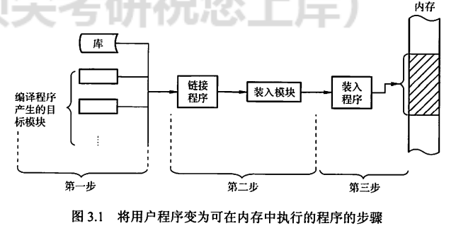

::: danger 这几个链接是啥啊，没看懂

:::

::: note 程序的链接有三种方式。

**静态链接**

在程序运行之前，先将各目标模块及它们所需的库函数链接成一个完整的装配模块，以后不再拆开。将几个目标模块装配成一个装 入模块时，需要解决两个问题：

1. 修改相对地址，编译后的所有目标模块都是从0开始的相对地址，当链接成一个装入模块时要修改相对地址。
2. 变换外部调用符号，将每个模块中所用的外部调用符号也都变换为相对地址。

---

**装入时动态链接**

将用户源程序编译后所得到的一组目标模块，在装入内存时，采用边装入边链接的方式。其优点是便于修改和更新，便于实现对目标模块的共享。

---

**运行时动态链接**

对某些目标模块的链接，是在程序执行中需要该目标模块时才进行的。凡在执行过程中未被用到的目标模块，都不会被调入内存和被链接到装入模块上。其优点是能加快程序的装入过程，还可节省大量的内存空间。

:::

::: note 装入内存有三种方式

**绝对装入**

绝对装入方式只适用于单道程序环境。在编译时，若知道程序将驻留在内存的某个位置，则编译程序将产生绝对地址的目标代码。绝对装入程序按照装入模块中的地址，将程序和数据装入内存。由于程序中的逻辑地址与实际内存地址完全相同，因此不需对程序和数据的地址进行修改。

另外，程序中所用的绝对地址，可在编译或汇编时给出，也可由程序员直接赋予。而通常情况下在程序中采用的是符号地址，编译或汇编时再转换为绝对地址。

---

**可重定位装入**

在多道程序环境下，多个目标模块的起始地址通常都从0开始，程序中的其他地址都是相对于起始地址的，此时应采用可重定位装入方式。根据内存的当前情况，将装入模块装入内存的适当位置。在装入时对目标程序中指令和数据地址的修改过程称为重定位，又因为地址变换通常是在进程装入时一次完成的，故称为 ==静态重定位==，如图3.2(a)所示。

当一个作业装入内存时，必须给它分配要求的全部内存空间，若没有足够的内存，则无法装入。此外，作业一日进入内存，整个运行期间就不能在内存中移动，也不能再申请内存空间。

---

**动态运行时装入**

也称 ==动态重定位==。程序在内存中若发生移动，则需要采用动态的装入方式。装入程序把装入模块装入内存后，并不立即把装入模块中的相对地址转换为绝对地址，而是把这种地址转换推迟到程序真正要执行时才进行。因此，装入内存后的所有地址均为相对地址。这种方式需要一个重定位寄存器的支持，如图3.2(b)所示。

动态重定位的优点：可以将程序分配到不连续的存储区；在程序运行之前可以只装入部分代码即可投入运行，然后在程序运行期间，根据需要动态申请分配内存；便于程序段的共享。

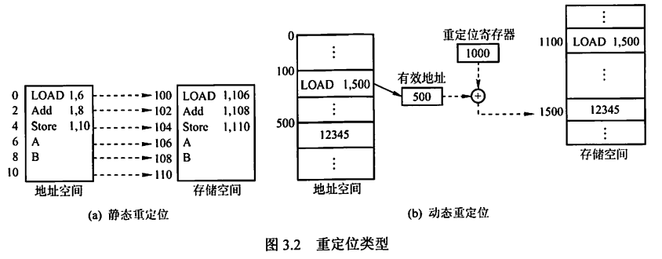

:::

### 1.2 逻辑地址与物理地址

编译后，每个目标模块都从 0 号单元开始编址，这称为该目标模块的 **相对地址（或逻辑地址）**。当链接程序将各个模块链接成一个完整的叮执行目标程序时，链接程序顺序依次按各个模块的相对地址构成统一的从 0 号单元开始编址的 **逻辑地址空间（或虚拟地址空间）**，对于32位系统，逻辑地址空间的范围为 $[0, 2^{32}-1]$。进程在运行时，看到和使用的地址都是逻辑地址。用户程序和程序员只需知道逻辑地址，而内存管理的具体机制则是完全透明的。不同进程可以有相同的逻辑地址，因为这些相同的逻辑地址可以映射到主存的不同位置。

物理地址空间是指内存中物理单元的集合，它是地址转换的最终地址，进程在运行时执行指令和访问数据，最后都要通过物理地址从主存中存取。当装入程序将可执行代码装入内存时，必须通过地址转换将逻辑地址转换成物理地址，这个过程称为 ==地址重定位==

操作系统通过内存管理部件(MMU)将进程使用的逻辑地址转换为物理地址。进程使用虚拟内存空间中的地址，操作系统在相关硬件的协助下，将它“转换”成真正的物理地址。逻辑地址通过页表映射到物理内存，页表由操作系统维护并被处理器引用。

### 1.3 进程的内存映像

不同于存放在硬盘上的可执行程序文件，当一个程序调入内存运行时，就构成了进程的内存映像。一个进程的内存映像一般有几个要素：

- 代码段：即程序的二进制代码，代码段是只读的，可以被多个进程共享。
- 数据段：即程序运行时加工处理的对象，包括全局变量和静态变量。
- 进程控制块(PCB)：存放在系统区。操作系统通过PCB来控制和管理进程。
- 堆：用来存放动态分配的变量。通过调用 malloc 函数动态地向高地址分配空间。
- 栈：用来实现函数调用。从用户空间的最大地址往低地址方向增长。

代码段和数据段在程序调入内存时就指定了大小，而堆和栈不一样。当调用像 malloc 和 free 这样的C标准库函数时，堆可以在运行时动态地扩展和收缩。用户栈在程序运行期间也可以动态地扩展和收缩，每次调用一个函数， 栈就会增长；从一个函数返回时，栈就会收缩。

> 图3.3是一个进程在内存中的映像。其中，共享库用来存放进程用到的共享函数库代码，如 printf() 函数等。在只读代码段中，.init 是程序初始化时调用的 _init 函数；.text 是用户程序的机器代码；.rodata 是只读数据。在读/写数据段中，.data 是已初始化的全局变量和静态变量；.bss 是未初始化及所有初始化为0的全局变量和静态变量。

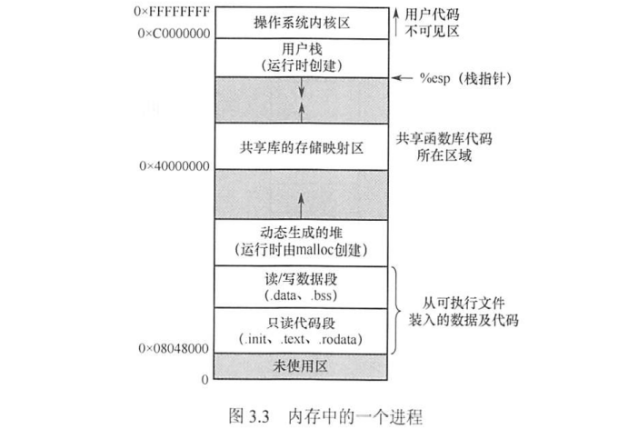

### 1.4 内存保护

确保每个进程都有一个单独的内存空间。内存分配前，需要保护操作系统不受用户进程的影响，同时保护用户进程不受其他用户进程的影响。内存保护可采取两种方法：

1. 在CPU中设置一对上、下限寄存器，存放用户作业在主存中的下限和上限地址，每当CPU要访问一个地址时， 分别和两个寄存器的值相比，判断有无越界。
2. 采用 **重定位寄存器（又称基地址寄存器）** 和 **界地址寄存器（又称限长寄存器）** 来实现这种保护。重定位寄存器含最小的物理地址值，界地址寄存器含逻辑地址的最大值。内存管理机构动态地将逻辑地址与界地址寄存器进行比较，若未发生地址越界，则加上重定位寄存器的值后映射成物理地址，再送交内存单元，如图3.4所示。

实现内存保护需要重定位寄存器和界地址寄存器，因此要注意两者的区别。

- 重定位寄存器是用来【加】的，逻辑地址加上重定位寄存器中的值就能得到物理地址；
- 界地址寄存器是用来【比】的，通过比较界地址寄存器中的值与逻辑地址的值来判断是否越界。

加载重定位寄存器和界地址寄存器时必须使用特权指令，只有操作系统内核才可以加载这两个存储器。这种方案允许操作系统内核修改这两个寄存器的值，而不允许用户程序修改。

### 1.5 内存共享

并不是所有的进程内存空间都适合共享，只有那些只读的区域才可以共享。可重入代码又称纯代码，是一种允许多个进程同时访问但不允许被任何进程修改的代码。但在实际执行时，也可以为每个进程配以局部数据区，把在执行中可能改变的部分复制到该数据区，这样，程序在执行时只需对该私有数据区中的内存进行修改，并不去改变共享的代码。

下面通过一个例子来说明内存共享的实现方式。考虑一个可以同时容纳40个用户的多用户系统，他们同时执行一个文本编辑程序，若该程序有160KB代码区和40KB数据区，则共需800KB的内存空间来支持40个用户。如果160KB代码是可分享的纯代码，则不论是在分页系统中还是在分段系统中，整个系统只需保留一份副本即可，此时所需的内存空间仅为 `40KB * 40 + 160KB = 1760KB`。对于分页系统，假设页面大小为4KB，则代码区占用40个页面、数据区占用10个页面。为实现代码共享，应在每个进程的页表中都建立40个页表项，它们都指向共享代码区的物理页号。此外，每个进程还要为自己的数据区建立10 个页表项，指向私有数据区的物理页号。对于分段系统，由于是以段为分配单位的，不管该段有多大，都只需为该段设置一个段表项 （指向共享代码段始址，以及段长160KB）。由此可见，段的共享非常简单易行。

### 1.6 内存分配与回收

存储管理方式随着操作系统的发展而发展。在操作系统由单道向多道发展时，存储管理方式便由单一连续分配发展为固定分区分配。为了能更好地适应不同大小的程序要求，又从固定分区分配发展到动态分区分配。为了更好地提高内存的利用率，进而从连续分配方式发展到离散分配方式 —— 页式存储管理。 引入分段存储管理的目的，主要是为了满足用户在编程和使用方面的要求，其中某些要求是其他几种存储管理方式难以满足的。

## 二、覆盖与交换

覆盖与交换技术是在多道程序环境下用来扩充内存的两种方法。

### 2.1 覆盖

早期的计算机系统中，主存容量很小，虽然主存中仅存放一道用户程序，但存储空间放不下用户进程的现象也经常发生，这一矛盾可以用覆盖技术来解决。

覆盖的基本思想如下：由于程序运行时并非任何时候都要访问程序及数据的各个部分（尤其是大程序），因此可把用户空间分成一个固定区和若干覆盖区。将经常活跃的部分放在固定区，其余部分按调用关系分段。首先将那些即将要访问的段放入覆盖区，其他段放在外存中，在需要调用前，系统再将其调入覆盖区，替换覆盖区中原有的段。

覆盖技术的特点是，打破了必须将一个进程的全部信息装入主存后才能运行的限制，但当同时运行程序的代码量大于主存时仍不能运行，此外，内存中能够更新的地方只有覆盖区的段，不在覆盖区中的段会常驻内存。覆盖技术对用户和程序员不透明。

### 2.2 交换

交换（对换）的基本思想是，把处于等待状态（或在CPU调度原则下被剥夺运行权利）的程序从内存移到辅存，把内存空间腾出来，这一过程又称换出;把准备好竞争CPU运行的程序从辅存移到内存，这过程又称换入。 第2章介绍的中级调度采用的就是交换技术。

例如，有一个CPU采用时间片轮转调度算法的多道程序环境。时间片到，内存管理器将刚刚执行过的进程换出，将另- -进程换入刚刚释放的内存空间。同时，CPU调度器可以将时间片分配给其他已在内存中的进程。每个进程用完时间片都与另一进程交换。在理想情况下，内存管理器的交换过程速度足够快，总有进程在内存中可以执行。

有关交换，需要注意以下几个问题：

- 交换需要备份存储，通常是磁盘。它必须足够大，并提供对这些内存映像的直接访问。
- 为了有效使用CPU，需要使每个进程的执行时间比交换时间长。
- 若换出进程，则必须确保该进程完全处于空闲状态。
- 交换空间通常作为磁盘的-整块，且独立于文件系统，因此使用起来可能很快。
- 交换通常在有许多进程运行且内存空间吃紧时开始启动，而在系统负荷降低时就暂停。
- 普通的交换使用不多，但交换策略的某些变体在许多系统(如UNIX)中仍发挥作用。

交换技术主要在不同进程(或作业)之间进行，而覆盖则用于同一个程序或进程中。对于主存无法存放用户程序的矛盾，现代操作系统是通过虚拟内存技术来解决的，覆盖技术则已成为历史；而交换技术在现代操作系统中仍具有较强的生命力。

## 三、连续分配管理方式

连续分配方式是指为一个用户程序分配一个连续的内存空间，譬如某用户需要100MB的内存空间，连续分配方式就在内存空间中为用户分配一块连续的100MB空间。连续分配方式主要包括单一连续分配、 固定分区分配和动态分区分配。

### 3.1 单一连续分配

内存在此方式下分为系统区和用户区，系统区仅供操作系统使用，通常在低地址部分；在用户区内存中，仅有一道用户程序，即整个内存的用户空间由该程序独占。

这种方式的优点是简单、无外部碎片，无须进行内存保护，因为内存中永远只有一道程序。

缺点是只能用于单用户、单任务的操作系统中，有内部碎片，存储器的利用率极低。

### 3.2 固定分区分配

固定分区分配是最简单的一种多道程序存储管理方式，它将用户内存空间划分为若千固定大小的区域，每个分区只装入一道作业。当有空闲分区时，便可再从外存的后备作业队列中选择适当大小的作业装入该分区，如此循环。在划分分区时有两种不同的方法。

- 分区大小相等。程序太小会造成浪费，程序太大又无法装入，缺乏灵活性。
- 分区大小不等。划分为多个较小的分区、适量的中等分区和少量大分区。

为便于内存分配，通常将分区按大小排队，并为之建立一张分区 说明表，其中各表项包括每个分区的始址、大小及状态，如图3.5所示。当有用户程序要装入时，便检索该表，以找到合适的分区给予分配并将其状态置【已分配】；未找到合适分区时，则拒绝为该程序分配内存。

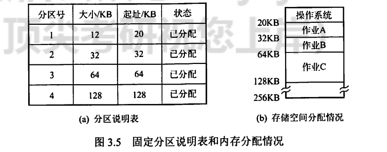

这种方式存在两个问题：一是程序可能太大而放不进任何一个分区， 这时就需要采用覆盖技术来使用内存空间；二是当程序小于固定分区大小时，也要占用一个完整的内存分区，这样分区内部就存在空间浪费，这种现象称为内部碎片。固定分区是可用于多道程序设计的最简单的存储分配，无外部碎片，但不能实现多进程共享一个主存区，所以存储空间利用率低。

在固定分区分配中，为了便于分配，建立一张分区使用表，通常按分区大小排队，各表项包括每个分区的起始地址、大小及状态（是否已分配）。分配内存时，检索分区使用表，找到一个能满足要求且尚未分配的分区分配给装入程序，并将对应表项的状态置为【已分配】；若找不到这样的分区，则拒绝分配。回收内存时，只需将对应表项的状态置为【未分配】即可。

### 3.3 动态分区分配

又称可变分区分配，它是在进程装入内存时，根据进程的实际需要，动态地为之分配内存，并使分区的大小正好适合进程的需要。因此，系统中分区的大小和数目是可变的。

如图3.6所示，系统有64MB内存空间，其中低8MB固定分配给操作系统，其余为用户可用内存。开始时装入前三个进程，它们分别分配到所需的空间后，内存仅剩4MB，进程4无法装入。在某个时刻，内存中没有一个就绪进程，CPU 出现空闲，操作系统就换出进程2，换入进程4。由于进程4比进程2小，这样在主存中就产生了一个6MB的内存块。之后CPU又出现空闲，需要换入进程2，而主存无法容纳进程2，操作系统就换出进程I，换入进程2。

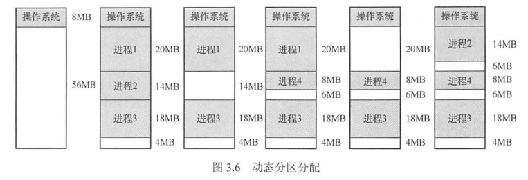

动态分区在开始时是很好的，但随着时间的推移，内存中会产生越来越多小的内存块，内存的利用率也随之下降。这些小的内存块称为外部碎片，它存在于所有分区的外部，这与固定分区中的内部碎片正好相对。克服外部碎片可以通过紧凑技术来解决，即操作系统不时地对进程进行移动和整理。但这需要动态重定位寄存器的支持，且相对费时。紧凑的过程实际上类似于 Windows 系统中的磁盘碎片整理程序，只不过后者是对外存空间的紧凑。

个在进程装入或换入主存时， 若内存中有多个足够大的空闲块，则操作系统必须确定分配哪个内存块给进程使用，这就是动态分区的分配策略。考虑以下几种算法：

1. 首次适应（First Fit）算法。空闲分区以地址递增的次序链接。分配内存时，从链首开始，顺序查找， 找到大小能满足要求的第一个空闲分区分配给作业。
2. 邻近适应（Next Fit）算法。又称循环首次适应算法，由首次适应算法演变而成。不同之处是，分配内存时从上次查找结束的位置开始继续查找。
3. 最佳适应（Best Fit） 算法。空闲分区按容量递增的次序形成空闲分区链，找到第一个能满足要求且最小的空闲分区分配给作业，避免“大材小用”。
4. 最坏适应（Worst Fit）算法。空闲分区以容量递减的次序链接，找到第一个能满足要求的，即最大的分区，从中分割一部分存储空间给作业。

首次适应算法最简单，通常也是最好和最快的。不过，首次适应算法会使得内存的低地址部分出现很多小的空闲分区，而每次分配查找时都要经过这些分区，因此增加了开销。

邻近适应算法试图解决这个问题。但它常常导致在内存空间的尾部(因为在一遍扫描中， 内存前面部分使用后再释放时，不会参与分配)分裂成小碎片。通常比首次适应算法要差。

最佳适应算法虽然称为“最佳”，但是性能通常很差，因为每次最佳的分配会留下很小的难以利用的内存块，会产生最多的外部碎片。

最坏适应算法与最佳适应算法相反，它选择最大的可用块，这看起来最不容易产生碎片，但是却把最大的连续内存划分开，会很快导致没有可用的大内存块，因此性能也非常差。

在动态分区分配中，与固定分区分配类似，设置一张空闲分区链（表），并按始址排序。分配内存时，检索空闲分区链，找到所需的分区，若其大小大于请求大小，便从该分区中按请求大小分割一块空间分配给装入进程 （若剩余部分小到不足以划分，则无须分割），余下部分仍留在空闲分区链中。回收内存时，系统根据回收分区的始址，从空闲分区链中找到相应的插入点，此时可能出现四种情况：

1. 回收区与插入点的前一空闲分区相邻，将这两个分区合并，并修改前一分区表项的大小为两者之和
2. 回收区与插入点的后一空闲分区相邻，将这两个分区合并，并修改后一分区表项的始址和大小
3. 回收区同时与插入点的前、后两个分区相邻，此时将这三个分区合并，修改前一分区 表项的大小为三者之和，取消后一分区表项
4. 回收区没有相邻的空闲分区，此时应为回收区新建一个表项，填写始址和大小，并插入空闲分区链。

以上三种内存分区管理方法有一个共同特点，即用户程序在主存中都是连续存放的。

在连续分配方式中，我们发现，即使内存有超过1GB的空闲空间，但若没有连续的1GB空间，则需要1GB空间的作业仍然是无法运行的；但若采用非连续分配方式，则作业所要求的1GB内存空间可以分散地分配在内存的各个区域，当然，这也需要额外的空间去存储它们（分散区域）的索引，使得非连续分配方式的存储密度低于连续分配方式。非连续分配方式根据分区的大小是否固定，分为分页存储管理和分段存储管理。在分页存储管理中，又根据运行作业时是否要把作业的所有页面都装入内存才能运行，分为基本分页存储管理和请求分页存储管理。

## 四、基本分页存储管理

固定分区会产生内部碎片,动态分区会产生外部碎片,这两种技术对内存的利用率都比较低。我们希望内存的使用能尽量避免碎片的产生，这就引入了分页的思想：把主存空间划分为大小相等且固定的块，块相对较小，作为主存的基本单位。每个进程也以块为单位进行划分，进程在执行时，以块为单位逐个申请主存中的块空间。

分页的方法从形式上看，像分区相等的固定分区技术，分页管理不会产生外部碎片。但它又有本质的不同点：块的大小相对分区要小很多，而且进程也按照块进行划分，进程运行时按块申请主存可用空间并执行。这样，进程只会在为最后一个不完整的块申请一个主存块空间时，才产生主存碎片，所以尽管会产生内部碎片，但这种碎片相对于进程来说也是很小的，每个进程平均只产生半个块大小的内部碎片（也称页内碎片）。

### 4.1 分页存储的几个基本概念

**页面和页面大小**

进程中的块称为页或页面（Page），内存中的块称为页框或页帧（Page Frame）。 外存也以同样的单位进行划分，直接称为块或盘块（Block）。 进程在执行时需要申请主存空间，即要为每个页面分配主存中的可用页框，这就产生了页和页框的一一对应。

为方便地址转换，页面大小应是2的整数幂。同时页面大小应该适中，页面太小会使进程的页面数过多，这样页表就会过长，占用大量内存，而且也会增加硬件地址转换的开销，降低页面换入/换出的效率；页面过大又会使页内碎片增多，降低内存的利用率。

---

**地址结构**

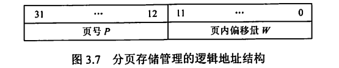

地址结构包含两部分：前一部分为页号P，后一部分为页内偏移量 W 地址长度为32位，其中 0 ~ 11 位为页内地址，即每页大小为4KB；12~31 位为页号，即最多允许20页。

注意，地址结构决定了虚拟内存的寻址空间有多大。在实际问题中，页号、页内偏移、逻辑地址可能是用十进制数给出的，若题目用二进制地址的形式给出时，读者要会转换。

---

**页表**

为了便于在内存中找到进程的每个页面所对应的物理块，系统为每个进程建立一张页表， 它记录页面在内存中对应的物理块号，页表一般存放在内存中。

在配置页表后，进程执行时，通过查找该表，即可找到每页在内存中的物理块号。可见，页表的作，用是实现从页号到物理块号的地址映射，如图3.8所示。

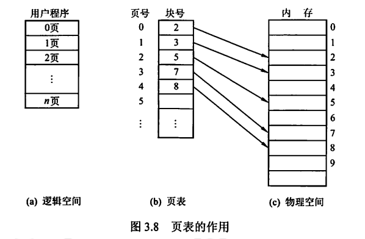

页表是由页表项组成的，初学者容易混淆页表项与地址结构，页表项与地址都由两部分构成，而且第一部分都是页号， 但页表项的第二部分是物理内存中的块号，而地址的第二部分是页内偏移；页表项的第二部分与地址的第二部分共同组成物理地址。

### 4.2 基本地址变换机构

地址变换机构的任务是将逻辑地址转换为内存中的物理地址。地址变换是借助于页表实现的。图3.9给出了分页存储管理系统中的地址变换机构。

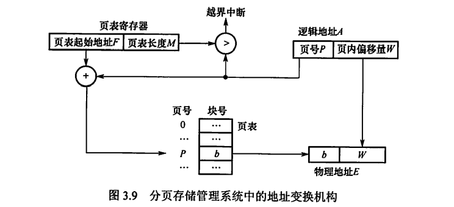

在系统中通常设置一个页表寄存 器（PTR），存放页表在内存的起始地址F和页表长度M。平时，进程未执行时，页表的始址和页表长度存放在本进程的PCB中，当进程被调度执行时，才将页表始址和页表长度装入页表寄存器中。设页面大小为L，逻辑地址A到物理地址E的变换过程如下（假设逻辑地址、页号、每页的长度都是十进制数）：

1. 计算页号P（`P = A / L`）和页内偏移量W（`w = A % L`）。
2. 比较页号P和页表长度M，若P≥M,则产生越界中断，否则继续执行。
3. 页表中页号P对应的 `页表项地址 = 页表始址F + 页号P * 页表项长度`，取出该页表项内容b，即为物理块号。注意区分页表长度和页表项长度。页表长度是指一共有多少页，页表项长度是指页地址占多大的存储空间。
4. 计算`E = b * L + w`，用得到的物理地址E去访问内存。

以上整个地址变换过程均是由硬件自动完成的。例如，若页面大小L为1KB，页号2对应的物理块为b = 8，计算逻辑地址 A = 2500 的物理地址E的过程如下：`P= 2500 / 1K = 2, W = 250 % 1K = 452`，查找得到页号2对应的物理块的块号为8，`E = 8 * 1024 + 452 = 8644`。

计算条件用十进制数和用二进制数给出，过程会稍有不同。页式管理只需给出一个整数就能确定对应的物理地址，因为页面大小L是固定的。因此，页式管理中地址空间是一维的。

页表项的大小不是随意规定的，而是有所约束的。如何确定页表项的大小？页表项的作用是找到该页在内存中的位置。以32位逻辑地址空间、字节编址单位、一页4KB为例，地址空间内一共有`22B / 4KB = 1M页`，因此需要 $log_21M = 20$ 位才能保证表示范围能容纳所有页面，又因为以字节作为编址单位，即页表项的大小 ≥「20/81 = 3B。所以在这个条件下，为了保证页表项能够指向所有页面，页表项的大小应该大于等于3B，当然，也可选择更大的页表项让一个页面能够正好容下整数个页表项，进而方便存储(如取成4B，这样一页正好可以装下1K个页表项)，或增加一些其他信息。

下面讨论分页管理方式存在的两个主要问题：

1. 每次访存操作都需要进行逻辑地址到物理地址的转换，地址转换过程必须足够快，否则访存速度会降低
2. 每个进程引入页表，用于存储映射机制，页表不能太大，杏则内存利用率会降低

### 4.3 具有快表的地址变换机构

由上面介绍的地址变换过程可知，若页表全部放在内存中，则存取一一个数据或一条指令至少要访问两次内存:第一次是访问页表，确定所存取的数据或指令的物理地址；第二次是根据该地址存取数据或指令。显然，这种方法比通常执行指令的速度慢了一半。

为此，在地址变换机构中增设一个具有并行查找能力的高速缓冲存储器快表，又称相联存储器（TLB），用来存放当前访问的若干页表项，以加速地址变换的过程。与此对应，主存中的页表常称为慢表。具有快表的地址变换机构如图3.10所示。

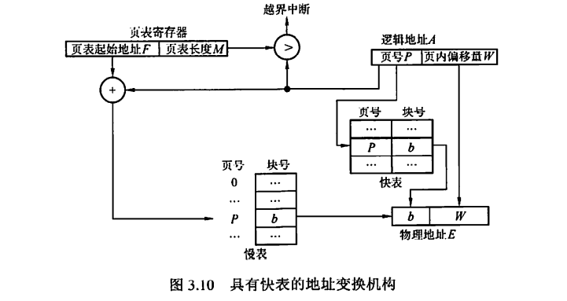

在具有快表的分页机制中，地址的变换过程如下：

1. CPU给出逻辑地址后，由硬件进行地址转换，将页号送入高速缓存寄存器，并将此页号与快表中的所有页号进行比较。
2. 若找到匹配的页号，说明所要访问的页表项在快表中，则直接从中取出该页对应的页框号，与页内偏移量拼接形成物理地址。这样，存取数据仅一次访存便可实现。
3. 若未找到匹配的页号，则需要访问主存中的页表，读出页表项后,应同时将其存入快表，以便后面可能的再次访问。若快表已满，则须按特定的算法淘汰一个旧页表项。

注意：有些处理机设计为快表和慢表同时查找，若在快表中查找成功则终止慢表的查找。一般快表的命中率可达90%以上，这样分页带来的速度损失就可降低至10%以下。快表的有效性基于著名的局部性原理，后面讲解虚拟内存时将会具体讨论它。

### 4.4 两级页表

由于引入了分页管理，进程在执行时不需要将所有页调入内存页框，而只需将保存有映射关系的页表调入内存。但是，我们仍然需要考虑页表的大小。以32位逻辑地址空间、页面大小4KB、页表项大小4B为例，若要实现进程对全部逻辑地址空间的映射，则每个进程需要20即约100万个页表项。也就是说，每个进程仅页表这一项就需要4MB主存空间，而且还要求是连续的，显然这是不切实际的。即便不考虑对全部逻辑地址空间进行映射的情况，一个逻辑地址空间稍大的进程，其页表大小也可能是过大的。以一个40MB的进程为例，页表项共40KB (40MB/4KBx4B)，若将所有页表项内容保存在内存中,则需要10个内存页框来保存整个页表。整个进程大小约为1万个页面，而实际执行时只需要几十个页面进入内存页框就可运行，但若要求10个页面大小的页表必须全部进入内存，则相对实际执行时的几十个进程页面的大小来说，肯定降低了内存利用率;从另一方面来说，这10页的页表项也并不需要同时保存在内存中，因为在大多数情况下，映射所需要的页表项都在页表的同一个页面中。

为了压缩页表，我们进一步延伸页表映射的思想，就可得到二级分页，即使用层次结构的页表：将页表的10页空间也进行地址映射，建立上一级页表，用于存储页表的映射关系。这里对页表的10个页面进行映射只需要10个页表项，所以上一级页表只需要1页就已足够（可以存储2l0= 1024个页表项）。在进程执行时，只需要将这一页的上一级页表调入内存即可，进程的页表和进程本身的页面可在后面的执行中再调入内存。根据上面提到的条件（32位逻辑地址空间、页面大小4KB、页表项大小4B，以字节为编址单位），我们来构造一个适合的页表结构。页面大小为4KB，页内偏移地址为log4K= 12位，页号部分为20位，若不采用分级页表，则仅页表就要占用20x4B/4KB= 1024页，这大大超过了许多进程自身需要的页面，对于内存来说是非常浪费资源的，而且查询页表工作也会变得十分不便、试想若把这些页表放在连续的空间内，查询对应页的物理页号时可以通过页表首页地址+页号x4B的形式得到，而这种方法查询起来虽然相对方便，但连续的1024 页对于内存的要求实在太高，并且上面也说到了其中大多数页面都是不会用到的，所以这种方法并不具有可行性。若不把这些页表放在连续的空间里，则需要一张索引表来告诉我们第几张页表该上哪里去找,这能解决页表的查询问题，且不用把所有的页表都调入内存，只在需要它时才调入(下节介绍的虚拟存储器思想)，因此能解决占用内存空间过大的问题。读者也许发现这个方案就和当初引进页表机制的方式一模一样，实际上就是构造一个页表的页表，也就是二级页表。为查询方便，顶级页表最多只能有1个页面(一定要记住这个规定)，因此项级页表总共可以容纳4KB/4B = lK个页表项，它占用的地址位数为logzlK = 10位，而之前已经计算出页内偏移地址占用了12 位，因此一个32位的逻辑地址空间就剩下了10位，正好使得二级页表的大小在一页之内， 这样就得到了逻辑地址空间的格式，如图3.11所示。

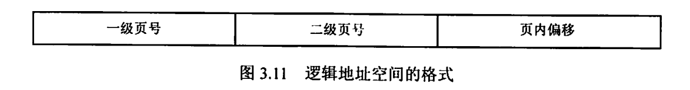

二级页表实际上是在原有页表结构上再加上一层页表，示意结构如图3.12所示。

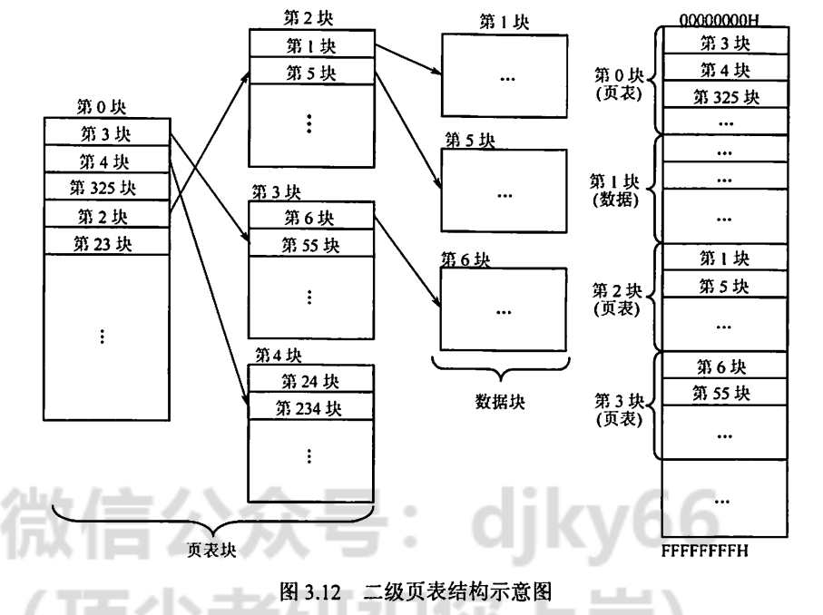

建立多级页表的目的在于建立索引，以便不用浪费主存空间去存储无用的页表项，也不用盲目地顺序式查找页表项。

## 五、基本分段存储管理

分页管理方式是从计算机的角度考虑设计的，目的是提高内存的利用率，提升计算机的性能。分页通过硬件机制实现，对用户完全透明。分段管理方式的提出则考虑了用户和程序员，以满足方便编程、信息保护和共享、动态增长及动态链接等多方面的需要。

### 5.1 分段

段式管理方式按照用户进程中的自然段划分逻辑空间。例如，用户进程由主程序段、两个子程序段、栈段和数据段组成，于是可以把这个用户进程划分为5段，每段从0开始编址，并分配一段连续的地址空间（段内要求连续，段间不要求连续，因此整个作业的地址空间是二维的），其逻辑地址由段号S与段内偏移量W两部分组成。

在图3.13中，段号为16位，段内偏移量为16位，因此-一个作业最多有216 = 65536段，最大段长为64KB。

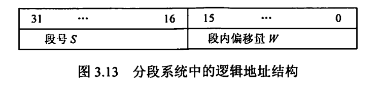

在页式系统中，逻辑地址的页号和页内偏移量对用户是透明的，但在段式系统中，段号和段内偏移量必须由用户显式提供，在高级程序设计语言中，这个工作由编译程序完成。

### 5.2 段表

每个进程都有张逻辑空间与内存空间映射的段表，其中每个段表项对应进程的一-段，段表项记录该段在内存中的始址和长度。段表的内容如图3.14所示。

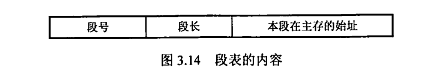

配置段表后，执行中的进程可通过查找段表，找到每段所对应的内存区。可见，段表用于实现从逻辑段到物理内存区的映射，如图3.15所示。

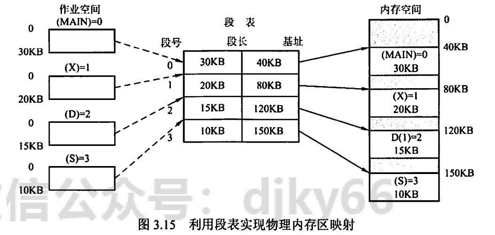

### 5.3 地址变换机构

分段系统的地址变换过程如图3.16所示。为了实现进程从逻辑地址到物理地址的变换功能，在系统中设置了段表寄存器，用于存放段表始址F和段表长度M。从逻辑地址A到物理地址E之间的地址变换过程如下:

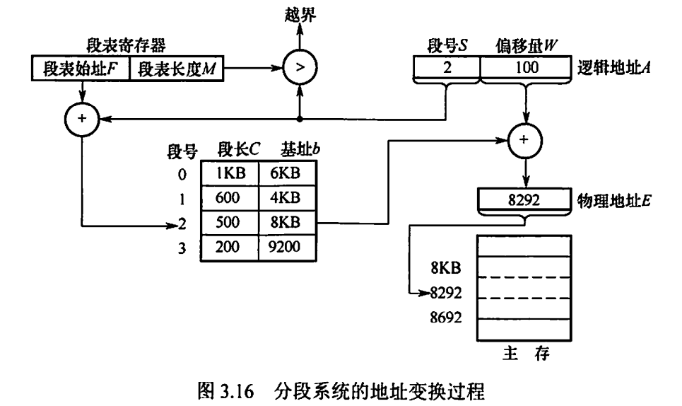

1. 从逻辑地址A中取出前几位为段号S,后几位为段内偏移量W。注意，在地址变换的题目中，要注意逻辑地址是用二进制数还是用十进制数给出的。
2. 比较段号S和段表长度M，若S≥M,则产生越界中断，否则继续执行。
3. 段表中段号S对应的段表项地址=段表始址F +段号Sx段表项长度，取出该段表项的前几位得到段长C。若段内偏移量≥C，则产生越界中断，否则继续执行。从这句话我们可以看出，段表项实际上只有两部分，前几位是段长，后几位是始址。
4. 取出段表项中该段的始址b,计算E=b+ W，用得到的物理地址E去访问内存。

### 5.4 段的共享与保护

在分段系统中，段的共享是通过两个作业的段表中相应表项指向被共享的段的同一个物理副本来实现的。当一个作业正从共享段中读取数据时，必须防止另一个作业修改此共享段中的数据。不能修改的代码称为纯代码或可重入代码(它不属于临界资源)，这样的代码和不能修改的数据可以共享，而可修改的代码和数据不能共享。

与分页管理类似，分段管理的保护方法主要有两种：一种是存取控制保护，另一种是地址越界保护。地址越界保护将段表寄存器中的段表长度与逻辑地址中的段号比较，若段号大于段表长度，则产生越界中断;再将段表项中的段长和逻辑地址中的段内偏移进行比较，若段内偏移大于段长，也会产生越界中断。分页管理只需要判断页号是否越界，页内偏移是不可能越界的。

与页式管理不同，段式管理不能通过给出一个整数便确定对应的物理地址，因为每段的长度是不固定的，无法通过整数除法得出段号，无法通过求余得出段内偏移，所以段号和段内偏移一定要显式给出（段号，段内偏移），因此分段管理的地址空间是二维的。

## 六、段页式管理

分页存储管理能有效地提高内存利用率，而分段存储管理能反映程序的逻辑结构并有利于段的共享和保护。将这两种存储管理方法结合起来，便形成了段页式存储管理方式。

在段页式系统中，作业的地址空间首先被分成若干逻辑段，每段都有自己的段号，然后将每段分成若千大小固定的页。对内存空间的管理仍然和分页存储管理一样， 將其分成若干和页面大小相同的存储块，对内存的分配以存储块为单位，如图3.17所示。

在段页式系统中，作业的逻辑地址分为三部分：段号、页号和页内偏移量，如图3.18所示。

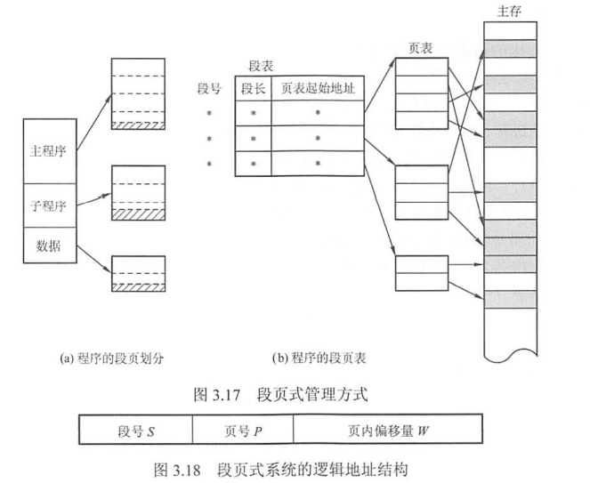

为了实现地址变换，系统为每个进程建立一张段表， 每个分段有一-张页表。 段表表项中至少包括段号、页表长度和页表始址，页表表项中至少包括页号和块号。此外，系统中还应有一个段表寄存器，指出作业的段表始址和段表长度（段表寄存器和页表寄存器的作用都有两个，一是在段表或页表中寻址，二是判断是否越界）。

注意：在一个进程中，段表只有一个，而页表可能有多个。

在进行地址变换时，首先通过段表查到页表始址,然后通过页表找到页帧号，最后形成物理地址。如图3.19所示，进行一次访问实际需要三次访问主存，这里同样可以使用快表来加快查找速度，其关键字由段号、页号组成，值是对应的页帧号和保护码。

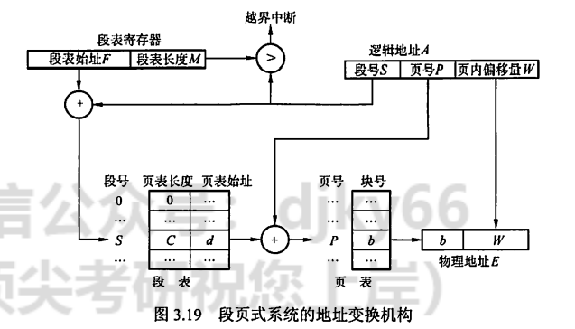

结合上面对段式和页式管理地址空间的分析，得出结论：段页式管理的地址空间是二维的。
