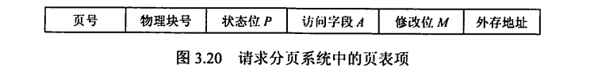
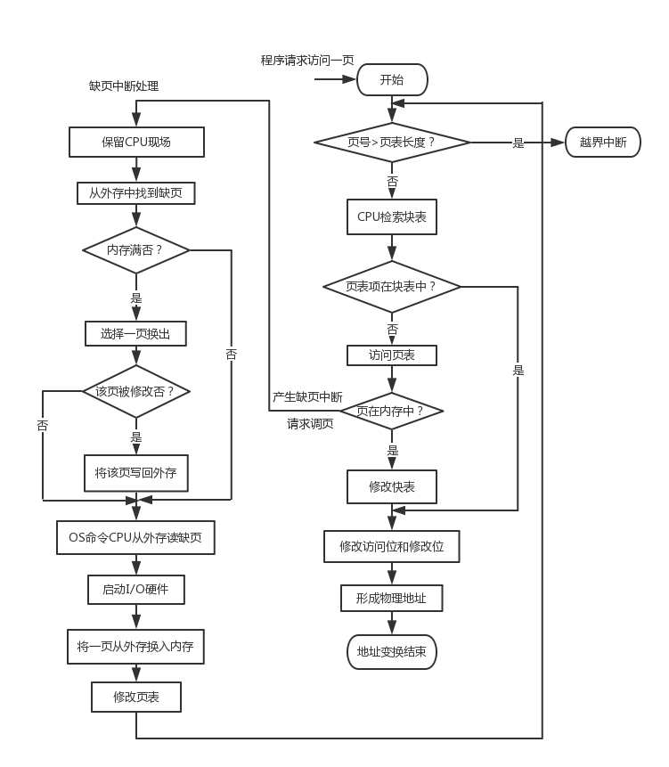
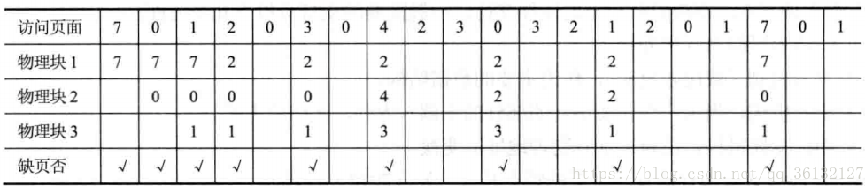
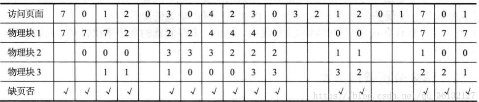
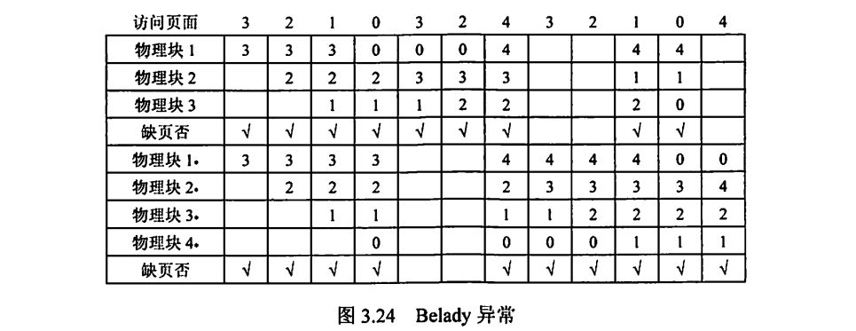
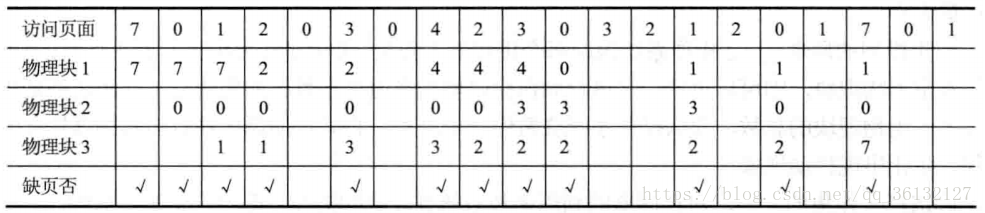
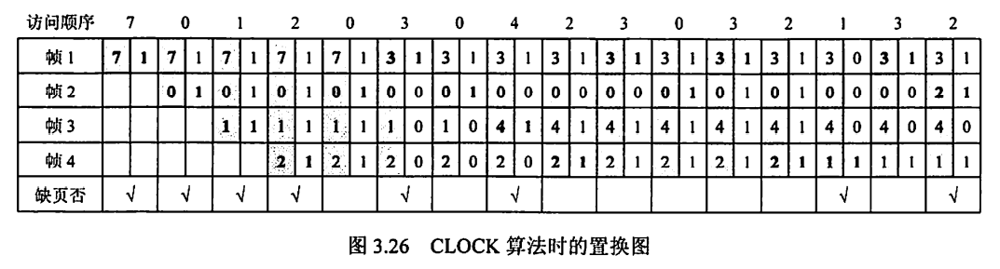
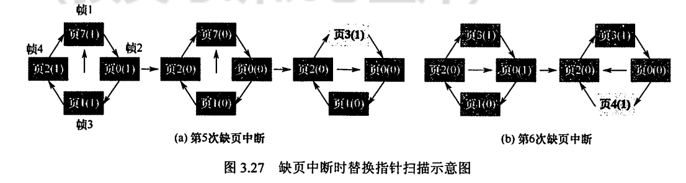
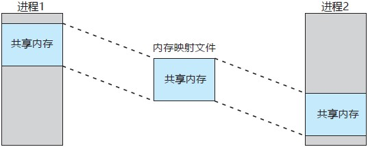

---
# 这是页面的图标
icon: page

# 这是文章的标题
title: 虚拟内存管理

# 设置作者
author: lllllan

# 设置写作时间
# time: 2020-01-20

# 一个页面只能有一个分类
category: 计算机基础

# 一个页面可以有多个标签
tag:
- 操作系统
- 王道-操作系统

# 此页面会在文章列表置顶
# sticky: true

# 此页面会出现在首页的文章板块中
star: true

# 你可以自定义页脚
# footer: 

---

::: warning 转载声明

- 《王道考研-操作系统》

:::

## 一、虚拟内存的基本概念

### 1.1 传统存储管理方式的特征

各种内存管理策略都是为了同时将多个进程保存在内存中，以便允许进行多道程序设计。它们都具有以下两个共同的特征：

1) 一次性。作业必须一次性全部装入内存后，才能开始运行。这会导致两种情况：
    1) 当作业很大而不能全部被装入内存时，将使该作业无法运行
    2) 当大量作业要求运行时，由于内存不足以容纳所有作业，只能使少数作业先运行，导致多道程序度的下降。

2) 驻留性。作业被装入内存后，就一直驻留在内存中，其任何部分都不会被换出，直至作业运行结束。运行中的进程会因等待 I/O 而被阻塞，可能处于长期等待状态。

由以上分析可知，许多在程序运行中不用或暂时不用的程序（数据）占据了大量的内存空间，而一些需要运行的作业又无法装入运行，显然浪费了宝贵的内存资源。

### 1.2 局部性原理

要真正理解虚拟内存技术的思想，首先须了解著名的局部性原理。

1. **时间局部性**。程序中的某条指令一旦执行，不久后该指令可能再次执行；某数据被访问过，不久后该数据可能再次被访问。产生的原因是程序中存在着大量的循环操作。
2. **空间局部性**。一旦程序访问了某个存储单元，在不久后，其附近的存储单元也将被访问，即程序在一段时间内所访问的地址，可能集中在一定的范围之内，因为指令通常是顺序存放、顺序执行的，数据也一般是以向量、数组、表等形式簇聚存储的。

时间局部性通过将近来使用的指令和数据保存到高速缓存中，并使用高速缓存的层次结构实现。空间局部性通常使用较大的高速缓存，并将预取机制集成到高速缓存控制逻辑中实现。虚拟内存技术实际上建立了【内存外存】的两级存储器结构，利用局部性原理实现高速缓存。

### 1.3 虚拟存储器的定义和特征

基于局部性原理，在程序装入时，仅须将程序当前要运行的少数页面或段先装入内存，而将其余部分暂留在外存，便可启动程序执行。在程序执行过程中，当所访问的信息不在内存时，由操作系统将所需要的部分调入内存，然后继续执行程序。另一方面，操作系统将内存中暂时不使用的内容换出到外存上，从而腾出空间存放将要调入内存的信息。这样，系统好像为用户提供了一个比实际内存容量大得多的存储器，称为 ==虚拟存储器==

之所以将其称为虚拟存储器，是因为这种存储器实际上并不存在，只是由于系统提供了部分装入、请求调入和置换功能后（对用户透明），给用户的感觉是好像存在一个比实际物理内存大得多的存储器。但容量大只是一种错觉，是虚的。虚拟存储器有以下三个主要特征：

1. 多次性。是指无须在作业运行时一次性地全部装入内存，而允许被分成多次调入内存运行，即只需将当前要运行的那部分程序和数据装入内存即可开始运行。以后每当要运行到尚未调入的那部分程序时，再将它调入。多次性是虚拟存储器最重要的特征。
2. 对换性。是指无须在作业运行时一直常驻内存，在进程运行期间，允许将那些暂不使用的程序和数据从内存调至外存的对换区（换出），待以后需要时再将它们从外存调至内存（换进）。正是由于对换性，才使得虚拟存储器得以正常运行。
3. 虚拟性。是指从逻辑上扩充内存的容量，使用户所看到的内存容量远大于实际的内存容量。这是虚拟存储器所表现出的最重要特征，也是实现虚拟存储器的最重要目标。

### 1.4 虚叔内存技术的实现

虚拟内存技术允许将一个作业分多次调入内存。采用连续分配方式时，会使相当一部分内存空间都处于暂时或【永久】的空闲状态，造成内存资源的严重浪费，而且也无法从逻辑上扩大内存容最。因此，虚拟内存的实现需要建立在离散分配的内存管理方式的基础上。

虚拟内存的实现有以下三种方式：

- 请求分页存储管理。
- 请求分段存储管理。
- 请求段页式存储管理。

不管哪种方式，都需要有一定的硬件支持。一般需要的支持有以下几个方面：

- 一定容量的内存和外存。
- 页表机制（或段表机制），作为主要的数据结构。
- 中断机构，当用户程序要访问的部分尚未调入内存时，则产生中断。
- 地址变换机构，逻辑地址到物理地址的变换。

## 二、请求分页管理方式

请求分页系统建立在基本分页系统基础之上，为了支持虚拟存储器功能而增加了请求调页功能和页面置换功能。请求分页是目前最常用的一种实现虛拟存储器的方法。

在请求分页系统中，只要求将当前需要的一部分页面装入内存，便可以启动作业运行。在作业执行过程中，当所要访问的页面不在内存中时，再通过调页功能将其调入，同时还可通过置换功能将暂时不用的页面换出到外存上，以便腾出内存空间。

### 2.1 页表机制

请求分页系统的页表机制不同于基本分页系统，请求分页系统在一个作业运行之前不要求全部一次性调入内存，因此在作业的运行过程中，必然会出现要访问的页面不在内存中的情况，如何发现和处理这种情况是请求分页系统必须解决的两个基本问题。为此，在请求页表项中增加了4个字段，如图3.20所示。

**页表项：** ==页号 + 物理块号 + 状态位 + 访问字段 + 修改位 + 外存地址==

增加的4个字段说明如下：

- 状态位P。用于指示该项是否已调入内存，供程序访问时参考。
- 访问字段A。用于记录本页在一段时间内被访问的次数，或记录本页最近已有多长时间未被访问，供置换算法换出页面时参考。
- 修改位M。标识该页在调入内存后是否被修改过，以确定页面置换时是否写回外存。
- 外存地址。用于指出该页在外存上的地址，通常是物理块号，供调入该页时参考。

### 2.2 缺页中断机构

在请求分页系统中，每当所要访问的页面不在内存中时，便产生一个缺页中断，请求操作系统将所缺的页调入内存。此时应将缺页的进程阻塞（调页完成唤醒），若内存中有空闲块，则分配一个块，将要调入的页装入该块，并修改页表中的相应页表项，若此时内存中没有空闲块，则要淘汰某页（若被淘汰页在内存期间被修改过，则要将其写回外存）。

缺页中断作为中断，同样要经历诸如 ==保护 CPU 环境、分析中断原因、转入缺页中断处理程序、恢复CPU环境== 等几个步骤。但与一般的中断相比，它有以下两个明显的区别：

- 在指令执行期间而非一条指令执行完后产生和处理中断信号，属于 ==内部异常==
- 一条指令在执行期间，可能产生多次缺页中断。

### 2.3 地址变换机构

请求分页系统中的地址变换机构，是在分页系统地址变换机构的基础上，为实现虚拟内存，又增加了某些功能而形成的，如产生和处理缺页中断，及从内存中换出一页 的功能等等。在进行地址变换时，先检索快表：

- 若找到要访问的页，则修改页表项中的访问位（写指令还需要重置修改位），然后利用页表项中给出的物理块号和页内地址形成物理地址。
- 若未找到该页的页表项，则应到内存中去查找页表，再对比页表项中的状态位P，看该页是否已调入内存，若页面已调入，则将该页的页表写入快表，若快表已满，则需采用某种算法替换。若页面未调入，则产生缺页中断，请求从外存把该页调入内存。

## 三、页框分配

### 3.1 驻留集大小

对于分页式的虚拟内存，在进程准备执行时，不需要也不可能把一个进程的所有页都读入主存。因此，操作系统必须决定读取多少页，即决定给特定的进程分配几个页框。给一个进程分配的物理页框的集合就是这个进程的驻留集。需要考虑以下几点：

1. 分配给一个进程的页框越少，驻留在主存中的进程就越多，从而可提高 CPU 的利用率。
2. 若一个进程在主存中的页面过少，则尽管有局部性原理，缺页率仍相对较高。
3. 若分配的页框过多，则由于局部性原理，对该进程的缺页率没有太明显的影响。

### 3.2 内存分配策略

在请求分页系统中，可采取两种内存分配策略，即固定和可变分配策略。在进行置换时，也可采取两种策略，即全局置换和局部置换。于是可组合出下面三种适用的策略。

**固定分配局部置换**

为每个进程分配一定数目的物理块，在进程运行期间都不改变。所谓局部置换，是指如果进程在运行中发生缺页，则只能从分配给该进程在内存的页面中选出一页换出，然后再调入一页，以保证分配给该进程的内存空间不变。实现这种策略时，难以确定应为每个进程分配的物理块数目：太少会频繁出现缺页中断，太多又会降低 CPU 和其他资源的利用率。

---

**可变分配全局置换**

先为每个进程分配一定数目的物理块，在进程运行期间可根据情况适当地增加或减少。所谓全局置换，是指如果进程在运行中发生缺页，系统从空闲物理块队列中取出一块分配给该进程，并将所缺页调入。这种方法比固定分配局部置换更加灵活，可以动态增加进程的物理块，但也存在弊端，如它会自目地给进程增加物理块，从而导致系统多道程序的并发能力下降。

---

**可变分配局部置换**

为每个进程分配一定数目的物理块，当某进程发生缺页时，只允许从该进程在内存的页面中选出一页换出，因此不会影响其他进程的运行。若进程在运行中频繁地发生缺页中断，则系统再为该进程分配若干物理块，直至该进程的缺页率趋于适当程度；反之，若进程在运行中的缺页率特别低，则可适当减少分配给该进程的物理块，但不能引起其缺页率的明显增加。这种方法在保证进程不会过多地调页的同时，也保持了系统的多道程序并发能力。当然它需要更复杂的实现，也衢要更大的开销，但对比频繁地换入换出所浪费的计算机资源，这种牺牲是值得的。

### 3.3 物理块调入算法

采用固定分配策略时，将系统中的空闲物理块分配给各个进程，可采用下述几种算法。

1. 平均分配算法，将系统中所有可供分配的物理块平均分配给各个进程。
2. 按比例分配算法，根据进程的大小按比例分配物理块。
3. 优先权分配算法，为重要和紧迫的进程分配较多的物理块。通常采取的方法是把所有可分配的物理块分成两部分：一部分按比例分配给各个进程，一部分则根据优先权分配。

### 3.4 调入页面的时机

为确定系统将进程运行时所缺的页面调入内存的时机，可采取以下两种调页策略：

1. 预调页策略。根据局部性原理，一次调入若干相邻的页会比一次调入一页更高效。但若调入的一批页面中的大多数都未被访问，则又是低效的。因此，需要采用以预测为基础的预调页策略，将那些预计在不久之后便会被访问的页面预先调入内存。但目前预调页的成功率仅约50%。因此这种策略主要用于进程的首次调入，由程序员指出应先调入哪些页。
2. 请求调页策略。进程在运行中需要访问的页面不在内存，便提出请求，由系统将其所需页面调入内存。由这种策略调入的页一定会被访问，且这种策略比较易于实现，因此目前的虚拟存储器大多采用此策略。其缺点是每次仅调入一页， 增加了磁盘I/O开销。预调入实际上就是运行前的调入，请求调页实际上就是运行期间调入。

### 3.5 从何处调入页面

请求分页系统中的外存分为两部分：用于存放文件的文件区和用于存放对换页面的对换区。对换区采用连续分配方式，而文件区采用离散分配方式，因此对换区的磁盘I/O速度比文件区的更快。这样，当发生缺页请求时，系统从何处将缺页调入内存就分为三种情况：

1. 系统拥有足够的对换区空间。可以全部从对换区调入所需页面，以提高调页速度。为此，在进程运行前，需将与该进程有关的文件从文件区复制到对换区。
2. 系统缺少足够的对换区空间。凡是不会被修改的文件都直接从文件区调入；而当换出这些页面时，由于它们未被修改而不必再将它们换出。但对于那些可能被修改的部分，在将它们換出时须调到对换区，以后需要时再从对换区调入（因为读比写的速度快）。

3) UNIX 方式。与进程有关的文件都放在文件区，因此未运行过的页面都应从文件区调入。曾经运行过但又被换出的页面，由于是放在对换区，因此在下次调入时应从对换区调入。进程请求的共享页面若被其他进程调入内存，则无须再从对换区调入。

### 3.6 如何调入页面

当进程所访问的页面不在内存中时（存在位为0），便向CPU发出缺页中断，中断响应后便转入缺页中断处理程序。该程序通过查找页表得到该页的物理块，此时如果内存未满， 则启动磁盘I/O，将所缺页谓入内存，并修改页表。如果内存已满，则先按某种置换算法从内存中选出一页准备换出；如果该页未被修改过（修改位为0），则无须将该页写回磁盘；但是，如果该页已被修改（修改位为1），则必须将该页写回磁盘，然后将所缺页调入内存，并修改页表中的相应表项，置其存在位为1。调入完成后，进程就可利用修改后的页表形成所要访间数据的内存地址。

## 四、页面置换算法

进程运行时，若其访问的页面不在内存中而需将其调入，但内存已无空闲空间时，就需要从内存中调出一页程序或数据，送入磁盘的对换区。

选择调出页面的算法就称为页面置换算法。好的页面置换算法应有较低的页面更换频率，也就是说，应将以后不会再访问或以后较长时间内不会再访问的页面先调出。

常见的置换算法有以下4种。

### 4.1 最佳(OPT) 置换算法

最佳置换算法选择的被淘汰页面是以后永不使用的页面，或是在最长时间内不再被访问的页面，以便保证获得最低的缺页率。然而，由于人们目前无法预知进程在内存下的若干页面中哪个是未来最长时间内不再被访问的，因而该算法无法实现。但可利用该算法去评价其他算法。

假定系统为某进程分配了三个物理块，并考虑有页面号引用串：

`7, 0, 1, 2, 0, 3, 0, 4, 2, 3, 0, 3, 2, 1, 2, 0, 1, 7, 0, 1`

进程运行时，先将 `7, 0, 1` 三个页面依次装入内存。当进程要访问页面 2 时，产生缺页中断，根据最佳置换算法，选择将第 18 次访问才需调入的页面 7 淘汰。然后，访问页面 0 时，因为它已在内存中，所以不必产生缺页中断。访问页面 3 时，又会根据最佳置换算法将页面 1 淘汰......以此类推，从图中可以看出采用最佳置换算法时的情况。

可以看到，发生缺页中断的次数为9，页面置换的次数为6。

### 4.2 先进先出(FIFO)页面置换算法

优先淘汰最早进入内存的页面，即淘汰在内存中驻留时间最久的页面。该算法实现简单，只需把已调入内存的页面根据先后次序链接成队列，设置一个指针总是指向最老的页面。但该算法与进程实际运行时的规律不适应，因为在进程中，有的页面经常被访问。

这里仍用上面的例子采用FIFO算法进行页面置换。当进程访问页面2时，把最早进入内存的页面 7 换出。然后访问页面 3 时，把 `2, 0, 1` 中最先进入内存的页面 0 换出。由图3.23可以看出，利用FIFO算法时进行了 12 次页面置换，比最佳置换算法正好多一倍。

::: danger Belady 异常

FIFO 算法还会产生所分配的物理块数增大而页故障数不减反增的异常现象，称为Belady异常。只有FIFO算法可能出现Belady异常，LRU 和OPT算法永远不会出现Belady异常。

:::

页面访问顺序为 `3, 2, 1, 0, 3, 2, 4, 3, 2, 1, 0, 4`。若采用FIFO置换算法，当分配的物理块为3个时，缺页次数为9次；当分配的物理块为4个时，缺页次数为10 次。分配给进程的物理块增多，但缺页次数不减反增。

### 4.3 最近最久未使用(LRU)置换算法

选择最近最长时间未访问过的页面予以淘汰，它认为过去一段时间内未访问过的页面，在最近的将来可能也不会被访问。该算法为每个页面设置一个访问字段，用来记录页面自上次被访问以来所经历的时间，淘汰页面时选择现有页面中值最大的予以淘汰。

再对上面的例子采用LRU算法进行页面置换。进程第一次对页面 2 访问时，将最近最久未被访问的页面 7 置换出去。然后在访问页面 3 时，将最近最久未使用的页面 1 换出。

前 5 次置换的情况与最佳置换算法相同，但两种算法并无必然联系。实际上，LRU 算法根据各页以前的使用情况来判断，是“向前看”的，而最佳置换算法则根据各页以后的使用情况来判断，是“向后看”的。而页面过去和未来的走向之间并无必然联系。

LRU算法的性能较好，但需要寄存器和栈的硬件支持。LRU是堆栈类的算法。理论上可以证明，堆栈类算法不可能出现 Belady 异常。FIFO 算法基于队列实现，不是堆栈类算法。

### 4.4 时钟(CLOCK)置换算法.

LRU 算法的性能接近 OPT 算法，但实现起来的开销大。因此，操作系统的设计者尝试了很多算法，试图用比较小的开销接近 LRU 算法的性能，这类算法都是CLOCK算法的变体。

**简单的CLOCK置换算法**

为每帧设置一位访问位，当某页首次被装入或被访问时，其访问位被置为1。对于替换算法，将内存中的所有页面视为一个循环队列，并有一个替换指针与之相关联，当某一页被替换时， 该指针被设置指向被替换页面的下一页。在选择一页淘汰时， 只需检查页的访问位：

- 若为0，就选择该页换出；
- 若为1，则将它置为0，暂不换出，给予该页第二次驻留内存的机会，再依次顺序检查下一个页面。

当检查到队列中的最后一个页面时，若其访问位仍为 1，则返回到队首去循环检查。由于该算法是循环地检查各个页面的使用情况，故称CLOCK算法。但是，因为该算法只有一位访问位，而置换时将未使用过的页面换出，故又称最近未用(NRU)算法。

假设页面访问顺序为 `7, 0, 1, 2, 0, 3, 0, 4, 2, 3, 0, 3, 2, 1, 3, 2`，采用简单CLOCK置换算法，分配 4 个页帧，每个页对应的结构为（页面号，访问位）。

首次访问 7, 0, 1, 2 时，产生缺页中断，依次调入主存，访问位都置为 1。访问 0 时，已存在，访问位置为 1。访问 3 时，产生第 5 次缺页中断，替换指针初始指向帧 1，此时所有帧的访问位均为 1，则替换指针完整地扫描一周， 把所有帧的访问位都置为 0，然后回到最初的位置（帧1），替换帧1中的页（包括置换页面和置访问位为1）。访问 0 时，已存在，访问位置为 1。访问 4 时，产生第 6 次缺页中断，替换指针指向帧 2（上次替换位置的下一帧），帧 2 的访问位为 1，将其修改为 0，继续扫描，帧 3 的访问位为0，替换帧 3 中的页。然后依次访问 2, 3, 0, 3, 2 均已存在，每次访问都将其访问位置为 1。访问 1 时，产生缺页中断，替换指针指向帧 4，此时所有帧的访问位均为 1，又完整扫描一周并置访问位为 0，回到帧 4，替换之。访问 3 时，已存在，访问位置为 1。访问 2 时，产生缺页中断，替换指针指向帧 1，帧 1 的访问位为 1，将其修改为 0，继续扫描，帧 2 的访问位为 0，替换帧 2 中的页。

---

**改进型CLOCK置换算法**

将一个页面换出时，若该页已被修改过，则要将该页写回磁盘，若该页未被修改过，则不必将它写回磁盘。可见，对于修改过的页面，替换代价更大。在改进型CLOCK算法中，除考虑页面使用情况外，还增加了置换代价一修改位。 在选择页面换出时，优先考虑既未使用过又未修改过的页面。由访问位A和修改位M可以组合成下面四种类型的页面：

- 1类A = 0，M = 0：最近未被访问且未被修改，是最佳淘汰页。
- 2类A = 0，M = 1：最近未被访问，但已被修改，不是很好的淘汰页。
- 3类A = 1，M = 0：最近已被访问，但未被修改，可能再被访问。
- 4类A = 1，M = 1：最近已被访问且已被修改，可能再被访问。

内存中的每页必定都是这四类页面之一。在进行页面置换时，可采用与简单CLOCK算法类似的算法，差别在于该算法要同时检查访问位和修改位。算法执行过程如下：

1. 从指针的当前位置开始，扫描循环队列，寻找A = 0且M = 0的 1 类页面，将遇到的第一个 1 类页面作为选中的淘汰页。在第一次扫描期间不改变访问位A。
2. 若第 1 步失败，则进行第二轮扫描，寻找A = 0且M = 1的 2 类页面。将遇到的第一个 2 类页面作为淘汰页。在第二轮扫描期间，将所有扫描过的页面的访问位都置为 0。

3. 若第 2 步也失败，则将指针返回到开始的位置，并将所有帧的访问位置为 0。重复第 1 步，并且若有必要，重复第 2 步，此时一定能找到被淘汰的页。

改进型CLOCK算法优于简单CLOCK算法的地方在于，可减少磁盘的 I/O 操作次数。但为了找到一个可置换的页，可能要经过几轮扫描，即实现算法本身的开销将有所增加。

操作系统中的页面置换算法都有一个原则，即尽可能保留访问过的页面，而淘汰未访问的页面。简单的CLOCK算法只考虑页面是否被访问过；改进型CLOCK算法对这两类页面做了细分，分为修改过的页面和未修改的页面。因此，若有未使用过的页面，则当然优先将其中未修改过的页面换出。若全部页面都用过，还是优先将其中未修改过的页面换出。

## 五、抖动和工作集

### 5.1 抖动

在页面置换过程中，一种最糟糕的情形是，刚刚换出的页面马上又要换入主存，刚刚换入的页面马上又要换出主存，这种频繁的页面调度行为称为 ==抖动或颠簸==

系统发生抖动的根本原因是，系统中同时运行的进程太多，由此分配给每个进程的物理块太少，不能满足进程正常运行的基本要求，致使每个进程在运行时频繁地出现缺页，必须请求系统将所缺页面调入内存。这会使得在系统中排队等待页面调入/调出的进程数目增加。显然，对磁盘的有效访问时间也随之急剧增加，造成每个进程的大部分时间都用于页面的换入/换出，而几乎不能再去做任何有效的工作，进而导致发生处理机的利用率急剧下降并趋于零的情况。抖动是进程运行时出现的严重问题，必须采取相应的措施解决它。由于抖动的发生与系统为进程分配物理块的多少有关，于是又提出了关于进程工作集的概念。

### 5.2 工作集

工作集是指在某段时间间隔内，进程要访问的页面集合。基于局部性原理，可以用最近访问过的页面来确定工作集。一般来说，工作集 W 可由时间 t 和工作集窗口大小  ⊿ 来确定。例如，某进程对页面的访问次序如下：

假设系统为该进程设定的工作集窗口大小 ⊿ 为 5，则在 t1 时刻，进程的工作集为 {2, 3, 5}，在 t2 时刻，进程的工作集为 {1, 2, 3, 4}。

实际应用中，工作集窗口会设置得很大，即对于局部性好的程序，工作集大小一般会比工作集窗口 ⊿ 小很多。工作集反映了进程在接下来的一段时间内很有可能会频繁访问的页面集合，因此，若分配给进程的物理块小于工作集大小，则该进程就很有可能频繁缺页，所以为了防止这种抖动现象，一般来说分配给进程的物理块数（即驻留集大小）要大于工作集大小。

工作集模型的原理是，让操作系统跟踪每个进程的工作集，并为进程分配大于其工作集的物理块。落在工作集内的页面需要调入驻留集中，而落在工作集外的页面可从驻留集中换出。若还有空闲物理块，则可再调一个进程到内存。若所有进程的工作集之和超过了可用物理块总数，则操作系统会暂停-一个进程，将其页面调出并将物理块分配给其他进程，防止出现抖动现象。

## 六、内存映射文件

内存映射文件(Memory-MappedFiles)与虚拟内存有些相似，将磁盘文件的全部或部分内容与进程虚拟地址空间的某个区域建立映射关系，便可以直接访问被映射的文件，而不必执行文件I/O操作，也无须对文件内容进行缓存处理。这种特性非常适合用来管理大尺寸文件。

使用内存映射文件所进行的任何实际交互都是在内存中进行的，并且是以标准的内存地址形式来访问的。磁盘的周期性分页是由操作系统在后台隐蔽实现的，对应用程序而言是完全透明的。系统内存中的所有页面都由虚拟存储器负责管理，虚拟存储器以统一的方式处理所有磁盘I/O。当进程退出或显式地解除文件映射时，所有被改动的页面会被写回磁盘文件。

多个进程允许并发地内存映射同一文件，以便允许数据共享。实际上，很多时候，共享内存是通过内存映射来实现的。进程可以通过共享内存来通信，而共享内存是通过映射相同文件到通信进程的虚拟地址空间实现的。内存映射文件充当通信进程之间的共享内存区域。一个进程在共享内存上完成了写操作，此刻当另一个进程在映射到这个文件的虚拟地址空间上执行读操作时，就能立刻看到上一个进程写操作的结果。

## 七、虚拟存储器性能影响因素

根据局部性原理，页面较大则缺页率较低，页面较小则缺页率较高。页面较小时，一方面减少了内存碎片，有利于提高内存利用率；另一方面，也会使每个进程要求较多的页面，导致页表过长，占用大量内存。页面较大时，虽然可以减少页表长度，但会使页内碎片增大。

分配给进程的物理块数越多，缺页率就越低，但是当物理块超过某个数目时，再为进程增加一个物理块对缺页率的改善是不明显的。可见，此时已没有必要再为它分配更多的物理块，否则也只能是浪费内存空间。只要保证活跃页面在内存中，保持缺页率在一个很低的范围即可。

好的页面置换算法可使进程在运行过程中具有较低的缺页率。选择LRU、CLOCK等置换算法，将未来有可能访问的页面尽量保留在内存中，从而提高页面的访问速度。

写回磁盘(见《计算机组成原理考研复习指导》)的频率。换出已修改过的页面时，应当写回磁盘，如果每当一个页面被换出时就将它写回磁盘，那么每换出一个页面就需要启动一次磁盘，效率极低。为此在系统中建立一个已修改换出页面的链表，对每个要被换出的页面（已修改），可以暂不将它们写回磁盘，而将它们挂在该链表上，仅当被换出页面数达到给定值时，才将它们一起写回磁盘，这样就可显著减少磁盘I/O的次数，即减少已修改页面换出的开销。此外，如果有进程在这批数据还未写回磁盘时需要再次访问这些页面，就不需从外存调入，而直接从已修改换出页面链表上获取，这样也可以减少页面从磁盘读入内存的频率，减少页面换进
的开销。

编写程序的局部化程度越高，执行时的缺页率就越低。如果存储采用的是按行存储，访问时就要尽量采用相同的访问方式，避免按列访问造成缺页率过高的现象。

