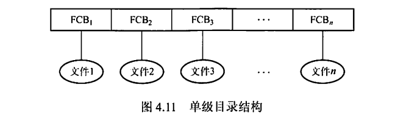
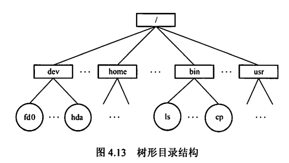
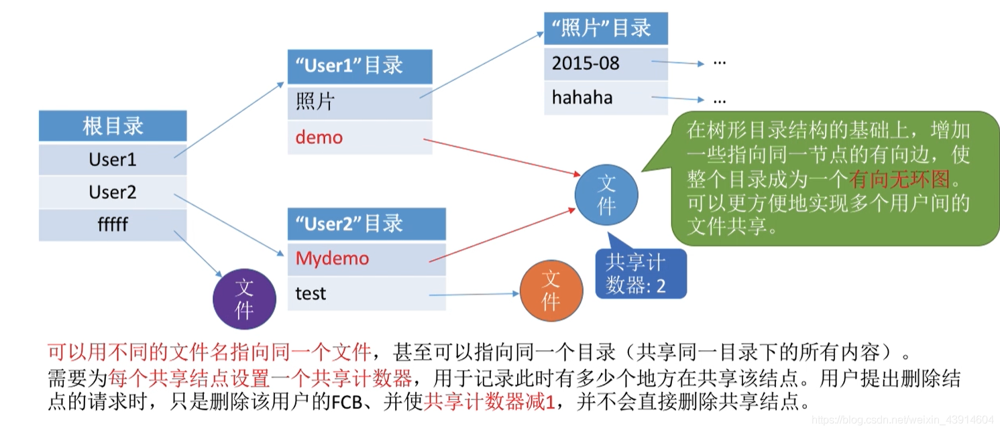
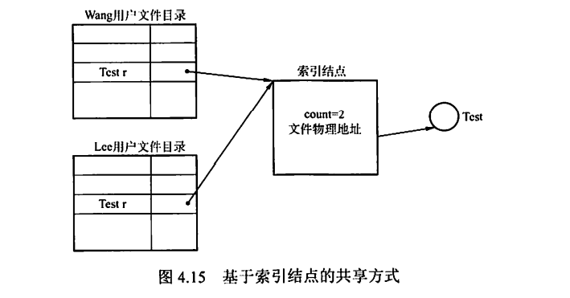

---
# 这是页面的图标
icon: page

# 这是文章的标题
title: 目录

# 设置作者
author: lllllan

# 设置写作时间
# time: 2020-01-20

# 一个页面只能有一个分类
category: 计算机基础

# 一个页面可以有多个标签
tag:
- 操作系统
- 王道-操作系统

# 此页面会在文章列表置顶
# sticky: true

# 此页面会出现在首页的文章板块中
star: true

# 你可以自定义页脚
# footer: 
---

::: warning 转载声明

- 《王道考研-操作系统》

:::

## 一、目录的基本概念

上节说过，FCB 的有序集合称为文件目录，一个FCB就是一个文件目录项。与文件管理系统和文件集合相关联的是文件目录，它包含有关文件的属性、位置和所有权等。

首先来看目录管理的基本要求：从用户的角度看，目录在用户（应用程序）所需要的文件名和文件之间提供一种映射，所以目录管理要实现【按名存取】：目录存取的效率直接影响到系统的性能，所以要提高对目录的检索速度；在多用户系统中，应允许多个用户共享一个文件，因此目录还需要提供用于控制访问文件的信息。此外，应允许不同用户对不同文件采用相同的名字，以便于用户按自己的习惯给文件命名，目录管理通过树形结构来解决和实现。

## 二、目录结构

### 2.1 单级目录结构

在整个文件系统中只建立一张目录表，每个文件占一个目录项

当访问一个文件时，先按文件名在该目录中查找到相应的FCB，经合法性检查后执行相应的操作。当建立一个新文件时，必须先检索所有目录项，以确保没有【重名】的情况，然后在该目录中增设一项，把新文件的属性信息填入到该项中。当删除一个文件时，先从该目录中找到该文件的目录项，回收该文件所占用的存储空间，然后清除该目录项。

单级目录结构实现了【按名存取】，但是存在查找速度慢、文件不允许重名、不便于文件共享等缺点，而且对于多用户的操作系统显然是不适用的。

### 2.2 两级目录结构

为了克服单级目录所存在的缺点，可以采用两级方案，将文件目录分成主文件目录(MasterFile Directory, MFD)和用户文件目录(User File Directory, UFD)两级，如图4.12所示。

主文件目录项记录用户名及相应用户文件目录所在的存储位置。用户文件目录项记录该用户文件的FCB信息。当某用户欲对其文件进行访问时，只需搜索该用户对应的UFD，这既解决了不同用户文件的【重名】问题，又在一定程度上保证了文件的安全。

两级目录结构提高了检索的速度，解决了多用户之间的文件重名问题，文件系统可以在目录上实现访问限制。但是两级目录结构缺乏灵活性，不能对文件分类。

### 2.3 树形目录结构

将两级日录结构加以推广，就形成了树形目录结构。它可以明显地提高对目录的检索速度和文件系统的性能。当用户要访问某个文件时，用文件的路径名标识文件，文件路径名是个字符串，由从根目录出发到所找文件通路上所有目录名与数据文件名用分隔符“/”链接而成。从根目录出发的路径称为绝对路径。当层次较多时，每次从根目录查询会浪费时间，于是加入了当前目录(又称工作目录)，进程对各文件的访问都是相对于当前目录进行的。当用户要访问某个文件时，使用相对路径标识文件，相对路径由从当前目录出发到所找文件通路上所有目录名与数据文件名用分隔符“/”链接而成。

图4.13是Linux操作系统的目录结构，“/dev/hda”就是一个绝对路径。若当前目录为“/bin"，则“/s”就是一个相对路径，其中符号“.” 表示当前工作目录。

通常，每个用户都有各自的“当前目录”，登录后自动进入该用户的“当前目录”。操作系统提供一-条专门的系统调用，供用户随时改变“当前目录”。例如，在UNIX系统中，“/etc/passwd" 文件就包含有用户登录时默认的“当前目录”，可用cd命令改变“当前目录

树形目录结构可以很方便地对文件进行分类，层次结构清晰，也能够更有效地进行文件的管理和保护。在树形目录中，不同性质、不同用户的文件，可以分.别呈现在系统目录树的不同层次或不同子树中，很容易地赋予不同的存取权限。但是，在树形目录中查找- -个文件，需要按路径名逐级访问中间结点，增加了磁盘访问次数，这无疑会影响查询速度。目前，大多数操作系统如UNIX.Linux和Windows系统都采用了树形文件目录。

### 2.4 无环图目录结构

树形目录结构能便于实现文件分类，但不便于实现文件共享，为此在树形目录结构的基础上增加了一些指向同一结点的有向边，使整个目录成为一个有向无环图，如图4.14所示。

当某用户要求删除一个共享结点时，若系统只是简单地将它删除，则当另一共享用户需要访问时，会因无法找到这个文件而发生错误。为此，可为每个共享结点设置一个共享计数器，每当图中增加对该结点的共享链时，计数器加1；每当某用户提出删除该结点时，计数器减1。仅当共享计数器为0时，才真正删除该结点，否则仅删除请求用户的共享链。

共享文件（或目录）不同于文件拷贝（副本）。若有两个文件拷贝，则每个程序员看到的是拷贝而不是原件；然而，若一个文件被修改，则另一个程序员的拷贝不会改变。对于共享文件，只存在一个真正的文件，任何改变都会为其他用户所见。

无环图目录结构方便地实现了文件的共享，但使得系统的管理变得更加复杂。

## 三、目录的操作

在理解一个文件系统的需求前，我们首先考虑在目录这个层次上所需要执行的操作，这有助于后面文件系统的整体理解。

- 搜索。当用户使用一个文件时，需要搜索目录，以找到该文件的对应目录项。
- 创建文件。当创建一个新文件时， 需要在目录中增加一个目录项。
- 删除文件。当删除一个文件时，需要在目录中删除相应的目录项。
- 创建目录。在树形目录结构中，用户可创建自己的用户文件目录，并可再创建子目录。
- 删除目录。有两种方式：
    1. 不删除非空目录，删除时要先删除目录中的所有文件，并递归地删除子目录。
    2. 可删除非空目录，目录中的文件和子目录同时被删除。
- 移动目录。将文件或子目录在不同的父目录之间移动，文件的路径名也会随之改变。

- 显示目录。用户可以请求显示目录的内容，如显示该用户目录中的所有文件及属性。
- 修改目录。某些文件属性保存在目录中，因而这些属性的变化需要改变相应的目录项。

## 四、目录实现

在访问一个文件时，操作系统利用路径名找到相应目录项，目录项中提供了查找文件磁盘块所需要的信息。目录实现的基本方法有线性列表和哈希表两种,要注意目录的实现就是为了查找，因此线性列表实现对应线性查找，哈希表的实现对应散列查找。

### 4.1 线性列表

最简单的目录实现方法是，采用文件名和数据块指针的线性列表。当创建新文件时，必须首先搜索目录以确定没有同名的文件存在，然后在目录中增加一个新的目录项。当删除文件时，则根据给定的文件名搜索目录，然后释放分配给它的空间。当要重用目录项时有许多种方法：可以将目录项标记为不再使用，或将它加到空闲目录项的列表上，还可以将目录的最后一个目录项复制到空闲位置，并减少目录的长度。采用链表结构可以减少删除文件的时间。

线性列表的优点在于实现简单，不过由于线性表的特殊性，查找比较费时。

### 4.2 哈希表

除了采用线性列表存储文件目录项，还可以采用哈希数据结构。哈希表根据文件名得到一个值，并返回一个指向线性列表中元素的指针。这种方法的优点是查找非常迅速，插入和刪除也较简单，不过需要一些措施来避免冲突(两个文件名称哈希到同一位置)。

目录查询是通过在磁盘上反复搜索完成的，需要不断地进行I/O操作，开销较大。所以如前所述，为了减少I/O操作，把当前使用的文件目录复制到内存，以后要使用该文件时只需在内存中操作，因此降低了磁盘操作次数，提高了系统速度。

## 五、文件共享

文件共享使多个用户共享同一个文件，系统中只需保留该文件的一个副本。若系统不能提供共享功能，则每个需要该文件的用户都要有各自的副本，会造成对存储空间的极大浪费。

现代常用的两种文件共享方法如下。

### 5.1 基于索引结点的共享方式(硬链接)

在树形结构的目录中，当有两个或多个用户要共享一个子目录或文件时，必须将共享文件或子目录链接到两个或多个用户的目录中，才能方便地找到该文件，如图4.15所示。

在这种共享方式中，诸如文件的物理地址及其他的文件属性等信息，不再放在目录项中，而放在索引结点中。在文件目录中只设置文件名及指向相应索引结点的指针。在索引结点中还应有一个链接计数count，用于表示链接到本索引结点(即文件)上的用户目录项的数目。当count = 2时，表示有两个用户目录项链接到本文件上，或者说有两个用户共享此文件。

用户A创建一个新文件时，他便是该文件的所有者，此时将count置为1。用户B要共享此文件时，在B的目录中增加一个目录项，并设置一个指针指向该文件的索引结点。此时，文件主仍然是用户A，count = 2。 如果用户A不再需要此文件，能否直接将其删除呢？答案是否定的。因为若删除了该文件，也必然删除了该文件的索引结点，这样便会使用户B的指针悬空，而B可能正在此文件上执行写操作，此时将因此半途而废。因此用户A不能删除此文件,只是将该文件的count减1，然后删除自己目录中的相应目录项。用户B仍可以使用该文件。当count = 0时，表示没有用户使用该文件，才会删除该文件。如图4.16给出了用户B链接到文件上的前、后情况。

### 5.2 利用符号链实现文件共享(软链接)

为使用户B能共享用户A的一个文件F，可以由系统创建一个LINK类型的新文件，也取名为F，并将该文件写入用户B的目录中，以实现用户B的目录与文件F的链接。在新文件中只包含被链接文件F的路径名。当用户B要访问被链接的文件F且正要读LINK类新文件时，操作系统查看到要读的文件是LINK类型，则根据该文件中的路径名去找到文件F，然后对它进行读，从而实现用户B对文件F的共享。这样的链接方法被称为符号链接。

在利用符号链方式实现文件共享时，只有文件主才拥有指向其索引结点的指针。而共享该文件的其他用户只有该文件的路径名，并不拥有指向其索引结点的指针。这样，也就不会发生在文件主删除共享文件后留下悬空指针的情况。当文件主把一个共享文件删除后，若其他用户又试图通过符号链去访问它时，则会访问失败，于是将符号链删除，此时不会产生任何影响。

在符号链的共享方式中，当其他用户读共享文件时，系统根据文件路径名逐个查找目录，直至找到该文件的索引结点。因此，每次访问共享文件时，都可能要多次地读盘。使得访问文件的开销甚大，且增加了启动磁盘的频率。此外，符号链的索引结点也要耗费一定的磁盘空间。

利用符号链实现网络文件共享时，只需提供该文件所在机器的网络地址及文件路径名。

硬链接和软链接都是文件系统中的静态共享方法，在文件系统中还存在着另外的共享需求，即两个进程同时对同一个文件进行操作，这样的共享称为动态共享。

可以这样说：文件共享，“软”“硬”兼施。硬链接就是多个指针指向一个索引结点，保证只要还有一个指针指向索引结点，索引结点就不能删除；软链接就是把到达共享文件的路径记录下来，当要访问文件时，根据路径寻找文件。可见，硬链接的查找速度要比软链接的快。

