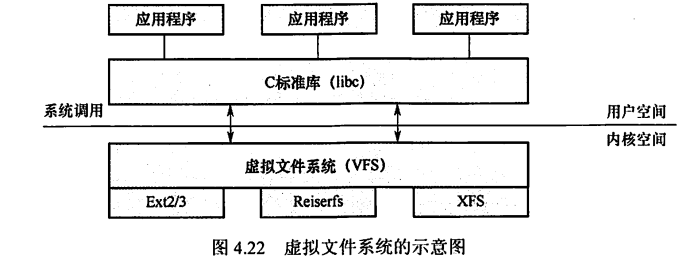

---
# 这是页面的图标
icon: page

# 这是文章的标题
title: 文件系统

# 设置作者
author: lllllan

# 设置写作时间
# time: 2020-01-20

# 一个页面只能有一个分类
category: 计算机基础

# 一个页面可以有多个标签
tag:
- 操作系统
- 王道-操作系统

# 此页面会在文章列表置顶
# sticky: true

# 此页面会出现在首页的文章板块中
star: true

# 你可以自定义页脚
# footer: 

---

::: warning 转载声明

- 《王道考研-操作系统》

:::

## 一、文件系统结构

文件系统(File system)提供高效和便捷的磁盘访问，以便允许存储、定位、提取数据。文件系统有两个不同的设计问题：

- 第一个问题是，定义文件系统的用户接口，它涉及定义文件及其属性、所允许的文件操作、如何组织文件的目录结构。
- 第二个问题是，创建算法和数据结构，以便映射逻辑文件系统到物理外存设备。

现代操作系统有多种文件系统类型，因此文件系统的层次结构也不尽相同。

### 1.1 I/O控制

包括设备驱动程序和中断处理程序，在内存和磁盘系统之间传输信息。设备驱动程序将输入的命令翻译成底层硬件的特定指令，硬件控制器利用这些指令使I/O设备与系统交互。设备驱动程序告诉I/O控制器对设备的什么位置采取什么动作。

### 1.2 基本文件系统

向对应的设备驱动程序发送通用命令，以读取和写入磁盘的物理块。每个物理块由磁盘地址标识。该层也管理内存缓冲区,并保存各种文件系统、目录和数据块的缓存。在进行磁盘块传输前，分配合适的缓冲区，并对缓冲区进行管理。管理它们对于系统性能的优化至关重要。

### 1.3 文件组织模块

组织文件及其逻辑块和物理块。文件组织模块可以将逻辑块地址转换成物理块地址，每个文件的逻辑块从0到N编号，它与数据的物理块不匹配，因此需要道过转换来定位。文件组织模块还包括空闲空间管理器，以跟踪未分配的块，根据需求提供给文件组织模块。

### 1.4 逻辑文件系统

用于管理元数据信息。元数据包括文件系统的所有结构，而不包括实际数据(或文件内容)。逻辑文件系统管理目录结构，以便根据给定文件名称为文件组织模块提供所需要的信息。它通过文件控制块来维护文件结构。逻辑文件系统还负贵文件保护。

## 二、文件系统布局

### 2.1 文件系统在磁盘中的结构

文件系统存放在磁盘上，多数磁盘划分为一个或多个分区，每个分区中有一个独立的文件系统。文件系统可能包括如下信息：启动存储在那里的操作系统的方式、总的块数、空闲块的数量和位置、目录结构以及各个具体文件等。图4.18所示为一个可能的文件系统布局。

简单描述如下：

1. 主引导记录(Master Boot Record, MBR)，位于磁盘的0号扇区，用来引导计算机，MBR后面是分区表，该表给出每个分区的起始和结束地址。表中的一个分区被标记为活动分区，当计算机启动时，BIOS读入并执行MBR。MBR做的第一件事是确定活动分区，读入它的第一块，即引导块。
2. 引导块(boot block)，MBR执行引导块中的程序后，该程序负责启动该分区中的操作系统。为统一起见，每个分区都从一个引导块开始，即使它不含有一个可启动的操作系统,也不排除以后会在该分区安装一个操作系统。Windows 系统称之为分区引导扇区。除了从引导块开始，磁盘分区的布局是随着文件系统的不同而变化的。
3. 超级块(super block)，包含文件系统的所有关键信息，在计算机启动时，或者在该文件系统首次使用时，超级块会被载入内存。超级块中的典型信息包括分区的块的数量、块的大小、空闲块的数量和指针、空闲的FCB数量和FCB指针等。
4. 文件系统中空闲块的信息，可以使用位示图或指针链接的形式给出。后面也许跟的是一组i结点，每个文件对应一个结点，i结点说明了文件的方方面面。接着可能是根目录，它存放文件系统目录树的根部。最后，磁盘的其他部分存放了其他所有的目录和文件.

### 2.2 文件系统在内存中的结构

内存中的信息用于管理文件系统并通过缓存来提高性能。这些数据在安装文件系统时被加载，在文件系统操作期间被更新，在卸载时被丢弃。这些结构的类型可能包括：

1. 内存中的安装表(mounttable)，包含每个已安装文件系统分区的有关信息。
2. 内存中的目录结构的缓存包含最近访问目录的信息。对安装分区的目录，它可以包括一个指向分区表的指针。
3. 整个系统的打开文件表，包含每个打开文件的FCB副本及其他信息。
4. 每个进程的打开文件表，包含一个指向整个系统的打开文件表中的适当条目的指针，以及其他信息。

为了创建新的文件，应用程序调用逻辑文件系统。逻辑文件系统知道目录结构的格式，它将为文件分配一个新的FCB。然后，系统将相应的目录读入内存，使用新的文件名和FCB进行更新，并将它写回磁盘。

一旦文件被创建， 它就能用于IO。不过，首先要打开文件。系统调用open()将文件名传递给逻辑文件系统。调用open()首先搜索整个系统的打开文件表，以确定这个文件是否已被其他进程使用。如果已被使用，则在单个进程的打开文件表中创建一个条目， 让其指向现有整个系统的打开文件表的相应条目。该算法在文件已打开时，能节省大量开销。如果这个文件尚未打开，则根据给定文件名来搜索目录结构。部分目录结构通常缓存在内存中，以加快目录操作。找到文件后，它的FCB会复制到整个系统的打开文件表中。该表不但存储FCB，而且跟踪打开该文件的进程的数量。然后，在单个进程的打开文件表中创建一个条目，并且通过指针将整个系统打开文件表的条目与其他域(如文件当前位置的指针和文件访问模式等)相连。调用open()返回的是--个指向单个进程的打开文件表中的适当条目的指针。以后，所有文件操作都通过该指针执行。一旦文件被打开，内核就不再使用文件名来访问文件，而使用文件描述符( Windows称之为文件句柄)。

当进程关闭一个文件时，就会删除单个进程打开文件表中的相应条目，整个系统的打开文件表的文件打开数量也会递减。当所有打开某个文件的用户都关闭该文件后，任何更新的元数据将复制到磁盘的目录结构中，并且整个系统的打开文件表的对应条目也会被删除。

## 三、外存空闲空间管理

一个存储 设备可以按整体用于文件系统，也可以细分。例如，一个磁盘可以划分为4个分区，每个分区都可以有单独的文件系统。包含文件系统的分区通常称为卷(volume)。卷可以是磁盘的一部分，也可以是整个磁盘，还可以是多个磁盘组成RAID集，如图4.19所示。

在一个卷中，存放文件数据的空间(文件区)和FCB的空间(目录区)是分离的。由于存在很多种类的文件表示和存放格式，所以现代操作系统中一般都有很多不同的文件管理模块，通过它们可以访问不同格式的卷中的文件。卷在提供文件服务前，必须由对应的文件程序进行初始化，划分好目录区和文件区，建立空闲空间管理表格及存放卷信息的超级块。

文件存储设备分成许多大小相同的物理块，并以块为单位交换信息，因此，文件存储设备的管理实质上是对空闲块的组织和管理，它包括空闲块的组织、分配与回收等问题。

### 3.1 空闲表法

空闲表法属于连续分配方式，它与内存的动态分配方式类似，为每个文件分配一块连续的存储空间。系统为外存上的所有空闲区建立一张空闲盘块表，每个空闲区对应于一个空闲表项，其中包括表项序号、该空闲区的第一个盘块号、该区的空闲盘块数等信息。再将所有空闲区按其起始盘块号递增的次序排列，如表4.1所示。

空闲盘区的分配与内存的动态分配类似，同样采用首次适应算法和最佳适应算法等。例如，在系统为某新创建的文件分配空闲盘块时，先顺序地检索空闲盘块表的各表项，直至找到第一个其大小能满足要求的空闲区，再将该盘区分配给用户，同时修改空闲盘块表。

系统在对用户所释放的存储空间进行回收时，也采取类似于内存回收的方法，即要考虑回收区是否与空闲盘块表中插入点的前区和后区相邻接，对相邻接者应予以合并。

### 3.2 空闹链表法

将所有空闲盘区拉成一条空闲链。根据构成链所用基本元素的不同，分为两种形式：

1. 空闲盘块链。将磁盘上的所有空闲空间以盘块为单位拉成一条链。当用户因创建文件而请求分配存储空间时，系统从链首开始，依次摘下适当数目的空闲盘块分配给用户。当用户因删除文件而释放存储空间时，系统将回收的盘块依次插入空闲盘块链的末尾。这种方法的优点是分配和回收一个盘块的过程非常简单，但在为一个文件分配盘块时可能要重复操作多次，效率较低。又因它是以盘块为单位的，空闲盘块链会很长。
2. 空闲盘区链。将磁盘上的所有空闲盘区(每个盘区可包含若干个盘块)拉成一条链。每个盘区除含有用于指示下一个空闲盘区的指针外，还应有能指明本盘区大小(盘块数)的信息。分配盘区的方法与内存的动态分区分配类似，通常采用首次适应算法。在回收盘区时，同样也要将回收区与相邻接的空闲盘区合并。这种方法的优缺点刚好与第一种方法的相反，即分配与回收的过程比较复杂，但效率通常较高，且空闲盘区链较短。

### 3.3 位示图法

位示图是利用二进制的一位来表示磁盘中一个盘块的使用情况，磁盘上所有的盘块都有一个二进制位与之对应。当其值为“0”时，表示对应的盘块空闲：为“1”时，表示已分配。这样，-一个mxn位组成的位示图就可用来表示mxn个盘块的使用情况，如图4.20所示。

盘块的分配：

1) 顺序扫描位示图， 从中找出一个或一组其值为 “0”的二进制位。
2) 将找到的一个或一组二进制位，转换成与之对应的盘块号。若找到的其值为“0” 的二进制位位于位示图的第i行、第j列，则其相应的盘块号应按下式计算(n 为每行位数)：$b = n(i - 1) + j$
3) 修改位示图，令map[i,j]= 1。

盘块的回收:：

1. 将回收盘块的盘块号转换成位示图中的行号和列号。转换公式为:
    i=(b- 1) DIV n+ 1
    j=(b- 1) MOD n+ 1
2. 修改位示图，令map[i,j]= 0。

空闲表法和空闲链表法都不适用于大型文件系统，因为这会使空闲表或空闲链表太大。

### 3.4 成组链接法

在UNIX系统中采用的是成组链接法，这种方法结合了空闲表和空闲链表两种方法，它具有上述两种方法的优点，克服了两种方法均有的表太长的缺点。

用来存放一组空闲盘块号(空闲盘块的块号)的盘块称为成组链块。成组链接法的大致思想是：把顺序的n个空闲盘块号保存在第一个成组链块中，其最后一个空闲盘块(作为成组链块)则用于保存另一组空闲盘块号，如此继续，直至所有空闲盘块均予以链接。系统只需保存指向第一个成组链块的指针。假设磁盘最初全为空闲盘块，

盘块的分配：

根据第一个成组链块的指针，将其对应的盘块分配给用户，然后将指针下移一格。若该指针指向的是最后一个盘块(即成组链块)，由于该盘块记录的是下一组空闲盘块号，因此要将该盘块读入内存，并将指针指向新的成组链块的第一条记录， 然后执行上述分配操作。

盘块的回收：

成组链块的指针上移一格， 再记入回收盘块号。当成组链块的链接数达到n时，表示已满，便将现有已记录n个空闲盘块号的成组链块号记入新回收的盘块(作为新的成组链块)。

表示空闲空间的位向量表或第一个成组链块，以及卷中的目录区、文件区划分信息都要存放在磁盘中，一般放在卷头位置，在UNIX系统中称为超级块。在对卷中的文件进行操作前，超级块需要预先读入系统空闲的主存，并且经常保持主存超级块与磁盘卷中超级块的一致性。

## 四、虚拟文件系统.

虚拟文件系统(VFS) 为用户程序提供了文件系统操作的统一接口，屏蔽了不同文件系统的差异和操作细节，如图4.1所示。用户程序可以通过VFS提供的统一调用函数 (如open()等)来操作不同文件系统(如ext3等)的文件，而无须考虑具体的文件系统和实际的存储介质。

虚拟文件系统采用了面向对象的思想，它抽象出一个通用的文件系统模型，定义了通用文件系统都支持的接口。新的文件系统只要支持并实现这些接口，即可安装和使用。以Linux中调用write()操作为例，它在VFS中通过sys_ write()函 数处理，sys_ write()找到具体文件系统，将控制权交给该文件系统，最后由具体文件系统与物理介质交互并读出数据，如图4.23所示。

为了实现VFS，Linux主要抽象了四种对象类型。每个VFS对象都存放在一个适当的数据结构中，其中包括对象的属性和指向对象方法(函数)表的指针。

- 超级块对象：表示一个已安装(或称挂载)的特定文件系统。
- 索引结点对象：表示一个特定的文件。
- 目录项对象：表示一个特定的目录项。
- 文件对象：表示一个与进程相关的已打开文件。

Linux将目录当作文件对象来处理，文件操作能同时应用于文件或目录。文件系统是由层次.目录组成的，一个目录项可能包含文件名和其他目录名。目录项作为单独抽象的对象，是因为目录可以层层嵌套，以便于形成文件路径，而路径中的每-部分其实就是目录项。

1. 超级块对象。超级块对象对应于磁盘上特定扇区的文件系统超级块，用于存储已安装文件系统的元信息，元信息中包含文件系统的基本属性信息，如文件系统类型、文件系统基本块的大小、文件系统所挂载的设备、操作方法(函数)指针等。其中操作方法(函数)指针指向该超级块的操作方法表，包含一系列可在超级块对象上调用的操作函数，主要有分配inode、销毁inode、读inode、写inode、文件同步等。
2. 索引结点对象。文件系统处理文件所需要的所有信息，都放在一个称为索引结点的数据结构中，索引结点对文件是唯一的。 只有当文件被访问时，才在内存中创建索引结点对象，每个索引结点对象都会复制磁盘索引结点包含的一些数据。该对象中有一个状态字段表示是否被修改，其值为“脏”时，说明对应的磁盘索引结点必须被更新。索引结点对象还提供许多操作接口，如创建新索引结点、创建硬链接、创建新目录等。
3. 目录项对象。由于VFS经常执行切换到某个目录这种操作，为了提高效率，便引入了目录项的概念。目录项对象是一个路径的组成部分，它要么是目录名，要么是文件名。例如，在查找路径名/test时，内核为根目录“/”创建一个目录项对象，为根目录下的test创建一个第二级目录项对象。目录项对象包含指向关联索引结点的指针，还包含指向父目录和指向子目录的指针。不同于前面两个对象，目录项对象在磁盘上没有对应的数据结构，而是VFS在遍历路径的过程中，将它们逐个解析成目录项对象的。
4. 文件对象。文件对象代表进程打开的一个文件。可以通过open()调用打开一个文件，通过close()调用关闭一个文件。文件对象和物理文件的关系类似于进程和程序的关系。由于多个进程可以打开和操作同一文件，所以同一文件在内存中可能存在多个对应的文件对象，但对应的索引结点和目录项是唯一的。文件对象仅在进程观点上代表已经打开的文件，它反过来指向其索引结点。文件对象包含与该文件相关联的目录项对象，包含该文件的文件系统、文件指针等，还包含在该文件对象上调用的一系列操作函数。

图4.24所示是一个进程与文件进行交互的简单实例。三个不同的进程已打开了同一个文件，其中两个进程使用同一个硬链接。在这种情况下，每个进程都使用自己的文件对象，但只需要两个目录项对象，每个硬链接对应一个目录项对象。这两个目录项对象指向同一个索引结点对象，这个索引结点对象标识的是超级块对象及随后的普通磁盘文件。

VFS还有另一个重要作用，即提高系统性能。最近最常使用的目录项对象被放在目录项高速缓存的磁盘缓存中，以加速从文件路径名到最后一个路径分量的索引结点的转换过程。

对用户来说，不需要关心不同文件系统的具体实现细节，只需要对一个虚拟的文件操作界面进行操作。VFS对每个文件系统的所有细节进行抽象，使得不同的文件系统在系统中运行的其他进程看来都是相同的。严格来说，VFS并不是一种实际的文件系统，它只存在于内存中，不存在于任何外存空间中。VFS 在系统启动时建立，在系统关闭时消亡。

## 五、分区和安装

一个磁盘可以划分为多个分区，每个分区都可以用于创建单独的文件系统，每个分区还可以包含不同的操作系统。分区可以是原始的，没有文件系统，当没有合适的文件系统时，可以使用原始磁盘。例如，UNIX 交换空间可以使用原始磁盘格式，而不使用文件系统。

第1章中介绍过操作系统的引导。Linux启动后，首先载入MBR,随后MBR识别活动分区，并且加载活动分区中的引导程序。图4.25中显示了一个典型的Linux分区。

分区的第一部分是引导块，里面存储着引导信息，它有自身的格式，因为在引导时系统并未加载文件系统代码，因此不能解释文件系统的格式。引导信息是一系列可 以加载到内存中的连续块，加载到内存后从其第-条代码开始执行，引导程序便启动一个具体的操作系统。引导块之后是超级块，它存储文件系统的有关信息，包括文件系统的类型、i结点的数目、数据块的数目。随后是多个索引结点，它们是实现文件存储的关键，每个文件对应-一个索引结点， 索引结点中包含多个指针，指向属于该文件的各个数据块。最后是文件数据块。

如文件在使用前必须打开一样，文件系统在进程使用前必须先安装，也称挂载。

Windows系统维护一个扩展的两级目录结构，用驱动器字母表示设备和卷。卷具有常规树结构的目录，与驱动器号相关联，还含有指向已安装文件系统的指针。特定文件的路径形式为driver-lttre:pathtofile，操作系统找到相应文件系统的指针，并且遍历该设备的目录结构，以查找指定的文件。新版本的Windows允许文件系统安装在目录树下的任意位置，就像UNIX-样。 在启动时，Windows 操作系统自动发现所有设备，并且安装所有找到的文件系统。

UNIX使用系统的根文件系统，由内核在引导阶段直接安装，其他文件系统要么由初始化脚本安装，要么由用户安装在已安装文件系统的目录下。作为一个目录树，每个文件系统都拥有自己的根目录。安装文件系统的这个目录称为安装点，安装就是将磁盘分区挂载到该安装点下，进入该目录就可以读取该分区的数据。已安装文件系统属于安装点目录的一个子文件系统。安装的实现是在目录inode 的内存副本上加上一个标志，表示该目录是安装点。还有一个域指向安装表的条目，表示哪个设备安装在哪里，这个条目还包括该设备的文件系统超级块的一个指针。

假定将存放在/dev/fd0软盘上的ext2 文件系统通过mount命令安装到/fhp:mount -t ext2 /dev/fd0 /flp

如需卸载该文件系统，可以使用umount命令。

我们可以这么理解：UNIX本身是一个固定的目录树，只要安装就有，但是如果不给它分配存储空间，就不能对它进行操作，所以首先要给根目录分配空间，这样才能操作这个目录树。

