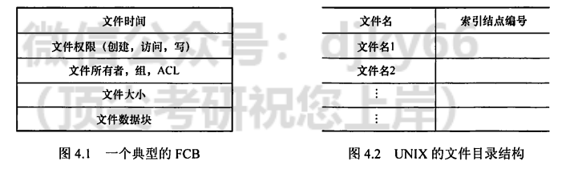
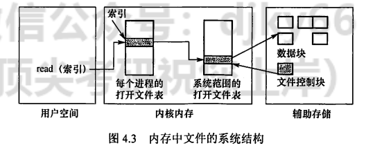
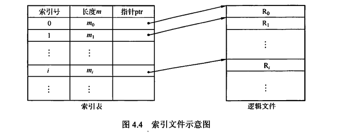
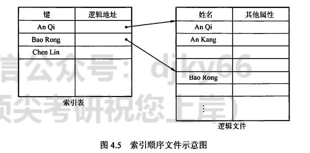
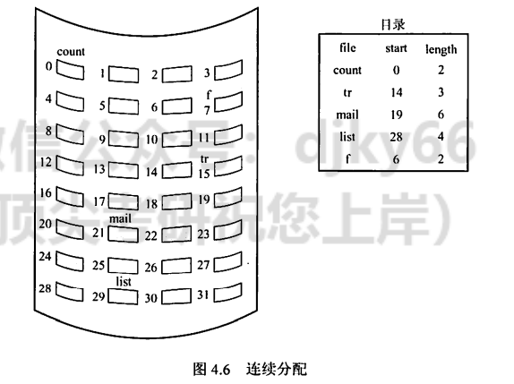
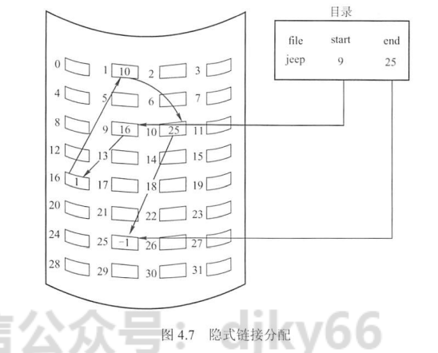
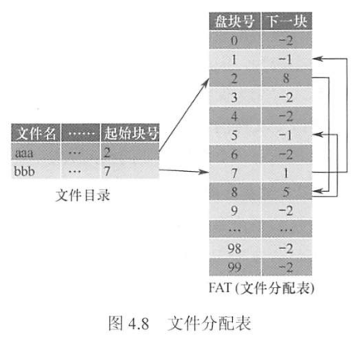
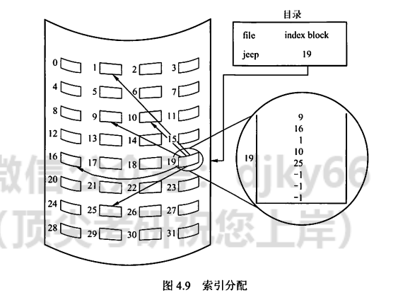
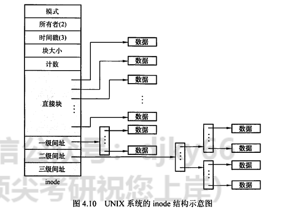

---
# 这是页面的图标
icon: page

# 这是文章的标题
title: 文件管理

# 设置作者
author: lllllan

# 设置写作时间
# time: 2020-01-20

# 一个页面只能有一个分类
category: 计算机基础

# 一个页面可以有多个标签
tag:
- 操作系统
- 王道-操作系统

# 此页面会在文章列表置顶
# sticky: true

# 此页面会出现在首页的文章板块中
star: true

# 你可以自定义页脚
# footer: 
---

::: warning 转载声明

- 《王道考研-操作系统》

:::

## 一、文件的基本概念

文件(File) 是以硬盘为载体的存储在计算机上的信息集合，文件可以是文本文档、图片、程序等。在系统运行时，计算机以进程为基本单位进行资源的调度和分配;而在用户进行的输入、输出中，则以文件为基本单位。大多数应用程序的输入都是通过文件来实现的，其输出也都保存在文件中，以便信息的长期存储及将来的访问。当用户将文件用于程序的输入、输出时，还希望首先，文件中肯定包括- -块存 储空间，更准确地说，是存储空间中的数据;其次，由于操作系统要管理成千.上万的数据，因此必定需要对这些数据进行划分，然后贴上“标签”，以便于分类和索引，所以文件必定包含分类和索引的信息;最后，不同的用户拥有对数据的不同访问权限，因此文件中-定包含- -些关 于访问权限的信息。

再举-一个直观的例子“图书馆管理图书”来类比文件。可以认为，计算机中的一个文件相当于图书馆中的一本书，操作系统管理文件，相当于图书管理员管理图书馆中的书。

首先，一-本书的主体- -定是书中的内容， 相当于文件中的数据:其次，不同类别的书需要放在不同的书库，然后加上编号，再把编号登记在图书管理系统中，方便读者查阅，相当于文件的分类和查找:最后，有些已经绝版或价格比较高的外文书籍，只能借给VIP会员或权限比较高的其他读者，而有些普通的书籍可供任何人借阅，这就是文件中的访问权限。所举例子与实际操作系统中的情形并不等价。但对于某些关键的属性，图书馆管理图书和操作系统管理文件的思想却有相一致的地方，因此通过这种类比可使初学者快速认识陌生的概念。

从用户的角度看，文件系统是操作系统的重要部分之一。用户关心的是如何命名、分类和查找文件，如何保证文件数据的安全性及对文件可以进行哪些操作等。而对于其中的细节，如文件如何存储在辅存上、如何管理文件辅存区域等方面关心甚少。

文件系统提供了与二级存储相关的资源的抽象，让用户能在不了解文件的各种属性、文件存储介质的特征及文件在存储介质上的具体位置等情况下，方便快捷地使用文件。用户通过文件系统建立文件，提供应用程序的输入、输出，对资源进行管理。

首先了解文件的结构，我们通过自底向.上的方式来定义。

1. 数据项。是文件系统中最低级的数据组织形式，可分为以下两种类型：
    - 基本数据项。用于描述一一个对象的某种属性的- -个值，是数据中的最小逻辑单位。
    - 组合数据项。由多个基本数据项组成。
2. 记录。是一组相关的数据项的集合，用于描述一个对象在某方面的属性。
3. 文件。是指由创建者所定义的、具有文件名的一组相关元素的集合，可分为有结构文件和无结构文件两种。在有结构的文件中，文件由若干个相似的记录组成，如一个班的学生记录:而无结构文件则被视为-一个字符流，比如一一个二进制文件或字符文件。

虽然上面给出了结构化的表述，但实际上关于文件并无严格的定义。在操作系统中，通常将程序和数据组织成文件。文件可以是数字、字符或二进制代码，基本访问单元可以是字节或记录。文件可以长期存储在硬盘中，允许可控制的进程间共享访问，能够被组织成复杂的结构。

## 二、文件控制块和索引结 点

与进程管理一样，为便于文件管理，在操作系统中引入了文件控制块的数据结构。

### 2.1 文件的属性

除了文件数据，操作系统还会保存与文件相关的信息，如所有者、创建时间等，这些附加信息称为文件属性或文件元数据。文件属性在不同系统中差别很大，但通常都包括如下属性。

1. 名称。文件名称唯一，以容易读取的形式保存。
2. 类型。被支持不同类型的文件系统所使用。
3. 创建者。文件创建者的ID。
4. 所有者。文件当前所有者的ID.
5. 位置。指向设备和设备.上文件的指针。
6. 大小。文件当前大小(用字节、字或块表示)，也可包含文件允许的最大值。
7. 保护。对文件进行保护的访问控制信息。
8. 创建时间、最后一次修改时间和最后一次存取时间。文件创建、上次修改和上次访问的相关信息，用于保护和跟踪文件的使用。

操作系统通过文件控制块(FCB) 来维护文件元数据。

### 2.2 文件控制块

文件控制块(FCB)是用来存放控制文件需要的各种信息的数据结构，以实现“按名存取”。FCB的有序集合称为文件目录，一个FCB就是一个文件目录项。图4.1是一个典型的FCB。为了创建一个新文件，系统将分配一个FCB并存放在文件目录中，称为目录项。

FCB主要包含以下信息：

- 基本信息，如文件名、文件的物理位置、文件的逻辑结构、文件的物理结构等。
- 存取控制信息，包括文件主的存取权限、核准用户的存取权限以及一般用户的存取权限。
- 使用信息，如文件建立时间、上次修改时间等。

一个文件目录也被视为一个文件，称为目录文件。

### 2.3 索引结点

文件目录通常存放在磁盘上，当文件很多时，文件目录会占用大量的盘块。在查找目录的过程中，要先将存放目录文件的第一个盘块中的目录调入内存，然后用给定的文件名逐- -比较，若未找到指定文件，就还需要不断地将下一盘块中的目录项调入内存，逐一比较。我们发现，在检索目录的过程中，只用到了文件名，仅当找到一个目录项(其中的文件名与要查找的文件名匹配)时，才需从该目录项中读出该文件的物理地址。也就是说，在检索目录时，文件的其他描述信息不会用到，也不需要调入内存。因此，有的系统(如UNIX，图4.2)便采用了文件名和文件描述信息分开的方法，使文件描述信息单独形成-一个称为索引结点的数据结构，简称i结点(inode)。在文件目录中的每个目录项仅由文件名和指向该文件所对应的i结点的指针构成。

假设一个FCB为64B,盘块大小是1KB,则每个盘块中可以存放16个FCB (FCB必须连续存放)，若一个文件目录共有640个FCB，则查找文件平均需要启动磁盘20次。而在UNIX系统中，一个目录项仅占16B，其中14B是文件名，2B是i结点指针。在1KB的盘块中可存放64个目录项。这样，可使查找文件的平均启动磁盘次数减少到原来的1/4，大大节省了系统开销。

---

**磁盘索引结点**

它是指存放在磁盘上的索引结点。每个文件有- -个唯-的磁盘索引结点,主要包括以下内容：

- 文件主标识符，拥有该文件的个人或小组的标识符。
- 文件类型，包括普通文件、目录文件或特别文件。
- 文件存取权限，各类用户对该文件的存取权限。
- 文件物理地址，每个索引结点中含有13个地址项，即iaddr(0)~iaddr(12), 它们以直接或间接方式给出数据文件所在盘块的编号。
- 文件长度，指以字节为单位的文件长度。
- 文件链接计数，在本文件系统中所有指向该文件的文件名的指针计数。
- 文件存取时间，本文件最近被进程存取的时间、最近被修改的时间及索引结点最近被修改的时间。

---

**内存索引结点**

它是指存放在内存中的索引结点。当文件被打开时，要将磁盘索引结点复制到内存的索引结点中，便于以后使用。在内存索引结点中增加了以下内容：

- 索引结点编号，用于标识内存索引结点。
- 状态，指示i结点是否上锁或被修改。访问计数，每当有一-进程要访问此i结点时，计数加1;访问结束减1。
- 逻辑设备号，文件所属文件系统的逻辑设备号。
- 链接指针，设置分别指向空闲链表和散列队列的指针。

FCB或索引结点相当于图书馆中图书的索书号，我们可以在图书馆网站上找到图书的索书号，然后根据索书号找到想要的书本。

## 三、文件的操作

### 3.1 文件的基本操作

文件属于抽象数据类型。为了正确地定义文件，需要考虑可以对文件执行的操作。操作系统提供系统调用，它对文件进行创建、写、读、重定位、删除和截断等操作。

1. 创建文件。创建文件有两个必要步骤:一是为新文件分配必要的外存空间;二是在目录中为之创建-一个目录项，目录项记录了新文件名、在外存中的地址及其他可能的信息。
2. 写文件。为了写文件，执行- -个系统调用。对于给定文件名，搜索目录以查找文件位置。系统必须为该文件维护-一个写位置的指针。每当发生写操作时，便更新写指针。
3. 读文件。为了读文件，执行一个系统调用。同样需要搜索目录以找到相关目录项，系统维护一个读位置的指针。每当发生读操作时，更新读指针。一个进程通常只对一个文件读或写，因此当前操作位置可作为每个进程当前文件位置的指针。由于读和写操作都使用同一指针，因此节省了空间，也降低了系统复杂度。
4. 重新定位文件，也称文件定位。搜索目录以找到适当的条目，并将当前文件位置指针重新定位到给定值。重新定位文件不涉及读、写文件。
5. 删除文件。为了删除文件，先从目录中检索指定文件名的目录项，然后释放该文件所占.的存储空间，以便可被其他文件重复使用，并删除目录条目。
6. 截断文件。允许文件所有属性不变，并删除文件内容，将其长度置为0并释放其空间。

这6个基本操作可以组合起来执行其他文件操作。例如，- -个文件的复制，可以创建新文件、从旧文件读出并写入新文件。

### 3.2 文件的打开与关闭

当用户对一一个文件实施操作时，每次都要从检索目录开始。为了避免多次重复地检索目录,大多数操作系统要求，在文件使用之前通过系统调用open被显式地打开。操作系统维护-一个包含所有打开文件信息的表(打开文件表)。所谓“打开”，是指调用open根据文件名搜索目录,将指.明文件的属性(包括该文件在外存上的物理位置),从外存复制到内存打开文件表的一个表目中，并将该表目的编号(也称索引)返回给用户。当用户再次向系统发出文件操作请求时，可通过索引在打开文件表中查到文件信息，从而节省再次搜索目录的开销。当文件不再使用时，可利用系统调用close关闭它，操作系统将会从打开文件表中删除这一条目。

在多个不同进程可以同时打开文件的操作系统中，通常采用两级表:每个进程表和整个系统表。每个进程表根据它打开的所有文件，表中存储的是进程对文件的使用信息。系统打开文件表包含文件相关信息，如文件在磁盘的位置、访问日期和大小。-旦有进程打开了一个文件，系统表就包含该文件的条目。当另一个进程执行调用open时，只不过是在其进程打开表中增加一一个条目,并指向系统表的相应条目。通常，系统打开文件表为每个文件关联-一个打开计数器(OpenCount),以记录多少进程打开了该文件。每个关闭操作close 使count递减，当打开计数器为0时，表示该文件不再被使用，并且可从系统打开文件表中删除相应条目。图4.3展示了这种结构。

文件名不必是打开文件表的- -部分，因为一旦完成对FCB在磁盘上的定位，系统就不再使用文件名。对于访问打开文件表的索引, UNIX称之为文件描述符,而Windows称之为文件句柄。因此，只要文件未被关闭，所有文件操作就通过打开文件表来进行。

每个打开文件都具有如下关联信息：

- 文件指针。系统跟踪上次的读写位置作为当前文件位置的指针，这种指针对打开文件的某个进程来说是唯一的， 因此必须与磁盘文件属性分开保存。
- 文件打开计数。计数器跟踪当前文件打开和关闭的数量。因为多个进程可能打开同一个文件，所以系统在删除打开文件条目之前，必须等待最后-一个进程关闭文件。
- 文件磁盘位置。大多数文件操作要求系统修改文件数据。查找磁盘上的文件所需的信息保存在内存中，以便系统不必为每个操作都从磁盘上读取该信息。
- 访问权限。每个进程打开文件都需要有-一个访问模式(创建、只读、读写、添加等)。该信息保存在进程的打开文件表中，以便操作系统能够允许或拒绝后续的I/O请求。

## 四、文件保护

为了防止文件共享可能会导致文件被破坏或未经核准的用户修改文件，文件系统必须控制用户对文件的存取，即解决对文件的读、写、执行的许可问题。为此，必须在文件系统中建立相应的文件保护机制。文件保护通过口令保护、加密保护和访问控制等方式实现。其中，口令和加密是为了防止用户文件被他人存取或窃取，而访问控制则用于控制用户对文件的访问方式。

### 4.1 访问类型

对文件的保护可从限制对文件的访问类型中出发。可加以控制的访问类型主要有以下几种。

- 读。从文件中读。
- 写。向文件中写。
- 执行。将文件装入内存并执行。
- 添加。将新信息添加到文件结尾部分。
- 删除。删除文件，释放空间。
- 列表清单。列出文件名和文件属性。

此外还可以对文件的重命名、复制、编辑等加以控制。这些高层的功能可以通过系统程序调用低层系统调用来实现。保护可以只在低层提供。例如，复制文件可利用一系列的读请求来完成，这样，具有读访问权限的用户同时也就具有了复制和打印权限。

### 4.2 访问控制

解决访问控制最常用的方法是根据用户身份进行控制。而实现基于身份访问的最为普通的方法是，为每个文件和目录增加一个访问控制列表( Acess-Control List, ACL)， 以规定每个用户名及其所允许的访问类型。这种方法的优点是可以使用复杂的访问方法，缺点是长度无法预计并且可能导致复杂的空间管理，使用精简的访问列表可以解决这个问题。

精简的访问列表采用拥有者、组和其他三种用户类型。

1. 拥有者。创建文件的用户。
2. 组。一组需要共享文件且具有类似访问的用户。
3. 其他。系统内的所有其他用户。

这样，只需用三个域即可列出访问表中这三类用户的访问权限。文件拥有者在创建文件时，说明创建者用户名及所在的组名，系统在创建文件时也将文件主的名字、所属组名列在该文件的FCB中。用户访问该文件时，按照拥有者所拥有的权限访问文件，若用户和拥有者在同一个用户组，则按照同组权限访问，否则只能按其他用户权限访问。UNIX操作系统即采用此种方法。

口令和密码是另外两种访问控制方法。

口令指用户在建立-一个文件时提供一一个口令，系统为其建立FCB时附上相应口令，同时告诉允许共享该文件的其他用户。用户请求访问时必须提供相应的口令。这种方法时间和空间的开销不多，缺点是口令直接存在系统内部，不够安全。

密码指用户对文件进行加密，文件被访问时需要使用密钥。这种方法保密性强，节省了存储空间，不过编码和译码要花费-定 的时间。

口令和密码都是防止用户文件被他人存取或窃取，并没有控制用户对文件的访问类型。

注意两个问题：

1. 现代操作系统常用的文件保护方法是，将访问控制列表与用户、组和其他成员访问控制方案- -起组合使用。
2. 对于多级目录结构而言，不仅需要保护单个文件，而且需要保护子目录内的文件，即需要提供目录保护机制。目录操作与文件操作并不相同，因此需要不同的保护机制。

## 五、文件的逻辑结构

文件的逻辑结构是从用户观点出发看到的文件的组织形式。文件的物理结构(又称文件的存储结构，见下一节)是从实现观点出发看到的文件在外存上的存储组织形式。文件的逻辑结构与存储介质特性无关，它实际上是指在文件的内部，数据逻辑上是如何组织起来的。

按逻辑结构，文件可划分为无结构文件和有结构文件两大类。

### 5.1 无结构文件(流式文件)

无结构文件是最简单的文件组织形式。无结构文件将数据按顺序组织成记录并积累、保存，它是有序相关信息项的集合，以字节(Byte) 为单位。由于无结构文件没有结构，因而对记录的访问只能通过穷举搜索的方式，因此这种文件形式对大多数应用不适用。但字符流的无结构文件管理简单，用户可以方便地对其进行操作。所以，那些对基本信息单位操作不多的文件较适于采用字符流的无结构方式，如源程序文件、目标代码文件等。

### 5.2 有结构文件(记录式文件)

有结构文件按记录的组织形式可以分为如下几种：

**顺序文件**

文件中的记录-一个接-一个地顺序排列，记录通常是定长的，可以顺序存储或以链表形式存储。顺序文件有以下两种结构:第- -种是串结构，记录之间的顺序与关键字无关，通常是按存入时间的先后进行排列，对串结构文件进行检索必须从头开始顺序依次查找，比较费时。第二种是顺序结构，指文件中的所有记录按关键字顺序排列，可采用折半查找法，提高了检索效率。

在对记录进行批量操作，即每次要读或写一大批记录时，顺序文件的效率是所有逻辑文件中最高的。此外，对于顺序存储设备(如磁带)，也只有顺序文件才能被存储并能有效地工作。在经常需要查找、修改、增加或删除单个记录的场合，顺序文件的性能也比较差。

---

**索引文件**

对于定长记录文件，要查找第i条记录，可直接根据下式计算得到第i条记录相对于第1条记录的地址: A;= ixL。然而，对于可变长记录的文件，要查找第i条记录，必须顺序地查找前i-1条记录，从而获得相应记录的长度L,进而按下式计算出第i条记录的首址:

注意:假定每条记录前用一个字节指明该记录的长度。

变长记录文件只能顺序查找，效率较低。为此，可以建立- -张索引表，为主文件的每个记录在索引表中分别设置一一个表项，包含指向变长记录的指针(即逻辑起始地址)和记录长度，索引表按关键字排序，因此其本身也是一-个定长记录的顺序文件。这样就把对变长记录顺序文件的检索转变为对定长记录索引文件的随机检索，从而加快了记录的检索速度。图4.4所示为索引文件示意图。

---

**索引顺序文件**

索引顺序文件是顺序文件和索引文件的结合。最简单的索引顺序文件只使用了一级索引。索引顺序文件将顺序文件中的所有记录分为若干组，为顺序文件建立-张索引表，在索引表中为每组中的第一条记录建 立-一个索引项，其中含有该记录的关键字值和指向该记录的指针。

如图4.5所示，主文件名包含姓名和其他数据项。姓名为关键字，索引表中为每组的第一条记录(不是每条记录)的关键字值，用指针指向主文件中该记录的起始位置。索引表只包含关键字和指针两个数据项，所有姓名关键字递增排列。主文件中记录分组排列，同一个组中的关键字可以无序，但组与组之间的关键字必须有序。查找- - 条记录时，首先通过索引表找到其所在的组，然后在该组中使用顺序查找，就能很快地找到记录。

对于含有N条记录的顺序文件，查找某关键字的记录时，平均需要查找N/2次。在索引顺序文件中，假设N条记录分为√N组，索引表中有√N个表项，每组有VN条记录，在查找某关键字的记录时，先顺序查找索引表，需要查找N12次，然后在主文件中对应的组中顺序查找，也需要查找√N12次，因此共需查找√N12+√N12=JN次。显然,索引顺序文件提高了查找效率，若记录数很多，则可采用两级或多级索引。这种方式就是数据结构中的分块查找。

索引文件和索引顺序文件都提高了存取的速度，但因为配置索引表而增加了存储空间。

---

**直接文件或散列文件(Hash File)**

给定记录的键值或通过散列函数转换的键值直接决定记录的物理地址。这种映射结构不同于顺序文件或索引文件，没有顺序的特性。

散列文件有很高的存取速度，但是会引起冲突，即不同关键字的散列函数值相同。

复习了数据结构的读者读到这里时，会有这样的感觉:有结构文件逻辑.上的组织，是为在文件中查找数据服务的(顺序查找、索引查找、索引顺序查找、哈希查找)。

前面介绍了文件内部的逻辑结构，下 面介绍多个文件之间在逻辑上是如何组织的，这实际上是文件“外部”的逻辑结构的问题。

## 六、文件的物理结构

前面说过，文件实际上是一种抽象数据类型，我们要研究它的逻辑结构、物理结构，以及关于它的一- 系列操作。文件的物理结构就是研究文件的实现，即文件数据在物理存储设备上是如何分布和组织的。同一个问题有两个方面的回答:一是文件的分配方式，讲的是对磁盘非空闲块的管理;二是文件存储空间管理，讲的是对磁盘空闲块的管理(详见4.3节)。

文件分配对应于文件的物理结构，是指如何为文件分配磁盘块。常用的磁盘空间分配方法有三种:连续分配、链接分配和索引分配。有的系统(如RDOS操作系统)对三种方法都支持，但更普遍的是一个系统只支持- -种方法。对于本节的内容，读者要注意与文件的逻辑结构区分，从历年的经验来看，这是很多读者容易搞混的地方(读者复习完数据结构后，应该了解线性表、顺序表和链表之间的关系，类比到这里就不易混淆)。

### 6.1 连续分配

连续分配方法要求每个文件在磁盘.上占有一组连续的块，如图4.6所示。磁盘地址定义了磁盘上的一个线性排序，这种排序使作业访问磁盘时需要的寻道数和寻道时间最小。

采用连续分配时，逻辑文件中的记录顺序也存储在相邻接的块中。-一个文件的目录项中“文件物理地址”字段应包括第一块的地址和该文件所分配区域的长度，若文件长n块并从位置b开始，则该文件将占有块b,b+ 1,b+2,, b+n-1。

连续分配支持顺序访问和直接访问。

优点是实现简单、存取速度快。

缺点是：

1. 文件长度不宜动态增加，因为一个文件末尾后的盘块可能已分配给其他文件，一-旦需要增加，就需要大0量移.动盘块。
2. 为保持文件的有序性，删除和插入记录时，需要对相邻的记录做物理上的移动，还会动态改变文件的长度。
3. 反复增删文件后会产生外部碎片(与内存管理分配方式中的碎片相似)。
4. 很难确定一个文件需要的空间大小，因而只适用于长度固定的文件。

### 6.2 链接分配

链接分配是一种采用离散分配的方式。它消除了磁盘的外部碎片，提高了磁盘的利用率。可以动态地为文件分配盘块，因此无须事先知道文件的大小。此外，对文件的插入、删除和修改也非常方便。链接分配又可分为隐式链接和显式链接两种形式。

**隐式链接**

隐式链接方式如图4.7所示。目录项中含有文件第-块的指针和最后- -块的指针。每个文件对应一个磁盘块的链表;磁盘块分布在磁盘的任何地方，除最后-一个盘块外，每个盘块都含有指向文件下一个盘块的指针，这些指针对用户是透明的。

隐式链接的缺点是只适合顺序访问，若要访问文件的第i个盘块，则只能从第1个盘块开始通过盘块指针顺序查找到第i块，随机访问效率很低。隐式链接的稳定性也是一一个问题，系统在运行过程中由于软件或硬件错误导致链表中的指针丢失或损坏，会导致文件数据的丢失。

通常的解决方案是，将几个盘块组成簇(cluster), 按簇而不按块来分配，可以成倍地减少查找时间。比如一-簇为4块，这样，指针所占的磁盘空间比例也要小得多。这种方法的代价是增加了内部碎片。簇可以改善许多算法的磁盘访问时间，因此应用于大多数操作系统。

---

**显式链接**

显式链接是指把用于链接文件各物理块的指针，从每个物理块的末尾中提取出来，显式地存放在内存的一张链接表中。该表在整个磁盘中仅设置一-张，称为文件分配表( File Allocation Table,FAT)。每个表项中存放链接指针，即下一一个盘块号。文件的第一- 个盘块号记录在目录项“物理地址”字段中，后续的盘块可通过查FAT找到。例如，某磁盘共有100个磁盘块，存放了两个文件：

文件. aaa”占三个盘块，依次是2→8→5;文件“bbb”占两个盘块，依次是7→1。其余盘块都是空闲盘块，则该磁盘的FAT表如图4.8所示。不难看出，文件分配表FAT的表项与全部磁盘块一一对应，并且可以用一个特殊的数字-1表示文件的最后一块，可以用-2表示这个磁盘块是空闲的(当然也可指定为-3,-4)。因此，FAT不仅记录了文件各块之间的先后链接关系，同时还标记了空闲的磁盘块，操作系统也可以通过FAT对文件存储空间进行管理。
当某进程请求操作系统分配- -个磁盘块时，操作系统只需从FAT中找到-2的表项，并将对应的磁盘块分配给进程即可。

FAT表在系统启动时就会被读入内存，因此查找记录的过程是在内存中进行的，因而不仅显
著地提高了检索速度，而且明显减少了访问磁盘的次数。

FAT表在系统启动时就会被读入内存，因此查找记录的过程是在内存中进行的，因而不仅显著地提高了检索速度，而且明显减少了访问磁盘的次数。

### 6.3 索引分配

链接分配解决了连续分配的外部碎片和文件大小管理的问题。但依然存在问题：

1. 链接分配不能有效支持直接访问(FAT除外)
2. FAT需要占用较大的内存空间。

事实上，在打开某个文件时，只需将该文件对应盘块的编号调入内存即可,完全没有必要将整个FAT调入内存。为此，索引分配将每个文件所有的盘块号都集中放在-起构成索引块(表),如图4.9所示。

每个文件都有其索引块，这是一个磁盘块地址的数组。索引块的第i 个条目指向文件的第i 个块。要读第i块，通过索引块的第i个条目的指针来查找和读入所需的块。

索引分配的优点是支持直接访问，且没有外部碎片问题。缺点是由于索引块的分配，增加了系统存储空间的开销。索引块的大小是-一个重要的问题，每个文件必须有一个索引块，因此索引块应尽可能小，但索引块太小就无法支持大文件。可以采用以下机制来处理这个问题。

- 链接方案。一个索引块通常为一个磁盘块，因此它本身能直接读写。为了支持大文件，可以将多个索引块链接起来。
- 多层索引。通过第- -级索引块指向- -组第二级的索引块,第二级索引块再指向文件块。查找时，通过第一-级索引查找第二级索引，再采用这个第二级索引查找所需数据块。这种方法根据最大文件大小，可以继续到第三级或第四级。例如，4096B 的块，能在索引块中存入1024个4B的指针。两级索引支持1048576个数据块，即支持最大文件为4GB。
- 混合索引。将多种索引分配方式相结合的分配方式。例如，系统既采用直接地址，又采用单级索引分配方式或两级索引分配方式。该内容为高频考点，下面用一节专门介绍。

此外，访问文件需两次访问外存，先读取索引块的内容，然后访问具体的磁盘块，因而降低了文件的存取速度。为了解决这一问题，通常将文件的索引块读入内存，以提高访问速度。

### 6.4 混合索引分配

为了能够较全面地照顾到小型、中型、大型和特大型文件，可采用混合索引分配方式。对于小文件，为了提高对众多小文件的访问速度，最好能将它们的每个盘块地址直接放入FCB,这样就可以直接从FCB中获得该文件的盘块地址，即为直接寻址。对于中型文件，可以采用单级索引方式，需要先从FCB中找到该文件的索引表，从中获得该文件的盘块地址，即为一次间址。对于大型或特大型文件，可以采用两级和三级索引分配方式。UNIX系统采用的就是这种分配方式，在其索引结点中，共设有13个地址项，即i.addr(0)~i.addr(12)，如图4.10所示。

1. 直接地址。为了提高对文件的检索速度，在索引结点中可设置10个直接地址项，即用i.addr(0)~iaddr(9)来存放直接地址，即文件数据盘块的盘块号。假如每个盘块的大小为4KB，当文件不大于40KB时，便可直接从索引结点中读出该文件的全部盘块号。
2. 一次间接地址。对于中、大型文件，只采用直接地址并不现实的。为此，可再利用索引结点中的地址项i.addr( 10)来提供-次间接地址。这种方式的实质就是一-级索引分配方式。图中的一次间址块也就是索引块，系统将分配给文件的多个盘块号记入其中。在-次间址块中可存放1024个盘块号，因而允许文件长达4MB.
3. 多次间接地址。当文件长度大于4MB + 40KB (一次间接地址与10个直接地址项)时，系统还需采用二次间接地址分配方式。这时，用地址项i.addr(1 1)提供二次间接地址。该方式的实质是两级索引分配方式。系统此时在二次间址块中记入所有一次间址块的盘号。地址项i.addr(11)作为二次间址块，允许文件最大长度可达4GB。同理，地址项iaddr(12)作为三次间址块，其允许的文件最大长度可达4TB.
