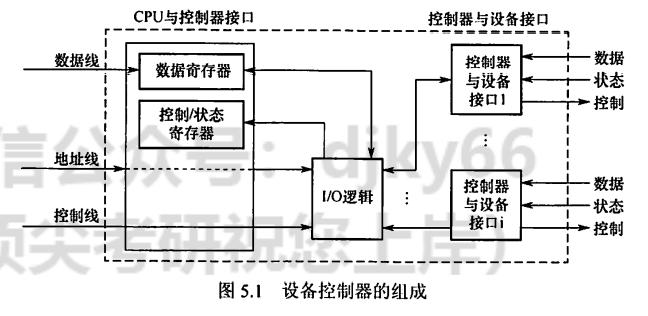
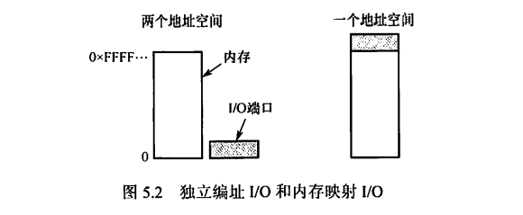
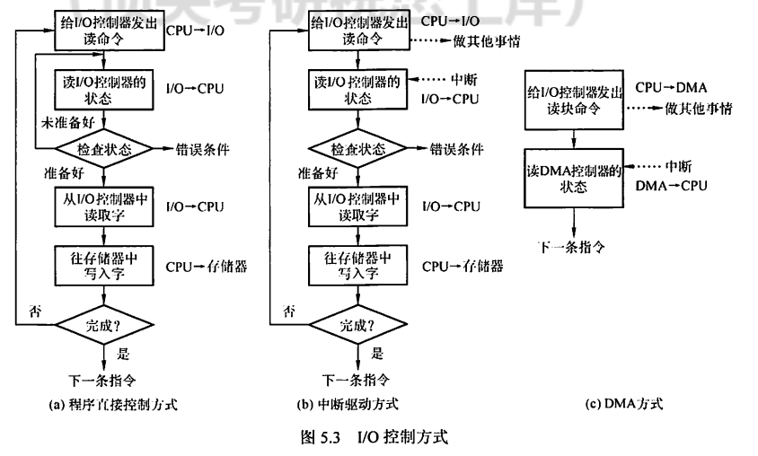
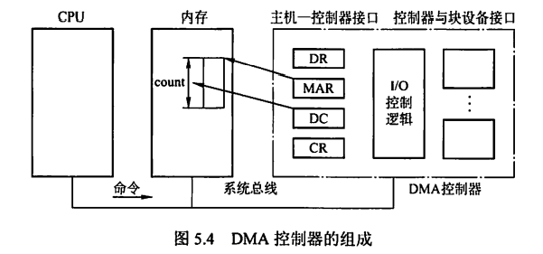
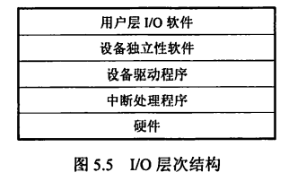

---
# 这是页面的图标
icon: page

# 这是文章的标题
title: I/O管理概述

# 设置作者
author: lllllan

# 设置写作时间
# time: 2020-01-20

# 一个页面只能有一个分类
category: 计算机基础

# 一个页面可以有多个标签
tag:
- 操作系统
- 王道-操作系统

# 此页面会在文章列表置顶
# sticky: true

# 此页面会出现在首页的文章板块中
star: true

# 你可以自定义页脚
# footer: 

---

::: warning 转载声明

- 《王道考研-操作系统》

:::

## 一、I/O 设备

I/O设备管理是操作系统设计中最凌乱也最具挑战性的部分。由于它包含了很多领域的不同设备及与设备相关的应用程序，因此很难有-一个通用且一 致的设计 方案。

### 1.1 设备的分类

按信息交换的单位分类，I/O 设备可分为：

1. 块设备。信息交换以数据块为单位。它属于有结构设备，如磁盘等。磁盘设备的基本特征是传输速率较高、可寻址，即对它可随机地读/写任一块。
2. 字符设备。信息交换以字符为单位。它属于无结构类型，如交互式终端机、打印机等。它们的基本特征是传输速率低、不可寻址，并且时常采用中断I/O方式。

按传输速率分类，I/O 设备可分为：

1. 低速设备。传输速率仅为每秒几字节到数百字节的- -类设备，如键盘、鼠标等.
2. 中速设备。传输速率为每秒数千字节至数万字节的一类设备，如激光打印机等。
3. 高速设备。传输速率在数百千字节至千兆字节的一类设备,如磁盘机、光盘机等。

### 1.2 I/O接口

I/O接口(设备控制器)位于CPU与设备之间，它既要与CPU通信，又要与设备通信，还要具有按CPU发来的命令去控制设备工作的功能，主要由三部分组成，如图5.1所示。

1. 设备控制器与CPU的接口。该接口有三类信号线:数据线、地址线和控制线。数据线通常与两类寄存器相连:数据寄存器(存放从设备送来的输入数据或从CPU送米的输出数据)和控制/状态寄存器(存放从CPU送来的控制信息或设备的状态信息)。
2. 设备控制器与设备的接口。一个设备控制器可以连接一个或多个设备，因此控制器中有一个或多个设备接口。每个接口中都存在数据、控制和状态三种类型的信号。
3. I/O逻辑。用于实现对设备的控制。它通过一组控制线与CPU交互，对从CPU收到的I/O命令进行译码。CPU启动设备时，将启动命令发送给控制器，同时通过地址线把地址发送给控制器，由控制器的I/O逻辑对地址进行译码，并相应地对所选设备进行控制。

设备控制器的主要功能有：

1. 接收和识别CPU发来的命令，如磁盘控制器能接收读、写、查找等命令
2. 数据交换，包括设备和控制器之间的数据传输，以及控制器和主存之间的数据传输
3. 标识和报告设备的状态，以供CPU处理
4. 地址识别
5. 数据缓冲
6. 差错控制。

### 1.3 I/O 端口

I/O端口是指设备控制器中可被CPU直接访问的寄存器，主要有以下三类寄存器。

- 数据寄存器:实现CPU和外设之间的数据缓冲。
- 状态寄存器:获取执行结果和设备的状态信息，以让CPU知道是否准备好。
- 控制寄存器:由CPU写入，以便启动命令或更改设备模式。

为了实现CPU与I/O端口进行通信，有两种方法，如图5.2所示。

1. 独立编址。为每个端口分配一个I/O端口号，所有I/O端口形成I/0端口空间，普通用户程序不能对其进行访问，只有操作系统使用特殊的I/O指令才能访问端口。
2. 统一编址。 又称内存映射1/0,每个端口被分配唯一的内存地址，且不会有内存被分配这一地址， 通常分配给端口的地址靠近地址空间的顶端。

## 二、I/O控制方式

设备管理的主要任务之-是控制设备和内存或CPU之间的数据传送。外围设备和内存之间的输入/输出控制方式有4种，下 面分别加以介绍。

###  2.1 程序直接控制方式

如图5.3(a)所示，计算机从外部设备读取的每个字，CPU需要对外设状态进行循环检查，直到确定该字已经在I/O控制器的数据寄存器中。在程序直接控制方式中,由于CPU的高速性和I/O设备的低速性，致使CPU的绝大部分时间都处于等待I/O设备完成数据I/O的循环测试中，造成了CPU资源的极大浪费。在该方式中，CPU之所以要不断地测试I/O设备的状态，就是因为在CPU中未采用中断机构，使I/O设备无法向CPU报告它已完成了一个字符的输入操作。

程序直接控制方式虽然简单且易于实现，但其缺点也显而易见，由于CPU和I/O设备只能串.行工作，导致CPU的利用率相当低。

### 2.2 中断驱动方式

中断驱动方式的思想是，允许I/O设备主动打断CPU的运行并请求服务,从而“解放"CPU,使得其向I/O控制器发送读命令后可以继续做其他有用的工作。如图5.3(b)所示，我们从I/O控制器和CPU两个角度分别来看中断驱动方式的工作过程。

从I/O控制器的角度来看，I/0 控制器从CPU接收一个读命令，然后从外部设备读数据。一旦数据读入I/0控制器的数据寄存器，便通过控制线给CPU发出中断信号，表示数据已准备好，然后等待CPU请求该数据。IO控制器收到CPU发出的取数据请求后，将数据放到数据总线上,传到CPU的寄存器中。至此，本次I0操作完成，I/O 控制器又可开始下一次IO操作。

从CPU的角度来看，CPU发出读命令，然后保存当前运行程序的上下文(现场，包括程序计数器及处理机寄存器)，转去执行其他程序。在每个指令周期的末尾，CPU检查中断。当有来自I0控制器的中断时，CPU保存当前正在运行程序的上下文，转去执行中断处理程序以处理该中断。这时，CPU从IO控制器读- -个字的数据传送到寄存器，并存入主存。接着, CPU恢复发出IO命令的程序(或其他程序)的上下文，然后继续运行。

中断驱动方式比程序直接控制方式有效，但由于数据中的每个字在存储器与I/O控制器之间的传输都必须经过CPU,这就导致了中断驱动方式仍然会消耗较多的CPU时间。

### 2.3 DMA方式

在中断驱动方式中，IO设备与内存之间的数据交换必须要经过CPU中的寄存器，所以速度还是受限，而DMA (直接存储器存取)方式的基本思想是在I/O设备和内存之间开辟直接的数据交换通路，彻底“解放”CPU。DMA方式的特点如下:

1. 基本单位是数据块。
2. 所传送的数据，是从设备直接送入内存的，或者相反。
3. 仅在传送一一个或多个数据块的开始和结束时，才需CPU干预，整块数据的传送是在DMA控制器的控制下完成的。

图5.4列出了DMA控制器的组成。

要在主机与控制器之间实现成块数据的直接交换,须在DMA控制器中设置如下4类寄存器：

1. 命令/状态寄存器(CR)。 接收从CPU发来的I/O命令、有关控制信息，或设备的状态。
2. 内存地址寄存器(MAR)。 在输入时，它存放把数据从设备传送到内存的起始目标地址在输出时，它存放由内存到设备的内存源地址。
3. 数据寄存器(DR)。暂存从设备到内存或从内存到设备的数据。
4. 数据计数器(DC)。存放本次要传送的字(节)数。

如图5.3(c)所示，DMA方式的工作过程是: CPU接收到I/O设备的DMA请求时，它给DMA控制器发出一条命令， 同时设置MAR和DC初值，启动DMA控制器，然后继续其他工作。之后CPU就把控制操作委托给DMA控制器，由该控制器负贵处理。DMA控制器直接与存储器交互，传送整个数据块，每次传送一-个字， 这个过程不需要CPU参与。传送完成后，DMA控制器发送一个中断信号给处理器。因此只有在传送开始和结束时才需要CPU的参与。

DMA方式与中断方式的主要区别是，中断方式在每个数据需要传输时中断CPU,而DMA方式则是在所要求传送的一批数据全部传送结束时才中断CPU;此外，中断方式的数据传送是在中断处理时由CPU控制完成的，而DMA方式则是在DMA控制器的控制下完成的。

### 2.4 通道控制方式

I/O通道是指专门负责输入/输出的处理机。I/0通道方式是DMA方式的发展，它可以进一步减少CPU的干预，即把对一个数据块的读(或写)为单位的干预，减少为对一-组数据块的读(或写)及有关控制和管理为单位的干预。同时，又可以实现CPU、通道和I/O设备三者的并行操作，从而更有效地提高整个系统的资源利用率。

例如，当CPU要完成一-组相关的读(或写)操作及有关控制时，只需向I/O通道发送一条I/O指令,以给出其所要执行的通道程序的首地址和要访问的I/O设备，通道接到该指令后，执行通道程序便可完成CPU指定的I/O任务，数据传送结束时向CPU发中断请求。

I/O通道与一般处理机的区别是:通道指令的类型单- -，没有自己的内存，通道所执行的通道程序是放在主机的内存中的，也就是说通道与CPU共享内存。

I/O通道与DMA方式的区别是:DMA方式需要CPU来控制传输的数据块大小、传输的内存位置，而通道方式中这些信息是由通道控制的。另外，每个DMA控制器对应一台 设备与内存传递数据，而一个通道可以控制多台设备与内存的数据交换。

下面用一个例子来总结这4种I/O方式。想象- -位客 户要去裁缝店做-批衣服的情形。

采用程序控制方式时，裁缝没有客户的联系方式，客户必须每隔一段时间去裁缝店看看裁缝把衣服做好了没有，这就浪费了客户不少的时间。采用中断方式时，裁缝有客户的联系方式，每当他完成一件衣服后，给客户打一个电话，让客户去拿，与程序直接控制能省去客户不少麻烦，但每完成一件衣服就让客户去拿- -次，仍然比较浪费客户的时间。采用DMA方式时，客户花钱雇一位单线秘书，并向秘书交代好把衣服放在哪里(存放仓库)，裁缝要联系就直接联系秘书，秘书负贵把衣服取回来并放在合适的位置，每处理完100件衣服，秘书就要给客户报告- -次(大大节省了客户的时间)。采用通道方式时，秘书拥有更高的自主权，与DMA方式相比，他可以决定把衣服存放在哪里，而不需要客户操心。而且，何时向客户报告，是处理完100件衣服就报告,还是处理完10000件衣服才报告，秘书是可以决定的。客户有可能在多个裁缝那里订了货，- -位DMA类的秘书只能负贵与一位裁缝沟通，但通道类秘书却可以与多名裁缝进行沟通。

## 三、I/O 软件层次结构

I/O软件涉及的面很宽，往下与硬件有着密切关系，往上又与虚拟存储器系统、文件系统和用户直接交互，它们都需要I/O软件来实现I/O操作。

为使复杂的1/O软件能具有清晰的结构、良好的可移植性和易适应性，目前已普遍采用层次式结构的I/O软件。将系统中的设备管理模块分为若干个层次，每层都是利用其下层提供的服务，完成输入/输出功能中的某些子功能，并屏蔽这些功能实现的细节，向高层提供服务。在层次式结构的I/O软件中，只要层次间的接口不变，对某一层次中的软件的修改都不会引起其下层或高层代码的变更，仅最低层才涉及硬件的具体特性。

-一个比较合理的层次划分如图5.5所示。整个I/O软件可以视为具有4个层次的系统结构，各层次及其功能如下:

### 3.1 用户层I/O软件

实现与用户交互的接口，用户可直接调用在用户层提供的、与I/0操作有关的库函数，对设备进行操作。-般而言，大部分的IO软件都在操作系统内部，但仍有一小部分在用户层，包括与用户程序链接在一起的库函数。用户层软件必须通过一组系统调用来获取操作系统服务。

### 3.2 设备独立性软件

用于实现用户程序与设备驱动器的统一接口、设备命令、设备的保护及设备的分配与释放等，同时为设备管理和数据传送提供必要的存储空间。

设备独立性也称设备无关性，使得应用程序独立于具体使用的物理设备。为实现设备独立性而引入了逻辑设备和物理设备这两个概念。在应用程序中，使用逻辑设备名来请求使用某类设备;而在系统实际执行时，必须将逻辑设备名映射成物理设备名使用。

使用逻辑设备名的好处是：

1. 增加设备分配的灵活性
2. 易于实现I/0重定向，所谓IO重定向，是指用于I/O操作的设备可以更换(即重定向)，而不必改变应用程序。

为了实现设备独立性，必须再在驱动程序之.上设置一层设备独立性软件。总体而言，设备独立性软件的主要功能可分为以下两个方面:：

1. 执行所有设备的公有操作，包括：对设备的分配与回收；将逻辑设备名映射为物理设备名;对设备进行保护，禁止用户直接访问设备；缓冲管理;差错控制;提供独立于设备的大小统-的逻辑块，屏蔽设备之间信息交换单位大小和传输速率的差异。
2. 向用户层(或文件层)提供统接口。无论何种设备，它们向用户所提供的接口应是相同的。例如，对各种设备的读/写操作，在应用程序中都统一使用read/write命令等。

### 3.3 设备驱动程序

与硬件直接相关，负责具体实现系统对设备发出的操作指令，驱动I/O设备工作的驱动程序。通常，每类设备配置一个设备驱动程序，它是I/O进程与设备控制器之间的通信程序，常以进程形式存在。设备驱动程序向上层用户程序提供一组标准接口，设备具体的差别被设备驱动程序所封装，用于接收上层软件发来的抽象I/O要求，如read和write命令，转换为具体要求后，发送给设备控制器，控制I/O设备工作;它也将由设备控制器发来的信号传送给上层软件,从而为I/O内核子系统隐藏设备控制器之间的差异。

### 3.4 中断处理程序

用于保存被中断进程的CPU环境，转入相应的中断处理程序进行处理，处理完毕再恢复被中断进程的现场后，返回到被中断进程。

中断处理层的主要任务有:进行进程上下文的切换，对处理中断信号源进行测试，读取设备状态和修改进程状态等。由于中断处理与硬件紧密相关，对用户而言，应尽量加以屏蔽，因此应放在操作系统的底层，系统的其余部分尽可能少地与之发生联系。

类似于文件系统的层次结构，I/O子系统的层次结构也是我们需要记忆的内容，但记忆不是死记硬背，我们以用户对设备的一次命令来总结各层次的功能，帮助各位读者记忆。例如：

1. 当用户要读取某设备的内容时，通过操作系统提供的read命令接口，这就经过了用户层
2. 操作系统提供给用户使用的接口，- -般是统- - 的通用接口，也就是几乎每个设备都可以响应的统一命令， 如read命令，用户发出的read命令，首先经过设备独立层进行解析，然后交往下层。
3. 接下来，不同类型的设备对read命令的行为会有所不同，如磁盘接收read命令后的行为与打印机接收read命令后的行为是不同的。因此，需要针对不同的设备，把read命令解析成不同的指令，这就经过了设备驱动层。
4. 命令解析完毕后，需要中断正在运行的进程，转而执行read命令，这就需要中断处理程序
5. 最后，命令真正抵达硬件设备，硬件设备的控制器按照上层传达的命令操控硬件设备，完成相应的功能。

## 五、应用程序I/O接口.

在I/O系统与高层之间的接口中，根据设备类型的不同，又进一步分为若干接口。

### 5.1 字符设备接口

字符设备是指数据的存取和传输是以字符为单位的设备，如键盘、打印机等。基本特征是传输速率较低、不可寻址，并且在输入/输出时通常采用中断驱动方式。

get和put操作。由于字符设备不可寻址，只能采取顺序存取方式，通常为字符设备建立- -个字符缓冲区，用户程序通过get操作从缓冲区获取字符，通过put操作将字符输出到缓冲区。

in-control指令。字符设备类型繁多，差异甚大，因此在接口中提供-种通用的in-control 指令来处理它们(包含了许多参数，每个参数表示-一个与具体设备相关的特定功能)。

字符设备都属于独占设备，为此接口中还需要提供打开和关闭操作，以实现互斥共享。

### 5.2 块设备接口

块设备是指数据的存取和传输是以数据块为单位的设备，典型的块设备是磁盘。基本特征是传输速率较高、可寻址。磁盘设备的I/0常采用DMA方式。

隐藏了磁盘的二维结构。在二维结构中，每个扇区的地址需要用磁道号和扇区号来表示。块设备接口将磁盘的所有扇区从0到n-1依次编号，这样，就将二维结构变为-种线性序列。

将抽象命令映射为低层操作。块设备接口支持上层发来的对文件或设备的打开、读、写和关闭等抽象命令，该接口将上述命令映射为设备能识别的较低层的具体操作。

内存映射接口通过内存的字节数组来访问磁盘，而不提供读/写磁盘操作。映射文件到内存的系统调用返回包含文件副本的--个虚拟内存地址。只在需要访问内存映像时，才由虚拟存储器实际调页。内存映射文件的访问如同内存读写-样简单，极大地方便了程序员。

### 5.3 网络设备接口

现代操作系统都提供面向网络的功能，因此还需要提供相应的网络软件和网络通信接口，使计算机能够通过网络与网络上的其他计算机进行通信或上网浏览。

许多操作系统提供的网络I/O接口为网络套接字接口，套接字接口的系统调用使应用程序创建的本地套接字连接到远程应用程序创建的套接字，通过此连接发送和接收数据。

### 5.4 阻塞/非阻塞I/O

操作系统的I/O接口还涉及两种模式:阻塞和非阻塞。

阻塞I/0是指当用户进程调用I/0操作时，进程就被阻塞，需要等待I/O 操作完成，进程才被唤醒继续执行。非阻塞I/O是指用户进程调用I/O操作时，不阻塞该进程，该I/O调用返回一个错误返回值，通常，进程需要通过轮询的方式来查询I/O操作是否完成。

大多数操作系统提供的I/O接口都是采用阻塞I/O。

