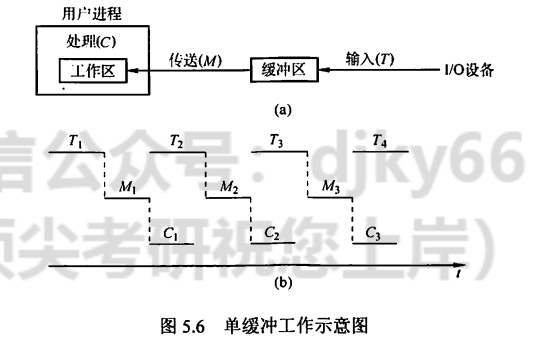
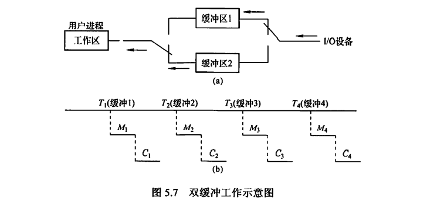
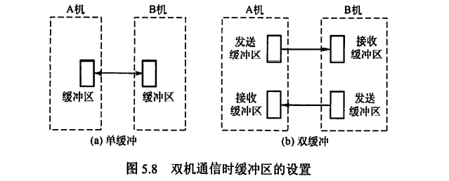
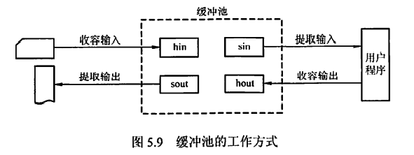
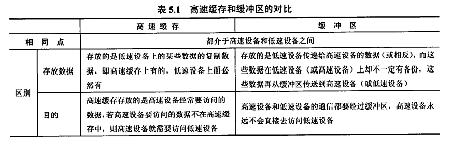
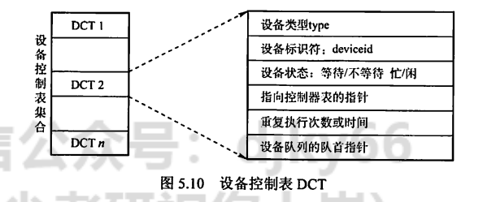
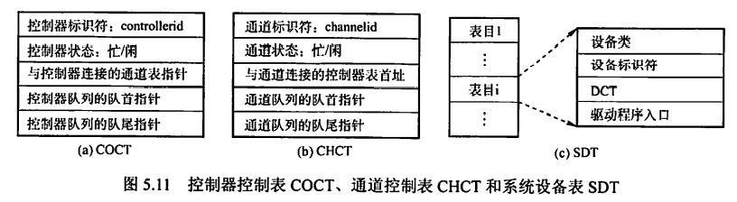
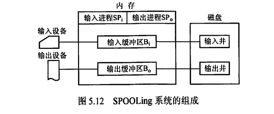

---
# 这是页面的图标
icon: page

# 这是文章的标题
title: 设备独立性软件

# 设置作者
author: lllllan

# 设置写作时间
# time: 2020-01-20

# 一个页面只能有一个分类
category: 计算机基础

# 一个页面可以有多个标签
tag:
- 操作系统
- 王道-操作系统

# 此页面会在文章列表置顶
# sticky: true

# 此页面会出现在首页的文章板块中
star: true

# 你可以自定义页脚
# footer: 

---

::: warning 转载声明

- 《王道考研-操作系统》

:::

## 一、与设备无关的软件

与设备无关的软件是I/O系统的最高层软件，它的下层是设备驱动程序,其间的界限因操作系统和设备的不同而有所差异。比如，一些本应 由设备独立性软件实现的功能，也可能放在设备驱动程序中实现。这样的差异主要是出于对操作系统、设备独立性软件和设备驱动程序运行效率等多方面因素的权衡。总体而言，设备独立性软件包括执行所有设备公有操作的软件。

## 二、高速缓存与缓冲区

### 2.1 磁盘高速缓存(Disk Cache)

操作系统中使用磁盘高速缓存技术来提高磁盘的I/O速度，对访问高速缓存要比访问原始磁盘数据更为高效。例如，正在运行进程的数据既存储在磁盘上，又存储在物理内存上，也被复制.到CPU的二级和- -级高速缓存中。不过，磁盘高速缓存技术不同于通常意义下的介于CPU与内存之间的小容量高速存储器，而是指利用内存中的存储空间来暂存从磁盘中读出的一系列盘块中的信息。因此，磁盘高速缓存逻辑.上属于磁盘，物理上则是驻留在内存中的盘块。

高速缓存在内存中分为两种形式:一种 是在内存中开辟-个单独的空间作为磁盘高速缓存,大小固定;另-种是把未利用的内存空间作为-一个缓冲池，供请求分页系统和磁盘IO时共享。

### 2.2 缓冲区(Buffer)

在设备管理子系统中，引入缓冲区的目的主要如下:

1. 缓和CPU与I/O设备间速度不匹配的矛盾。
2. 减少对CPU的中断频率，放宽对CPU中断响应时间的限制。
3. 解决基本数据单元大小(即数据粒度)不匹配的问题。
4. 提高CPU和I/O设备之间的并行性。

其实现方法如下:

1. 采用硬件缓冲器，但由于成本太高，除- -些关键部位外，一 般 不采用硬件缓冲器。
2. 采用缓冲区(位于内存区域)。

根据系统设置缓冲器的个数，缓冲技术可以分为如下几种: 

**单缓冲**

在主存中设置-一个缓冲区。当设备和处理机交换数据时，先将数据写入缓冲区，然后需要数据的设备或处理机从缓冲区取走数据，在缓冲区写入或取出的过程中，另一方需等待。

如图5.6 所示，在块设备输入时，假定从磁盘把一块数据输入到缓冲区的时间为T,操作系统将该缓冲区中的数据传送到用户区的时间为M，而CPU对这一块数据处理的时间为C。

在研究每块数据的处理时间时，有一个技巧:假设一种初始状态， 然后计算下一次到达相同状态时所需要的时间，就是处理--块数据所需要的时间。在单缓冲中，这种初始状态为:工作区是满的，缓冲区是空的。如题目无明确说明，通常认为缓冲区的大小和工作区的大小相等。

假设T> C,从初始状态开始，当工作区数据处理完后，时间为C,缓冲区还没充满，当缓冲区充满时，经历了T时间，停止再冲入数据，然后缓冲区向工作区传送数据，当工作区满了后，缓冲区的数据同时也为空，用时为M,到达下一个开始状态，整个过程用时M+ T;若T<C,同理，整个过程用时M+C。故单缓冲区处理每块数据的用时为max(C,T)+M.

---

**双缓冲**

根据单缓冲的特点，CPU在传送时间M内处于空闲状态，由此引入双缓冲。I/O设备输入数据时先装填到缓冲区1,在缓冲区1填满后才开始装填缓冲区2,与此同时处理机可以从缓冲区1中取出数据送入用户进程，当缓冲区1中的数据处理完后，若缓冲区2已填满，则处理机又从缓冲区2中取出数据送入用户进程，而I/O设备又可以装填缓冲区1。注意，必须等缓冲区2充满才能让处理机从缓冲区2取出数据。双缓冲机制提高了处理机和输入设备的并行程度。

为了研究双缓冲处理-块数据的用时，我们先规定- -种初始状态:工作区是空的，其中- -个缓冲区是满的，另外一个缓冲区是空的;我们不妨假设缓冲区1是空的，缓冲区2是满的。

如图5.7所示，我们假设T<C + M,缓冲区2开始向工作区传送数据，缓冲区1开始冲入数据，当工作区充满数据后，缓冲区为空,时间为M,然后工作区开始处理数据，缓冲区1继续冲入数据，因为此时只有一个IO设备，所以缓冲区2虽然为空，但不能冲入数据。当缓冲区1充满数据后，工作区的数据还未处理完毕，时间为T,当工作区数据处理完毕后，此时工作区为空，缓冲区1满，缓冲区2为空，达到下一个初始状态，用时C + M。

我们再来分析T> C + M的情况。缓冲区2开始向工作区传送数据，缓冲区1开始冲入数据，当工作区允满数据并处理完后，用时C+ M,但缓冲区1的数据还未充满;当时间为T时，缓冲区1的数据充满，到达下一个初始状态。

总结:双缓冲区处理-块数据的用时为max(C+ M, D)。

若M+C<T,则可使块设备连续输入;若C + M> T,则可使CPU不必等待设备输入。对于字符设备，若采用行输入方式，则采用双缓冲可使用户在输入第-一行后，在CPU执行第-行中的命令的同时，用户可继续向第二缓冲区输入下一-行数据。而单缓冲情况下则必须等待一-行数据被提取完毕才可输入下一行的数据。

若两台机器之间通信仅配置了单缓冲，如图5.8(a)所示， 则它们在任意时刻都只能实现单方向的数据传输。例如，只允许把数据从A机传送到B机，或从B机传送到A机，而绝不允许双方同时向对方发送数据。为了实现双向数据传输，必须在两台机器中都设置两个缓冲区，一个用作发送缓冲区，另- 一个用作接收缓冲区，如图5.8(b)所示。

---

**循环缓冲**

包含多个大小相等的缓冲区，每个缓冲区中有-一个链接指针指向下一个缓冲区，最后一个缓冲区指针指向第一一个缓冲区，多个缓冲区构成-一个环形 。

循环缓冲用于输入/输出时，还需要有两个指针in和out。对输入而言，首先要从设备接收数据到缓冲区中，in 指针指向可以输入数据的第一个空缓冲区; 当运行进程需要数据时，从循环缓冲区中取一个装满数据的缓冲区，并从此缓冲区中提取数据，out 指针指向可以提取数据的第一个满缓冲区。输出则正好相反。

---

**缓冲池**

由多个系统公用的缓冲区组成，缓冲区按其使用状况可以形成三个队列:空缓冲队列、装满输入数据的缓冲队列(输入队列)和装满输出数据的缓冲队列(输出队列)。还应具有4种缓冲区:用于收容输入数据的工作缓冲区、用于提取输入数据的工作缓冲区、用于收容输出数据的工作缓冲区及用于提取输出数据的工作缓冲区，如图5.9 所示。

当输入进程需要输入数据时，便从空缓冲队列的队首摘下一个空缓冲区，把它作为收容输入工作缓冲区，然后把输入数据输入其中，装满后再将它挂到输入队列队尾。当计算进程需要输入数据时，便从输入队列取得一个缓冲区作为提取输入工作缓冲区，计算进程从中提取数据，数据用完后再将它挂到空缓冲队列尾。当计算进程需要输出数据时，便从空缓冲队列的队首取得一一个空缓冲区，作为收容输出工作缓冲区，当其中装满输出数据后，再将它挂到输出队列队尾。当要输出时，由输出进程从输出队列中取得-一个装满输出数据的缓冲区，作为提取输出工作缓冲区，当数据提取完后，再将它挂到空缓冲队列的队尾。

对于循环缓冲和缓冲池，我们只是定性地介绍它们的机理，而不去定量研究它们平均处理一块数据所需要的时间。而对于单缓冲和双缓冲，我们只要按照上面的模板分析，就可以解决任何计算单缓冲和双缓冲情况下数据块处理时间的问题，以不变应万变。

### 2.3 高速缓存与缓冲区的对比

高速缓存是可以保存数据拷贝的高速存储器,访问高速缓存比访问原始数据更高效，速度更快。高速缓存和缓冲区的对比见表5.1.

## 三、设备分配与回收

### 3.1 设备分配概述

设备分配是指根据用户的I/0请求分配所需的设备。分配的总原则是充分发挥设备的使用效率，尽可能地让设备忙碌，又要避免由于不合理的分配方法造成进程死锁。从设备的特性来看，采用下述三种使用方式的设备分别称为独占设备、共享设备和虚拟设备。

1. 独占式使用设备。进程分配到独占设备后，便由其独占，直至该进程释放该设备。
2. 分时式共享使用设备。对于共享设备，可同时分配给多个进程，通过分时共享使用。
3. 以SPOOLing方式使用外部设备。SPOOLing技术实现了虚拟设备功能，可以将设备同时分配给多个进程。这种技术实质上就是实现了对设备的I/O操作的批处理。

### 3.2 设备分配的数据结构

设备分配依据的主要数据结构有设备控制表(DCT)、 控制器控制表(COCT)、 通道控制表(CHCT)和系统设备表(SDT),各数据结构功能如下。

设备控制表(DCT): - -个设备控制表就表征-一个设备， 而这个控制表中的表项就是设备的各个属性，如图5.10所示。凡因请求本设备而未得到满足的进程，应将其PCB按某种策略排成-一个设备请求队列，设备队列的队首指针指向该请求队列队首PCB.

设备控制器控制设备与内存交换数据，而设备控制器又需要请求通道为它服务，因此每个COCT [图5.11(a)]有一一个表项存放指向相应通道控制表(CHCT) [图5.11(b)]的指针，而一个通道可为多个设备控制器服务，因此CHCT中必定有一个指针，指向一个表，这个表上的信息表达的是CHCT提供服务的那几个设备控制器。CHCT与COCT的关系是一对多的关系。

系统设备表(SDT): 整个系统只有一-张 SDT,如图5.11(C)所示。它记录己连接到系统中的所有物理设备的情况，每个物理设备占-一个表目。

在多道程序系统中，进程数多于资源数,因此要有一套合理的分配原则，主要考虑的因素有：I/O设备的固有属性、I/O设备的分配算法、I/O设备分配的安全性以及I/O设备的独立性。

### 3.3 设备分配的策咯.

1. 设备分配原则。设备分配应根据设备特性、用户要求和系统配置情况。既要充分发挥设备的使用效率，又要避免造成进程死锁，还要将用户程序和具体设备隔离开。
2. 设备分配方式。设备分配方式有静态分配和动态分配两种：
    1. 静态分配主要用于对独占设备的分配，它在用户作业开始执行前，由系统- -次性分配该作业所要求的全部设备、控制器。一旦分配， 这些设备、 控制器就-直为该作业所占用，直到该作业被撤销。静态分配方式不会出现死锁，但设备的使用效率低
    2. 动态分配在进程执行过程中根据执行需要进行。当进程需要设备时，通过系统调用命令向系统提出设备请求，由系统按某种策略给进程分配所需要的设备、控制器，一 旦用完，便立即释放。这种方式有利于提高设备利用率，但若分配算法使用不当，则有可能造成进程死锁。
3. 设备分配算法。常用的动态设备分配算法有先请求先分配、优先级高者优先等。

对于独占设备，既可以采用动态分配方式，又可以采用静态分配方式，但往往采用静态分配方式。共享设备可被多个进程所共享，- 般采用动态分配方式，但在每个I/O传输的单位时间内只被一一个进程所占有，通常采用先请求先分配和优先级高者优先的分配算法。

### 3.4 设备分配的安全性

设备分配的安全性是指设备分配中应防止发生进程死锁。

1. 安全分配方式。每当进程发出I/O请求后便进入阻塞态，直到其I/O操作完成时才被唤醒。这样，一旦进程已经获得某种设备后便阻塞，不能再请求任何资源，而在它阻塞时也不保持任何资源。其优点是设备分配安全，缺点是CPU和IO设备是串行工作的。
2. 不安全分配方式。进程在发出I/0请求后仍继续运行，需要时又发出第二个、第三个IO请求等。仅当进程所请求的设备已被另一进程占用时，才进入阻塞态。优点是一一个进程可同时操作多个设备，使进程推进迅速;缺点是有可能造成死锁。

### 3.5 逻辑设备名到物理设备名的映射

为了提高设备分配的灵活性和设备的利用率，方便实现I/O重定向，引入了设备独立性。设备独立性是指应用程序独立于具体使用的物理设备。

为了实现设备独立性，在应用程序中使用逻辑设备名来请求使用某类设备，在系统中设置一张逻辑设备表(Logical Unit Table, LUT),用于将逻辑设备名映射为物理设备名。LUT表项包括逻辑设备名、物理设备名和设备驱动程序入口地址;当进程用逻辑设备名来请求分配设备时，系统为它分配一台相应的物理设备，并在LUT中建立-一个表目,当以后进程再利用该逻辑设备名请求I/O操作时，系统通过查找LUt来寻找对应的物理设备和驱动程序。

在系统中可采取两种方式设置逻辑设备表:

1. 在整个系统中只设置- -张LUT.这样,所有进程的设备分配情况都记录在同一张LUT中，因此不允许LUT中具有相同的逻辑设备名，主要适用于单用户系统。.
2. 为每个用户设置- -张LUT.每当用户登录时，系统便为该用户建立-一个进程，同时也为之建立一-张LUT,并将该表放入进程的PCB中。

## 四、SPOOLing 技术(假脱机技术)

为了缓和CPU的高速性与I/O设备低速性之间的矛盾，引入了脱机输入/输出技术，它是操作系统中采用的一-项将独占设备改造成共享设备的技术。该技术利用专门的外围控制机，将低速I/O设备上的数据传送到高速磁盘上，或者相反。SPOOLing 系统的组成如图5.12所示。

### 4.1 输入井和输出井

在磁盘上开辟出的两个存储区域。输入井模拟脱机输入时的磁盘，用于收容I/O设备输入的数据。输出井模拟脱机输出时的磁盘，用于收容用户程序的输出数据。-一个进程的输入(或输出)数据保存为一个文件，所有进程的数据输入(或输出)文件链接成一个输入(或输出)队列。

### 4.2 输入缓冲区和输出缓冲区

在内存中开辟的两个缓冲区。输入缓冲区用于暂存由输入设备送来的数据，以后再传送到输入井。输出缓冲区用于暂存从输出井送来的数据，以后再传送到输出设备。

### 4.3 输入进程和输出进程

输入/输出进程用于模拟脱机输入/输出时的外围控制机。用户要求的数据从输入设备经过输入缓冲区送到输入井，当CPU需要输入数据时，直接从输入井读入内存。用户要求输出的数据先从内存送到输出井，待输出设备空闲时，再将输出井中的数据经过输出缓冲区送到输出设备。

共享打印机是使用SPOOLing技术的实例。当用户进程请求打印输出时，SPOOLing 系统同意打印，但是并不真正立即把打印机分配给该进程，而由假脱机管理进程完成两项任务:

1. 在磁盘缓冲区中为之申请一个空闲盘块，并将要打印的数据送入其中暂存。
2. 为用户进程申请一-张空白的用户请求打印表，并将用户的打印要求填入其中，再将该表挂到假脱机文件队列上。

这两项工作完成后，虽然还没有任何实际的打印输出，但是对于用户进程而言，其打印任务已完成。对用户而言，系统并非立即执行真实的打印操作，而只是立即将数据输出到缓冲区,真正的打印操作是在打印机空闲且该打印任务已排在等待队列队首时进行的。

SPOOLing系统的特点如下：

1. 提高了I/O的速度,将对低速IO设备执行的IO操作演变为对磁盘缓冲区中数据的存取，如同脱机输入/输出一样， 缓和了CPU和低速I/O设备之间的速度不匹配的矛盾
2. 将独占设备改造为共享设备，在假脱机打印机系统中，实际上并没有为任何进程分配设备
3. 实现了虚拟设备功能，对每个进程而言，它们都认为自己独占了一个设备。

前面我们提到过SPOOLing技术是-一种以空间换时间的技术,我们很容易理解它牺牲了空间，因为它开辟了磁盘上的空间作为输入井和输出井，但它又如何节省时间呢？

从前述内容我们了解到，磁盘是一-种高速设备， 在与内存交换数据的速度上优于打印机、键盘、鼠标等中低速设备。试想一下， 若没有SPOOLing技术，CPU要向打印机输出要打印的数据，打印机的打印速度比较慢，CPU 就必须迁就打印机，在打印机把数据打印完后才能继续做其他的工作，浪费了CPU的不少时间。在SPOOLing技术下，CPU 要打印机打印的数据可以先输出到磁盘的输出井中(这个过程由假脱机进程控制)，然后做其他的事情。若打印机此时被占用，则SPOOLing系统就会把这个打印请求挂到等待队列上，待打印机有空时再把数据打印出来。向磁盘输出数据的速度比向打印机输出数据的速度快，因此就节省了时间。

## 五、设备驱动程序接口

如果每个设备驱动程序与操作系统的接口都不同，那么每次出现一个新设备时，都必须为此修改操作系统。因此，要求每个设备驱动程序与操作系统之间都有着相同或相近的接口。这样会使得添加一一个新设备驱动程序变得很容易，同时也便于开发人员编制设备驱动程序。

对于每种设备类型，例如磁盘，操作系统都要定义一组驱动程序必须支持的函数。对磁盘而言，这些函数自然包含读、写、格式化等。驱动程序中通常包含一张表格，这张表格具有针对这些函数指向驱动程序自身的指针。装载驱动程序时，操作系统记录这个函数指针表的地址，所以当操作系统需要调用一一个函数时，它可以通过这张表格发出间接调用。这个函数指针表定义了驱动程序与操作系统其余部分之间的接口。给定类型的所有设备都必须服从这一要求。

与设备无关的软件还要负责将符号化的设备名映射到适当的驱动程序上。例如，在UNIX中，设备名/dev/disk0唯- -确定了一个特殊文件的i结点，这个i结点包含了主设备号(用于定位相应的驱动程序)和次设备号(用来确定要读写的具体设备)。

在UNIX和Windows中，设备是作为命名对象出现在文件系统中的，因此针对文件的常规保护规则也适用于I/O设备。系统管理员可以为每个设备设置适当的访问权限。

