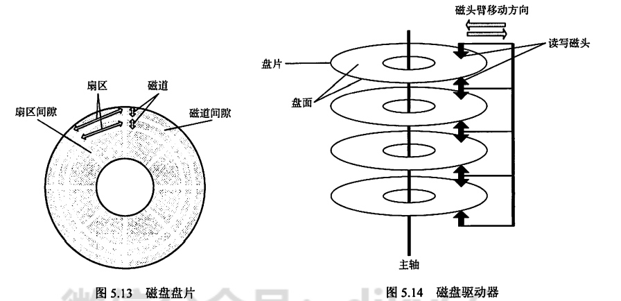
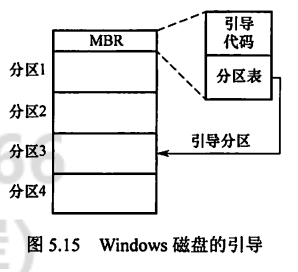
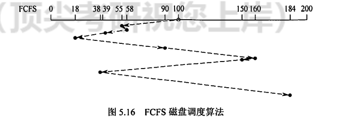
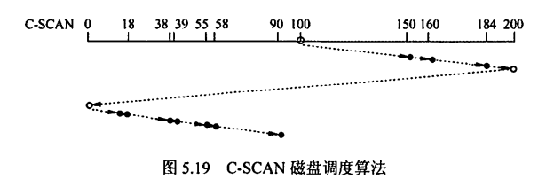
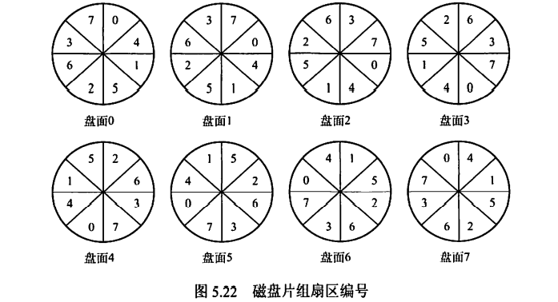
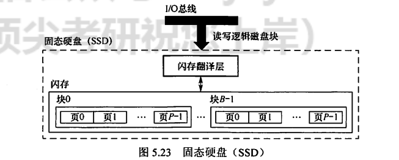

---
# 这是页面的图标
icon: page

# 这是文章的标题
title: 磁盘和固态硬盘

# 设置作者
author: lllllan

# 设置写作时间
# time: 2020-01-20

# 一个页面只能有一个分类
category: 计算机基础

# 一个页面可以有多个标签
tag:
- 操作系统
- 王道-操作系统

# 此页面会在文章列表置顶
# sticky: true

# 此页面会出现在首页的文章板块中
star: true

# 你可以自定义页脚
# footer: 
---

::: warning 转载声明

- 《王道考研-操作系统》

:::

## 一、磁盘

磁盘(Disk) 是由表面涂有磁性物质的物理盘片，通过- - 个称为磁头的导体线圈从磁盘存取数据。在读/写操作期间，磁头固定，磁盘在下面高速旋转。如图5.13所示，磁盘盘面上的数据存储在一组同心圆中， 称为磁道。每个磁道与磁头-样宽，- 一个盘面有上千个磁道。磁道又划分为几百个扇区，每个扇区固定存储大小，-一个扇区称为一个盘块。相邻磁道及相邻扇区间通过一定的间隙分隔开，以避免精度错误。注意，由于扇区按固定圆心角度划分，所以密度从最外道向里道增加，磁盘的存储能力受限于最内道的最大记录密度。

磁盘安装在一个磁盘驱动器中,它由磁头臂、用于旋转磁盘的主轴和用于数据输入/输出的电子设备组成。如图5.14所示，多个盘片垂直堆叠，组成磁盘组，每个盘面对应-一个磁头，所有磁头固定在一起， 与磁盘中心的距离相同且-起移动。所有盘片，上相对位置相同的磁道组成柱面。扇区是磁盘可寻址的最小单位，磁盘上能存储的物理块数目由扇区数、磁道数及磁盘面数决定,磁盘地址用“柱面号●盘面号●扇区号”表示。

磁盘按不同的方式可分为若干类型:磁头相对于盘片的径向方向固定的，称为固定头磁盘,每个磁道一个磁头;磁头可移动的，称为活动头磁盘，磁头臂可来回伸缩定位磁道;磁盘永久固定在磁盘驱动器内的，称为固定盘磁盘;可移动和替换的，称为可换盘磁盘。

操作系统中几乎每介绍一类资源及其管理时，都要涉及一类调度算法。用户访问文件,需要操作系统的服务，文件实际上存储在磁盘中，操作系统接收用户的命令后，经过一系列的检验访问权限和寻址过程后，最终都会到达磁盘，控制磁盘把相应的数据信息读出或修改。当有多个请求同时到达时，操作系统就要决定先为哪个请求服务，这就是磁盘调度算法要解决的问题。

## 二、磁盘的管理

### 2.1 磁盘初始化

一个新的磁盘只是一个磁性记录材料的空白盘。在磁盘可以存储数据之前，必须将它分成扇区，以便磁盘控制器能够进行读写操作，这个过程称为低级格式化( 或称物理格式化)。低级格式化为每个扇区使用特殊的数据结构,填充磁盘。每个扇区的数据结构通常由头部、数据区域(通常为512B大小)和尾部组成。头部和尾部包含了- -些磁盘控制器的使用信息。

大多数磁盘在工厂时作为制造过程的-部分就已低级格式化,这种格式化能够让制造商测试磁盘,并且初始化逻辑块号到无损磁盘扇区的映射。对于许多磁盘,当磁盘控制器低级格式化时,还能指定在头部和尾部之间留下多长的数据区，通常选择256或512字节等。

### 2.2 分区

在可以使用磁盘存储文件之前，操作系统还要将自己的数据结构记录到磁盘上，分为两步:第- -步是，将磁盘分为由一个或多个柱面组成的分区( 即我们熟悉的C盘、D盘等形式的分区),每个分区的起始扇区和大小都记录在磁盘主引导记录的分区表中;第二步是，对物理分区进行逻辑格式化(创建文件系统)，操作系统将初始的文件系统数据结构存储到磁盘上，这些数据结构包括空闲空间和已分配的空间以及-个初始为空的目录。

因扇区的单位太小，为了提高效率，操作系统将多个相邻的扇区组合在一起，形成-簇(在Linux中称为块)。为了更高效地管理磁盘，-簇只能存放-一个文件的内容，文件所占用的空间只能是簇的整数倍;如果文件大小小于- -簇(甚至是0字节)，也要占用- -簇的空间。

### 2.3 引导块

计算机启动时需要运行-一个初始化程序( 自举程序),它初始化CPU、寄存器、设备控制器和内存等，接着启动操作系统。为此，自举程序找到磁盘上的操作系统内核，将它加载到内存,并转到起始地址，从而开始操作系统的运行。

自举程序通常存放在ROM中，为了避免改变自举代码而需要改变ROM硬件的问题，通常只在ROM中保留很小的自举装入程序，而将完整功能的引导程序保存在磁盘的启动块上，启动块位于磁盘的固定位置。具有启动分区的磁盘称为启动磁盘或系统磁盘。

引导ROM中的代码指示磁盘控制器将引导块读入内存，然后开始执行，它可以从非固定的磁盘位置加载整个操作系统，并且开始运行操作系统。下 面以Windows为例来分析引导过程。Windows允许将磁盘分为多个分区，有一个分区为引导分区， 它包含操作系统和设备驱动程序。Windows系统将引导代码存储在磁盘的第0号扇区，它称为主引导记录(MBR)。引导首先运行ROM中的代码，这个代码指示系统从MBR中读取引导代码。除了包含引导代码，MBR还包含:一个磁盘分区表和一个标志(以指示从哪个分区引导系统)，如图5.15所示。当系统找到引导分区时，读取分区的第-一个扇区，称为引导扇区，并继续余下的引导过程，包括加载各种系统服务。

### 2.4坏块

由于磁盘有移动部件且容错能力弱，因此容易导致一个或多个扇区损坏。部分磁盘甚至在出厂时就有坏块。根据所用的磁盘和控制器，对这些块有多种处理方式。

对于简单磁盘，如采用IDE控制器的磁盘，坏块可手动处理，如MS-DOS的Format命令执行逻辑格式化时会扫描磁盘以检查坏块。坏块在FAT表上会标明，因此程序不会使用它们。

对于复杂的磁盘,控制器维护磁盘内的坏块列表。这个列表在出厂低级格式化时就已初始化,并在磁盘的使用过程中不断更新。低级格式化将一些块保留 作为备用，操作系统看不到这些块。控制器可以采用备用块来逻辑地替代坏块，这种方案称为扇区备用。.

对坏块的处理实质上就是用某种机制使系统不去使用坏块。

## 三、磁盘调度算法

一次磁 盘读写操作的时间由寻找(寻道)时间、旋转延迟时间和传输时间决定。

1. 寻找时间Tg。活动头磁盘在读写信息前，将磁头移动到指定磁道所需要的时间。这个时间除跨越n条磁道的时间外，还包括启动磁臂的时间s，即 T= mxn+s 式中，m是与磁盘驱动器速度有关的常数，约为0.2ms,磁臂的启动时间约为2ms。
2. 旋转延迟时间Tp。磁头定位到某- - 磁道的扇区所需要的时间，设磁盘的旋转速度为r,则 T=:1/2r 对于硬盘，典型的旋转速度为5400转/分，相当于- -周11.1ms，则T为5.55ms; 对于软盘，其旋转速度为300~600转/分，则T,为50~ l00ms.
3. 传输时间T。从磁盘读出或向磁盘写入数据所经历的时间，这个时间取决于每次所读/写的字节数b和磁盘的旋转速度: T = b /rN 式中，r为磁盘每秒的转数，N为--个磁道上的字节数。

在磁盘存取时间的计算中，寻道时间与磁盘调度算法相关;而延迟时间和传输时间都与磁盘旋转速度相关，且为线性相关，所以在硬件上，转速是磁盘性能的- -个非常重要的参数。

总平均存取时间T可以表示为 T=T + 1/2r + b/rN

虽然这里给出了总平均存取时间的公式，但是这个平均值是没有太大实际意义的，因为在实际的磁盘I/O操作中，存取时间与磁盘调度算法密切相关。

目前常用的磁盘调度算法有以下几种。

### 3.1 先来先服务( First Come First Served, FCFS)算法

FCFS算法根据进程请求访问磁盘的先后顺序进行调度，这是一种最简单的调度算法，如图5.16所示。该算法的优点是具有公平性。若只有少量进程需要访问，且大部分请求都是访问簇聚的文件扇区，则有望达到较好的性能;若有大量进程竞争使用磁盘，则这种算法在性能上往往接近于随机调度。所以，实际磁盘调度中会考虑-些更为复杂的调度算法。

例如，磁盘请求队列中的请求顺序分别为55, 58, 39, 18, 90, 160, 150, 38, 184，磁头的初始位置是磁道100,采用FCFS算法时磁头的运动过程如图5.16所示。磁头共移动了(45+3+ 19+21 +72 + 70+ 10+ 112+ 146) =498个磁道，平均寻找长度= 498/9 = 55.3。

### 3.2 最短寻找时间优先( Shortest Seek Time First, SSTF)算法

SSTF算法选择调度处理的磁道是与当前磁头所在磁道距离最近的磁道，以便使每次的寻找时间最短。当然，总是选择最小寻找时间并不能保证平均寻找时间最小，但能提供比FCFS算法更好的性能。这种算法会产生“饥饿”现象。如图5.17所示，若某时刻磁头正在18 号磁道，而在18号磁道附近频繁地增加新的请求，则SSTF算法使得磁头长时间在18号磁道附近工作，将使184号磁道的访问被无限期地延迟，即被“饿死”。.

例如，磁盘请求队列中的请求顺序分别为55, 58, 39, 18, 90, 160, 150, 38, 184，磁头初始位置是磁道100,采用SSTF算法时磁头的运动过程如图5.17所示。磁头共移动了10+32+3+16+1 +20+ 132+ 10+ 24= 248个磁道，平均寻找长度= 248/9= 27.5. 

### 3.3 扫描(SCAN)算法(又称电梯调度算法)

SCAN算法在磁头当前移动方向上选择与当前磁头所在磁道距离最近的请求作为下一次服务的对象，实际上就是在最短寻找时间优先算法的基础上规定了磁头运动的方向，如图5.18所示。由于磁头移动规律与电梯运行相似，因此又称电梯调度算法。SCAN算法对最近扫描过的区域不公平，因此它在访问局部性方面不如FCFS算法和SSTF算法好。

例如，磁盘请求队列中的请求顺序分别为55, 58, 39, 18, 90, 160, 150, 38, 184,磁头初始位置是磁道100。采用SCAN算法时，不但要知道磁头的当前位置，而且要知道磁头的移动方向，假设磁头沿磁道号增大的顺序移动，则磁头的运动过程如图5.18所示。移动磁道的顺序为100, 150,160, 184, 200, 90, 58, 55, 39, 38, 18。磁头共移动了(50+ 10+ 24+ 16+ 110+32+3+ 16+ 1 + 20)=282个磁道，平均寻道长度= 282/9=31.33.

### 3.4 循环扫描( Circular SCAN, C-SCAN)箅法

在扫描算法的基础上规定磁头单向移动来提供服务，回返时直接快速移动至起始端而不服务任何请求。由于SCAN算法偏向于处理那些接近最里或最外的磁道的访问请求，所以使用改进型的C-SCAN算法来避免这个问题，如图5.19所示。.

采用SCAN算法和C-SCAN算法时，磁头总是严格地遵循从盘面的一端到另一端，显然，在实际使用时还可以改进,即磁头移动只需要到达最远端的一个请求即可返回,不需要到达磁盘端点。这种形式的SCAN算法和C-SCAN算法称为LOOK调度( 见图5.20)和C-LOOK (见图5.21)调度，因为它们在朝-一个给定方向移动前会查看是否有请求。

注意,若无特别说明,也可以默认SCAN算法和C-SCAN算法为LOOK和C-LOOK调度(请读者认真领悟，并通过结合后面的习题进- 步加深对以.上相关算法的理解)。

例如，磁盘请求队列中的请求顺序为55, 58, 39, 18, 90, 160, 150, 38, 184,磁头初始位置是磁道100.采用C-SCAN算法时,假设磁头沿磁道号增大的顺序移动，则磁头的运动过程如图5.19所示。移动磁道的顺序为100, 150, 160, 184, 200, 0, 18, 38, 39, 55, 58, 90。磁头共移动50+ 10+ 24+ 16+200+ 18+20+1 +16+3+ 32= 390个磁道，平均寻道长度= 390/9 = 43.33.

不太熟悉操作系统整体框架的读者经常混淆磁盘调度算法中的循环扫描算法和页面调度算法中的CLOCK算法，请读者注意区分。

对比以上几种磁盘调度算法，FCFS 算法太过简单，性能较差，仅在请求队列长度接近于1时才较为理想; SSTF算法较为通用和自然; SCAN算法和C-SCAN算法在磁盘负载较大时比较占优势。它们之间的比较见表5.2。

除减少寻找时间外，减少延迟时间也是提高磁盘传输效率的重要因素。可以对盘面扇区进行交替编号,对磁盘片组中的不同盘面错位命名。假设每个盘面有8个扇区，磁盘片组共8个盘面,则可以采用如图5.22所示的编号。

磁盘是连续自转设备，磁头读/写一个物理块后，需要经过短暫的处理时间才能开始读/写下一块。假设逻辑记录数据连续存放在磁盘空间中，若在盘面上按扇区交替编号连续存放，则连续读/写多条记录时能减少磁头的延迟时间;同柱面不同盘面的扇区若能错位编号，连续读/写相邻两个盘面的逻辑记录时也能减少磁头延迟时间。

以图5.22为例，在随机扇区访问情况下，定位磁道中的一个扇区平均需要转过4个扇区，这时，延迟时间是传输时间的4倍，这是一种非常低效的方式。理想的情况是不需要定位而直接连续读取扇区，没有延迟时间，这样磁盘数据存取效率可以成倍提高。但由于读取扇区的顺序是不可预测的，所以延迟时间不可避免。图5.22中的编号方式是读取连续编号扇区时的一种方法。

磁盘寻块时间分为三个部分，即寻道时间、延迟时间和传输时间，寻道时间和延迟时间属于“找”的时间，凡是“找”的时间都可以通过一-定的方法削减，但传输时间是磁盘本身性质所决定的，不能通过一定的措施减少。

## 四、固态硬盘

### 4.1 固态硬盘的特性

固态硬盘(SSD) 是- -种基于闪存技术的存储器。它与U盘并无本质差别，只是容量更大,存取性能更好。-一个SSD由一个或多个闪存芯片和闪存翻译层组成，如图5.23所示。闪存芯片替代传统旋转磁盘中的机械驱动器，而闪存翻译层将来自CPU的逻辑块读写请求翻译成对底层物理设备的读写控制信号，因此闪存翻译层相当于扮演了磁盘控制器的角色。

在图5.23中，一个闪存由B块组成，每块由P页组成。通常，页的大小是512B~4KB，每块由32~128页组成，块的大小为16KB~512KB。 数据是以页为单位读写的。只有在-页所属的块整个被擦除后，才能写这一页。不过，-旦擦除-块，块中的每页就都可以直接再写-一次。某块进行若千次重复写后，就会磨损坏，不能再使用。

随机写很慢，有两个原因。首先，擦除块比较慢，通常比访问页高一个数量级。其次，如果写操作试图修改包含已有数据的页P，那么这个块中所有含有用数据的页都必须被复制到--个新(擦除过的)块中，然后才能进行对页P; 的写操作。

比起传统磁盘，SSD有很多优点，它由半导体存储器构成，没有移动的部件，因而随机访问时间比机械磁盘要快很多，也没有任何机械噪声和震动，能耗更低、抗震性好、安全性高等。

随着技术的不断发展，价格也不断下降，SSD会有望逐步取代传统机械硬盘。

### 4.2 磨损均衡(Wear Leveling)

固态硬盘也有缺点，闪存的擦写寿命是有限的，一般是几百次到几千次。如果直接用普通闪存组装SSD,那么实际的寿命表现可能非常令人失望一一读写 数据时会集中在SSD的一部分闪存，这部分闪存的寿命会损耗得特别快。一旦这部分闪存损坏，整块SSD也就损坏了。这种磨损不均衡的情况，可能会导致一块256GB的SSD，只因数兆空间的闪存损坏而整块损坏。

为了弥补SSD的寿命缺陷，引入了磨损均衡。SSD磨损均衡技术大致分为两种:

1. 动态磨损均衡。写入数据时，自动选择较新的闪存块。老的闪存块先歇- - 歇。
2. 静态磨损均衡。这种技术更为先进，就算没有数据写入，SSD也会监测并自动进行数据分配，让老的闪存块承担无须写数据的存储任务，同时让较新的闪存块腾出空间，平常的读写操作在较新的闪存块中进行。如此一来，各闪存块的寿命损耗就都差不多。

有了这种算法加持，SSD 的寿命就比较可观了。例如，对于一个256GB的SSD,如果闪存的擦写寿命是500次，那么就需要写入125TB数据，才寿终正寝。就算每天写入10GB数据，也要三十多年才能将闪存磨损坏，更何况很少有人每天往SSD中写入10GB数据。

