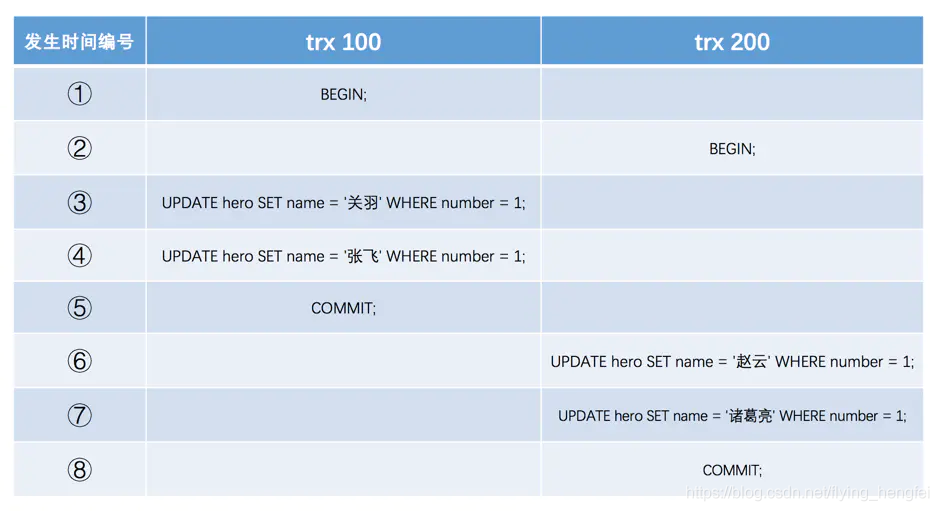
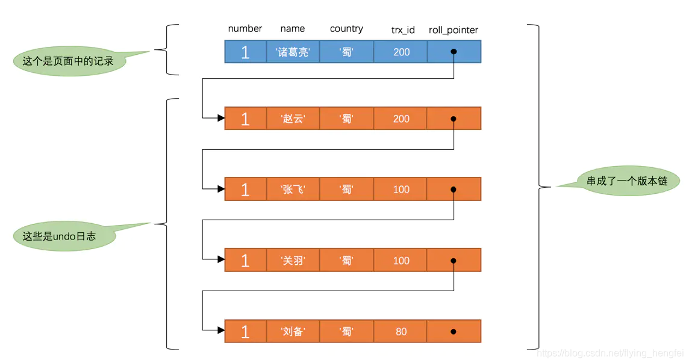

---
# 这是页面的图标
icon: page

# 这是文章的标题
title: MVCC 多版本并发控制

# 设置作者
author: lllllan

# 设置写作时间
# time: 2020-01-20

# 一个页面只能有一个分类
category: 数据库

# 一个页面可以有多个标签
tag:

# 此页面会在文章列表置顶
# sticky: true

# 此页面会出现在首页的文章板块中
star: true

# 你可以自定义页脚
# footer: 
---


::: warning 转载声明

- [MVCC到底是什么？](https://blog.csdn.net/flying_hengfei/article/details/106965517)
- [看一遍就理解：MVCC原理详解](https://juejin.cn/post/7016165148020703246#heading-15)
- [全网最全的一篇数据库MVCC详解](https://www.php.cn/mysql-tutorials-460111.html)

:::


## 一、MVCC

【Multi-Version Concurrency Control】多版本并发控制，MVCC 是一种并发控制的方法，一般在数据库管理系统中，实现对数据库的并发访问；在编程语言中实现事务内存。


> 通俗地讲，数据库中每条数据拥有多个版本，在某个事务要对数据进行操作时，取出该数据合适的版本，在整个事务的执行过程中，就依赖这个版本进行查询。
>
> 这种情况下的查询，查询得到的数据不一定是最新的，可能是历史版本


::: note MVCC 的作用

1. MVCC 在 MySQL InnoDB 中的实现主要是为了提高数据库并发性能，用更好的方式去处理【读-写冲突】，做到即使可能有读-写冲突时，也能做到不加锁，非阻塞并发读
2. ，MVCC 在尽量较少使用锁的情况下高效避免并发操作下可能导致的一些问题 [脏读、不可重复读、幻读](../transaction/#四、事务并发的问题)

:::


## 二、实现基础


### 2.1 隐藏列

对于 InnoDB 存储引擎，会有三个隐藏的列

|      列名      | 是否必须 |                             描述                             |
| :------------: | :------: | :----------------------------------------------------------: |
|     row_id     |    否    |      行ID，唯一标识一条记录（如果定义主键，它就没有啦）      |
| transaction_id |    是    |                    记录操作该数据的事务ID                    |
|  roll_pointer  |    是    | DB_ROLL_PTR是一个回滚指针，用于配合undo日志，指向上一个旧版本 |


### 2.2 undo log

undo log，回滚日志。用于记录数据被修改前的信息。在表记录修改之前，会先把数据拷贝到undo log里，如果事务回滚，即可以通过undo log来还原数据。

---


**insert undo log**

代表事务在 insert 新记录时产生的 undo log，只在事务回滚时需要，并且在事务提交后可以被立即丢弃。

****


**update undo log**

事务在进行 update 或 delete 时产生的 undo log，不仅在事务回滚时需要，在快照读时也需要。

不能随便删除，只有在快照读或事务回滚不涉及该日志时，对应的日志才会被 purge 线程统一清楚。


### 2.3 版本链


假设初始添加一条数据：


有两个事务同时进行更新信息，事务执行流程：



> 如果两个事务同时修改了这条数据，就会造成丢失修改。因此在 trx 100 进行修改的时候，对数据加锁， trx 200 必须等待 trx 100 提交事务以后才能继续操作。



对该记录每次更新后，都会将旧值放到一条undo日志中，就算是该记录的一个旧版本，随着更新次数的增多，所有的版本都会被【roll_pointer】属性连接成一个链表，我们把这个链表称之为版本链，版本链的头节点就是当前记录最新的值。另外，每个版本中还包含生成该版本时对应的事务id


### 2.4 快照读


**快照读：** 读取的是记录数据的可见版本（有旧的版本）。不加锁，普通的select语句都是快照读，如：

```mysql
select * from core_user where id > 2;
```


**当前读**：读取的是记录数据的最新版本，显式加锁的都是当前读

```mysql
select * from core_user where id > 2 for update;
select * from account where id > 2 lock in share mode;
```


### 2.5 Read View

Read View就是事务进行快照读操作的时候生产的读视图（Read View），在该事务执行的快照读的那一刻，会生成数据库系统当前的一个【快照】，记录并维护系统当前活跃事务的ID（当每个事务开启时，都会被分配一个ID，这个ID是递增的，所以最新的事务，ID值越大）

---


**四个属性**

- m_ids：表示在生成 ReadView 时当前系统中活跃的读写事务的事务id列表。
- min_trx_id：表示在生成 ReadView 时当前系统中活跃的读写事务中最小的事务id，也就是m_ids中的最小值。
- max_trx_id：表示生成 ReadView 时系统中应该分配给下一个事务的id值。
- creator_trx_id：表示生成该 ReadView 的事务的事务id。 

---


**Read View 匹配规则**


::: note trx_id < min_trx_id

【数据的事务ID，trx_id】小于【视图创建时活跃事务的最小ID，min_trx_id】，说明这条数据在该事务开启之前就已经存在了，所以这条记录 ==可见==

:::


::: note trx_id >= max_trx_id

【数据的事务ID，trx_id】小于【视图创建时下一个事务的ID，max_trx_id】，说明这条数据是在视图创建之后才产生的，所以这条记录不可见

:::


::: note min_trx_id <= trx_id < max_trx_id

- `trx_id 存在于 m_ids && trx_id == creator_id`

    【数据的事务ID，trx_id】等于【创建视图的事务ID，creator_id】，说明事务正在访问自己修改过的记录，所以这条记录 ==可见==

- `trx_id 存在于 m_ids && trx_id != creator_id`

    【数据的事务ID，trx_id】存在于【创建视图时活跃的事务列表，m_ids】，说明视图创建的时候，该事务还在活跃（还没提交），所以这条记录不可见

- `trx_id 不存在于 m_ids`

    【数据的事务ID，trx_id】不存在于【创建视图时活跃的事务列表，m_ids】，说明视图创建的时候，该事务就已经提交了，这条事务 ==可见==

:::


## 三、实现原理

1. 获取事务自己的版本号，即事务ID
2. 获取Read View
3. 查询得到的数据，然后Read View中的事务版本号进行比较。
4. 如果不符合Read View的可见性规则， 即就需要Undo log中历史快照;
5. 最后返回符合规则的数据


### 生成快照时机


::: danger

==只有【读已提交】【可重复读】两种隔离级别下会使用MVCC==；【读未提交】连脏读都不能避免，基本没有数据库会支持这种隔离级别了；【串行化】最高级别隔离直接上锁，让各个事务串行执行，自然也不需要MVCC。

:::


- 读已提交：每次快照读都会获取最新的 Read View
- 可重复读：同一事务下，只有第一次快照读会创建 Read View，之后的所有快照读都是使用这个视图。（也就是在InnoDB的可重复读隔离级别下，实现了避免幻读的问题）
