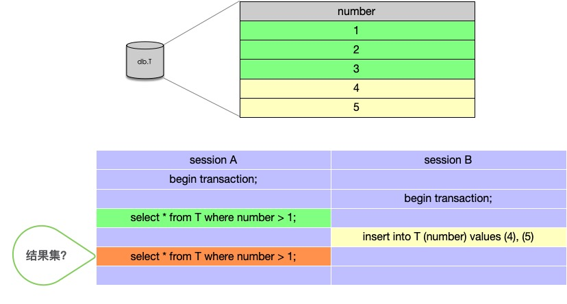
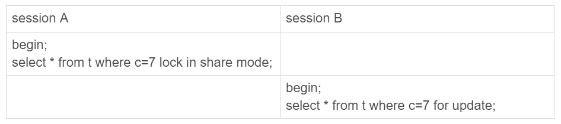

---
# 这是页面的图标
icon: page

# 这是文章的标题
title: 解决幻读

# 设置作者
author: lllllan

# 设置写作时间
# time: 2020-01-20

# 一个页面只能有一个分类
category: 数据库

# 一个页面可以有多个标签
tag:

# 此页面会在文章列表置顶
# sticky: true

# 此页面会出现在首页的文章板块中
star: true

# 你可以自定义页脚
# footer: 
---


::: warning 转载声明

- [MySQL实战45讲 (gitee.io)](https://funnylog.gitee.io/mysql45/iframe/)
- [MySQL 是如何解决幻读的 - 吴丹阳-cn](https://www.cnblogs.com/wudanyang/p/10655180.html#三mysql-是如何解决幻读的)
- [MYSQL（04）-间隙锁详解](https://www.jianshu.com/p/32904ee07e56)

:::


## 一、幻读

**因为一个事务的操作，导致另一个事务的前后两次查询结构不一致。**




## 二、InnoDB 解决幻读


select 查询分为快照读和实时读，在 InnoDB 中快照读通过 【MVCC（多版本并发控制）】来解决幻读，实时读通过【next-key锁】来解决。


::: info 快照读

InnoDB 在可重复读隔离级别下，普通的select查询语句都是快照读。

在一个事务内，多次执行 select 语句，查询得到的数据都是开始时那个状态的数据（有可能是历史数据，事务过程中其他事务的修改不可见），从而解决幻读。

:::


::: info 实时读

实时读就是查询当前数据库中的数据。

:::


### 2.1 next-key 锁

next-key 锁包含两部分：

- 行锁（锁住记录）
- 间隙锁（锁住记录之间的间隙）


假设有如下的表和数据。

```mysql
CREATE TABLE `t` (
  `id` int(11) NOT NULL,
  `c` int(11) DEFAULT NULL,
  `d` int(11) DEFAULT NULL,
  PRIMARY KEY (`id`),
  KEY `c` (`c`)
) ENGINE=InnoDB;

insert into t values(0,0,0), (5,5,5), (10,10,10), (15,15,15), (20,20,20), (25,25,25);
```


为了解决幻读的问题，InnoDB引入了间隙锁，就是锁住两个值之间的间隙：


这样，当你执行 `select * from t where d = 5 for update` 的时候，就不止是给数据库中已有的6个记录加上了行锁，还同时加了7个间隙锁。这样就确保了无法再插入新的记录，从而解决了幻读。


间隙锁和行锁合称【next-key lock】，每个 next-key lock 是 **前开后闭区间** 。也就是说，我们的表t初始化以后，如果用 `select * from t for update` 要把整个表所有记录锁起来，就形成了7个next-key lock，分别是 (-∞,0]、(0,5]、(5,10]、(10,15]、(15,20]、(20, 25]、(25, +suprenum]。

> InnoDB给每个索引加了一个不存在的最大值suprenum，这样才符合我们前面说的“都是前开后闭区间”


::: tip 锁冲突

现在你知道了，数据行是可以加上锁的实体，数据行之间的间隙，也是可以加上锁的实体。但是间隙锁跟我们之前碰到过的锁都不太一样。


比如行锁，分成读锁和写锁。下图就是这两种类型行锁的冲突关系。


---


但是间隙锁不一样，**跟间隙锁存在冲突关系的，是“往这个间隙中插入一个记录”这个操作。**间隙锁之间都不存在冲突关系。



这里session B并不会被堵住。因为表t里并没有c=7这个记录，因此session A加的是间隙锁(5,10)。而session B也是在这个间隙加的间隙锁。它们有共同的目标，即：保护这个间隙，不允许插入值。但，它们之间是不冲突的。

:::


### 2.2 MVCC 多版本并发控制

[跳转](../mvcc/)


## 三、间隙锁加锁机制

看了几篇博客，甚至不能统一，看不太懂，不知道哪个准确，就先放着
