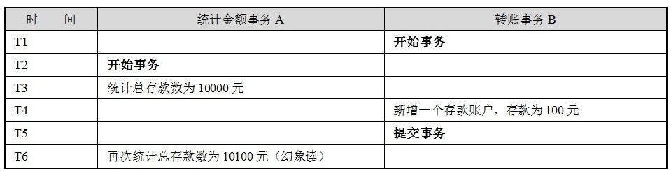
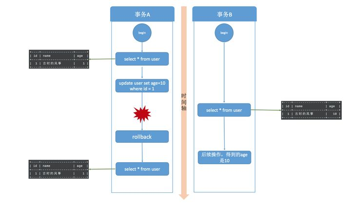
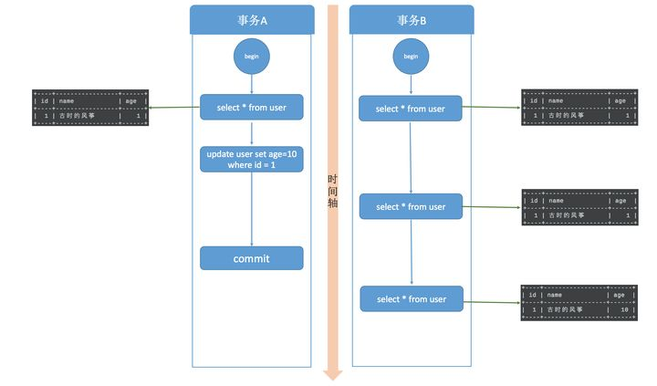

---
# 这是页面的图标
icon: page

# 这是文章的标题
title: 事务隔离

# 设置作者
author: lllllan

# 设置写作时间
# time: 2020-01-20

# 一个页面只能有一个分类
category: 数据库

# 一个页面可以有多个标签
tag:

# 此页面会在文章列表置顶
# sticky: true

# 此页面会出现在首页的文章板块中
star: true

# 你可以自定义页脚
# footer: 


---


::: warning 转载声明

- [MySQL实战45讲 (gitee.io)](https://funnylog.gitee.io/mysql45/iframe/)
- [MySQL事务【详解-最新的总结】](https://blog.csdn.net/wang_luwei/article/details/119619105)
- [MySQL事务 - 简书 (jianshu.com)](https://www.jianshu.com/p/081a3e208e32)
- [MySQL 事务 | 菜鸟教程 (runoob.com)](https://www.runoob.com/mysql/mysql-transaction.html)
- [事务并发的问题](https://blog.csdn.net/dingguanyi/article/details/80888441)
- [MySQL事务隔离级别和实现原理](https://zhuanlan.zhihu.com/p/117476959)

:::


## 一、什么是事务


::: info 事务

是指对数据库执行一批操作，在同一个事务当中，这些操作最终要么全部执行成功，要么全部失败，不会存在部分成功的情况。

:::


- 事务是一个原子操作。是一个最小执行单元。可以甶一个或多个SQL语句组成
- 在同一个事务当中，所有的SQL语句都成功执行时，整 个事务成功，有一个SQL语句执行失败，整个事务都执行失败。


> 比如A用户给B用户转账100操作，过程如下：
>
> - 从A账户扣100
> - 给B账户加100
>
> 
>
> 如果在事务的支持下，上面最终只有2种结果：
>
> - 操作成功：A账户减少100；B账户增加100
> - 操作失败：A、B两个账户都没有发生变化
>
> 
>
> 如果没有事务的支持，可能出现错：A账户减少了100，此时系统挂了，导致B账户没有加上100，而A账户凭空少了100。


## 二、事务四大特征


### 原子性

原子性（**A**tomicity，或称不可分割性）

一个事务（transaction）中的所有操作，要么全部完成，要么全部不完成，不会结束在中间某个环节。事务在执行过程中发生错误，会被回滚（Rollback）到事务开始前的状态，就像这个事务从来没有执行过一样

---


### 一致性

一致性（**C**onsistency）

在事务开始之前和事务结束以后，数据库的完整性没有被破坏。这表示写入的资料必须完全符合所有的预设规则，这包含资料的精确度、串联性以及后续数据库可以自发性地完成预定的工作。

> 例如从帐户A转一笔钱到帐户B上，如果帐户A上的钱减少了，而帐户B上的钱却没有增加，那么我们认为此时数据处于不一致的状态。

---


### 隔离性

隔离性（**I**solation，又称独立性）

数据库允许多个并发事务同时对其数据进行读写和修改的能力，隔离性可以防止多个事务并发执行时由于交叉执行而导致数据的不一致。事务隔离分为不同级别，包括读未提交（Read uncommitted）、读提交（read committed）、可重复读（repeatable read）和串行化（Serializable）

---


### 持久性

持久性（**D**urability）

事务处理结束后，对数据的修改就是永久的，即便系统故障也不会丢失


## 三、事务操作


### 3.1 显式事务

事务需要手动开启、提交或回滚，由开发者自己控制。


**手动开启事务**

```mysql
mysql> start transaction;
```


**执行语句**

```mysql
mysql> update ...
```


**提交事务**

```mysql
mysql> commit;
```


**回滚事务**

```mysql
mysql> rollback;
```


### 3.2 隐式事务

事务自动开启、提交或回滚，比如insert、update、delete语句，事务的开启、提交或回滚由mysql内部自动控制的。


## 四、事务并发的问题

一个数据库可能拥有多个访问客户端，这些客户端都可以并发方式访问数据库。数据库中的相同数据可能同时被多个事务访问，如果没有采取必要的隔离措施，就会导致各种并发问题，破坏数据的完整性。

这些问题可以归结为5类，包括3类数据读问题（ 脏读、 不可重复读和幻象读）以及2类数据更新问题（两类丢失更新）


### 4.1 脏读

**因为事务的撤销，导致另一事务读到了提交以前的脏数据。**

脏读又称无效数据的读出，是指在数据库访问中，事务T1将某一值修改，然后事务T2读取该值，此后T1因为某种原因撤销对该值的修改，这就导致了T2所读取到的数据是无效的，值得注意的是，脏读一般是针对于update操作的。


### 4.2 不可重复度

**因为事务的提交修改了数据，导致另一事务的前后两次查询得到了不同的结果。**


### 4.3 幻读

**因为事务的提交增删了数据，导致另一事务的前后两次查询得到了不同的结果**




::: tip

**不可重复读** ，是因为 `update` 操作，导致某个事务的前后两次查询，得到了不一致的结果。


**幻读** ，是因为 `insert, delete` 操作，导致某个事务的第二次查询比前一次查询多了或少了某条数据

:::


### 4.4 丢失更新

**因为事务的撤销，覆盖了另一事务的修改**


**因为事务的提交，覆盖了另一事务的修改**


## 五、事务隔离级别

- 读未提交：read uncommitted
- 读已提交：read committed
- 可重复读：repeatable read
- 串行化：serializable


### 5.1 读未提交

**事务能够读到另一事务提交以前所修改的数据** 




读未提交，其实就是可以读到其他事务未提交的数据，但没有办法保证你读到的数据最终一定是提交后的数据，如果中间发生回滚，那就会出现脏数据问题，读未提交没办法解决脏数据问题。更别提可重复读和幻读了，想都不要想。


### 5.2 读已提交

**事务只能读到其他事务提交以后的数据**

这种级别能够避免脏读，但是仍然可能导致不可重复读




每个 select 语句都有自己的一份快照，而不是一个事务一份，所以在不同的时刻，查询出来的数据可能是不一致的。

读提交解决了脏读的问题，但是无法做到可重复读，也没办法解决幻读。


### 5.3 可重复读

**事务范围内如果有其他事务提交，必须自己也提交事务后才能读取到该结果。**


可重复是对比不可重复而言的，上面说不可重复读是指同一事物不同时刻读到的数据值可能不一致。

事务不会读到其他事务 **对已有数据的修改**，即使其他事务已提交，也就是说，事务开始时读到的已有数据是什么，在事务提交前的任意时刻，这些数据的值都是一样的。但是，对于其他事务新插入的数据是可以读到的，这也就引发了幻读问题。


::: tip 为什么上了锁，其他事务还能读？

InnoDB 有 MVCC机制（多版本并发控制），可以使用快照读，而不会被阻塞

:::


::: info

要说明的是，当你在 MySQL 中测试幻读的时候，并不会出现上图的结果，幻读并没有发生，MySQL 的可重复读隔离级别其实解决了幻读问题，这会在后面的内容说明

:::


### 5.4 串行化

串行化是4种事务隔离级别中隔离效果最好的，解决了脏读、可重复读、幻读的问题，但是效果最差，它将事务的执行变为顺序执行，与其他三个隔离级别相比，它就相当于单线程，后一个事务的执行必须等待前一个事务结束。


## 六、事务隔离的实现


### 6.1 读未提交、串行化

首先说读未提交，它是性能最好，也可以说它是最野蛮的方式，因为它压根儿就不加锁，所以根本谈不上什么隔离效果，可以理解为没有隔离。

再来说串行化。读的时候加共享锁，也就是其他事务可以并发读，但是不能写。写的时候加排它锁，其他事务不能并发写也不能并发读。


### 6.2 实现可重复读

为了解决不可重复读，或者为了实现可重复读，MySQL 采用了 MVVC (多版本并发控制) 的方式。


我们在数据库表中看到的一行记录可能实际上有多个版本，每个版本的记录除了有数据本身外，还要有一个表示版本的字段，记为 row trx_id，而这个字段就是使其产生的事务的 id，事务 ID 记为 transaction id，它在事务开始的时候向事务系统申请，按时间先后顺序递增。


可重复读是在事务开始的时候生成一个当前事务全局性的快照，而读提交则是每次执行语句的时候都重新生成一次快照。

对于一个快照来说，它能够读到那些版本数据，要遵循以下规则：

1. 当前事务内的更新，可以读到；
2. 版本未提交，不能读到；
3. 版本已提交，但是却在快照创建后提交的，不能读到；
4. 版本已提交，且是在快照创建前提交的，可以读到；


### 6.3 并发写问题


假设事务A执行 update 操作， update 的时候要对所修改的行加行锁，这个行锁会在提交之后才释放。而在事务A提交之前，事务B也想 update 这行数据，于是申请行锁，但是由于已经被事务A占有，事务B是申请不到的，此时，事务B就会一直处于等待状态，直到事务A提交，事务B才能继续执行，如果事务A的时间太长，那么事务B很有可能出现超时异常。如下图所示。


**有索引情况下加锁**

```mysql
update user set age=11 where id = 1
```

id 是这张表的主键，是有索引的情况，那么 MySQL 直接就在索引数中找到了这行数据，然后干净利落的加上行锁就可以了。

---


**无索引情况下加锁**

```mysql
update user set age=11 where age=10
```

表中并没有为 age 字段设置索引，所以， MySQL 无法直接定位到这行数据。那怎么办呢，当然也不是加表锁了。**MySQL 会为这张表中所有行加行锁**，没错，是所有行。但是呢，在加上行锁后，MySQL 会进行一遍过滤，发现不满足的行就释放锁，最终只留下符合条件的行。虽然最终只为符合条件的行加了锁，但是这一锁一释放的过程对性能也是影响极大的。所以，如果是大表的话，建议合理设计索引，如果真的出现这种情况，那很难保证并发度。


### 6.4 解决幻读


MySQL 已经在可重复读隔离级别下解决了幻读的问题。

解决幻读用的锁叫做间隙锁，MySQL 把行锁和间隙锁合并在一起，解决了并发写和幻读的问题，这个锁叫做  ==Next-Key锁==


假设现在表中有两条记录，并且 age 字段已经添加了索引，两条记录 age 的值分别为 10 和 30。


此时，在数据库中会为索引维护一套B+树，用来快速定位行记录。B+索引树是有序的，所以会把这张表的索引分割成几个区间。


在事务A提交之前，事务B的插入操作只能等待，这就是间隙锁起得作用。当事务A执行`update user set name='风筝2号’ where age = 10;` 的时候，由于条件 where age = 10 ，数据库不仅在 age =10 的行上添加了行锁，而且在这条记录的两边，也就是(负无穷,10]、(10,30]这两个区间加了间隙锁，从而导致事务B插入操作无法完成，只能等待事务A提交。不仅插入 age = 10 的记录需要等待事务A提交，age<10、10<age<30 的记录页无法完成，而大于等于30的记录则不受影响，这足以解决幻读问题了。

这是有索引的情况，如果 age 不是索引列，那么数据库会为整个表加上间隙锁。所以，如果是没有索引的话，不管 age 是否大于等于30，都要等待事务A提交才可以成功插入。
