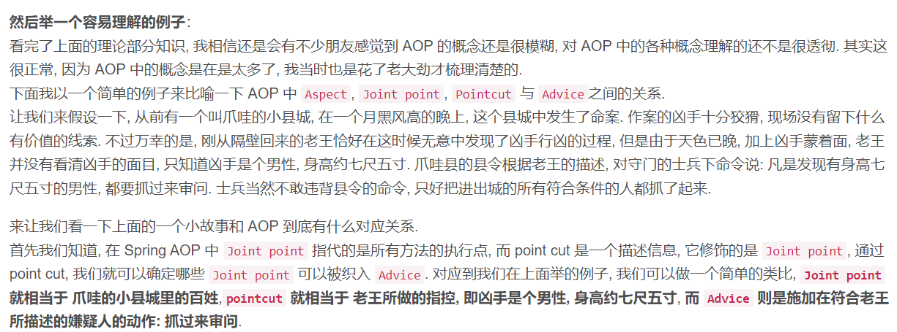

---
# 这是页面的图标
icon: info

# 这是文章的标题
title: 框架技术概览

# 设置作者
author: lllllan

# 设置写作时间
# time: 2020-01-20

# 一个页面只能有一个分类
category: 

# 一个页面可以有多个标签
tag:

# 此页面会在文章列表置顶
# sticky: true

# 此页面会出现在首页的文章板块中
star: true

# 你可以自定义页脚
# footer: 
---

::: warning 转载声明

- [AOP 面向切面编程 - 简书 (jianshu.com)](https://www.jianshu.com/p/f1770b9dce27)
- [细说Spring——AOP详解（AOP概览）_Jivan2233的博客-CSDN博客_aop](https://blog.csdn.net/q982151756/article/details/80513340)
- [Spring(4)——面向切面编程（AOP模块） - 简书 (jianshu.com)](https://www.jianshu.com/p/994027425b44)

:::

## AOP

[细说Spring——AOP详解（AOP概览）_Jivan2233的博客-CSDN博客_aop](https://blog.csdn.net/q982151756/article/details/80513340)

AOP全称 `Aspect Oriented Programming` 意为面向切面编程，也叫做面向方法编程， ==是通过预编译方式和运行期动态代理的方式实现不修改源代码的情况下给程序动态统一添加功能的技术== 。

AOP技术利用一种称为【横切】的技术，剖解开封装对象的内部，将影响多个类的公共行为封装到一个可重用的模块中，并将其命名为 `Aspect` 切面。 ==利用AOP可以对业务逻辑各个部分进行隔离，从而使业务逻辑各部分之间的耦合度降低，提高程序的可重用性，同时提高开发效率。==

- 连接点，join point。连接点是程序过程中 **能够** 插入切面的点。
- 切入点，point cut。真正插入切面连接点。
- 通知，advice。在切入点中具体要做的事情。
- 切面，aspect。切入点 + 通知，在什么时候、什么地方做什么事情。
- 织入，weaving。把切面切入到对象，并创建出代理对象的过程。

> 好奇怪的描述，不是特别明确。

