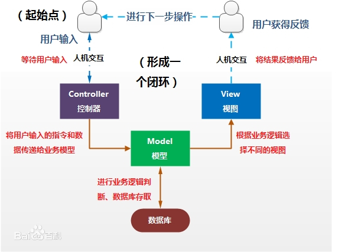

---
# 这是页面的图标
icon: page

# 这是文章的标题
title: MVC

# 设置作者
author: lllllan

# 设置写作时间
# time: 2020-01-20

# 一个页面只能有一个分类
category: 技术

# 一个页面可以有多个标签
tag:
- 框架

# 此页面会在文章列表置顶
# sticky: true

# 此页面会出现在首页的文章板块中
star: true

# 你可以自定义页脚
# footer: 
---


::: warning 转载声明

- [MVC框架_百度百科 (baidu.com)](https://baike.baidu.com/item/MVC框架/9241230)
- [MVC 模式 | 菜鸟教程 (runoob.com)](https://www.runoob.com/design-pattern/mvc-pattern.html)
- [MVC 模式及其优缺点](https://zhuanlan.zhihu.com/p/78891947)
- [mvc模式有哪些优缺点](https://www.php.cn/php-weizijiaocheng-415962.html)

:::


经典MVC模式中，M是指业务模型，V是指用户界面，C则是控制器，使用MVC的目的是将M和V的实现代码分离，从而使同一个程序可以使用不同的表现形式。其中，View的定义比较清晰，就是用户界面。

- V 即 `View` 视图是指用户看到并与之交互的界面。

  > 比如由html元素组成的网页界面，或者软件的客户端界面。MVC的好处之一在于它能为应用程序处理很多不同的视图。在视图中其实没有真正的处理发生，它只是作为一种输出数据并允许用户操作的方式。

- M 即 `model` 模型是指模型表示业务规则。

  > 在MVC的三个部件中，模型拥有最多的处理任务。被模型返回的数据是中立的，模型与数据格式无关，这样一个模型能为多个视图提供数据，由于应用于模型的代码只需写一次就可以被多个视图重用，所以减少了代码的重复性。

- C 即 `controller` 控制器是指控制器接受用户的输入并调用模型和视图去完成用户的需求

  > 控制器本身不输出任何东西和做任何处理。它只是接收请求并决定调用哪个模型构件去处理请求，然后再确定用哪个视图来显示返回的数据。




## 代码实现 MVC


:::: code-group


::: code-group-item 模型

```java
public class Student {
    private String rollNo;
    private String name;
    
    public String getRollNo() {
        return rollNo;
    }
    
    public void setRollNo(String rollNo) {
        this.rollNo = rollNo;
    }
    
    public String getName() {
        return name;
    }
    
    public void setName(String name) {
        this.name = name;
    }
}
```

:::


::: code-group-item 视图

```java
public class StudentView {
    public void printStudentDetails(String studentName, String studentRollNo){
        System.out.println("Student: ");
        System.out.println("Name: " + studentName);
        System.out.println("Roll No: " + studentRollNo);
    }
}
```

:::


::: code-group-item 控制器

```java
public class StudentController {
    private Student model;
    private StudentView view;

    public StudentController(Student model, StudentView view){
        this.model = model;
        this.view = view;
    }

    public void setStudentName(String name){
        model.setName(name);    
    }

    public String getStudentName(){
        return model.getName();    
    }

    public void setStudentRollNo(String rollNo){
        model.setRollNo(rollNo);      
    }

    public String getStudentRollNo(){
        return model.getRollNo();     
    }

    public void updateView(){           
        view.printStudentDetails(model.getName(), model.getRollNo());
    }  
}
```

:::


::::


使用 *StudentController* 方法来演示 MVC 设计模式的用法。

```java
public class MVCPatternDemo {
   public static void main(String[] args) {
 
      //从数据库获取学生记录
      Student model  = retrieveStudentFromDatabase();
 
      //创建一个视图：把学生详细信息输出到控制台
      StudentView view = new StudentView();
 
      StudentController controller = new StudentController(model, view);
 
      controller.updateView();
 
      //更新模型数据
      controller.setStudentName("John");
 
      controller.updateView();
   }
 
   private static Student retrieveStudentFromDatabase(){
      Student student = new Student();
      student.setName("Robert");
      student.setRollNo("10");
      return student;
   }
}
```


## MVC 的优缺点


::: tip MVC 的优点

- **降低代码耦合性**。在 MVC 模式中，三个层各施其职，所以如果一旦哪一层的需求发生了变化，就只需要更改相应的层中的代码而不会影响到其他层中的代码。

- **有利于分工合作**。在 MVC 模式中，由于按层把系统分开，那么就能更好的实现开发中的分工。

- **有利于组件的重用**。如控制层可独立成一个能用的组件，表示层也可做成通用的操作界面。可以为一个模型在运行时同时建立和使用多个视图。

- **模型具备可移植性**。由于模型是独立于视图的因此可以把它独立的移植到新的工作平台上而且只需要在新的平台上对视图和控制器进行新的修改就可以了

:::


::: warning MVC 的缺点

- **增加了系统结构和实现的复杂性**。对于简单的界面，严格遵循 MVC，使模型、视图与控制器分离，会增加结构的复杂性，并可能产生过多的更新操作，降低运行效率。

- **降低系统的性能**。由于视图不能直接访问数据库需要控制器来帮助因此降低了性能
- **给调试增添了困难**。由于模型和视图要严格分离，这样给调试增添了困难，而且级联层级的修改是自上而下的如果某块业务只需要新增一个视图，而这个新增就会因为MVC模式思想的限制而去增加业务逻辑层和数据访问层的代码。

:::
