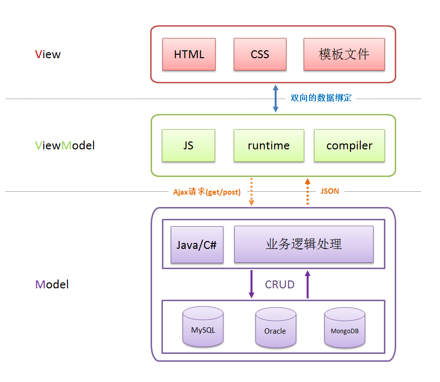

---
# 这是页面的图标
icon: page

# 这是文章的标题
title: MVVM

# 设置作者
author: lllllan

# 设置写作时间
# time: 2020-01-20

# 一个页面只能有一个分类
category: 技术

# 一个页面可以有多个标签
tag:
- 框架

# 此页面会在文章列表置顶
# sticky: true

# 此页面会出现在首页的文章板块中
star: true

# 你可以自定义页脚
# footer: 

---


::: warning 转载声明

- [MVVM_百度百科 (baidu.com)](https://baike.baidu.com/item/MVVM/96310)
- [什么是MVVM框架？](https://zhuanlan.zhihu.com/p/59467370)
- [前后端分手大师——MVVM 模式 - DOM哥 - 博客园 (cnblogs.com)](https://www.cnblogs.com/iovec/p/7840228.html)

:::


MVVM 是 Model-View-ViewModel 的简写。它本质上就是MVC 的改进版


**比MVC架构中多了一个ViewModel**，没错，就是这个ViewModel，他是MVVM相对于MVC改进的核心思想。在开发过程中，由于需求的变更或添加，项目的复杂度越来越高，代码量越来越大，此时我们会发现MVC维护起来有些吃力，首先被人吐槽的最多的就是MVC的简写变成了Massive-View-Controller（意为沉重的Controller）

由于Controller主要用来处理各种逻辑和数据转化，复杂业务逻辑界面的Controller非常庞大，维护困难，所以有人想到**把Controller的数据和逻辑处理部分从中抽离出来，用一个专门的对象去管理，这个对象就是ViewModel，是Model和Controller之间的一座桥梁**。当人们去尝试这种方式时，发现Controller中的代码变得非常少，变得易于测试和维护，只需要**Controller和ViewModel做数据绑定**即可，这也就催生了MVVM的热潮。





**View 层**

View 是视图层，也就是用户界面。前端主要由 HTML 和 CSS 来构建，为了更方便地展现 ViewModel 或者 Model 层的数据，已经产生了各种各样的前后端模板语言，比如 FreeMarker、Marko、Pug、Jinja2等等，各大 MVVM 框架如 KnockoutJS，Vue，Angular 等也都有自己用来构建用户界面的内置模板语言。

----


**Model 层**

Model 是指数据模型，泛指后端进行的各种业务逻辑处理和数据操控，主要围绕数据库系统展开。

后端业务处理再复杂跟我们前端也没有半毛钱关系，只要后端保证对外接口足够简单就行了，我请求api，你把数据返出来，咱俩就这点关系，其他都扯淡。

---


**ViewModel 层**

ViewModel 是由前端开发人员组织生成和维护的视图数据层。在这一层，前端开发者对从后端获取的 Model 数据进行转换处理，做二次封装，以生成符合 View 层使用预期的视图数据模型。


需要注意的是 ViewModel 所封装出来的数据模型包括视图的状态和行为两部分，而 Model 层的数据模型是只包含状态的，比如页面的这一块展示什么，那一块展示什么这些都属于视图状态（展示），而页面加载进来时发生什么，点击这一块发生什么，这一块滚动时发生什么这些都属于视图行为（交互），视图状态和行为都封装在了 ViewModel 里。这样的封装使得 ViewModel 可以完整地去描述 View 层。


## 代码实现


:::: code-group


::: code-group-item View 层

```html
<div id="app">
    <p>{{message}}</p>
    <button v-on:click="showMessage()">Click me</button>
</div>
```

:::


::: code-group-item Model 层

```java
// （省略业务逻辑处理，只描述对外接口）
{
    "url": "/your/server/data/api",
    "res": {
        "success": true,
        "name": "IoveC",
        "domain": "www.cnblogs.com"
    }
}
```

:::


::: code-group-item ViewModel 层

```js
var app = new Vue({
    el: '#app',
    data: {     // 用于描述视图状态（有基于 Model 层数据定义的，也有纯前端定义）
        message: 'Hello Vue!',  // 纯前端定义
        server: {}, // 存放基于 Model 层数据的二次封装数据
    },
    methods: {  // 用于描述视图行为（完全前端定义）
        showMessage(){
            let vm = this;
            alert(vm.message);
        }
    },
    created(){
        let vm = this;

        // Ajax 获取 Model 层的数据
        ajax({
            url: '/your/server/data/api',
            success(res){
                // TODO 对获取到的 Model 数据进行转换处理，做二次封装
                vm.server = res;
            }
        });
    }
})
```

:::


::::


## 优点

1. **低耦合**。视图（View）可以独立于Model变化和修改，一个ViewModel可以绑定到不同的"View"上，当View变化的时候Model可以不变，当Model变化的时候View也可以不变。

2. **可重用性**。你可以把一些视图逻辑放在一个ViewModel里面，让很多view重用这段视图逻辑。

3. **独立开发**。开发人员可以专注于业务逻辑和数据的开发（ViewModel），设计人员可以专注于页面设计，使用Expression Blend可以很容易设计界面并生成xaml代码。

4. **可测试**。界面素来是比较难于测试的，测试可以针对ViewModel来写。
