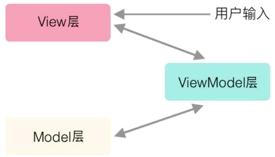

---
# 这是页面的图标
icon: page

# 这是文章的标题
title: MVVM

# 设置作者
author: lllllan

# 设置写作时间
# time: 2020-01-20

# 一个页面只能有一个分类
category: 技术

# 一个页面可以有多个标签
tag:
- 框架

# 此页面会在文章列表置顶
# sticky: true

# 此页面会出现在首页的文章板块中
star: true

# 你可以自定义页脚
# footer: 

---


::: warning 转载声明

- [MVVM_百度百科 (baidu.com)](https://baike.baidu.com/item/MVVM/96310)
- [什么是MVVM框架？](https://zhuanlan.zhihu.com/p/59467370)
- [前后端分手大师——MVVM 模式 - DOM哥](https://www.cnblogs.com/iovec/p/7840228.html)
- [MVC、MVP、MVVM的区别和联系](http://c.biancheng.net/view/7743.html)
- [mvc和mvvm的区别](https://www.jianshu.com/p/b0aab1ffad93)

:::


MVVM 是 Model-View-ViewModel 的简写。它本质上就是MVC 的改进版





::: tip 与 MVC 的区别

最直接的区别是，在 MVC 中，用户通过 Controller 进行输入，在 View 层得到反馈。

而在 MVVM 中，用户的全部交互都在 View 层。

:::


## MVC 的臃肿

就像我们之前分析MVC是如何合理分配工作的一样，我们需要数据所以有了M，我们需要界面所以有了V，而我们需要找一个地方把M赋值给V来显示，所以有了C，然而我们忽略了一个很重要的操作：**数据解析**。

在MVC出生的年代，手机APP的数据往往都比较简单，没有现在那么复杂，所以那时的数据解析很可能一步就解决了，所以既然有这样一个问题要处理，而面向对象的思想就是用类和对象来解决问题，显然V和M早就被定义死了，它们都不应该处理“解析数据”的问题，理所应当的，“解析数据”这个问题就交给C来完成了。而现在的手机App功能越来越复杂，数据结构也越来越复杂，所以数据解析也就没那么简单了。如果我们继续按照MVC的设计思路，将数据解析的部分放到了Controller里面，那么Controller就将变得相当臃肿。


## MVVM 的分层

虽然 MVVM 中没有 C，但是 Controller 层还在，只是存在感被弱化了。


**View**

View 是视图层，也就是用户界面。

---


**Model**

Model 是指数据模型，泛指后端进行的各种业务逻辑处理和数据操控，主要围绕数据库系统展开。

---


**ViewModel**

Model 中的数据一般指原始数据，而 View 层想要获取的数据是复杂的，这时就需要 ViewModel 层从 Model 层获取原始数据，分析处理过之后再交给 View

---


**Controller**

Controller 层还在，它只是接收请求并决定调用哪个接口来处理请求。而处理操作都在 ViewModel 层完成，减少了 Controller 的工作量，也就弱化了存在感。


## 代码实现


:::: code-group


::: code-group-item View 层

```html
<div id="app">
    <p>{{message}}</p>
    <button v-on:click="showMessage()">Click me</button>
</div>
```

:::


::: code-group-item Model 层

```java
// （省略业务逻辑处理，只描述对外接口）
{
    "url": "/your/server/data/api",
    "res": {
        "success": true,
        "name": "IoveC",
        "domain": "www.cnblogs.com"
    }
}
```

:::


::: code-group-item ViewModel 层

```js
var app = new Vue({
    el: '#app',
    data: {     // 用于描述视图状态（有基于 Model 层数据定义的，也有纯前端定义）
        message: 'Hello Vue!',  // 纯前端定义
        server: {}, // 存放基于 Model 层数据的二次封装数据
    },
    methods: {  // 用于描述视图行为（完全前端定义）
        showMessage(){
            let vm = this;
            alert(vm.message);
        }
    },
    created(){
        let vm = this;

        // Ajax 获取 Model 层的数据
        ajax({
            url: '/your/server/data/api',
            success(res){
                // TODO 对获取到的 Model 数据进行转换处理，做二次封装
                vm.server = res;
            }
        });
    }
})
```

:::


::::


## 优点

1. **低耦合**。视图（View）可以独立于Model变化和修改，一个ViewModel可以绑定到不同的"View"上，当View变化的时候Model可以不变，当Model变化的时候View也可以不变。

2. **可重用性**。你可以把一些视图逻辑放在一个ViewModel里面，让很多view重用这段视图逻辑。

3. **独立开发**。开发人员可以专注于业务逻辑和数据的开发（ViewModel），设计人员可以专注于页面设计，使用Expression Blend可以很容易设计界面并生成xaml代码。

4. **可测试**。界面素来是比较难于测试的，测试可以针对ViewModel来写。
