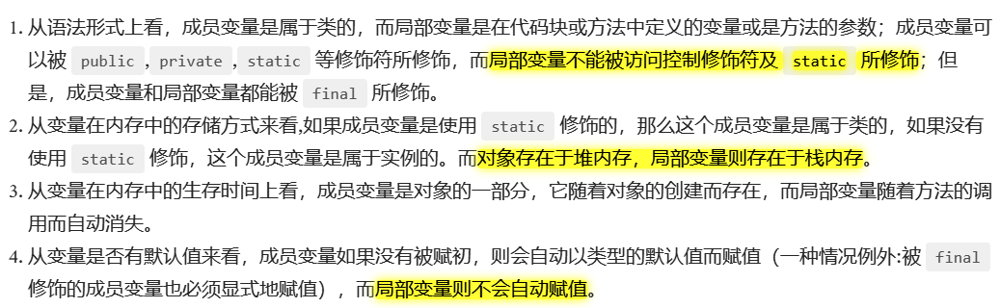

---
# 这是页面的图标
icon: page

# 这是文章的标题
title: Java - 数据类型

# 设置作者
author: lllllan

# 设置写作时间
# time: 2020-01-22 16:07

# 一个页面只能有一个分类
category: Java

# 一个页面可以有多个标签
tag:
- Java基础

# 此页面会在文章列表置顶
# sticky: true

# 此页面会出现在首页的文章板块中
star: true

# 你可以自定义页脚
# footer:

---


::: warning 转载声明

- [JavaGuide](https://javaguide.cn/)

:::


## 一、数据类型


| 类型名称     | 关键字  | 占用内存 | 取值范围                                   |
| ------------ | ------- | -------- | ------------------------------------------ |
| 字节型       | byte    | 1 字节   | -128~127                                   |
| 短整型       | short   | 2 字节   | -32768~32767                               |
| 整型         | int     | 4 字节   | -2147483648~2147483647                     |
| 长整型       | long    | 8 字节   | -9223372036854775808L~9223372036854775807L |
| 布尔型       | boolean | 1 字节   | true 或 false                              |
| 字符型       | char    | 2 字节   | ISO 单一字符集                             |
| 单精度浮点型 | float   | 4 字节   | +/-3.4E+38F（6~7 个有效位）                |
| 双精度浮点型 | double  | 8 字节   | +/-1.8E+308 (15 个有效位）                 |

 

::: info 各种数据的存放位置

- 只要是全局变量，就全都存放在堆中。
- 如果是局部变量，基本数据类型和引用存放在栈中，对象实体存放在堆中。

:::


## 二、变量

### 2.1 成员变量和局部变量的区别




### 2.2  静态变量和实例变量的区别

- 静态变量：被 `static` 修饰，也称类变量。它属于类，因此不管创建多少个对象，该静态变量在内存中有且仅有一个拷贝。静态变量可以实现多个对象共享内存
- 实例变量：属于某一实例，需要先创建对象，然后通过对象才能访问得到


## 三、包装类


### 3.1 Integer 和 int 的区别？ 

1. int 是 Java 的⼋种基本数据类型之⼀，⽽ `Integer` 是 Java 为 int 类型提供的封装类
2. int 型变量的默认值是 0，Integer 变量的默认值是 null，这⼀点说明 Integer 可以区分出未赋值和值为 0 的 区分
3. Integer 变量必须实例化后才可以使⽤，⽽ int 不需要。


### 3.2 Integer 之间的比较

1. 两个 `new()` 出来的 `Integer` 进行比较：因为是两个对象，进行比较的其内存地址，结果均为 false
2. `Integer` 和 `int` 进行比较：包装类和基本数据类型进行比较时，会对包装类进行拆包装为基本数据类型，所以最后是两个 `int` 在比较。只要数值相等就为 true
3. 非new生成的 `Integer` 和 `new integer()` 进行比较：前者指向 Java 常量池中的对象、后者指向堆中的对象，内存地址不同，结果均为 false
4. 两个非new生成的 `Integer` 进行比较：如果数值相等并且变量值在 `[-128, 127]` 之间，比较结果为 true，否则为 false。

```java
public static Integer valueOf(int var0) { 
    return var0 >= -128 && var0 <= Integer.IntegerCache.high ?
		Integer.IntegerCache.cache[var0 + 128] : new Integer(var0);
}
```


### 3.3 包装类的常量池

`Byte`、`Short`、`Integer`、`Long` 这 4 种包装类默认创建了数值 **[-128，127]** 的相应类型的缓存数据，`Character` 创建了数值在 **[0,127]** 范围的缓存数据，`Boolean` 直接返回 `True` or `False`。 


解释来说呢，大概就是以上几种类型中，创建的对象大小在约定的范围之内，该对象会在cache中长生（如果已存在将会复用）。

- 节省内存空间：常量池中所有相同的对象常量被合并，只占用一个空间。
- 节省运行时间：比较字符串时，==比equals()快。对于两个引用变量，只用==判断引用是否相等，也就可以判断实际值是否相等。


### 3.4 装箱和拆箱

⾃动装箱是 Java 编译器在基本数据类型和对应得包装类之间做的⼀个转化。⽐如：把 int 转化成 Integer，double 转化成 Double 等等。反之就是⾃动拆箱。 

原始类型：boolean、char、byte、short、int、long、float、double 

封装类型：Boolean、Character、Byte、Short、Integer、Long、Float、Double

