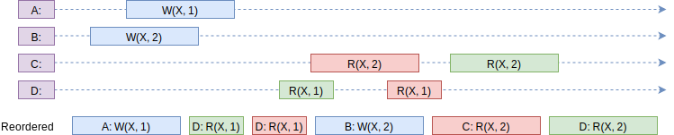

---
# 这是页面的图标
icon: page

# 这是文章的标题
title: 顺序一致性

# 设置作者
author: lllllan

# 设置写作时间
# time: 2020-01-20

# 一个页面只能有一个分类
category: Java

# 一个页面可以有多个标签
tag:
- Java 多线程

# 此页面会在文章列表置顶
# sticky: true

# 此页面会出现在首页的文章板块中
star: true

# 你可以自定义页脚
# footer: 

---

::: warning 转载声明

- [什么是顺序一致性(Sequential Consistency) | 三点水 (lotabout.me)](https://lotabout.me/2019/QQA-What-is-Sequential-Consistency/)

:::

## 什么是顺序一致性

顺序一致性内存模型是一个**理想化的理论参考模型**，它为程序员提供了极强的内存可见性保证。

::: info 顺序一致性模型 两大特性

- ==一个线程中== 的所有操作必须按照程序的顺序（即Java代码的顺序）来执行。
- 不管程序是否同步，所有线程都只能看到一个单一的操作执行顺序。即在顺序一致性模型中，每个操作必须是**原子性的，且立刻对所有线程可见**。

:::

如果可以找到一个所有 CPU 执行指令的排序，该排序中 **每个 CPU 要执行指令的顺序得以保持** [1]，且 **实际的 CPU 执行结果** [2] **与该指令排序的执行结果一致** [3]，则称该次执行达到了顺序一致性。栗如：

> 图中 `W(X, 1)` 代表将 1 写入变量 X；`R(X, 1)` 代表读取变量 X，值为 1

---

**[1] 每个CPU要执行指令的顺序保持不变：**

每个CPU执行一个线程任务。单个线程任务中，指令的顺序不得改变；多个线程之间，指令顺序无相关性。

图中上面四条线指每个CPU执行指令的顺序，最下方一条指令序列是某一种符合顺序一致性的排序。观察可知该排序中没有破坏每条线程中的指令顺序。

> 即C线程中 `R(X, 1)` 指令保持出现在 `R(X, 2)` 之前

---

**[2]实际的CPU执行结果：**

- A线程：写操作，令 X = 1；
- B线程：写操作，令 X = 2；
- C线程：读操作，得到 X = 1；读操作，得到 X = 2
- D线程：读操作，得到 X = 1；读操作，得到 X = 2

> 图中不要纠结个线程之间指令的先后，只管线程内部的顺序即可。

---

**[3]与该指令排序的执行结果一致**

最下方的指令序列获得的结果：

A线程写操作，令 X = 1；C线程读操作，得到 X = 1；D线程读操作，得到 X = 1；

B线程写操作，令 X = 2；C线程读操作，得到 X = 2；D线程读操作，得到 X = 2；

与上面实际的CPU执行结果一致

---

**因此我们认为这条指令序列，达到了顺序一致性**

## 更多正反栗

### 正栗2

上方四条是实际的CPU执行，最下方是能够找到的符合顺序一致性的指令序列。

### 反栗1

C线程的指令：两次读操作，先得到X = 1，后续再得到 X = 2

D线程的指令：两次读操作，先得到X = 2，后续再得到 X = 1

但这里对 X 一共只有两次写操作，根据 ==不破坏线程中的指令顺序的原则== ，这个栗子中找不到一个指令序列能够满足顺序一致性。

### 反栗2

A线程的指令：两次写操作，先令 X = 2，后续再令 X = 1

C线程的指令：两次读操作，先得到 X = 1，后续再得到 X = 2

此处没有别的写操作，显然C线程不应该得到这样的结果，我们任务这里依然找不到一个指令序列能够满足顺序一致性
