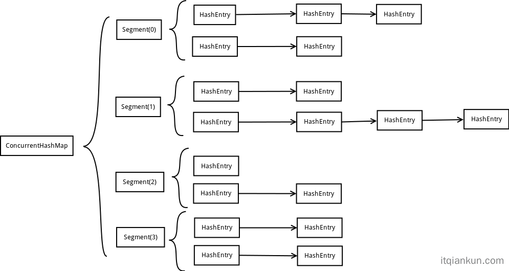
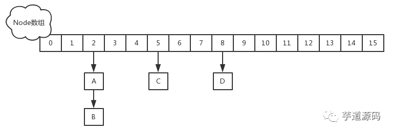

---
# 这是页面的图标
icon: page

# 这是文章的标题
title: ConcurrentHashMap 源码解读

# 设置作者
author: lllllan

# 设置写作时间
# time: 2020-01-20

# 一个页面只能有一个分类
category: Java

# 一个页面可以有多个标签
tag:
- 集合
- 源码解读

# 此页面会在文章列表置顶
# sticky: true

# 此页面会出现在首页的文章板块中
star: true

# 你可以自定义页脚
# footer: 
---

::: warning 转载声明

- [一文彻底搞懂ConcurrentHashMap原理-IT乾坤技术博客 (itqiankun.com)](https://www.itqiankun.com/article/concurrenthashmap-principle)
- [Java 经典面试题：为什么 ConcurrentHashMap 的读操作不需要加锁？ - 云+社区 - 腾讯云 (tencent.com)](https://cloud.tencent.com/developer/article/1461980)
- [ConcurrentHashMap（JDK8） - 云+社区 - 腾讯云 (tencent.com)](https://cloud.tencent.com/developer/article/1873182)

:::

## HashMap

HashMap 的问题在于不是线程安全的，ConcurrentHashMap 是 HashMap 的升级版，大体的实现原理和 HashMap 都是类似的，只是加了一下手段保证了线程安全。

## Hashtable

Hashtable 是线程安全的，但是执行 `get/put/remove` 操作都需要锁住整个结构，效率很低。

Hashtable 是快速失败的，遍历时改变结构会报错 `ConcurrentModificationException`

## ConcurrentHashMap

### JDK 1.7

::: info 分段锁

- 将数据分成一段一段的存储，然后给每一段数据配一把锁，当一个线程占用锁访问其中一个段数据的时候，其他段的数据也能被其他线程访问。
- ConcurrentHashMap定位一个元素的过程需要进行两次Hash操作，第一次Hash定位到Segment，第二次Hash定位到元素所在的链表的头部。
- JDK7中使用了 ReentrantLock
-  JDK7中的扩容是 ==每个Segment内部进行扩容，不会影响其他Segment==

:::

::: note 头插法

JDK 1.7 中，在链表中插入一个节点的时候，是在加在链表的头部。

据说，这种方法在扩容的时候会出现死循环，JDK 1.8 就改成了尾插法

:::

### JDK 1.8

::: info Synchronized

JDK 1.8 中取消了分段锁，选择了和 HashMap 类似的操作方法，在一个 Entry 节点上进行同步，支持多线程的操作。

:::

## 为什么 ConcurrentHashMap 的读操作不需要加锁？

[Java 经典面试题：为什么 ConcurrentHashMap 的读操作不需要加锁？ - 云+社区 - 腾讯云 (tencent.com)](https://cloud.tencent.com/developer/article/1461980)

1. 使用 synchronized 对 Entry 进行同步
2. get 过程中如果遇到扩容的时候，会调用标志正在扩容节点ForwardingNode的find方法，查找该节点，匹配就返回
3. 使用 volatile 关键字保证共享遍历的可见性

## JDK1.8 ConcurrentHashMap 扩容

首先，JDK8中是支持多线程扩容的，JDK8中的ConcurrentHashMap不再是分段，或者可以理解为每个桶为一段，在需要扩容时，首先会生成一个双倍大小的数组，生成完数组后，线程就会开始转移元素，在扩容的过程中，如果有其他线程在put，那么这个put线程会帮助去进行元素的转移，虽然叫转移，但是其实是基于原数组上的Node信息去生成一个新的Node的，也就是原数组上的Node不会消失，因为在扩容的过程中，如果有其他线程在get也是可以的。
