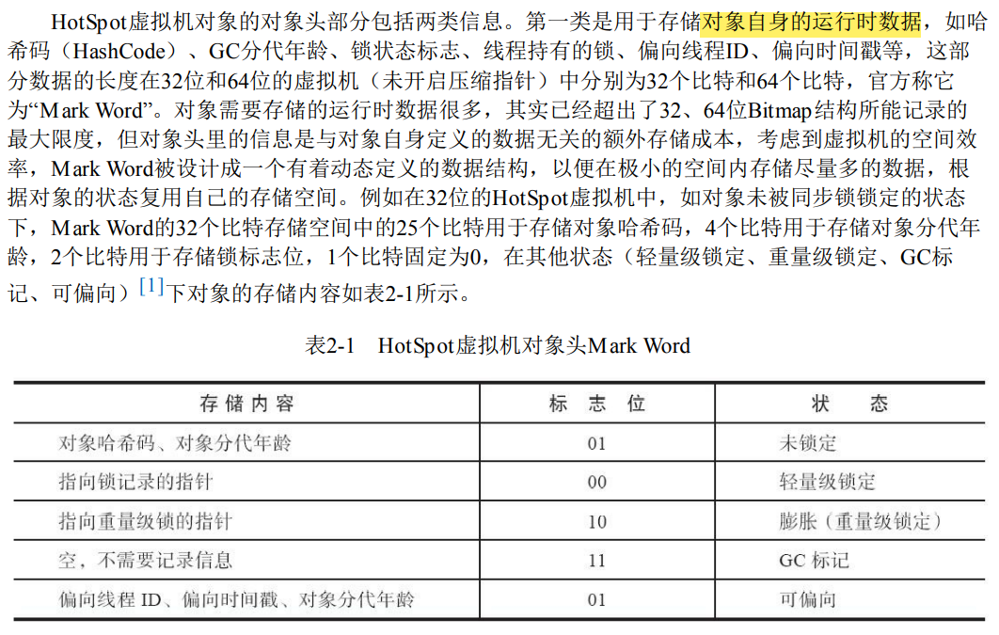
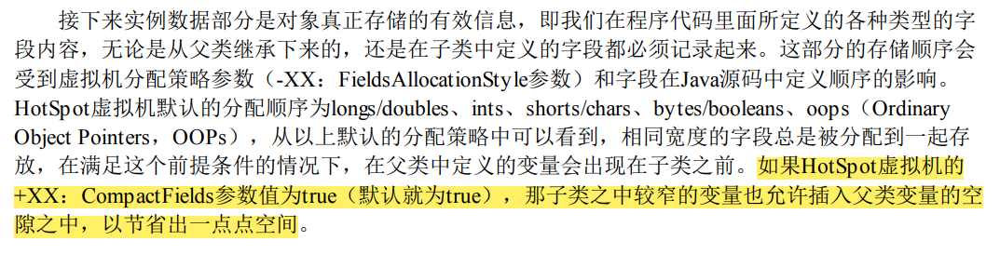
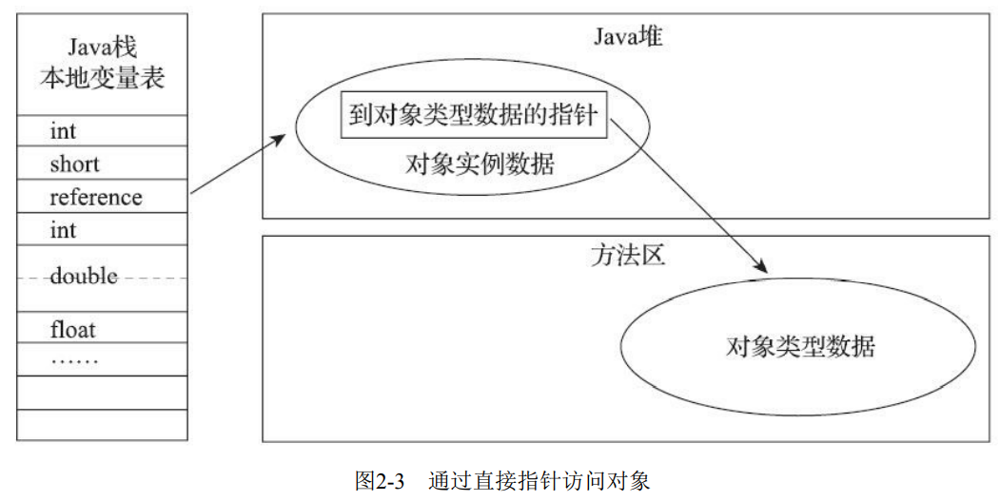

---
# 这是页面的图标
icon: page

# 这是文章的标题
title: HotSpot 虚拟机中的对象

# 设置作者
author: lllllan

# 设置写作时间
# time: 2020-01-20

# 一个页面只能有一个分类
category: Java

# 一个页面可以有多个标签
tag:
- JVM
- 深入理解Java虚拟机

# 此页面会在文章列表置顶
# sticky: true

# 此页面会出现在首页的文章板块中
star: true

# 你可以自定义页脚
# footer: 
---

::: warning 转载声明

- 《深入理解Java虚拟机》

:::

## 一、对象的创建过程

1. **类加载检查**

   > 首先将去检查这个指令的参数是否能在常量池中定位到一个类的符号引用，并且检查这个符号引用代表的类是否已被加载、解析和初始化过。如果没有，那必须先执行相应的类加载过程

2. **分配内存**

   > 为对象分配空间的任务实际上便等同于把一块确定 大小的内存块从Java堆中划分出来
   >
   > - ==指针碰撞== ： 假设Java堆中内存是绝对规整的，所有被使用过的内存都被放在一 边，空闲的内存被放在另一边，中间放着一个指针作为分界点的指示器，那所分配内存就仅仅是把那 个指针向空闲空间方向挪动一段与对象大小相等的距离
   > - ==空闲列表== ： 但如果Java堆中的内存并不是规整的，已被使用的内存和空闲的内存相互交错在一起，那就没有办法简单地进行指针碰撞了，虚拟机就必须维护一个列表，记录上哪些内存块是可用的，在分配的时候从列表中找到一块足够大的空间划分给对象实例，并更新列表上的记录
   >
   > 选择哪种分配方式由Java堆是否规整决定，而Java堆是否规整又由所采用的垃圾收集器是否带有 ==空间压缩整理（Compact）== 的能力决定

   ::: tip 非线程安全

   在并发情况下也并 ==不是线程安全的== ，可能出现正在给对象 A分配内存，指针还没来得及修改，对象B又同时使用了原来的指针来分配内存的情况。解决这个问题有两种可选方案：

   1. 对分配内存空间的动作进行同步处理——实际上虚拟机是采用 ==CAS配上失败重试== 的方式保证更新操作的原子性

   2. 另外一种是把内存分配的动作按照线程划分在不同的空间之中进 行，即每个线程在Java堆中预先分配一小块内存，称为 ==本地线程分配缓冲== （Thread Local Allocation Buffer，TLAB），哪个线程要分配内存，就在哪个线程的本地缓冲区中分配，只有本地缓冲区用完 了，分配新的缓存区时才需要同步锁定。

   :::

3. **对象字段初始化为零值**

   > 将分配到的内存空间（但不包括对象头）都初始化为零值，这步操作保证了对象的实例字段 在Java代码中可以不赋初始值就直接使用，使程序能访问到这些字段的数据类型所对应的零值。

4. **设置对象头**

   > 设置这个对象是哪个类的实例、如何才能找到类的元数据信息、对象的哈希码（实际上对象的哈希码会延后到真正调用 `Object::hashCode()` 方法时才 计算）、对象的GC分代年龄等信息

5. **执行构造函数**

### 二、对象的内存布局

对象在堆内存中的存储布局可以划分为三个部分：对象头（Header）、实例数据（Instance Data）和对齐填充（Padding）

### 2.1 对象头

HotSpot虚拟机对象的对象头部分包括两类信息

1. **对象自身的运行数据：** 如哈希码（HashCode）、GC分代年龄、锁状态标志、线程持有的锁、偏向线程ID、偏向时间戳等

   > 

2. **类型指针：** 对象指向它的类型元数据的指针，Java虚拟机通过这个指针来确定该对象是哪个类的实例。

   > 并不是所有的虚拟机实现都必须在对象数据上保留类型指针，换句话说，查找对象的元数据信息并不一定要经过对象本身

### 2.2 实例数据

来实例数据部分是对象真正存储的有效信息，即我们在程序代码里面所定义的各种类型的字段内容，无论是从父类继承下来的，还是在子类中定义的字段都必须记录起来

### 2.3 对齐填充

这并不是必然存在的，也没有特别的含义，它仅仅起着占位符的作用。

由于HotSpot虚拟机的自动内存管理系统要求对象起始地址必须是8字节的整数倍，换句话说就是任何对象的大小都必须是 **8字节的整数倍**。对象头部分已经被精心设计成正好是8字节的倍数（1倍或者 2倍），因此，如果对象实例数据部分没有对齐的话，就需要通过对齐填充来补全。

## 三、对象的访问定位

对象访问方式也是由虚拟机实 现而定的，主流的访问方式主要有使用句柄和直接指针两种：

### 3.1 句柄访问

Java堆中将可能会划分出一块内存来作为句柄池，reference中存储的就是对象的句柄地址，而句柄中包含了对象实例数据与类型数据各自具体的地址信息

::: tip 句柄的优势

是reference中存储的是稳定句柄地 址，在对象被移动（垃圾收集时移动对象是非常普遍的行为）时只会改变句柄中的实例数据指针，而 reference本身不需要被修改。

:::

### 3.2 直接指针访问

Java堆中对象的内存布局就必须考虑如何放置访问类型数据的相关信息，reference中存储的直接就是对象地址，如果只是访问对象本身的话，就不需要多一次间接访问的开销

::: tip 指针的优势

是速度更快，它节省了一次指针定位的时间开销，由于对象访 问在Java中非常频繁，因此这类开销积少成多也是一项极为可观的执行成本。

对于HotSpot而言，它主要使用第二种方式进行对象访问。

:::
