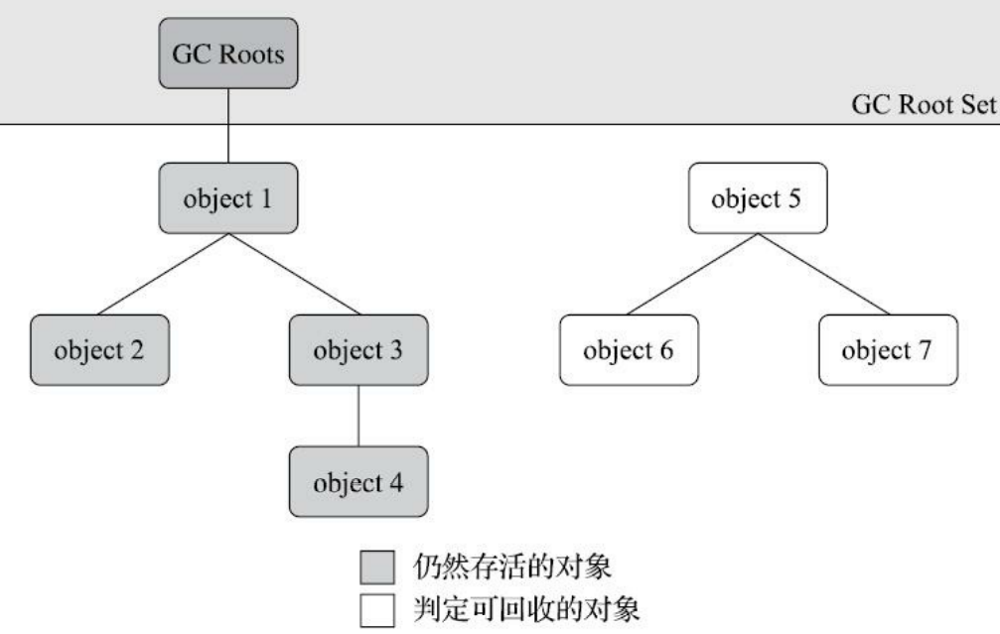

---
# 这是页面的图标
icon: page

# 这是文章的标题
title: 对象已死

# 设置作者
author: lllllan

# 设置写作时间
# time: 2020-01-20

# 一个页面只能有一个分类
category: Java

# 一个页面可以有多个标签
tag:
- JVM
- 深入理解Java虚拟机

# 此页面会在文章列表置顶
# sticky: true

# 此页面会出现在首页的文章板块中
star: true

# 你可以自定义页脚
# footer: 

---


::: warning 转载声明

- 《深入理解Java虚拟机》

:::


垃圾收集器在对堆进行回收前，第一件事情就是要确定这些对象之中哪些还【存活】着，哪些已经【死去】（死去即不可能再被任何途径使用的对象）了


## 一、引用计数算法

在对象中添加一个引用计数器，每当有一个地方引用它时，计数器值就加一；当引用失效时，计数器值就减一；任何时刻计数器为零的对象就是不可 能再被使用的。

- 优点：原理简单，判定效率也很高
- 缺点：单纯的引用计数 就很难解决对象之间相互循环引用的问题


```java
/**
 * testGC()方法执行后，objA和objB会不会被GC呢？
 * @author zzm
 */
public class ReferenceCountingGC {
    public Object instance = null;
    private static final int _1MB = 1024 * 1024;
    /**
     * 这个成员属性的唯一意义就是占点内存，以便能在GC日志中看清楚是否有回收过
     */
    private byte[] bigSize = new byte[2 * _1MB];
    public static void testGC() {
        ReferenceCountingGC objA = new ReferenceCountingGC();
        ReferenceCountingGC objB = new ReferenceCountingGC();
        objA.instance = objB;
        objB.instance = objA;
        objA = null;
        objB = null;
        // 假设在这行发生GC，objA和objB是否能被回收？
        System.gc();
    }
}
```

实际上虚拟机并没有因为这两个对象互相引用就放弃回收它们，这也从侧面说明了 Java 虚拟机并不是通过引用计数算法来判断对象是否存活的。


## 二、可达性分析算法

通过一系列称为 ==GC Roots== 的根对象作为起始节点集，从这些节点开始，根据引用关系 **向下搜索** ，搜索过程所走过的路径称为 ==引用链== （Reference Chain），如果某个对象到 GC Roots 间没有任何引用链相连， 或者用图论的话来说就是从 GC Roots 到这个对象不可达时，则证明此对象是不可能再被使用的。



::: tip GC Roots 包括的对象

1. 在虚拟机栈（栈帧中的 **本地变量表）中引用的对象**，譬如各个线程被调用的方法堆栈中使用到的参数、局部变量、临时变量等
2. 在方法区中类 **静态属性引用的对象**，譬如Java类的引用类型静态变量
3. 在方法区中 **常量引用的对象**，譬如字符串常量池（String Table）里的引用
4. 在本地方法栈中JNI（即通常所说的 **Native方法）引用的对象**
5. Java **虚拟机内部的引用**，如基本数据类型对应的Class对象，一些常驻的异常对象（比如 NullPointExcepiton、OutOfMemoryError）等，还有系统类加载器
6. 所有被 **同步锁（synchronized关键字）持有的对象**
7. 反映Java虚拟机内部情况的JMXBean、JVMTI中注册的回调、本地代码缓存等。


根据用户所选用的垃圾收集器以及当前回收的内存区域不同，还 **可以有其他对象【临时性】地加入**，共同构成完整GC Roots集合。

:::


## 三、再谈引用

在 JDK 1.2 版之后，Java对引用的概念进行了扩充，将引用分为强引用（Strongly Re-ference）、软引用（Soft Reference）、弱引用（Weak Reference）和虚引用（Phantom Reference）4 种，这 4 种引用强度依次逐渐减弱。


- **强引用** 是最传统的【引用】的定义，是指在程序代码之中普遍存在的引用赋值，即类似 `Object obj=new Object()` 这种引用关系。无论任何情况下，只要强引用关系还存在，垃圾收集器就永远不会回收掉被引用的对象。 
- **软引用** 是用来描述一些<u>还有用，但非必须</u>的对象。只被软引用关联着的对象， ==在系统将要发生内存溢出异常前，会把这些对象列进回收范围之中进行第二次回收，如果这次回收还没有足够的内存，才会抛出内存溢出异常== 。  `SoftReference` 
- **弱引用** 也是用来描述那些非必须对象，但是它的强度比软引用更弱一些，被弱引用关联的对象只能生存到下一次垃圾收集发生为止。 ==当垃圾收集器开始工作，无论当前内存是否足够，都会回收掉只被弱引用关联的对象== 。 `WeakReference` 
- **虚引用** 是最弱的一种引用关系。一个对象是否有虚引用的存在，完全不会对其生存时间构成影响，也无法通过虚引用来取得一个对象实例。为一个对象设置虚 引用关联的唯一目的只是为了能在这个对象被收集器回收时收到一个系统通知。 `PhantomReference` 


## 四、生存还是死亡

即使在可达性分析算法中判定为不可达的对象，也不是“非死不可”的，这时候它们暂时还处于“缓刑”阶段。

要真正宣告一个对象死亡，至少要经历两次标记过程：

1. 如果对象在进行可达性分析后发现没有与 GC Roots 相连接的引用链，那它将会被第一次标记，随后进行一次筛选
2. 筛选的条件是此对象是否有必要执行 `finalize()` 方法。假如对象没有覆盖 finalize() 方法，或者 finalize() 方法已经被虚拟机调用过，那么虚拟机将这两种情况都视为“没有必要执行”。


> 如果这个对象被判定为确有必要执行 finalize 方法，那么该对象将会被放置在一个名为F-Queue的队列之中，并在稍后由一条由虚拟机自动建立的、低调度优先级的 Finalizer 线程去执行它们的 finalize() 方法。这里所说的【执行】是指虚拟机会触发这个方法开始运行，但并不承诺一定会等待它运行结束。
>
> 这样做的原因是，如果某个对象的 finalize 方法执行缓慢，或者更极端地发生了死循环，将很可能导致 F-Queue 队列中的其他对象永久处于等待，甚至导致整个内存回收子系统的崩溃。finalize 方法是对象逃脱死亡命运的最后一次机会，稍后收集器将对 F-Queue 中的对象进行第二次小规模的标记，如果对象要在 finalize() 中成功拯救自己——只要重新与引用链上的任何一个对象建立关联即可，譬如把自己（this关键字）赋值给某个类变量或者对象的成员变量，那在第二次标记时它将被移出【即将回收】的集合；如果对象这时候还没有逃脱，那基本上它就真的要被回收了。


```java
/**
* 此代码演示了两点：
* 1.对象可以在被GC时自我拯救。
* 2.这种自救的机会只有一次，因为一个对象的finalize()方法最多只会被系统自动调用一次
* @author zzm
*/
public class FinalizeEscapeGC {
    public static FinalizeEscapeGC SAVE_HOOK = null;
    public void isAlive() {
        System.out.println("yes, i am still alive :)");
    }
    @Override
    protected void finalize() throws Throwable {
        super.finalize();
        System.out.println("finalize method executed!");
        FinalizeEscapeGC.SAVE_HOOK = this;
    }
    public static void main(String[] args) throws Throwable {
        SAVE_HOOK = new FinalizeEscapeGC();
        //对象第一次成功拯救自己
        SAVE_HOOK = null;
        System.gc();
        // 因为Finalizer方法优先级很低，暂停0.5秒，以等待它
        Thread.sleep(500);
        if (SAVE_HOOK != null) {
            SAVE_HOOK.isAlive();
        } else {
            System.out.println("no, i am dead :(");
        }
        // 下面这段代码与上面的完全相同，但是这次自救却失败了
        SAVE_HOOK = null;
        System.gc();
        // 因为Finalizer方法优先级很低，暂停0.5秒，以等待它
        Thread.sleep(500);
        if (SAVE_HOOK != null) {
            SAVE_HOOK.isAlive();
        } else {
            System.out.println("no, i am dead :(");
        }
    }
}
```

```java
finalize method executed!
yes, i am still alive :)
no, i am dead :(
```

代码中有两段完全一样的代码片段，执行结果却是一次逃脱成功，一次失败了。这是因为 **任何一个对象的 `finalize()` 方法都只会被系统自动调用一次**，如果对象面临下一次回收，它的 `finalize()` 方法不会被再次执行，因此第二段代码的自救行动失败了。


## 五、回收方法区

方法区垃圾收集 的“性价比”通常也是比较低的：在 Java 堆中，尤其是在新生代中，对常规应用进行一次垃圾收集通常 可以回收 70% 至 99% 的内存空间，相比之下，方法区回收囿于苛刻的判定条件，其区域垃圾收集的回收成果往往远低于此。


**方法区的垃圾收集主要回收两部分内容：废弃的常量和不再使用的类型。**

判定一个常量是否“废弃”还是相对简单，而要判定一个类型是否属于“不再被使用的类”的条件就 比较苛刻了。需要同时满足下面三个条件：

1. 该类 **所有的实例都已经被回收**，也就是Java堆中不存在该类及其任何派生子类的实例。
2. 加载该类的 **类加载器已经被回收**，这个条件除非是经过精心设计的可替换类加载器的场景，如 OSGi、JSP的重加载等，否则通常是很难达成的。
3. 该类对应的 **`java.lang.Class` 对象没有在任何地方被引用**，无法在任何地方通过反射访问该类的方 法。


> 所有实例被回收 && 类加载器被回收 && class对象没有被引用
