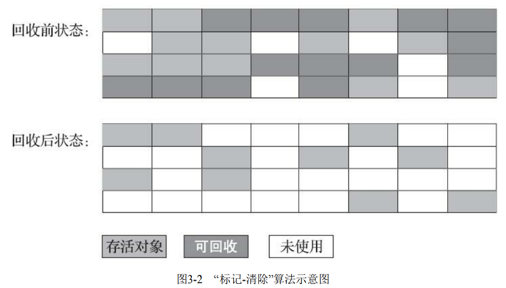
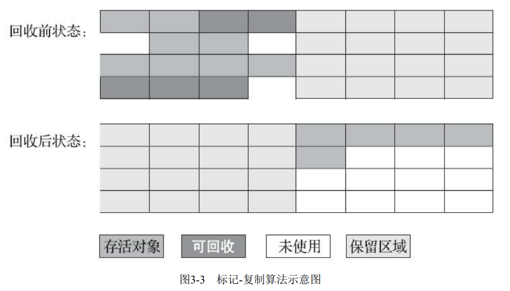
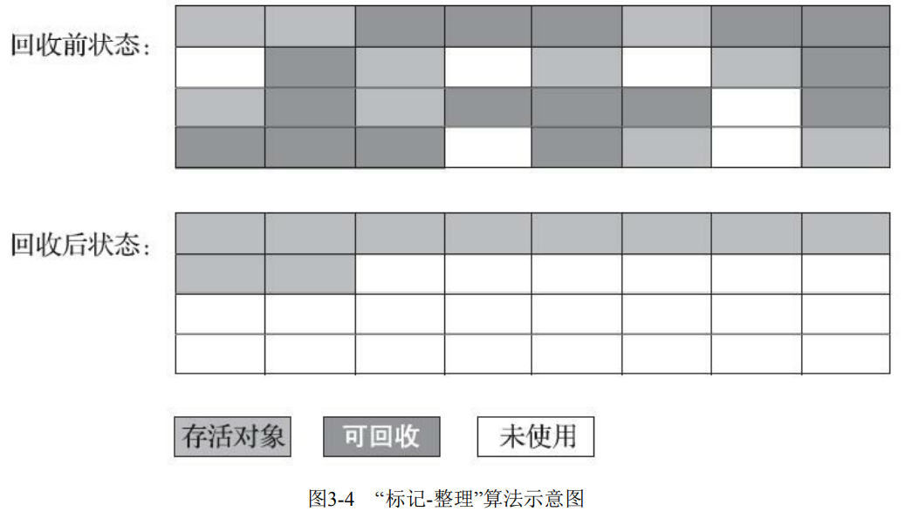

---
# 这是页面的图标
icon: page

# 这是文章的标题
title: 垃圾收集算法

# 设置作者
author: lllllan

# 设置写作时间
# time: 2020-01-20

# 一个页面只能有一个分类
category: Java

# 一个页面可以有多个标签
tag:
- JVM
- 深入理解Java虚拟机

# 此页面会在文章列表置顶
# sticky: true

# 此页面会出现在首页的文章板块中
star: true

# 你可以自定义页脚
# footer: 
---

::: warning 转载声明

- 《深入理解Java虚拟机》

:::

## 一、分代收集理论

### 分代假说

1. 弱分代假说：绝大多数对象都是朝生夕灭的
2. 强分代假说：熬过越多次垃圾收集过程的对象就越难以消亡

这两个分代假说共同奠定了多款常用的垃圾收集器的一致的设计原则：**收集器应该将Java堆划分出不同的区域，然后将回收对象依据其年龄（年龄即对象熬过垃圾收集过程的次数）分配到不同的区域之中存储。**

### 跨代引用假说

3. 跨代引用假说：跨代引用对于同代应用来说仅占极少数

依据这条假说，我们就不应再为了少量的跨代引用去扫描整个老年代，也不必浪费空间专门记录 每一个对象是否存在及存在哪些跨代引用，只需 **在新生代上建立一个全局的数据结构**（该结构被称 为 ==“记忆集”== ，Remembered Set），这个结构把老年代划分成若干小块，**标识出老年代的哪一块内存会存在跨代引用**。此后当发生Minor GC时，只有包含了跨代引用的小块内存里的对象才会被加入到GC Roots进行扫描。虽然这种方法需要在对象改变引用关系（如将自己或者某个属性赋值）时维护记录数据的正确性，会增加一些运行时的开销，但比起收集时扫描整个老年代来说仍然是划算的。

::: info 收集

- 部分收集 `Partial GC`：指目标不是完整收集整个 Java 堆的垃圾收集
  - 新生代收集 `Minor GC/Young GC`：新生代的垃圾收集
  - 老年代收集 `Major GC/Old GC`：老年代的垃圾收集，目前只有 **CMS收集器** 会有单独收集老年代
  - 混合收集 `Mixed GC`：收集整个新生代和部分老年代，目前只有 **G1收集器** 会这么做
- 整堆收集 `Full GC`：整个 Java堆和方法区的收集

:::

## 二、标记-清除算法

算法分为【**标记**】和【**清除**】两个阶段：首先标记出所有需要回收的对象，在标记完成后，统一回收掉所有被标记的对象，也可以反过来，标记存活的对象，统一回收所有未被标记的对象。

::: tip 缺点：

1. **执行效率不稳定：** 如果Java堆中包含大量对象，而且其中大部分是需要被回收的，这时必须进行大量标记和清除的动作，导致标记和清除两个过程的执行效率都随对象数量增长而降低
2. **空间的碎片化问题：** 标记、清除之后会产生大量不连续的内存碎片，空间碎片太多可能会导致当以后在程序运行过程中需要分配较大对象时无法找到足够的连续内存而不得不提前触发另一次垃圾收集动作

:::

## 三、标记-复制算法

它将可用内存按容量划分为大小相等的两块，每次只使用其中的一块。当这一块的内存用完了，就将还存活着的对象复制到另外一块上面，然后再把已使用过的内存空间一次清理掉。

每次都是针对整个半区进行内存回收，分配内存时也就不用考虑有空间碎片的复杂情况，只要移动堆顶指针，按顺序分配即可。这样实现简单，运行高效

::: tip 缺点

1. **执行效率不稳定：** 如果内存中多数对象都是存活的，这种算法将会产生大量的内存间复制的开销，但对于多数对象都是可回收的情况，算法需要复制的就是占少数的存活对象
2. **空间浪费：** 这种复制回收算法的代价是将可用内存缩小为了原来的一半

:::

::: info 朝生夕灭

IBM公司曾有一项专门研究对新生代【朝生夕灭】的特点做了更量化的诠释——新生代中的对象有 98% 熬不过第一轮收集。因此也不必担心在垃圾回收时存在大量存活的对象需要去复制转移，甚至都不需要按照 `1:1` 的比例来划分新生代的空间。

:::

::: danger Appel 式回收

HotSpot虚拟机的 Serial、ParNew 等新生代收集器均采用了这种策略来设计新生代的内存布局

Appel 式回收的具体做法是把新生代分为一块较大的 `Eden` 空间和两块较小的 `Survivor` 空间，每次分配内存只使用 Eden 和其中一块 Survivor。发生垃圾搜集时，将 Eden 和 Survivor 中仍 然存活的对象一次性复制到另外一块 Survivor 空间上，然后直接清理掉 Eden 和已用过的那块 Survivor 空间

HotSpot 虚拟机默认 Eden 和 Survivor 的大小比例是 8∶1，也即每次新生代中可用内存空间为整个新生代容量的 90%（Eden 的 80% 加上一个 Survivor 的 10%），只有一个 Survivor 空间，即 10% 的新生代是会被【浪费】的。

当然，98% 的对象可被回收仅仅是【普通场景】下测得的数据，任何人都没有办法百分百保证每次回收都只有不多于 10% 的对象存活，因此 Appel 式回收还有一个充当罕见情况的【逃生门】的安全设计，当 Survivor 空间不足以容纳一次 Minor GC 之后存活的对象时，就需要 ==依赖其他内存区域（实际上大多就是老年代）进行分配担保（Handle Promotion）==

:::

## 四、标记-整理算法

标记-清除算法与标记-整理算法的本质差异在于前者是一种非移动式的回收算法，而后者是移动式的。

::: tip 缺点

1. 在老年代这种每次回收都有大量对象存活区域，移动存活对象并更新 所有引用这些对象的地方将会是一种极为负重的操作，而且这种对象移动操作必须全程暂停用户应用程序才能进行
2. 但如果跟标记-清除算法那样完全不考虑移动和整理存活对象的话，弥散于堆中的存活对象导致的空间碎片化问题就只能依赖更为复杂的内存分配器和内存访问器来解决。

基于以上两点，是否移动对象都存在弊端，移动则内存回收时会更复杂，不移动则内存分配时会更复杂

:::

