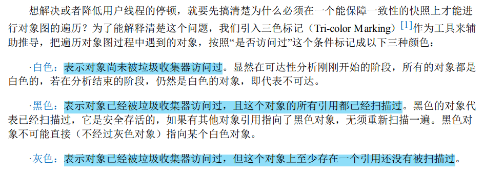

---
# 这是页面的图标
icon: page

# 这是文章的标题
title: HotSpot 的算法实现细节

# 设置作者
author: lllllan

# 设置写作时间
# time: 2020-01-20

# 一个页面只能有一个分类
category: Java

# 一个页面可以有多个标签
tag:
- JVM
- 深入理解Java虚拟机

# 此页面会在文章列表置顶
# sticky: true

# 此页面会出现在首页的文章板块中
star: true

# 你可以自定义页脚
# footer: 
---

::: warning 转载声明

- 《深入理解Java虚拟机》
- [HotSpot VM中的准确式GC、OopMap、Safepoint、抢先式中断、主动式中断、Safe Region和RememberedSet](https://blog.csdn.net/weixin_42090746/article/details/103942247)
- [再谈HotSpot JVM GC机制中的写屏障](https://blog.csdn.net/nazeniwaresakini/article/details/105947623)
- [彻底搞清楚什么是伪共享](https://zhuanlan.zhihu.com/p/187593289)

:::

## 一、根节点枚举

我们知道要判断一个对象是否可以被回收，是通过判断这个对象与GC Roots之间是否存在引用链，这个过程叫做可达性分析。而这个过程中，业务线程是需要停止的，不然在遍历时，引用发生变化，那么分析到的结果就是不准确的。也就是说这个过程需要“Stop the world”。为了提高效率，我们需要这个过程尽可能地快，以减少系统停顿时间。

迄今为止， ==所有收集器在根节点枚举这一步骤时都是必须暂停用户线程的== 。在枚举根节点的期间，根节点集合的对象引用关系应该保持不变，这是枚举根节点应该保证的 **一致性** 。如果这点都不能满足，分析结果也就无法保证，因此垃圾手机过程必须停顿所有用户线程。

> 

> 在JDK1.0时，Sun公司发布JVM，称为Sun Classic VM，这款虚拟机只支持纯解释器方式来执行java代码，如果想使用JIT编译期就必须进行外挂，但是外挂后解释器就不工作了，总之两者不兼容。不止于此这款JVM，遍历GC Roots时，扫描内存中全局变量和栈上的本地变量表时，并不知道这个位置存的是基本数据类型还是对象引用，需要额外判断，效率很低。Classic VM其使用的是基于句柄的访问方式，每次定位都需要两次定位，其速度就可想而知了，这种方式称为“保守式内存管理”和 ==保守式GC==。

::: info 准确式GC 和 OopMap

目前主流Java虚拟机都是使用 ==准确式垃圾收集== ，即虚拟机知道内存中某个位置存储的数据是什么类型，在GC时，只需遍历引用类型即可，而不需要一个不漏地检查完所有执行上下文和全局的引用位置。

其用来维护哪些地方存有引用的数据结构就叫做 ==OopMap==。在 HotSpot 中一旦类记载完成的时候，HotSpot 会将对象内什么偏移量上是什么类型的数据计算出来，在即时编译过程中，在特定位置记录下栈里和寄存器里哪些位置是引用。这样收集器在扫描时就可以直接获取这些信息了。 

:::

## 二、安全点

OopMap存储的是哪些地方存有引用。但是维护这个数据结构太难了，系统在多线程地跑，对象千千万万，时时刻刻引用关系都在发生变化，不管是采用频繁地修改OopMap的值，还没每执行一条指令（只有执行指令，引用关系才会改变）都创建一个OopMap都是不可取的。

::: info 安全点

安全点就是指，当线程运行到这类位置时，堆对象状态是确定一致的，JVM可以安全地进行操作。

参考 [Java-JVM-安全点SafePoint](https://blog.csdn.net/baichoufei90/article/details/85097727)

:::

安全点位置选取的原则：

- **是否具有让程序长时间执行的特征**。“长时间执行” 的最明显特征就是指令序列的复用，例如方法调用、循环跳转、异常跳转等都属于指令序列服用，只有具有这些功能的指令才会产生安全点
- **如何在垃圾收集发生时让所有线程（不包括执行JNI调用的线程）都跑到最近的安全点**。抢先式中断、主动式中断

::: note  两种中断

**抢先式中断：** 抢先式中断不需要线程的执行代码主动去配合，在垃圾收集发生时，系统首先把所有用户线程全部中断，如果发现有用户线程中断的地方不在安全点上，就恢复这条线程执行，让它一会再重新中断，直到跑到安全点上。

**主动式中断：** 是当垃圾收集需要中断线程的时候，不直接对线程操作，仅仅简单地设置一 个标志位，各个线程执行过程时会不停地主动去轮询这个标志，一旦发现中断标志为真时就自己在最近的安全点上主动中断挂起

:::

## 三、安全区域

安全点机制保证了程序执行时，在不太长的时间内就会遇到可进入垃圾收集过程的安全点

但是，程序“不执行”的时候呢？所谓的程序不执行就是没有分配处理器时间，典型的场景便是用户线程处于 `Sleep` 状态或者 `Blocked` 状态，这时候线程无法响应虚拟机的中断请求，不能再走到安全的地方去中断挂起自己，虚拟机也显然不可能持续等待线程重新被激活分配处理器时间。对于这种情况，就必须引入安全区域（Safe Region）来解决。

::: info 安全区域

==安全区域== 是指能够确保在某一段代码片段之中，引用关系不会发生变化，因此，在这个区域中任意地方开始垃圾收集都是安全的。我们也可以把安全区域看作被扩展拉伸了的安全点。

:::

当用户线程执行到安全区域里面的代码时，**首先会标识自己已经进入了安全区域**，那样当这段时间里虚拟机要发起垃圾收集时就不必去管这些已声明自己在安全区域内的线程了。当线程要 **离开安全区域时，它要检查虚拟机是否已经完成了根节点枚举**（或者垃圾收集过程中其他需要暂停用户线程的 阶段），如果完成了，那线程就当作没事发生过，继续执行；否则它就必须一直等待，直到收到可以离开安全区域的信号为止

## 四、记忆集和卡表

::: info 记忆集

所有涉及部分区域收集（Partial GC）行为的垃圾收集器，都会面临对象跨代引用的问题。 ==记忆集== 是一种用于记录从非收集区域指向收集区域的指针集合的抽象数据结构

:::

这种记录全部含跨代引用对象的实现方案，无论是空间占用还是维护成本都相当高昂。而在垃圾收集的场景中，收集器只需要通过记忆集判断出某一块非收集区域是否存在有指向了收集区域的指针就可以了，并不需要了解这些跨代指针的全部细节。

- **字长精度**：每个记录精确到一个机器字长（就是处理器的寻址位数，如常见的32位或64位，这个精度决定了机器访问物理内存地址的指针长度），该字包含跨代指针。 
- **对象精度**：每个记录精确到一个对象，该对象里有字段含有跨代指针。 
- **卡精度**：每个记录精确到一块内存区域，该区域内有对象含有跨代指针

::: info 卡表

==卡表== 就是记忆集的一种具体实现，它定义了记忆集的记录精度、与堆内存的映射关系等。（关于卡表与记忆集的关系，读者不妨按照Java语言中HashMap与Map的关系来类比理解。）

:::

HotSpot 虚拟机中卡表就是一个字节数组，其中每一个元素都对应着其标识的内存区域中一块特定大小的内存块，这个内存块称为 ==卡页== 。一个卡页的内存中通常包含不止一个对象，只要卡页内有一个（或更多）对象的字段存在着跨代指针，那就将对应卡表的数组元素的值标识为1，称为这个元素变脏（Dirty），没有则标识为0。

在垃圾收集发生时，只要筛选出卡表中变脏的元素，就能轻易得出哪些卡页内存块中包含跨代指针，把它们加入GC Roots中一并扫描。

## 五、写屏障

我们已经解决了如何使用记忆集来缩减GC Roots扫描范围的问题，但还没有解决卡表元素如何维护的问题，例如它们何时变脏、谁来把它们变脏等。

1. **何时变脏：** 有其他分代区域中对象引用了本区域对象时，其对应的卡表元素就应该变脏，变脏时间点原则上应该发生在引用类型字段赋值的那一刻
2. **如何变脏：** 通过写屏障技术维护卡表状态

::: info 写屏障

==写屏障== 可以看作在虚拟机层面对“引用类型字段赋值”这个动作的AOP切 面，在引用对象赋值时会产生一个环形（Around）通知，供程序执行额外的动作，也就是说赋值的前后都在写屏障的覆盖范畴内。

换句话就是 **对一个对象引用进行写操作（即引用赋值）之前或之后附加执行的逻辑**，相当于为引用赋值挂上的一小段钩子代码。

参考 [内存屏障](../../../concurrent/2/8/#_2-2-禁止重排序)

:::

除了写屏障的开销外，卡表在高并发场景下还面临着“伪共享”（False Sharing）问题。伪共享是处理并发底层细节时一种经常需要考虑的问题

::: info 伪共享问题

现代中央处理器的缓存系统中是以缓存行（Cache Line） 为单位存储的，当多线程修改互相独立的变量时，如果这些变量恰好共享同一个缓存行，就会彼此影响（写回、无效化或者同步）而导致性能降低，这就是 ==伪共享问题==

---

**缓存行**

CPU缓存是有缓存行组成的，一个缓存行一般是64个字节，CPU读取数据是以**缓存行**为单位的读取，这意味着即使是读1个字节的数据，CPU也要读取这个数据所在的连续的64个字节的数据。

如果使用的数据结构中的数据项不是彼此相邻连续的，如链表，那么读数据的时候就得不到免费缓存带来的好处，在java中，数组中的数据通常是连续的（数组的连续存储不是jvm规范中的要求，在某些jvm中，大中型数据项不是分配在连续的空间），所以数组的访问速度比链表要快。

---

**缓存失效**

在java中，long类型占8个字节，这就意味着，当读一个long类型的变量，也会读取其相邻的7个long类型变量（不是long类型的变量按占用的字节数计算个数，如int类型的变量占4个字节，那么就64-8个字节，就可以存储14个int类型的变量），在基于mesi协议下，其它的线程此时再读取其中的一个long类型变量，那么这个long类型变量所在的缓存行就会失效，需要重新读取缓存，这就是缓存失效。

---

**伪共享**

CPU在读取数据时，是以一个缓存行为单位读取的，假设这个缓存行中有两个long类型的变量a、b，当一个线程A读取a，并修改a，线程A在未写回缓存之前，另一个线程B读取了b，读取的这个b所在的缓存是无效的（前面说的缓存失效），本来是为了提高性能是使用的缓存，现在为了提高命中率，反而被拖慢了，这就是传说中的伪共享。

:::

为了避免 伪共享问题：

- 一种简单的解决方案是 **不采用无条件的写屏障，而是先检查卡表标记**，只有当该卡表元素未被标记过时才将其标记为变脏。

    > 个人理解，只有必要将 “未变脏” 的卡页变为 “脏”，而没必要记录 “脏” 了多少，从而减少修改卡表的次数。

- 在JDK 7之后，HotSpot虚拟机增加了一个新的参数 `-XX：+UseCondCardMark`，用来决定是否开启卡表更新的条件判断；开启会增加一次额外判断的开销，但能够避免伪共享问。

## 六、并发的可达性分析

可达性分析算法理论上要求全过程都基于一个能保障一致性的快照中才能够进行分析， 这意味着必须全程冻结用户线程的运行。从GC Roots再继续往下遍历对象图，这一步骤的停顿时间就必定会与Java堆容量直接成正比例关系了：堆越大，存储的对象越多，对象图结构越复杂，要标记更多对象而产生的停顿时间自然就更长。

> 
>
> 

因此，我们要解决并发扫描时的对象消失问题，只需破坏这两个条件的任意一个即可。由此分别 产生了两种解决方案：==增量更新==（Incremental Update）和 ==原始快照==（Snapshot At The Beginning， SATB）。

::: info 增量更新

黑色对象一旦新插入了指向白色对象的引用之后，它就变回灰色对象了。等并发扫描结束之后，再将这些记录过的引用关系中的黑色对象为根，重新扫描一次

:::

::: info 原始快照

无论引用关系删除与否，都会按照刚刚开始扫描那一刻的对象图快照来进行搜索

:::

