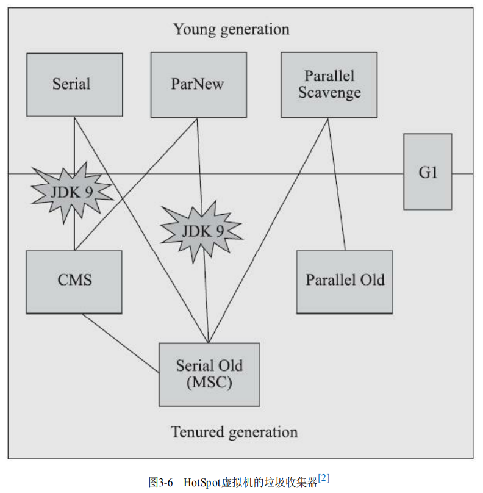
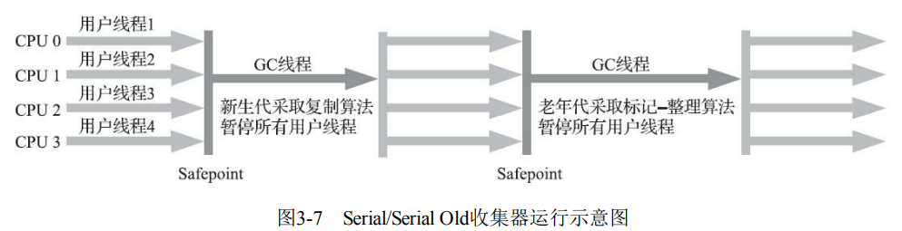
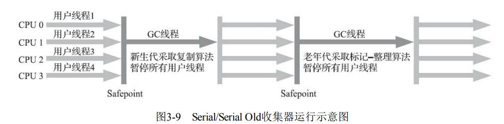
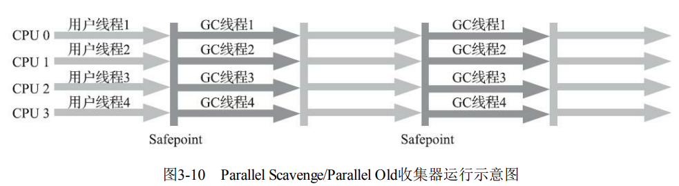
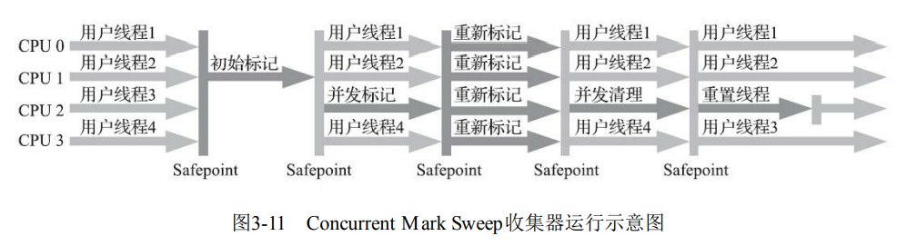
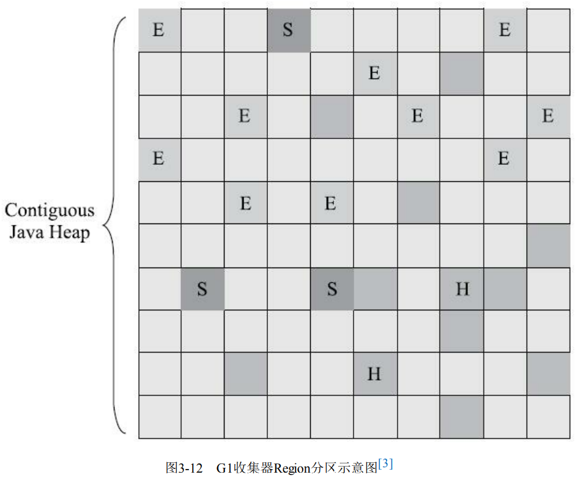
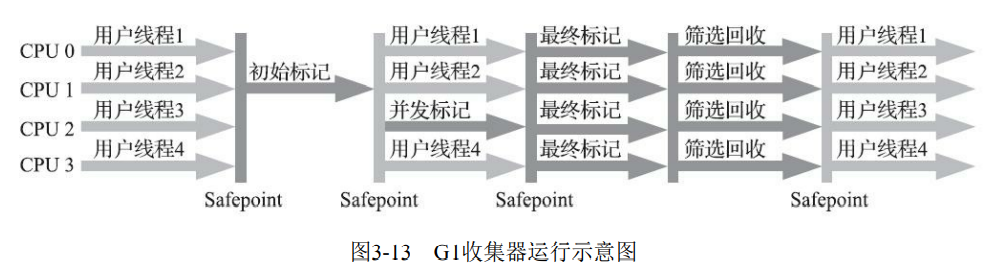
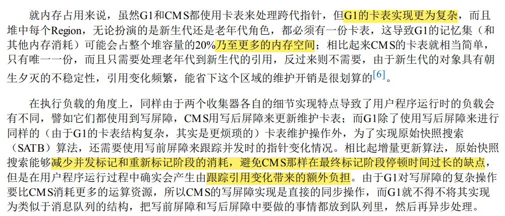

---
# 这是页面的图标
icon: page

# 这是文章的标题
title: 经典垃圾收集器

# 设置作者
author: lllllan

# 设置写作时间
# time: 2020-01-20

# 一个页面只能有一个分类
category: Java

# 一个页面可以有多个标签
tag:
- JVM
- 深入理解Java虚拟机

# 此页面会在文章列表置顶
# sticky: true

# 此页面会出现在首页的文章板块中
star: true

# 你可以自定义页脚
# footer: 
---

::: warning 转载声明

- 《深入理解Java虚拟机》

:::

## 一、Serial 收集器

Serial 收集器是一个 ==单线程工作、新生代的收集器== ，要求在进行垃圾收集时，必须暂停其他所有工作线程，直到收集结束。

**优点：**

- 简单高效
- 额外的内存消耗最小
- 最高的单线程收集效率

## 二、ParNew 收集器

ParNew 收集器实质上是 Serial 收集器的 ==多线程并行版本==。**优势：除了Serial收集器外，目前只有它能与CMS 收集器配合工作**

::: info CMS收集器

JDK5 发布的 CMS 收集器是HotSpot虚拟机中第一款真正意义上 ==支持并发== 的垃圾收集器，它首次 实现了让垃圾收集线程与用户线程（基本上）同时工作。是一个 ==老年代的收集器==

:::

> 随着垃圾收集器技术的不 断改进，更先进的G1收集器带着CMS继承者和替代者的光环登场。G1是一个面向全堆的收集器，不 再需要其他新生代收集器的配合工作。ParNew可以说是HotSpot虚拟机中第一款退出历史舞台的垃圾收集器。

::: info 并行和并发

- **并行：** 描述多条垃圾收集器之间的关系。同一时间可以有多条这样的线程在协同工作，默认此时用户线程处于等待状态。
- **并发：** 描述垃圾收集器线程和用户线程之间的关系。垃圾收集器线程可以和用户线程同时运行。

:::

## 三、Parallel Scavenge 收集器

Parallel Scavenge 收集器是一款 ==基于标记-复制算法实现的、新生代的、并行收集的多线程收集器== 。该收集器关注的目标是达到一个可控制的吞吐量。

$$
吞吐量 = \frac{运行用户代码时间}{运行用户代码时间 + 运行垃圾收集时间}
$$

- 停顿时间越短就越适合需要与用户交互或需要保证服务响应质量的程序，良 好的响应速度能提升用户体验
- 而高吞吐量则可以最高效率地利用处理器资源，尽快完成程序的运算 任务，主要适合在后台运算而不需要太多交互的分析任务

## 四、Serial Old 收集器

Serial Old 收集器是 Serial 收集器的 ==老年代版本，是基于标记-整理算法实现的单线程收集器。==

## 五、Parallel Old 收集器

Parallel Ole 收集器是 Parallel Scavenge 收集器的  ==老年代版本，是基于标记-整理算法实现的多线程并发收集器==

## 六、CMS 收集器

CMS（Concurrent Mark Sweep）收集器是一种 ==获取最短回收停顿时间为目标、支持并发的老年代收集器== 

1. **初始标记：** 单线程。标记一下GC Roots 能直接关联的对象，速度很快。
2. **并发标记：** 和用户线程并发运行。从直接关联对象开始遍历整个对象图，耗时较长。
3. **重新标记：** 暂停用户线程，多条标记线程并行。修正并发期间用户线程运行产生的对象变动，停顿较初始标记稍长。
4. **并发清除：** 和用户线程并发运行。

**优点：** 并发收集、低停顿

::: tip CMS 的缺点

**对处理器资源非常敏感。**

在并发阶段，它虽然不会导致用户线程停顿，但却会因为占用了一部分线程（或者说处理器的计 算能力）而导致应用程序变慢，降低总吞吐量。

> CMS默认启动的回收线程数是（处理器核心数量 +3）/4，也就是说，如果处理器核心数在四个或以上，并发回收时垃圾收集线程只占用不超过25%的 处理器运算资源，并且会随着处理器核心数量的增加而下降。但是当处理器核心数量不足四个时， CMS对用户程序的影响就可能变得很大

------------

**无法处理浮动垃圾。** 

有可能出现“Con-current Mode Failure”失败进而导致另一次完全“Stop The World”的Full GC的产生

在CMS的并发标记和并发清理阶 段，用户线程是还在继续运行的，程序在运行自然就还会伴随有新的垃圾对象不断产生，但这一部分 垃圾对象是出现在标记过程结束以后，CMS无法在当次收集中处理掉它们，只好留待下一次垃圾收集 时再清理掉。

-----

**收集结束会产生大量的垃圾碎片。**

空间 碎片过多时，将会给大对象分配带来很大麻烦，往往会出现老年代还有很多剩余空间，但就是无法找 到足够大的连续空间来分配当前对象，而不得不提前触发一次Full GC的情况

:::

## 七、Garbage First 收集器

Garbage First（简称G1）收集器是 ==面向局部收集、基于Region内存分布形式== 的收集器。

::: info G1 的特点

G1不再坚持固定大小以及固定数量的 分代区域划分，而是把连续的Java堆划分为多个大小相等的独立区域（Region），每一个Region都可以 根据需要，扮演新生代的Eden空间、Survivor空间，或者老年代空间。

特殊的Humongous区域，专门用来存储大对象。G1认为只要大小超过了一个 Region容量一半的对象即可判定为大对象。

新生代和老年代是一系列区域的动态集合。

:::

::: tip G1 需要解决的细节问题

**Region里面存在的跨Region引用对象如何解决？**

使用记忆集避免全堆作为GC Roots扫描，但在G1收集器上记 忆集的应用其实要复杂很多，它的每个Region都维护有自己的记忆集，这些记忆集会记录下别的Region 指向自己的指针，并标记这些指针分别在哪些卡页的范围之内。

---

**并发标记阶段如何保证收集线程与用户线程互不干扰地运行？**

G1 收集器则是通过原始快照（SATB）算法来实现的。

---

**怎样建立起可靠的停顿预测模型？**

看不懂

:::

1. **初始标记：** 单线程。标记一下GC Roots 能直接关联的对象，速度很快。<u>修改TAMS 指针的值，让下一阶段用户线程并发运行时，能正确地在可用的Region中分配新对象。</u>
2. **并发标记：** 和用户线程并发运行。从直接关联对象开始遍历整个对象图，耗时较长。<u>当对象图扫描完成以 后，还要重新处理SATB记录下的在并发时有引用变动的对象。</u>
3. **最终标记：** 暂停用户线程，多条标记线程并行。用于处理并发阶段结束后仍遗留 下来的最后那少量的SATB记录。
4. **筛选回收：** 暂停用户线程，多条筛选线程并行。负责更新Region的统计数据，对各个Region的回收价值和成本进行排序，根据用户所期望的停顿时间来制定回收计划，可以自由选择任意多个 Region 构成回收集，然后把决定回收的那一部分Region的存活对象复制到空的Region中，再清理掉整个旧 Region的全部空间。

::: info 用户指定期望的停顿时间

由用户指定期望的停顿时间是G1收集器很强大的一个功能，设置不同的期望停顿 时间，可使得G1在不同应用场景中取得关注吞吐量和关注延迟之间的最佳平衡。

:::

::: info 应付应用的内存分配速率的垃圾收集

从G1开始，最先进的垃圾收集器的设计导向都不约而同地变为追求能够应付应用的内存分配速率 （Allocation Rate），而不追求一次把整个Java堆全部清理干净。这样，应用在分配，同时收集器在收 集，只要收集的速度能跟得上对象分配的速度，那一切就能运作得很完美。

:::

::: tip CMS 和 G1 的优缺点对比

（看不懂）

:::
