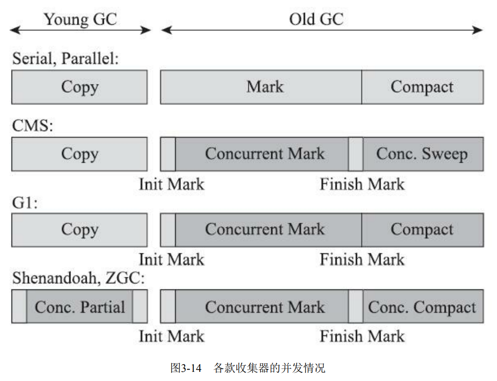
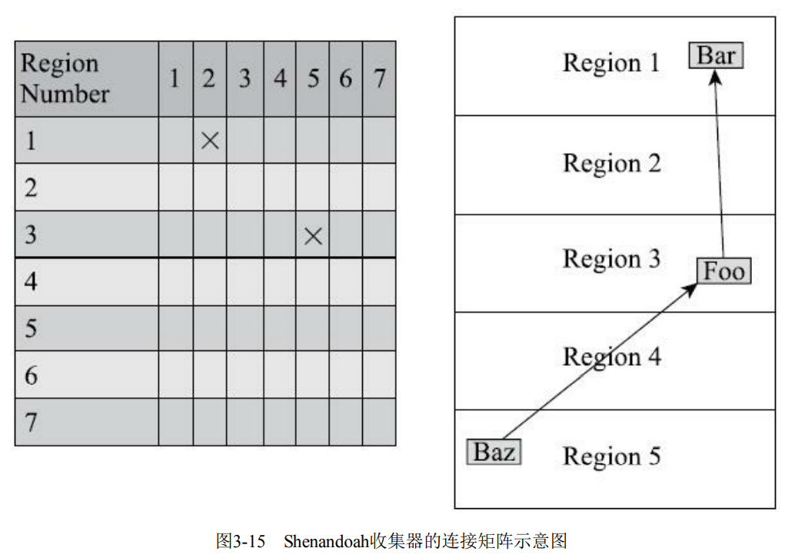
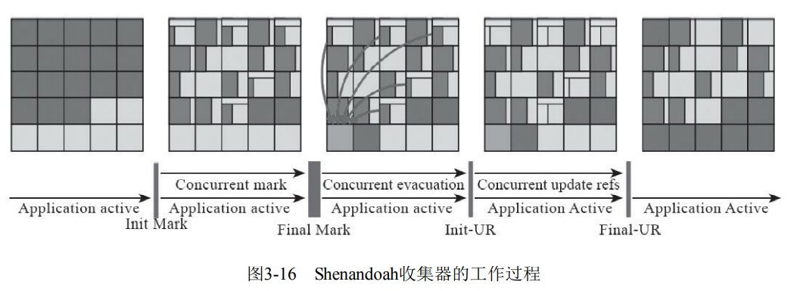

---
# 这是页面的图标
icon: page

# 这是文章的标题
title: 低延迟垃圾收集器

# 设置作者
author: lllllan

# 设置写作时间
# time: 2020-01-20

# 一个页面只能有一个分类
category: Java

# 一个页面可以有多个标签
tag:
- JVM
- 深入理解Java虚拟机

# 此页面会在文章列表置顶
# sticky: true

# 此页面会出现在首页的文章板块中
star: true

# 你可以自定义页脚
# footer: 
---

::: warning 转载声明

- 《深入理解Java虚拟机》

:::

衡量垃圾收集器的三项最重要的指标是：==内存占用（Footprint）、吞吐量（Throughput）和延迟 （Latency）== ，三者共同构成了一个“不可能三角”

图3-14中浅色阶段表示必须挂起用户线程，深色表示收集器线程与用户线程是并发工作的。

## 一、Shenandoah 收集器

Shenandoah 更像是 G1 的下一代继承者，它们两者有着相似的堆内存布局，在初始标记、并发标记等许多阶段的处理思路上都高度一致，甚至还直接共享了一部分实现代码

### 1.1 Shenandoah 和 G1 的不同

1. 支持并发的整理算法：G1 的回收阶段是可以多线程并行的，但不能与用户线程并发
2. 默认不使用分代收集：
3. 摒弃记忆集，改用连接矩阵：连接矩阵记录跨Region的引用关系，降低了处理跨代指针时的记忆集维护消耗，也降低了伪共享问题的发生概率

::: note 连接矩阵

不太懂，以后再补

:::

### 1.2 工作阶段

1. 初始标记：首先标记与GC Roots直接关联的对象，仍然是 ==Stop The World==
2. 并发标记：遍历对象图，标记出全部可达的对象， ==与用户线程并发==
3. 最终标记：处理剩余的SATB扫描，并在这个阶段统计出回收价值最高的Region，将这些Region构成一组回收集。 ==有停顿==
4. 并发清理：清理那些整个区域内连一个存活对象都没有找到的Region
5. 并发回收：把回收集里面的存活对象先复制一份到其他未被使用的Region之中。（涉及读屏障、转发指针）
6. 初始引用更新：建立一个线程集合点，确保所有并发回收阶段中进行的收集器线程都已完成分配给它们的对象移动任务。 ==短暂停顿==
7. 并发引用更新：把堆中所有指向旧对象的引用修正到复制后的新地。 ==与用户线程并发==
8. 最终引用更新：修正存在于GC Roots 中的引用。 ==最后一次停顿==
9. 并发清理：回收内存空间

::: note 插眼

文档中后半部分看不懂，没再记录，之后再补

:::

## 二、ZGC 收集器

