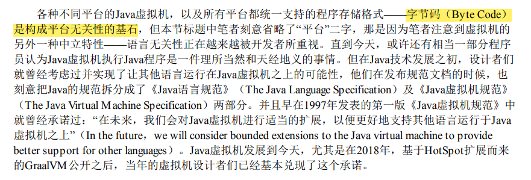

---
# 这是页面的图标
icon: page

# 这是文章的标题
title: 无关性的基石

# 设置作者
author: lllllan

# 设置写作时间
# time: 2020-01-20

# 一个页面只能有一个分类
category: Java

# 一个页面可以有多个标签
tag:
- JVM
- 深入理解Java虚拟机

# 此页面会在文章列表置顶
# sticky: true

# 此页面会出现在首页的文章板块中
star: true

# 你可以自定义页脚
# footer: 

---

::: warning 转载声明

- 《深入理解Java虚拟机》

:::

**平台无关性**

各种不同平台的Java虚拟机，以及所有平台都统一支持的程序存储格式 —— 字节码是构成平台无关性的基石。

**语言无关性**

GraalVM 能够支持不同语言的运行

