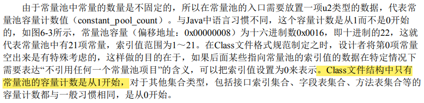
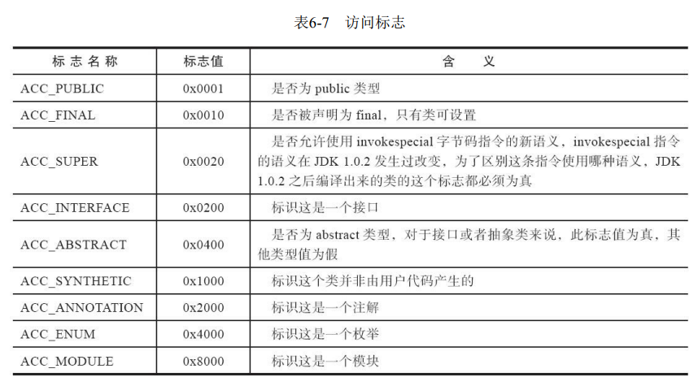
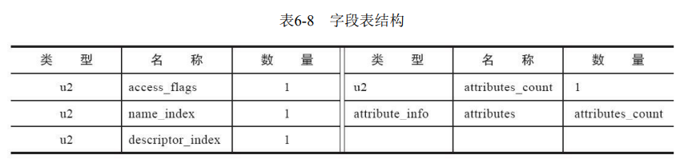
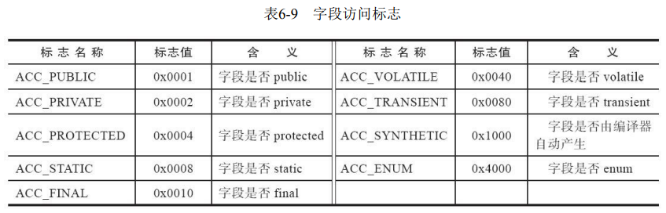
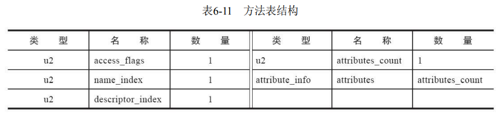
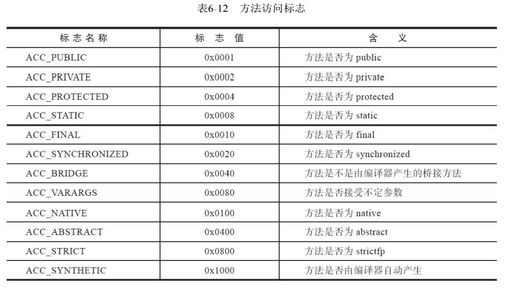
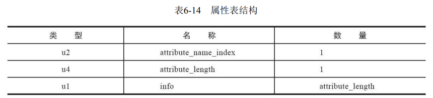

---
# 这是页面的图标
icon: page

# 这是文章的标题
title: Class 类文件的结构

# 设置作者
author: lllllan

# 设置写作时间
# time: 2020-01-20

# 一个页面只能有一个分类
category: Java

# 一个页面可以有多个标签
tag:
- JVM
- 深入理解Java虚拟机

# 此页面会在文章列表置顶
# sticky: true

# 此页面会出现在首页的文章板块中
star: true

# 你可以自定义页脚
# footer: 

---

::: warning 转载声明

- 《深入理解Java虚拟机》

:::

**Class 文件是一组以 8 个字节为基础单位的二进制流。**

各个数据项目严格按照顺序紧凑地排列在文件之中，中间没有添加任何分隔符，这使得整个Class文件中存储的内容几乎全部是程序运行的必要数据，没有空隙存在。当遇到需要占用8个字节以上空间的数据项时，则会按照高位在前的方式分割成若干个8个字节进行存储。

::: info class文件和类或接口

任何一个 Class 文件都对应着唯一的一个类或接口的定义信息。

但是反过来，类或接口不一定都得定义在文件里（譬如类或接口也可以动态生成，直接送入类加载器中）

:::

根据《Java虚拟机规范》的规定，Class文件格式采用一种类似于C语言结构体的伪结构来存储数据，这种伪结构中只有两种数据类型：“无符号数”和“表”。

- 无符号数属于基本的数据类型，以u1、u2、u4、u8来分别代表1个字节、2个字节、4个字节和8个字节的无符号数，无符号数可以用来描述数字、索引引用、数量值或者按照UTF-8编码构成字符串值。
- 表是由多个无符号数或者其他表作为数据项构成的复合数据类型，为了便于区分，所有表的命名都习惯性地以“_info”结尾。表用于描述有层次关系的复合结构的数据，整个Class文件本质上也可以视作是一张表，这张表由表6-1所示的数据项按严格顺序排列构成。

## 一、魔数与Class文件的版本

::: info 魔数

每个 Class 文件的头4个字节被称为魔数，**它唯一的作用是确定这个文件是否为一个能被虚拟机接收的 Class 文件。**

Class 文件的魔数取值为 `0xCAFEBABE` （咖啡宝贝？）

:::

::: info 版本号

紧接着魔数的4个字节存储的 Class 文件的版本号，56两个字节是次版本号，78两个字节是主版本号。

:::

## 二、常量池

::: info 常量池

版本号之后的是常量池入口，可以比喻为 Class 文件里的资源仓库。

常量池中主要存放两大类常量：字面量、符号引用。

- 字面量比较接近于 Java 语言层面的常量概念，如文本字符串、被声明 final 的常量值
- 符号引用则属于编译原理方面的概念：被模块导出或者开放的包、类和接口的全限定名、字段的名称和描述符、方法的名称和描述符、方法句柄和方法类型、动态调用和动态常量

:::

> Class 文件结构中只有常量池的容量计数是从1开始的。
>
> 

## 三、访问标志

::: info 访问标志

常量池之后两个字节标识访问标志，这个标志用于识别一些类或者接口层次的访问信息。

:::

## 四、类索引、父类索引、接口索引集合

类索引和父类索引都是一个 u2 类型的数据，而接口索引集合是一组 u2 类型的数据的集合，Class 文件中由着三项数据来确定该类型的继承关系。

- 类型索引用于确定这个类的全限定名
- 父类索引用于确定这个类的父类的全限定名
- 接口索引集合用来描述实现了哪些接口

## 五、字段表集合

字段表用于描述接口或类中声明的变量。

> Java语言中的“字段”（Field）包括类级变量以及实例级变量，但不包括在方法内部声明的局部变量

1. 字段修饰符 access_flags

    > 

2. 简单名称 name_index，方法名或字段名
3. 修饰符 descriptor_index，描述字段的数据类型、方法的参数列表和返回值

4. 属性表集合，用于存储一些额外的信息

## 六、方法表集合

Class文件存储 格式中对方法的描述与对字段的描述采用了几乎完全一致的方式，方法表的结构如同字段表一样，依次包括访问标志（access_flags）、名称索引（name_index）、描述符索引（descriptor_index）、属性表集合（attributes）几项

## 七、属性表集合

Class文件、字段表、方法表都可以携带自己的属性表集合，以描述某些场景专有的信息。

::: note 属性表集合

《》P321，内容太多暂且跳过。

:::

