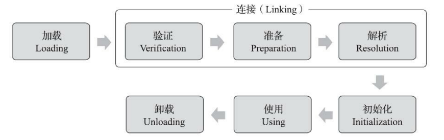

---
# 这是页面的图标
icon: page

# 这是文章的标题
title: 类加载的时机

# 设置作者
author: lllllan

# 设置写作时间
# time: 2020-01-20

# 一个页面只能有一个分类
category: Java

# 一个页面可以有多个标签
tag:
- JVM
- 深入理解Java虚拟机

# 此页面会在文章列表置顶
# sticky: true

# 此页面会出现在首页的文章板块中
star: true

# 你可以自定义页脚
# footer: 

---

::: warning 转载声明

- 《深入理解Java虚拟机》

:::

个类型从被加载到虚拟机内存中开始，到卸载出内存为止，它的整个生命周期将会经历加载 （Loading）、验证（Verification）、准备（Preparation）、解析（Resolution）、初始化 （Initialization）、使用（Using）和卸载（Unloading）七个阶段，其中验证、准备、解析三个部分统称为连接（Linking）

<u>加载、验证、准备、初始化和卸载</u> 这五个阶段的顺序是确定的，类型的加载过程必须按照这种顺序按部就班地开始，而 **解析阶段则不一定：它在某些情况下可以在初始化阶段之后再开始，这是为了支持Java语言的运行时绑定特性（也称为动态绑定或晚期绑定）**

## 加载

关于在什么情况下需要开始类加载过程的第一个阶段“加载”，《Java虚拟机规范》中并没有进行强制约束，这点可以交给虚拟机的具体实现来自由把握。

## 初始化

但对于初始化阶段有且只有六种情况必须立即对类进行初始化：

1. 遇到 `new、getstatic、putstatic、invokestatic` 这四条字节码指令时，如果类型没有进行过初始化，则需要先触发其初始化阶段。
    - 使用new关键字实例化对象
    - 读取或设置一个类型的静态字段（被final修饰、已在编译期把结果放入常量池的静态字段除外）
    - 调用一个类型的静态方法
2. 使用 `java.lang.reflect` 包的方法对类型进行反射调用的时候，如果类型没有进行过初始化，则需要先触发其初始化。 
3. 当初始化类的时候，如果发现其父类还没有进行过初始化，则需要先触发其父类的初始化。
4. 当虚拟机启动时，用户需要指定一个要执行的主类（包含main()方法的那个类），虚拟机会先初始化这个主类。
5. 当使用JDK 7新加入的动态语言支持时，如果一个 `java.lang.invoke.MethodHandle` 实例最后的解析结果为 `REF_getStatic、REF_putStatic、REF_invokeStatic、REF_newInvokeSpecial` 四种类型的方法句柄，并且这个方法句柄对应的类没有进行过初始化，则需要先触发其初始化
6. 当一个接口中定义了JDK 8新加入的默认方法（被default关键字修饰的接口方法）时，如果有这个接口的实现类发生了初始化，那该接口要在其之前被初始化。

对于这六种会触发类型进行初始化的场景，《Java虚拟机规范》中使用了一个非常强烈的限定语 ——“有且只有”，这六种场景中的行为称为对一个类型进行主动引用。除此之外，所有引用类型的方式都不会触发初始化，称为被动引用。（书上有栗子，看不懂记不住就没有抄）

