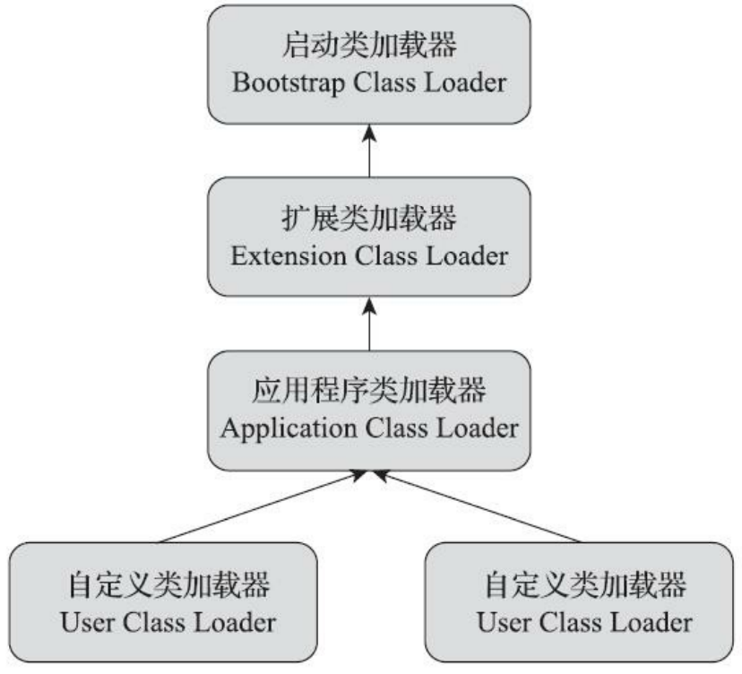
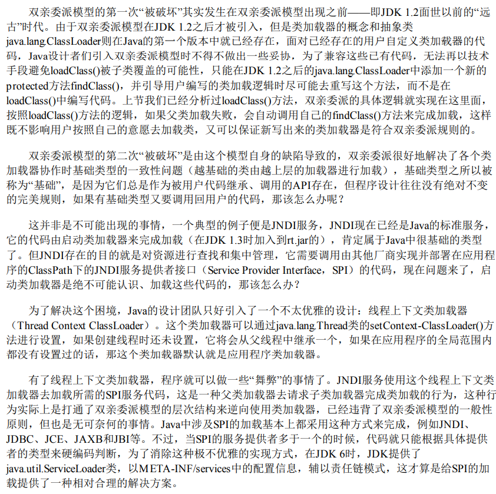

---
# 这是页面的图标
icon: page

# 这是文章的标题
title: 类加载器

# 设置作者
author: lllllan

# 设置写作时间
# time: 2020-01-20

# 一个页面只能有一个分类
category: Java

# 一个页面可以有多个标签
tag:
- JVM
- 深入理解Java虚拟机

# 此页面会在文章列表置顶
# sticky: true

# 此页面会出现在首页的文章板块中
star: true

# 你可以自定义页脚
# footer: 

---

::: warning 转载声明

- 《深入理解Java虚拟机》
- [双亲委派模式的优点](https://blog.csdn.net/u010312474/article/details/91046318)

:::

Java虚拟机设计团队有意把类加载阶段中的【通过一个类的全限定名来获取描述该类的二进制字节流】这个动作放到Java虚拟机外部去实现，以便让应用程序自己决定如何去获取所需的类。实现这个动作的代码被称为【类加载器】（Class Loader）。

## 一、类与类加载器

类加载器用于实现类的加载动作。

::: note

对于任意一个类，都必须由加载它的类加载器和这个类本身一起共同确立其在 Java虚拟机中的唯一性，每一个类加载器都拥有一个独立的类命名空间。

即：比较两个类是否【相等】，只有在这两个类是由同一个类加载器加载的前提下才有意义。否则，即使这两个类来源于同一个 Class 文件、被同一个 Java 虚拟机加载，只要加载他们的类加载器不同，那么这两个类就必定不相等。

> 这里所指的【相等】，包括代表类的 Class 对象的 `equals(), isAssignableFrom(), isInstance()` 的返回结果，也包括了使用 `instanceof` 关键字做对象所属关系判定等各种情况。

:::

## 二、双亲委派模型

站在 Java 虚拟机的角度来看，只有两种不同的类加载器：

1. 启动类加载器，使用 C++ 语言实现，是虚拟机自身的一部分
2. 其他所有类加载器，由 Java 语言实现，独立存在于虚拟机外部，并且全部继承自抽象类 `java.lang.ClassLoader`

站在 Java 开发人员的角度来看，Java 一直保持着三层类加载器、双亲委派的类加载架构

### 三层类加载器

1. **启动类加载器**：这个加载器负责加载放在 `<JAVA_HOME>\lib` 目录，或者被 `-Xbootclasspath` 参数指定的路径中存放的、而且是Java虚拟机能够识别的类库加载到虚拟机的内存中。
2. **扩展类加载器**：负责加载 `<JAVA_HOME>\lib\ext` 目录中，或者被 `java.ext.dirs` 系统变量所指定的路径中的所有类库。允许用户将具有通用性的类库放置在ext目录里以扩展Java SE的功能
3. **应用程序类加载器**：负责加载用户类路径上的所有类库，开发者同样可以直接在代码中使用这个类加载器。

JDK 9 之前的 Java 应用都是由这三种类加载器互相配合来完成加载的，如果用户认为有必要，还可以加入自定义的类加载器来进行扩展。

### 双亲委派模型

上图各种类加载器之间的层次关系被称为类加载器的【双亲委派模型】。

双亲委派模型要求出了顶层的启动类加载器外，其余的类加载器都应有自己的父类加载器。不过这里的父子关系一般不是以继承的关系来实现，而是通常使用组合关系来复用父加载器的代码。

::: note 双亲委派模型的工作过程：

如果一个类加载器收到了类加载的请求，它首先不会自己去尝试加载这个类，而是把这请求委派给父类加载器去完成，每一个层次的类加载器都是如此。因此所有的加载请求最终都应该传送到最顶层的启动类加载器中，只有当父加载器反馈自己无法完成这个类加载请求时（它的搜索范围中没有找到所需要的类）时，子加载器才会尝试自己去完成加载。

:::

::: tip 双亲委派模型的好处

**避免重复加载 + 避免核心类篡改**

采用双亲委派模式的是好处是Java类随着它的类加载器一起具备了一种带有优先级的层次关系，通过这种层级关可以避免类的重复加载，当父亲已经加载了该类时，就没有必要子ClassLoader再加载一次。

其次是考虑到安全因素，java核心api中定义类型不会被随意替换，假设通过网络传递一个名为 `java.lang.Integer` 的类，通过双亲委托模式传递到启动类加载器，而启动类加载器在核心Java API发现这个名字的类，发现该类已被加载，并不会重新加载网络传递的过来的 `java.lang.Integer` ，而直接返回已加载过的 `Integer.class` ，这样便可以防止核心API库被随意篡改。

:::

## 三、破坏双亲委派模型

双亲委派模型并不是一个具有强制性约束的模型，而是Java设计者推荐给开发者们的类加载器实现方式。

> 

