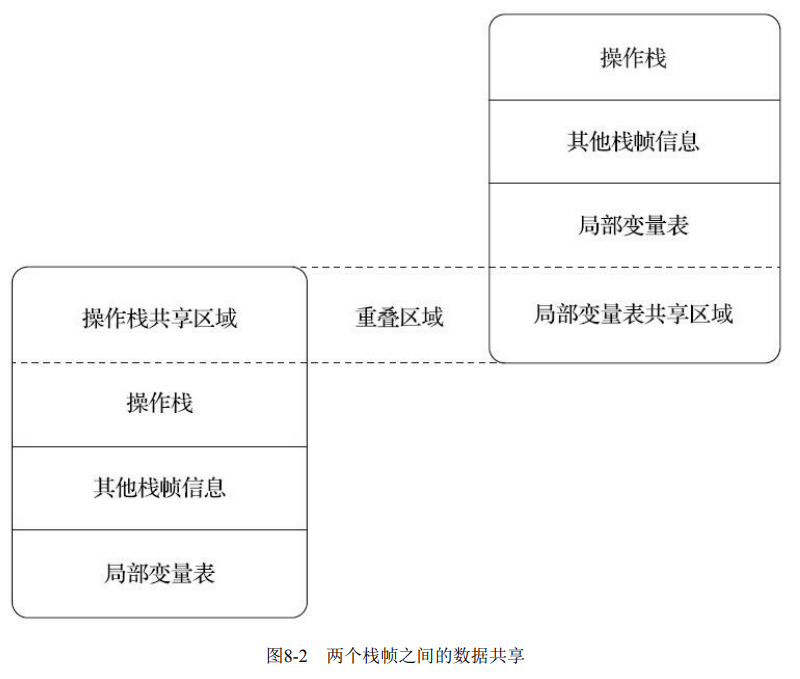

---
# 这是页面的图标
icon: page

# 这是文章的标题
title: 运行时栈帧结构

# 设置作者
author: lllllan

# 设置写作时间
# time: 2020-01-20

# 一个页面只能有一个分类
category: Java

# 一个页面可以有多个标签
tag:
- JVM
- 深入理解Java虚拟机

# 此页面会在文章列表置顶
# sticky: true

# 此页面会出现在首页的文章板块中
star: true

# 你可以自定义页脚
# footer: 
---

::: warning 转载声明

- 《深入理解Java虚拟机》
- [Java虚拟机—栈帧、操作数栈和局部变量表](https://zhuanlan.zhihu.com/p/45354152)

:::

==Java虚拟机以方法作为最基本的执行单元==

【栈帧（Stack Frame）】则是用于支持虚拟机进行方法调用和方法执行背后的数据结构，它也是虚拟机运行时数据区中的虚拟机栈（Virtual Machine Stack）的栈元素

每一个栈帧都包括了局部变量表、操作数栈、动态连接、方法返回地址和一些额外的附加信息。

一个线程中的方法调用链可能会很长，以Java程序的角度来看，同一时刻、同一条线程里面，在调用堆栈的所有方法都同时处于执行状态。而对于执行引擎来讲，在活动线程中，只有位于栈顶的方法才是在运行的，只有位于栈顶的栈帧才是生效的，其被称为【当前栈帧】（Current Stack Frame），与这个栈帧所关联的方法被称为【当前方法】（Current Method）

## 一、局部变量表

局部变量表（Local Variables Table）是一组变量值的存储空间，用于存放方法参数和方法内部定义的局部变量。

局部变量表的容量以【变量槽】（Variable Slot）为最小单位。一个变量槽可以存放一个 32位以内的数据类型，Java中占用不超过32位存储空间的数据类型有 `boolean, byte, char, short, int, float, reference, returnAddress` 这8种类型。对于64位的数据类型 `long, double`，Java虚拟机会以高位对齐的方式为其分配两个连续的变量槽空间。

> 由于局部变量表是建立在线程堆栈中的，属于线程私有的数据，无论读写两个连续的变量槽是否为原子操作，都不会引起数据竞 争和线程安全问题。

Java虚拟机 **通过索引定位的方式使用局部变量表**，索引值的范围是从0开始至局部变量表最大的变量槽数量

当一个方法被调用时，Java虚拟机会使用局部变量表来完成参数值到参数变量列表的传递过程，即实参到形参的传递。如果执行的是实例方法（没有被static修饰的方法），那局部变量表中第0位索引的变量槽默认是用于传递方法所属对象实例的引用，在方法中可以通过关键字“this”来访问到这个隐含的参数

为了尽可能节省栈帧耗用的内存空间，局部变量表中的 **变量槽是可以重用的**，方法体中定义的变量，其作用域并不一定会覆盖整个方法体，如果当前字节码PC计数器的值已经超出了某个变量的作用域，那这个变量对应的变量槽就可以交给其他变量来重用。不过，这样的设计除了节省栈帧空间以外，还会伴随有少量额外的副作用，例如在某些情况下变量槽的 **复用会直接影响到系统的垃圾收集行为**

## 二、操作数栈

操作数栈（Operand Stack）也常被称为操作栈，方法执行的过程中需要往操作数栈中写入和提取内容。

> 例如整数加法的字节码指令iadd，这条指令在运行的时候要求操作数栈中最接近栈顶的两个元素已经存入了两个int型的数值，当执行这个指令时，会把这两个int 值出栈并相加，然后将相加的结果重新入栈。

当一个方法刚刚开始执行时，其操作数栈是空的，随着方法执行和字节码指令的执行，会从局部变量表或对象实例的字段中复制常量或变量写入到操作数栈，再随着计算的进行将栈中元素出栈到局部变量表或者返回给方法调用者，也就是出栈/入栈操作。一个完整的方法执行期间往往包含多个这样出栈/入栈的过程。

在概念模型中，两个不同栈帧作为不同方法的虚拟机栈的元素，是完全相互独立的。但是在大多虚拟机的实现里都会进行一些优化处理，令两个栈帧出现一部分重叠。让下面栈帧的部分操作数栈与上面栈帧的部分局部变量表重叠在一起，这样做不仅节约了一些空间，更重要的是在进行方法调用时就可以直接共用一部分数据，无须进行额外的参数复制传递了

## 三、动态连接

在一个class文件中，一个方法要调用其他方法，需要将这些方法的符号引用转化为其在内存地址中的直接引用，而符号引用存在于方法区中的运行时常量池。

Java虚拟机栈中，每个栈帧都包含一个指向运行时常量池中该栈所属方法的符号引用，持有这个引用的目的是为了支持方法调用过程中的**动态连接(Dynamic Linking)**。

::: info 动态连接

这些符号引用一部分会在类加载阶段或者第一次使用时就直接转化为直接引用，这类转化称为**静态解析**。另一部分将在每次运行期间转化为直接引用，这类转化称为 **动态连接**。

:::

## 四、方法返回地址

当一个方法开始执行后，只有两种方式退出这个方法。

- 正常调用完成：执行引擎遇到任意一个方法返回的字节码指令，这时候可能会有返回值传递给上层的方法调用者
- 异常调用完成：方法执行的过程中遇到了异常，并且这个异常没有在方法体内得到妥善处理

方法返回时可能需要在栈帧中保存一些信息，用来帮助恢复它的上层主调方法的执行状态。一般来说，方法正常退出时，主调方法的PC计数器的值就可以作为返回地址，栈帧中很可能会保存这个计数器值。而方法异常退出时，返回地址是要通过异常处理器表来确定的，栈帧中就一般不会保存这部分信息。

方法退出的过程实际上等同于把当前栈帧出栈，因此退出时可能执行的操作有：恢复上层方法的局部变量表和操作数栈，把返回值（如果有的话）压入调用者栈帧的操作数栈中，调整PC计数器的值以指向方法调用指令后面的一条指令等。

